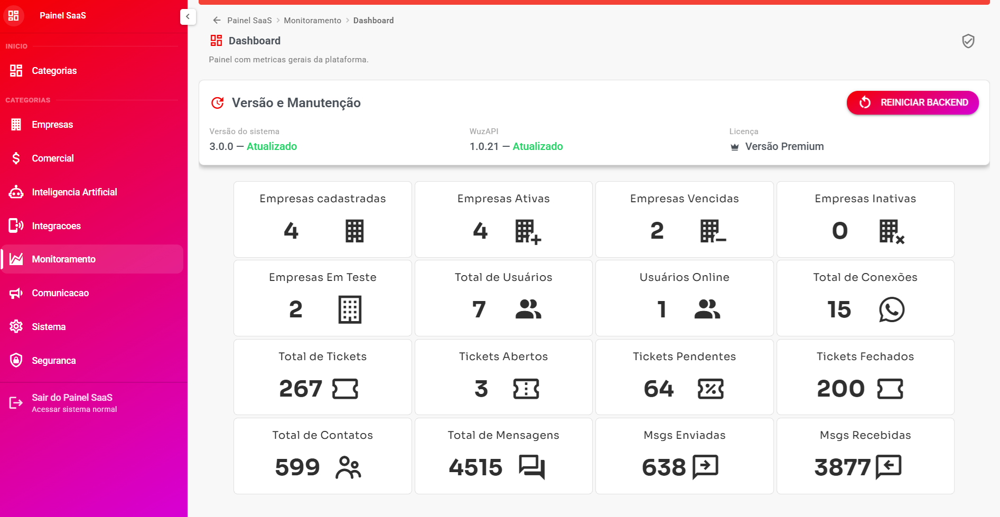
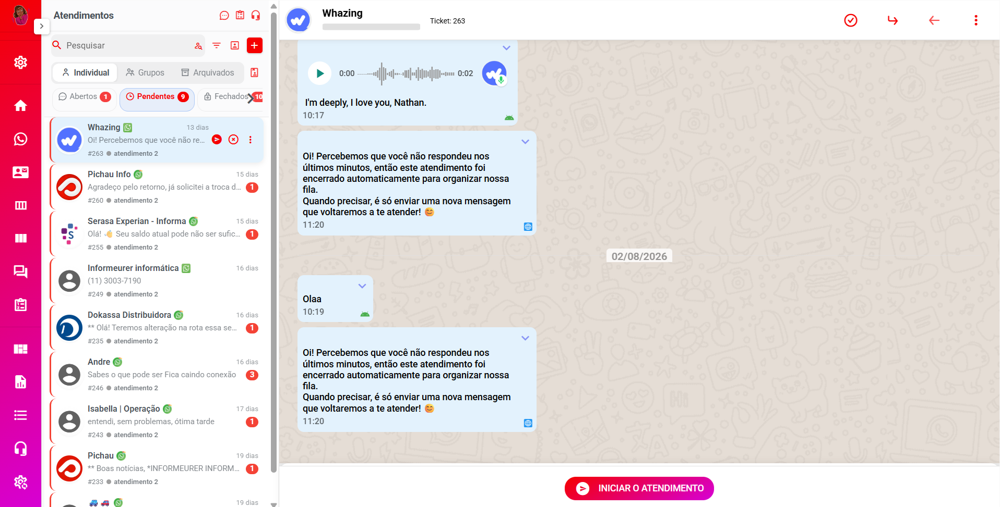
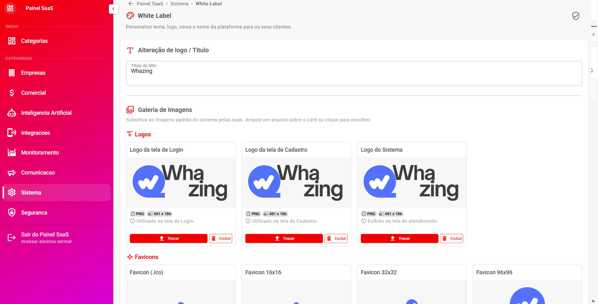
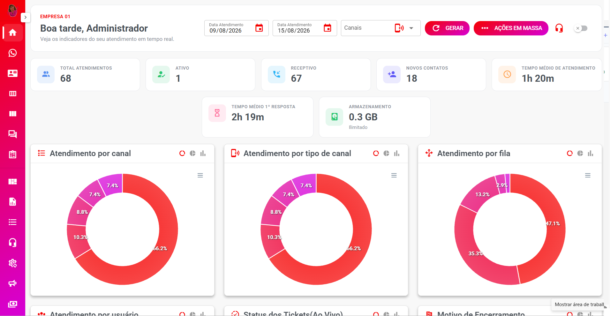

# Introdução

#### Bem-vindo ao Whazing SaaS <a href="#bem-vindo-ao-whazing-saas" id="bem-vindo-ao-whazing-saas"></a>

O Whazing é a solução completa para gerenciar múltiplos canais de atendimento em um só lugar.

Entre na nossa comunidade para suporte e novidades. Aprenda como instalar e configurar o sistema. Link abaixo para acessar nosso grupo.

#### 🗺️ Por onde começar? <a href="#por-onde-comecar" id="por-onde-comecar"></a>

* 🚀 **Nunca usou o sistema?** Siga o guia [**Primeiros Passos — Configuração Inicial**](primeiros-passos.md), que mostra a ordem correta de configuração, do acesso ao primeiro teste.
* 📖 **Não entendeu algum termo?** Consulte o [**Glossário de Termos**](glossario.md), que explica os conceitos em linguagem simples.
* 💡 **Quer ver o que o sistema faz?** Veja os [Principais Recursos do Sistema](principais-recursos-do-sistema.md) ou teste a [Demo do Produto](./#demo-do-produto) abaixo.

Canal telegram receber novidades e atualizações: [https://t.me/whazing](https://t.me/whazing)

#### 🚀 Demo do Produto <a href="#demo-do-produto" id="demo-do-produto"></a>

* [https://teste.whazing.com.br/](https://teste.whazing.com.br/)

**Usuário:** `admin@admin.com`

**Senha:** `123456`

[Resumo de Recursos](principais-recursos-do-sistema.md)

**IMPORTANTE**:

* [Termos de USO](https://doc.whazing.com.br/termos-de-uso-da-plataforma)
* [Contrato de Licença](https://doc.whazing.com.br/contrato-de-licenca-de-uso-de-software)

#### 📦 Instalação Rápida <a href="#instalacao-rapida" id="instalacao-rapida"></a>

Instalação super simples para pode ser instalado ou atualizado usando nosso instalador automático com simples comando

```
curl -sSL instalar.whazing.com.br | sudo bash
```

Para quem quiser mais controle pode fazer instalação manual conforme manual

📣 Quer receber novidades e comunicados oficiais do Whazing?

Entre no nosso Telegram:\
[Canal Oficial Whazing](https://t.me/whazing?utm_source=chatgpt.com)

## Screenshots

<figure><figcaption></figcaption></figure>

<figure><figcaption></figcaption></figure>

<figure><figcaption></figcaption></figure>

<figure><figcaption></figcaption></figure>


<figure><figcaption></figcaption></figure>

## Recomendação de VPS

Recomendamos uso de VPS nacionais.

Vps internacional tem [Hetzer](https://www.hetzner.com/) , mas de preferência VPS tempo resposta menor de 50ms

Não compativel com VPS ARM

* Cupom 25% desconto Peramix "WHAZING"

```bash
WHAZING
```

🚀 Whazing & Hostear: Sua VPS no Brasil com Teste Grátis!\
Olá! A Whazing e a Hostear se uniram para trazer o que há de melhor em servidores VPS no Brasil, com uma condição que você não pode ignorar.\
\
🔥 TESTE GRATUITO POR 7 DIAS\
Isso mesmo! Você testa toda a performance por uma semana sem pagar nada.\
\
❌ Sem dados de cartão de crédito.\
\
❌ Sem compromisso financeiro inicial.\
\
Gostou do serviço? É só assinar após o período de teste!\
\
💰 DESCONTOS EXCLUSIVOS\
\
Mensal: 30% OFF no 1º mês (Cupom: WHAZING).\
\
Recorrente: 10% OFF todo mês a partir do 2º mês (Cupom: WHAZING10).\
\
👉 Comece seu teste agora: [hostear.com.br/whazing](http://hostear.com.br/whazing)\
\
_&#x4E;ota: Para validar o desconto de 10%, lembre-se de aplicar o cupom WHAZING10 no momento do pagamento da fatura._\
\
Hostear & Whazing: Potência brasileira ao seu alcance! ⚡

💎 **Versão Premium**

Adquira a versão Premium para remover anúncios.

WhatsApp: \*\*[+55 48 3197-0877](https://wa.me/554831970877)\*\* ou \*\*[+55 48 3197-0599](https://wa.me/554831970599)\*\*

📲 Caso precise de um número para utilizar no sistema, você pode adquirir facilmente através do portal:\
[https://telera.whazing.com.br](https://telera.whazing.com.br/)
