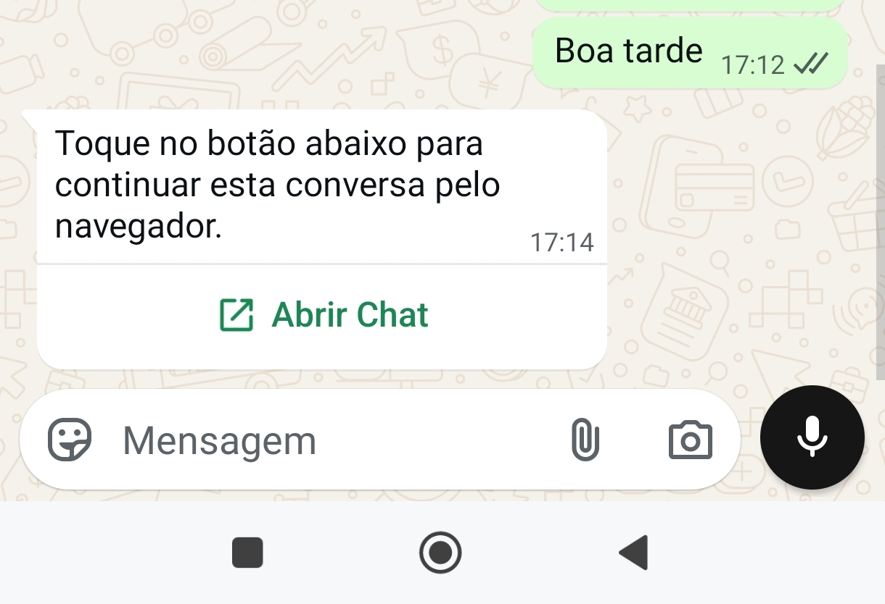
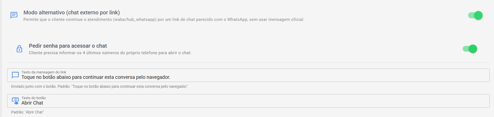
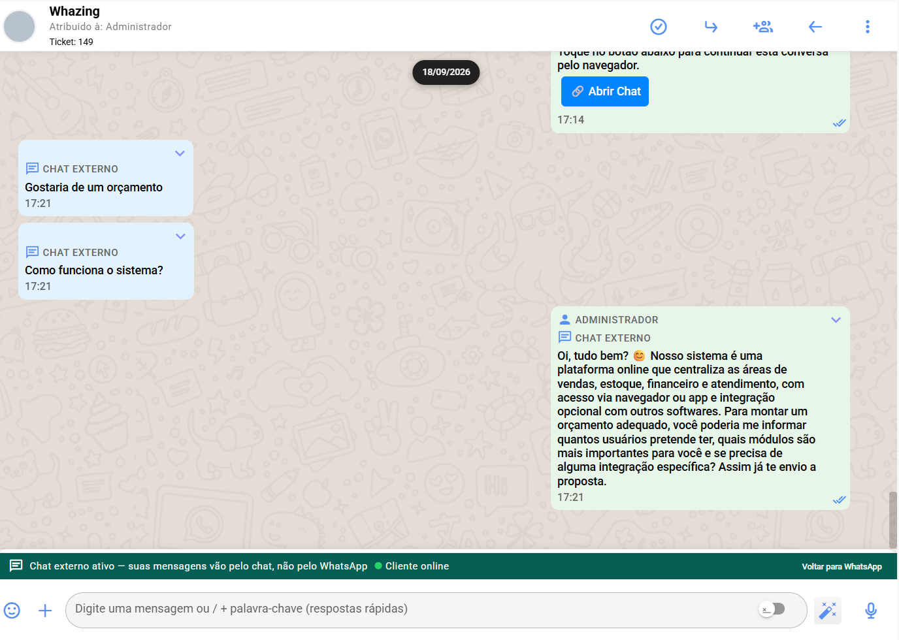
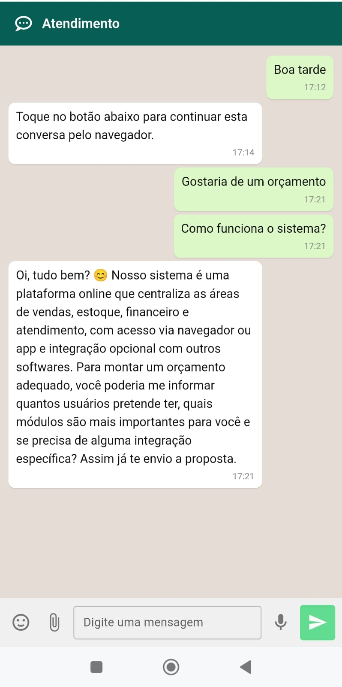

# 💬 Chat externo por link

O **Chat externo por link** é um **modo alternativo** para os canais de **API Oficial (WABA e Hub WhatsApp)**: o cliente continua o atendimento **por uma página de chat na internet, parecida com o WhatsApp**, sem que cada interação consuma uma **mensagem oficial**.

> 💡 **Para que serve:** economizar mensagens da API Oficial. Em vez de continuar gastando mensagens oficiais, você **manda um link** e a conversa segue pela página — sem custo por mensagem.

***

## 🧩 Como funciona, em resumo

1. O **administrador ativa** o recurso nas configurações do sistema (uma vez só).
2. No atendimento, o atendente clica no botão **"Enviar link do chat externo"** (ícone de janelinha abrindo, ao lado do campo de mensagem).
3. O cliente recebe **no WhatsApp** uma mensagem com um **texto** e um **botão** (ex.: **"Abrir Chat"**).
4. Ao tocar no botão, o cliente abre a **página de chat** e continua a conversa por lá.
5. Enquanto isso, o atendente continua vendo tudo **dentro da mesma conversa no Atendimento**, como se fosse uma conversa normal.

<figure><figcaption></figcaption></figure>

<figure><figcaption></figcaption></figure>

***

## ⚙️ Ativando e configurando (administrador)

1. Acesse **Configurações de Atendimento → Configurações do Atendimento.**
2. Localize **"Modo alternativo (chat externo por link)"** e **ative o interruptor**.
3. Ajuste as opções, se quiser:

| Opção                               | O que faz                                                                                                                             |
| ----------------------------------- | ------------------------------------------------------------------------------------------------------------------------------------- |
| **Pedir senha para acessar o chat** | Ao abrir o link, o cliente precisa informar **os 4 últimos números do próprio telefone** — protege o chat caso alguém encontre o link |
| **Texto da mensagem do link**       | A frase enviada junto com o botão no WhatsApp. Padrão: _"Toque no botão abaixo para continuar esta conversa pelo navegador."_         |
| **Texto do botão**                  | O que está escrito no botão. Padrão: **"Abrir Chat"** (máximo de 30 caracteres)                                                       |

<figure><figcaption></figcaption></figure>

***

## 🚀 Como o atendente envia o link

* O botão **"Enviar link do chat externo"** aparece **somente em conversas dos canais Hub WhatsApp e WABA**, com o atendimento **em aberto** e **enquanto o chat externo não estiver ativo**;
* Ao clicar, o sistema envia a mensagem com o botão ao cliente e confirma: **"Link do chat externo enviado ao cliente"**;
* O próprio sistema grava a mensagem do link **no histórico da conversa**.

> 💡 Dica de uso: o chat externo é especialmente útil **quando a janela de 24 horas fecha** — em vez de gastar um template para reabrir, continue pelo link.

***

## 👤 O que o cliente vê e pode fazer

A página do cliente é simples e parecida com o WhatsApp:

* **Conversa completa** — o histórico do atendimento aparece como bolhas de conversa;
* **Enviar mensagens de texto**, com **emojis**;
* **Enviar imagens** (tocar para ampliar) e **documentos em PDF**;
* **Gravar e enviar áudio**;
* Se ativado, **informar os 4 últimos números do telefone** antes de entrar;
* Quando o atendimento é **encerrado**, a página avisa: _"Este atendimento foi encerrado. Se precisar de algo, mande uma mensagem no WhatsApp novamente."_

> ⚠️ **Limitações:** a página aceita **texto, imagem, PDF e áudio**. Recursos exclusivos do WhatsApp — como stickers, respostas citadas com menu completo, localização em tempo real, PIX e botões de template — não fazem parte do chat externo. Se o link expirar, a página informa: _"Este link não é mais válido. Peça um novo link ao atendente."_

***

## 🖥️ O que muda para o atendente

Enquanto o chat externo está ativo, um **banner** aparece acima do campo de mensagem:

* 🟢 **"Chat externo ativo — suas mensagens vão pelo chat, não pelo WhatsApp"**;
* **Cliente online / Cliente offline** — uma luzinha mostra se o cliente está na página neste momento;
* Botão **"Voltar para WhatsApp"** — **encerra o modo alternativo** e devolve a conversa ao fluxo normal do WhatsApp (as próximas mensagens voltam a ser oficiais).

O restante é igual: as respostas do cliente **chegam na mesma conversa**, com notificação normal, e você responde pelo mesmo campo de sempre.

<figure><figcaption></figcaption></figure>

<figure><figcaption></figcaption></figure>

***

## 📱 Em quais canais funciona

* **WABA** (WhatsApp API Oficial);
* **Hub WhatsApp** (API Oficial via Hub).

Não aparece em canais não oficiais, Instagram, Facebook, Telegram, WebChat, SMS ou e-mail — nesses canais cada mensagem não tem o custo da API Oficial, então não há o que economizar.

***

## ❓ Problemas comuns

**"O botão de enviar o link não aparece."** Ele só existe em conversas de **WABA/Hub WhatsApp** e com o atendimento **em aberto**. Se o chat externo **já está ativo** nessa conversa, o botão some — o que aparece é o banner com **"Voltar para WhatsApp"**.

**"O cliente abriu o link e pediu senha."** A senha são os **4 últimos números do telefone dele** — o sistema pede para proteger o chat. Se não quiser esse passo, desative **"Pedir senha para acessar o chat"** nas configurações.

**"O cliente diz que o link não abre mais."** O link pode ter expirado. Clique novamente em **"Enviar link do chat externo"** para gerar e reenviar.

**"Mudei de ideia e quero voltar ao WhatsApp."** Clique em **"Voltar para WhatsApp"** no banner acima do campo de mensagem. A conversa segue normalmente pelo WhatsApp.

**"Não achei a opção de ativar o chat externo."** Ela fica em **Configurações → Atendimento**, com o nome **"Modo alternativo (chat externo por link)"**. Somente administradores têm acesso às configurações.

***

> 📄 Veja também: [Concatenador de Mensagens](concatenador-de-mensagens.md) — juntar mensagens para economizar · [Franquia mensal grátis](franquia-mensal-gratis.md)
