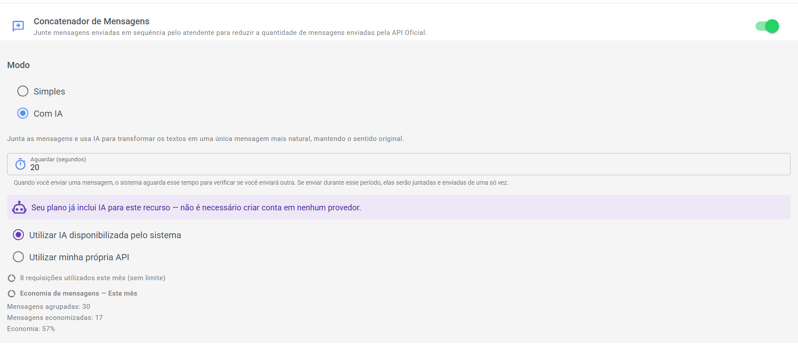

# 🔗 Concatenador de Mensagens

O **Concatenador de Mensagens** junta **mensagens de texto enviadas em sequência pelo atendente** em uma **única mensagem**, antes de elas irem para o WhatsApp.

> 💡 **Para que serve:** nas conversas pela **API Oficial do WhatsApp**, cada mensagem enviada tem um custo. Quando o atendente responde em pedacinhos, cada pedacinho vira uma mensagem cobrada. O Concatenador reduz esse desperdício — **sem precisar trocar de API nem usar canais não oficiais**.

***

## 👀 Entendendo com um exemplo

**Sem o Concatenador**, o atendente escreve três frases seguidas:

> Olá! 😊 Tudo bem? Posso ajudar?

...e o cliente recebe **3 mensagens separadas** (3 mensagens cobradas pela API Oficial).

**Com o Concatenador ativado**, o sistema **espera alguns segundos** depois do primeiro envio. Se vier mais texto nesse intervalo, ele **junta tudo em uma única mensagem** antes de enviar:

> Olá! 😊 Tudo bem? Posso ajudar?

Ou seja: **1 mensagem no lugar de 3.**

***

## ⚙️ Como ativar e configurar

1. Acesse **Configurações de Atendimento → Configurações do Atendimento.**
2. Localize a opção **"Concatenador de Mensagens"** e **ative o interruptor**.
3. Escolha o **Modo**:
   * **Simples** — junta as mensagens de texto **sem alterar o conteúdo** (só agrupa);
   * **Com IA** — junta as mensagens **e usa IA para transformar tudo em um texto único mais natural**, mantendo o sentido original.
4. Defina o **"Aguardar (segundos)"** — o tempo que o sistema espera antes de enviar, para ver se você vai escrever mais algo (de **2 a 15 segundos**).

> 💡 **Como funciona esse tempo:** quando você envia uma mensagem, o sistema **aguarda o tempo escolhido** para verificar se você enviará outra. Se enviar durante esse período, elas serão **juntadas e enviadas de uma só vez**. Passado o tempo, a mensagem segue normalmente.

**Sobre o modo "Com IA":**

* Se você escolher usar a **IA própria** (chave de API da empresa), o Concatenador **usa a mesma configuração do Copilot** — chave, modelo etc. **Se o Copiloto já está configurado, não precisa configurar de novo aqui.**
* Se usar a **IA compartilhada do sistema**, o consumo entra no mesmo limite mensal dos demais recursos de IA (veja [Limite de uso da IA](../../funcionalidades/atendimento/assistente-ia-menu-copiloto/limite-de-uso-da-ia.md)).

<figure><figcaption></figcaption></figure>

***

## 💬 Como o atendente percebe que está funcionando

Durante a conversa, aparecem **aviso e confirmação** perto do campo de mensagem:

* 🕒 **"Mensagem sendo agrupada..."** — o sistema está esperando o tempo configurado;
* 🔢 **"2 mensagens agrupadas"** (3, 4...) — mais mensagens entraram no pacote;
* ✅ **"Mensagens agrupadas e enviadas · Modo simples"** (ou **"Modo com IA"**) — o pacote foi enviado como uma única mensagem.

Na conversa com o cliente, tudo aparece **como uma mensagem só**.

<figure><figcaption></figcaption></figure>

***

## 📈 "Economia de mensagens"

Logo abaixo da configuração, o próprio sistema mostra o resultado **"Economia de mensagens — Este mês"**:

* **Mensagens agrupadas** — quantas mensagens entraram em pacotes;
* **Mensagens economizadas** — quantas mensagens deixaram de ser enviadas separadamente;
* **Economia** — a porcentagem poupada no mês.

> 💡 É a forma mais simples de verificar se o recurso vale a pena: ative, use por alguns dias e acompanhe a porcentagem.

***

## 📱 Em quais canais funciona

O Concatenador se aplica aos **canais de API Oficial** (WABA e Hub WhatsApp) — é justamente onde cada mensagem tem custo pela Meta.

> 💡 Nas telas desses canais o próprio sistema lembra da função: _"Quer reduzir a quantidade de mensagens cobradas pela API Oficial? Ative o Concatenador de Mensagens."_, com o botão **Configurar** que leva direto à opção.

***

## ❓ Problemas comuns

**"Mandei duas mensagens e foram separadas."** Provavelmente a segunda foi enviada **depois do tempo configurado**. Aumente os segundos em **"Aguardar (segundos)"** (ex.: de 2 para 5).

**"Não quero que a IA mexa no meu texto."** Use o modo **Simples** — ele agrupa sem alterar o conteúdo. O modo **Com IA** reescreve em um texto único mais natural.

**"O agrupamento demora para enviar."** É o tempo de espera configurado trabalhando. Se for desconfortável, reduza para 2–3 segundos — o equilíbrio entre espera e economia fica a gosto da operação.

**"A opção não aparece nas minhas configurações."** O Concatenador aparece em **Configurações → Atendimento**. Se a sua tela não tem essa seção, verifique com o administrador — ele pode variar conforme a versão/plano do sistema.

***

> 📄 Veja também: [Chat externo por link](chat-externo-por-link.md) — o outro modo de economizar mensagens da API Oficial · [Franquia mensal grátis](franquia-mensal-gratis.md)
