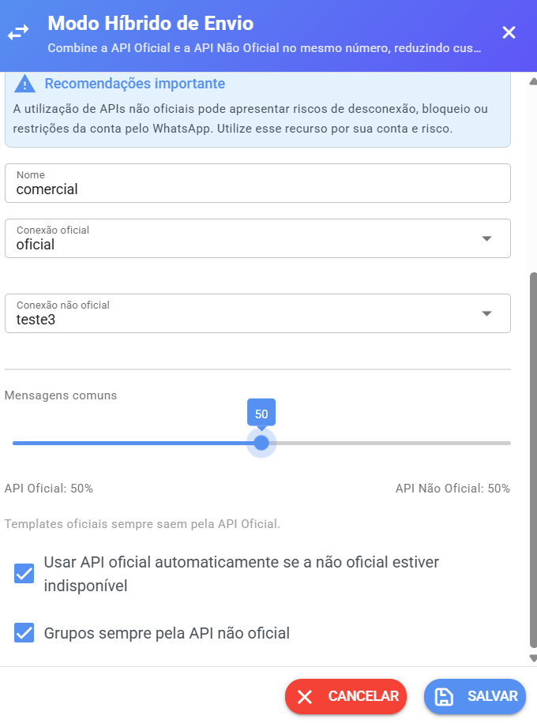

# Modo Híbrido

## O que é o Modo Híbrido?

O **Modo Híbrido** permite utilizar a **API Oficial** e a **API Não Oficial** do **mesmo número de WhatsApp** ao mesmo tempo, distribuindo o envio das mensagens entre as duas conexões de acordo com a configuração que você definir.

É a forma como o sistema apresenta esse recurso:

> _"Combine a API Oficial e a API Não Oficial no mesmo número, reduzindo custo sem perder confiabilidade."_

Na prática, você cria um **par de canais**: uma conexão oficial e uma conexão não oficial trabalhando juntas, como se fossem uma equipe só. Cada uma fica responsável por uma parte das mensagens enviadas.

**Para que isso é útil?** A API Oficial tem recursos e confiabilidade que a Não Oficial não tem, mas cada mensagem enviada por ela tem custo. A API Não Oficial não tem custo por mensagem. Com o Modo Híbrido, é possível dividir os envios entre as duas — por exemplo, deixando as mensagens mais importantes na Oficial e o restante na Não Oficial.

<figure><figcaption></figcaption></figure>

***

## ⚠️ Antes de usar: o que você precisa

Antes de pensar em ativar o Modo Híbrido, confira se você tem tudo abaixo:

| Requisito                          | Detalhe                                                                                     |
| ---------------------------------- | ------------------------------------------------------------------------------------------- |
| **1 canal Oficial compatível**     | Um canal **WABA (API Oficial direta)** ou **WhatsApp via Hub**                              |
| **1 canal Não Oficial compatível** | Um canal **API Plus**, **WuzAPI**                                                           |
| **O mesmo número nos dois canais** | O número conectado no canal Oficial precisa ser **exatamente o mesmo** do canal Não Oficial |
| **Número em Coexistência (Coex)**  | O número precisa estar conectado nas duas formas ao mesmo tempo (veja a explicação abaixo)  |

### O que é Coexistência (Coex)?

**Coexistência** é a forma de conexão que permite que o **mesmo número** seja utilizado na conexão **Oficial** e na conexão **Não Oficial compatível** ao mesmo tempo.

O nome já diz: as duas conexões **coexistem** — vivem juntas.

> ⚠️ **Atenção:** Coex **não** significa usar dois números. É justamente o contrário: é o **mesmo número** conectado nas duas formas. O Modo Híbrido depende disso para funcionar corretamente.

Para configurar a Coexistência no canal oficial, siga o guia [Configuração do WABA Incorporado (Coexistência)](api-oficial/configuracao-do-waba-incorporado-coexistencia.md).

> 💡 **Importante saber:** ao criar um par, o próprio sistema mostra as conexões oficiais e não oficiais disponíveis para você escolher — mas **não confere se os números são iguais**. Essa conferência é sua responsabilidade. Antes de salvar, confirme que o número do canal Oficial é o mesmo do canal Não Oficial.

***

## ⚠️ Riscos da conexão Não Oficial

Este aviso é importante e vem antes até do passo a passo:

> ⚠️ **A utilização de APIs não oficiais pode apresentar riscos de desconexão, bloqueio ou restrições da conta pelo WhatsApp. Utilize esse recurso por sua conta e risco.**

O que isso significa na prática:

* A conexão Não Oficial **não tem as mesmas características** da API Oficial.
* O uso envolve **riscos**, como desconexões e bloqueios.
* **Envios em grande quantidade** e mensagens para pessoas que não esperam recebê-las **aumentam o risco** de problemas com o WhatsApp.

> 🚨 **O Modo Híbrido NÃO é uma proteção contra bloqueios.** Ele é uma forma de dividir os envios entre duas conexões — não uma garantia de que sua conta não será bloqueada ou restringida. Use o recurso com cuidado e sempre dentro das boas práticas do WhatsApp.

***

## ❌ O que NÃO fazer

Para evitar problemas, fique atento a estes pontos:

### Não conecte números diferentes

O Modo Híbrido **não significa conectar dois números diferentes**. O mesmo número de WhatsApp precisa estar conectado no canal Oficial **e** no canal Não Oficial.

> ❌ **Errado:** número X no canal Oficial e número Y no canal Não Oficial.
>
> ✅ **Certo:** número X no canal Oficial e número X no canal Não Oficial.

Se você conectar um número no Oficial e outro número diferente no Não Oficial, **não utilize o Modo Híbrido** — o resultado não será o esperado.

### Não use sem Coex

O Modo Híbrido depende da conexão em **Coexistência**. Sem ela, o mesmo número não consegue operar nas duas formas ao mesmo tempo.

### Não considere o Modo Híbrido uma proteção contra bloqueios

Utilizar uma conexão Não Oficial **continua envolvendo riscos**, mesmo com o Modo Híbrido ativo. O recurso divide os envios, mas não elimina os riscos da conexão Não Oficial.

### Não faça envios abusivos

Grandes volumes de mensagens e mensagens para pessoas que não esperam recebê-las podem **aumentar os riscos** de bloqueio ou restrição — em qualquer tipo de conexão. Envie sempre para quem autorizou e no volume adequado ao seu atendimento.

***

## 📊 Como funciona a distribuição das mensagens

Quando você cria um par no Modo Híbrido, cada lado fica responsável por uma parte:

### Entrada de mensagens (o que você recebe)

* **Todas as mensagens recebidas são processadas pela API Oficial.**
* Mensagens individuais que chegarem pela conexão Não Oficial são **ignoradas** — de propósito — para que a mesma conversa não apareça duas vezes no atendimento.

> 💡 Isso é esperado, não é um erro: no Modo Híbrido, a conexão Não Oficial não é usada para receber mensagens individuais. Ela é usada principalmente para **envio** e para **receber mensagens de grupos**.

### Grupos

* A API Oficial não oferece suporte a grupos, então **as mensagens de grupos continuam chegando normalmente pela conexão Não Oficial**.

### Envio (o que você manda)

* O envio usa a **API Oficial ou a Não Oficial**, de acordo com a **porcentagem** que você configurar e as regras abaixo.

### A porcentagem de envio

A configuração se chama **"Mensagens comuns"** e funciona assim:

* Um controle deslizante (**slider**) vai de **0% a 100%**, em passos de **5 em 5**.
* O valor definido representa a parte da **API Oficial**. O resto complementa automaticamente na **API Não Oficial**.
* O valor padrão é **50%**, ou seja, metade para cada lado.

### Regras fixas do envio

Algumas regras **sempre** valem, independentemente da porcentagem:

* 📄 **Templates oficiais sempre saem pela API Oficial** — mesmo que a porcentagem esteja baixa.
* 👥 **Grupos sempre pela API Não Oficial** — você pode deixar essa opção ativada (já vem ativada por padrão, na opção _"Grupos sempre pela API não oficial"_).
* 🛟 **Fallback (opcional):** se você ativar a opção _"Usar API oficial automaticamente se a não oficial estiver indisponível"_, o sistema passa a usar a API Oficial quando a Não Oficial estiver fora do ar. Essa opção também já vem ativada por padrão.

***

## 🧭 Passo a passo para configurar

### 1. Verifique os canais

Acesse a tela de **Canais** do sistema. Você precisa ter **pelo menos 1 canal Oficial compatível (WABA ou Hub)** e **1 canal Não Oficial compatível (API Plus, WuzAPI)**.

O botão **"Modo Híbrido"** só aparece na barra de ações da tela quando esses dois tipos de canal existem — e somente para o usuário **administrador**.

### 2. Confirme o número

Confira se o **mesmo número** está conectado no canal Oficial e no canal Não Oficial. Lembre-se: o sistema não faz essa conferência por você.

### 3. Confirme a Coexistência

Certifique-se de que o número está conectado em **Coexistência (Coex)**. Se necessário, siga o guia [Configuração do WABA Incorporado (Coexistência)](api-oficial/configuracao-do-waba-incorporado-coexistencia.md).

### 4. Abra a configuração

Clique no botão **"Modo Híbrido"** na barra de ações da tela de Canais. A janela **"Modo Híbrido de Envio"** será aberta, mostrando a lista de pares já criados (se houver).

### 5. Crie o par

Clique em **"Novo par"**. O formulário de configuração será exibido.

### 6. Preencha as informações

* **Nome:** um nome para identificar o par (exemplo sugerido pelo sistema: _"WhatsApp Comercial"_).
* **Conexão oficial:** selecione o canal Oficial no menu. Se não houver nenhum disponível, o sistema avisa: _"Nenhuma conexão oficial (WABA/Hub) disponível."_
* **Conexão não oficial:** selecione o canal Não Oficial. Se não houver nenhum disponível, o aviso é: _"Nenhuma conexão não oficial disponível."_

> 💡 Um canal que já está sendo usado em **outro par** não aparece na lista de opções — cada conexão pertence a apenas um par por vez.

### 7. Configure a porcentagem

Ajuste o slider **"Mensagens comuns"** para definir a parte da API Oficial. O complemento vai automaticamente para a API Não Oficial. Veja os exemplos na seção seguinte.

### 8. Confira as opções extras

* ☑️ **"Usar API oficial automaticamente se a não oficial estiver indisponível"** — ativa o fallback (já vem marcada).
* ☑️ **"Grupos sempre pela API não oficial"** — mantém os grupos na Não Oficial (já vem marcada).

### 9. Salve

Clique em **"Salvar"**. Ao concluir, o sistema confirma: _"Par de canal salvo com sucesso."_

### 10. Confira se ficou ativo

O par criado aparece na lista da janela "Modo Híbrido de Envio" com:

* o **nome** que você definiu;
* o resumo das porcentagens, no formato **"X% API Oficial / Y% API Não Oficial"**;
* os **nomes das duas conexões**;
* a linha de status: **"Entrada: API Oficial · Grupos: API Não Oficial · Envio: Híbrido"**.

***

## ✏️ Editar ou excluir um par

* **Editar:** clique no ícone de **lápis** ao lado do par na lista. O formulário abre preenchido com as configurações atuais — ajuste o que precisar e clique em **"Salvar"**.
* **Excluir:** clique no ícone de **lixeira** ao lado do par. O sistema pede confirmação — _"Excluir par?"_ — e avisa: _"As duas conexões voltam a operar separadamente. Esta ação não pode ser desfeita."_

Depois de excluir, as duas conexões **voltam a operar separadamente**, cada uma do jeito que funcionava antes do Modo Híbrido, e voltam a aparecer disponíveis para criar novos pares.

***

## 🧪 Exemplos práticos

### Exemplo 1 — Uso correto ✅

* **Canal Oficial:** número (11) 99999-0000
* **Canal Não Oficial:** número (11) 99999-0000

O **mesmo número** conectado nas duas formas, em Coexistência. É assim que o Modo Híbrido deve ser usado.

### Exemplo 2 — Uso incorreto ❌

* **Canal Oficial:** número (11) 99999-0000
* **Canal Não Oficial:** número (11) 88888-0000

Dois números diferentes. **Não utilize o Modo Híbrido dessa maneira.**

### Exemplo 3 — Distribuição dos envios

Imagine um par configurado com o slider em **70%**:

* **70% API Oficial / 30% API Não Oficial**

Os envios de mensagens comuns passam a ser divididos nessa proporção: cerca de 7 de cada 10 mensagens saem pela API Oficial e 3 pela API Não Oficial. Já as **mensagens de grupos** continuam saindo sempre pela Não Oficial, e os **templates oficiais** sempre pela Oficial — independentemente da porcentagem.

***

## 🆘 Problemas comuns

### "O botão Modo Híbrido não aparece para mim"

O botão só aparece quando **as duas condições** são atendidas ao mesmo tempo:

1. O usuário é **administrador**.
2. Existe **pelo menos 1 canal Oficial compatível (WABA ou Hub)** **e** **pelo menos 1 canal Não Oficial compatível (API Plus, WuzAPI )**.

Ter dois canais do mesmo tipo não é suficiente — precisa haver um de cada tipo.

### "Tenho dois canais, mas a opção não aparece"

Não basta ter dois canais: eles precisam ser dos **tipos compatíveis** — um Oficial (WABA ou Hub) e um Não Oficial (API Plus, WuzAPI). Verifique também se você está acessando com um usuário **administrador**, pois o botão não aparece para outros perfis.

### "Aparece 'Nenhuma conexão oficial disponível' ao criar o par"

Isso acontece quando todas as conexões oficiais já estão sendo usadas em outros pares — ou quando não existe nenhuma conexão oficial. A mensagem exibida pelo sistema é: _"Nenhuma conexão oficial (WABA/Hub) disponível."_ Cada conexão só pode pertencer a um par por vez.

### "Estou usando números diferentes"

Nesse caso, **não utilize o Modo Híbrido**. O recurso foi feito para o mesmo número operando nas duas formas. Revise as conexões antes de criar o par.

### "Meu número não está em Coex"

O Modo Híbrido depende da conexão em **Coexistência**. Veja como configurar em [Configuração do WABA Incorporado (Coexistência)](api-oficial/configuracao-do-waba-incorporado-coexistencia.md).

### "Qual porcentagem devo usar?"

O sistema não impõe um valor: você escolhe conforme a sua necessidade. O que você precisa saber é o **efeito** de cada valor — o slider define a parte da API Oficial nos envios de mensagens comuns (o restante vai para a Não Oficial) — e que o uso da conexão Não Oficial envolve riscos, independentemente da porcentagem escolhida.

### "Por que as mensagens dos grupos não saem pela Oficial?"

Porque a API Oficial não oferece suporte a grupos. No Modo Híbrido, os grupos ficam sempre na **API Não Oficial** — e a entrada de mensagens comuns é sempre processada pela **API Oficial**. Essas regras são fixas do recurso.

***

## 👣 Próximos passos

* Conheça as características de cada conexão: [WhatsApp API Oficial](api-oficial/) e [WhatsApp API Não Oficial](whatsapp-api-nao-oficial/).
* Precisa esconder um canal dos demais usuários? Veja o [Canal Privado](canal-privado.md).
* Configurou o Modo Híbrido e as mensagens não estão saindo? Veja [Mensagem não enviando](whatsapp-api-nao-oficial/mensagem-nao-enviando.md).
* Problemas de conexão com a API Oficial em Coexistência? Veja [COEX (API Oficial) – Problemas de Conexão e Reconexão](api-oficial/limitacoes-e-erros/coex-api-oficial-problemas-de-conexao-e-reconexao.md).
