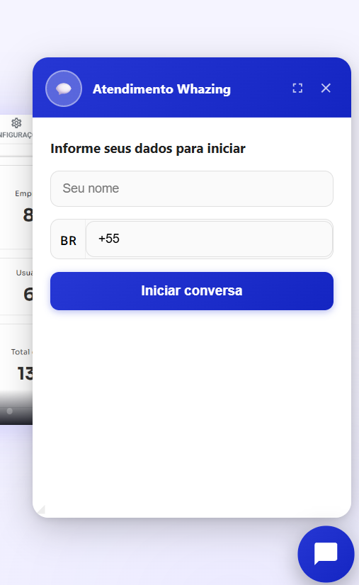
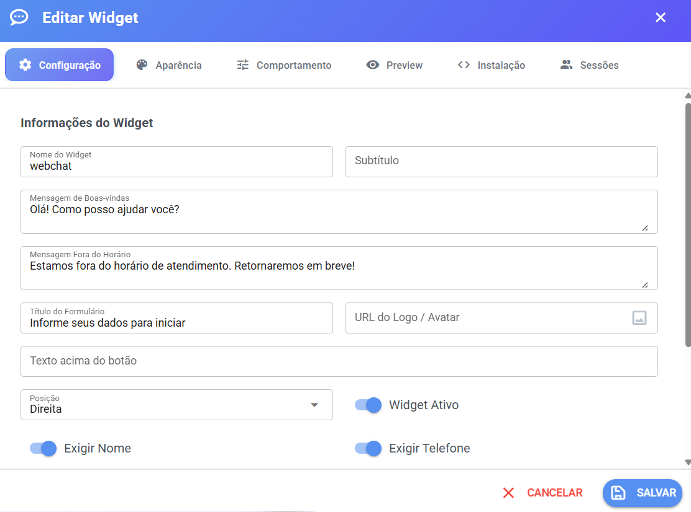

# 💬 WebChat — Atendimento pelo seu site

O **WebChat** é um **chat ao vivo que você coloca no seu site**. O visitante clica no botão de chat no canto da página, escreve a mensagem e a conversa chega **direto no seu sistema de atendimento**, como se fosse um WhatsApp.

<figure><figcaption></figcaption></figure>

***

## ✅ Para que ele serve

* Receber mensagens de clientes e visitantes **pelo site**, sem precisar de WhatsApp.
* Atender essas conversas no mesmo lugar onde você já atende os outros canais.
* Saber **quem** está falando: o formulário inicial pede nome, telefone e e-mail (você escolhe o que é obrigatório).
* Personalizar **cores, textos e logo** para combinar com a sua marca.
* Controlar **em quais sites** o chat pode aparecer.

**Não é necessário contratar um HUB (como o NotificaMe) para ter chat no site:** o Whazing já tem **WebChat nativo**, sem custo adicional do Whazing. Se um dia você usar um provedor HUB para WebChat, as cobranças seriam do próprio provedor — não do Whazing.

***

## 📍 Onde encontrar e como criar

1. Faça login no sistema.
2. No menu lateral, entre em **Cadastros  - Canais**.
3. Clique no botão de **Adicionar Canal** e escolha **WebChat**.
4. Preencha nome do canal e clique em salvar.
5. Clique **Widget no canal foi criado**
6. Preencha os campos, confira o preview e clique em **Criar Widget**.
7. Depois de salvar, abra o widget de novo e use a aba **Instalação** para copiar o código e colar no seu site.

> 💡 O widget só começa a funcionar de verdade depois de **salvo** e **ativo**, e com o código de instalação colado no site.

***

## 🗂️ A tela de configuração (abas)

A configuração do WebChat tem **6 abas**:

| Aba               | O que você faz nela                                      |
| ----------------- | -------------------------------------------------------- |
| **Configuração**  | Nome, textos, formulário, posição, domínios permitidos   |
| **Aparência**     | Cores do chat                                            |
| **Comportamento** | Abertura automática, simulação de digitação, som         |
| **Preview**       | Vê como o chat vai ficar antes de publicar               |
| **Instalação**    | Código para colocar no site + documentação de integração |
| **Sessões**       | Lista das conversas dos visitantes                       |

> ⚠️ As abas **Instalação** e **Sessões** só ficam disponíveis **depois de salvar o widget**. Se ainda não salvou, salve primeiro.

<figure><figcaption></figcaption></figure>

***

## ⚙️ Aba Configuração

### Campos de texto (o que o visitante vê)

| Campo                        | O que é                                                                     |
| ---------------------------- | --------------------------------------------------------------------------- |
| **Nome do Widget**           | Nome interno do widget, só para você identificar na lista de canais         |
| **Subtítulo**                | Frase pequena que aparece no topo do chat (ex.: "Somos felizes em ajudar!") |
| **Mensagem de Boas-vindas**  | Primeira mensagem que o visitante recebe ao abrir o chat                    |
| **Mensagem Fora do Horário** | Mensagem exibida quando você não está disponível                            |
| **Título do Formulário**     | Título da telinha que pede os dados do visitante                            |
| **URL do Logo / Avatar**     | Endereço da imagem do seu logo, que aparece no chat                         |
| **Texto acima do botão**     | Frase que fica flutuando junto ao botão do chat (ex.: "Precisa de ajuda?")  |

### Opções liga/desliga e escolhas

| Opção                    | O que faz                                                                                                                             |
| ------------------------ | ------------------------------------------------------------------------------------------------------------------------------------- |
| **Posição**              | Escolha **Direita** ou **Esquerda** — de que lado do site o botão aparece                                                             |
| **Widget Ativo**         | Liga/desliga o chat no site. Desligado, o botão some                                                                                  |
| **Exigir Nome**          | Visitante **precisa** informar o nome para conversar                                                                                  |
| **Exigir Telefone**      | Visitante **precisa** informar o telefone                                                                                             |
| **Exigir E-mail**        | Visitante **precisa** informar o e-mail                                                                                               |
| **Ocultar botão padrão** | Esconde o botão de chat do Whazing — use quando quiser um **botão seu** no site, abrindo o chat pelo código (veja a seção API abaixo) |

> 💡 Os três "Exigir..." servem para o formulário inicial. Se desligar tudo, o visitante conversa sem preencher nada.

### 🔒 Domínios Permitidos

Aqui você diz **em quais sites o chat pode aparecer**.

* **Deixe vazio** para permitir **qualquer** site (qualquer pessoa que pegar seu código poderia instalar).
* **Adicione os seus domínios** (ex.: `suaempresa.com.br`) para o chat funcionar **apenas** nesses sites.

**Como adicionar:**

1. Digite o domínio no campo (exemplo do campo: `exemplo.com.br`).
2. Pressione **Enter** ou clique no botão **+**.
3. O domínio aparece como uma etiqueta na lista. Para tirar, clique no **x** da etiqueta.

> ⚠️ **Recomendado:** cadastre os domínios dos seus sites. Assim, ninguém copia o seu código de chat e usa em outro site no seu lugar.

***

## 🎨 Aba Aparência

Você escolhe **duas cores de fundo** e, para cada uma, a **cor da fonte** (a cor do texto por cima):

| Cor                   | Onde aparece                 |
| --------------------- | ---------------------------- |
| **Cor de fundo** (1ª) | Cabeçalho do chat e botão    |
| **Cor da fonte** (1ª) | Texto por cima dessa cor     |
| **Cor de fundo** (2ª) | Mensagens e detalhes do chat |
| **Cor da fonte** (2ª) | Texto por cima dessa cor     |

* Use o seletor de cores ou digite o código da cor (ex.: `#1a73e8`).
* Se você **não escolher** a cor da fonte, o sistema **calcula automaticamente** a cor de texto que tem melhor leitura sobre o fundo escolhido (pretinho ou branco, conforme o contraste).

> 💡 Dica simples: escolha o fundo na cor da sua marca e deixe a cor da fonte automática. O sistema garante que o texto fique legível.

***

## 🕹️ Aba Comportamento

| Opção                           | O que faz                                                                    |
| ------------------------------- | ---------------------------------------------------------------------------- |
| **Abrir automaticamente**       | O chat se abre sozinho quando o visitante entra na página                    |
| **Tempo para abrir**            | Quantos **milissegundos** esperar antes de abrir (ex.: `5000` = 5 segundos)  |
| **Simular digitação do agente** | Antes da mensagem aparecer, mostra "digitando…" — dá cara de conversa humana |
| **Duração da simulação**        | Quanto tempo o "digitando…" fica na tela (em milissegundos)                  |
| **Som de notificação**          | Toca um som quando chega mensagem                                            |

> 💡 A abertura automática também pode ser feita pelo código, caso prefira controlar pelo site — os dois jeitos estão descritos na seção de integração.

***

## 👁️ Aba Preview

Mostra o **Preview em Tempo Real**: o chat exatamente como o visitante vai ver, atualizando **conforme você edita** as configurações, cores e textos.

Use esta aba para conferir tudo **antes** de salvar e publicar no site.

<figure><figcaption></figcaption></figure>

***

## 🌐 Aba Instalação — colocando o chat no site

Aqui está o **Código de Instalação**, pronto para copiar (tem um botão de copiar ao lado). O código é parecido com este:

```html
<script src="https://SEU-SISTEMA/webchat/public/widget.js" data-widget-id="SEU-WIDGET-ID"></script>
```

> Os valores em maiúsculo são **exemplos** — use o código copiado da tela, que já vem preenchido com o endereço do **seu** sistema e o **Widget ID** do seu chat.

**Passo a passo:**

1. Salve o widget (se ainda não salvou).
2. Abra a aba **Instalação**.
3. Clique no **botão de copiar** ao lado do código.
4. No arquivo do seu site, **cole o código antes de `</body>`** (no final da página, antes de fechar o corpo do site).
5. Salve e recarregue o site. O botão de chat vai aparecer no canto escolhido.

> ⚠️ O Widget ID também é mostrado separadamente na mesma aba — é a "identidade" do seu chat, e já vem embutido no código.

### Documentação de Integração (na própria aba Instalação)

Abaixo do código de instalação, a mesma tela traz a **Documentação de Integração** com exemplos prontos para copiar, em 5 partes:

### 1. Instalação padrão

O código básico explicado acima — a forma mais comum.

### 2. Ocultar o botão e usar um botão seu

Se quiser que o chat abra a partir de **um botão do seu próprio site** (com a sua cara e o seu texto):

1. Na aba **Configuração**, ative **Ocultar botão padrão**.
2. Use `WebChat.open()` no elemento que quiser. Exemplos que constam na tela:

```html
<!-- Botão simples -->
<button onclick="WebChat.open()">Falar com o suporte</button>

<!-- Passando dados do usuário logado (pula o formulário) -->
<button onclick="WebChat.open({ name: currentUser.name, phone: currentUser.phone, email: currentUser.email })">
  Suporte
</button>

<!-- Link -->
<a href="#" onclick="WebChat.open({ name: 'João', phone: '5511912345678' }); return false;">
  Fale conosco
</a>

<!-- Botão que abre após 2 segundos -->
<button onclick="setTimeout(() => WebChat.open(), 2000)">Abrir em 2s</button>
```

> 💡 Ao passar **nome, telefone e e-mail** na abertura, o visitante **não precisa preencher o formulário** — ótimo para sites onde o cliente já está logado.

### 3. API JavaScript

Comandos para controlar o chat pelo código do site:

```js
WebChat.open();   // Abrir o chat
WebChat.close();  // Fechar o chat
WebChat.toggle(); // Alternar (abre se fechado, fecha se aberto)

// Inicializar manualmente (quando o código não usa data-widget-id)
WebChat.init({ widgetId: 'SEU-WIDGET-ID' });
```

### 4. Eventos disponíveis

O chat **avisa** a página do site quando coisas acontecem. Seu site pode "escutar" esses avisos e reagir:

```js
// O chat abriu
window.addEventListener('webchat:opened', function() {
  console.log('Chat aberto');
});

// O chat fechou
window.addEventListener('webchat:closed', function() {
  console.log('Chat fechado');
});

// Chegou uma mensagem do agente
window.addEventListener('webchat:message', function(e) {
  console.log('Nova mensagem:', e.detail.message);
});

// Há mensagens não lidas
window.addEventListener('webchat:unread', function(e) {
  console.log('Mensagens não lidas:', e.detail.count);
});
```

**Exemplo do dia a dia:** quando o atendente responde e o visitante está em outra aba do site, o aviso `webchat:unread` permite que o seu site mostre um contador ou destaque no botão.

### 5. Abrir automaticamente após X segundos

Duas formas (escolha uma):

* **Pelo painel:** aba **Comportamento** → ative **Abrir automaticamente** e defina o **Tempo para abrir** em milissegundos.
* **Pelo código:**

```html
<script src="https://SEU-SISTEMA/webchat/public/widget.js"></script>
<script>
WebChat.init({
  widgetId: 'SEU-WIDGET-ID',
  autoOpen: true,
  autoOpenDelay: 5000  // 5 segundos
});
</script>
```

***

## 📋 Aba Sessões

Lista as **conversas dos visitantes** deste widget, com as colunas:

| Coluna               | O que mostra                                                                                  |
| -------------------- | --------------------------------------------------------------------------------------------- |
| **Visitante**        | Nome da pessoa que abriu o chat                                                               |
| **Telefone**         | Telefone informado (se preenchido)                                                            |
| **Status**           | Situação da sessão — etiqueta verde quando **ativa**, cinza quando encerrada                  |
| **Última atividade** | Data e hora da última movimentação                                                            |
| **Ticket**           | Número do atendimento criado no sistema (ex.: `#123`) — clique para acompanhar no atendimento |

Se não houver conversas, aparece **"Nenhuma sessão encontrada."**

***

## 🤝 Como funciona o atendimento

Quando um visitante inicia uma conversa pelo site:

1. O visitante preenche o formulário (somente o que você marcou como obrigatório).
2. A conversa **cria um atendimento (ticket) no canal WebChat** do sistema.
3. A partir daí, funciona como qualquer outro canal: **chatbot, filas, equipe e as regras de atendimento** do sistema se aplicam normalmente.
4. O atendente responde pelo sistema, e a mensagem aparece na janela do chat no site.

> 💡 Se a mesma pessoa voltar ao site e abrir o chat de novo, a conversa **retoma** o atendimento dela.

***

## 🔌 Sobre "API" — o que existe de verdade

**Para que serve uma API?** É um jeito de um programa conversar com outro. No caso do WebChat, a pergunta é: _"meu site consegue conversar com o chat?"_ — e a resposta é **sim**.

O WebChat do Whazing oferece a **API JavaScript do widget** — que é exatamente o que foi mostrado acima:

* **Comandos:** `WebChat.open()`, `WebChat.close()`, `WebChat.toggle()`, `WebChat.init()`;
* **Avisos (eventos):** `webchat:opened`, `webchat:closed`, `webchat:message`, `webchat:unread`;
* **Onde encontrar:** aba **Instalação** do widget, com exemplos prontos e botão de copiar;
* **Segurança:** não é preciso senha nem token — a proteção é feita pelo **Widget ID** (que é do seu chat) combinado com a lista de **Domínios Permitidos**.

> ⚠️ **Importante:** o WebChat **não está incluído** na documentação geral da API do sistema (OpenAPI) nem na coleção do **Postman**. Se você procurar endpoints REST do WebChat lá, **não vai encontrar** — a integração do WebChat é feita pela **API JavaScript** descrita nesta página. A API REST (OpenAPI/Postman) serve para os outros recursos do sistema, como clientes, mensagens e agendamentos.

**Quando eu preciso usar a API do WebChat?** Só quando quiser um **comportamento além do padrão**: botão próprio no site, abrir o chat para um usuário já logado (sem formulário), reagir a mensagens no seu site ou controlar a abertura automática pelo código. Para o uso normal, **não precisa de nada disso** — basta colar o código de instalação.

***

## ❓ Dúvidas e problemas comuns

**O botão não aparece no site.** Verifique, nesta ordem: (1) o widget está **salvo** e com **Widget Ativo** ligado; (2) o código de instalação foi colado **antes de `</body>`** na página certa; (3) o site que você está testando está na lista de **Domínios Permitidos** (se a lista não estiver vazia, só os domínios cadastrados funcionam); (4) recarregue a página com o cache limpo.

**Aparece o aviso de "Widget salvo com sucesso!" mas a aba Instalação continua bloqueada.** Feche e abra o widget novamente — depois de salvar, a aba fica disponível.

**O chat aparece, mas o visitante não é atendido.** Confira se o canal WebChat está ativo no sistema e se as regras de atendimento (chatbot/fila/equipe) estão configuradas, como nos outros canais.

**Alguém instalou meu chat em outro site.** Cadastre **apenas os seus domínios** em **Domínios Permitidos** e salve. O chat para de funcionar fora deles.

**Quero o chat num botão meu, não no canto.** Ative **Ocultar botão padrão** e use `WebChat.open()` no seu botão (exemplos na aba Instalação).

**O chat abre sozinho e incomoda os visitantes.** Desative **Abrir automaticamente** na aba **Comportamento**, ou aumente o **Tempo para abrir**.

**Erros ao salvar.** Se aparecer **"Erro ao salvar widget"**, verifique os campos obrigatórios (por exemplo, o nome do widget) e tente novamente. Em caso de persistência, registre o problema com a equipe de suporte.

***

## ✅ Resumo rápido

1. **Cadastros → Canais → adicionar canal → WebChat**.
2. Preencha textos, formulário e **Domínios Permitidos**.
3. Ajuste **cores** (Aparência) e **comportamento**.
4. Confira no **Preview**.
5. **Salve** → aba **Instalação** → copie o código → cole no site **antes de `</body>`**.
6. Acompanhe as conversas na aba **Sessões** e atenda no sistema, como em qualquer canal.
