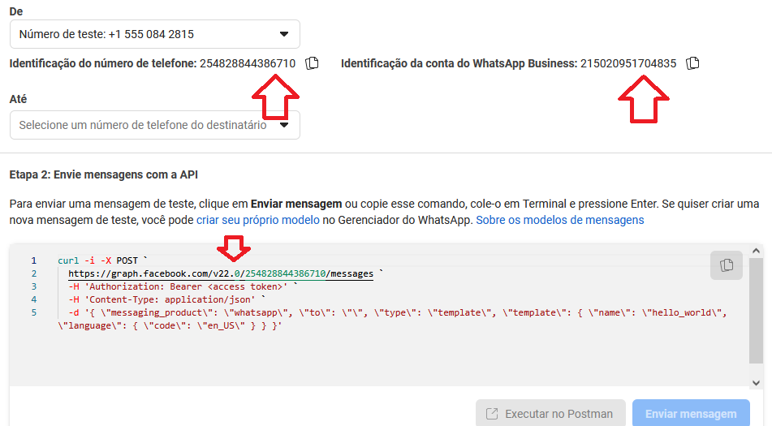
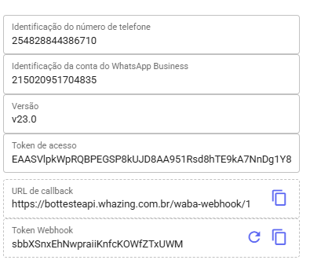

# API Oficial do WhatsApp (Meta)

## API Oficial do WhatsApp (Meta)

**⚠️ Considerações importantes**

* A API oficial **não oferece suporte a grupos**.
* O envio de templates está configurado ➤ [Tabela oficial de preços da Meta](https://business.whatsapp.com/products/platform-pricing?lang=pt_BR\&country=Brasil\&currency=D%C3%B3lar%20\(USD\)\&category=Utilit%C3%A1rios)
* A API oficial **não exibe a foto do contato**.
* Você tem **24 horas** para responder uma mensagem do cliente via Whazing. Após 24 horas somente via template pode ser iniciada uma conversa.
* API oficial **também pode ser banida**.

***

### ✅ Manual de Integração com a API Oficial do WhatsApp (Meta)

***

#### 1️⃣ Acessar o Painel da Meta

1. Entre em: [https://developers.facebook.com/](https://developers.facebook.com/)
2. Faça login com sua conta do **Facebook**.
3. Clique em **Criar Aplicativo**.
4. Selecione **Outro > Empresa**.

***

#### 2️⃣ Configurar o WhatsApp

* No painel de **Produtos**, localize **WhatsApp** e clique em **Configurar**.
*   Escolha a empresa vinculada à sua conta.

    > Se ainda não tiver uma empresa, será necessário criar uma.
* Clique em **Começar a usar a API**.

***

#### 3️⃣ Ajustes Iniciais do Aplicativo

1. Acesse **Configurações do App > Básico**.
2. Preencha os campos obrigatórios:
   * **URL da Política de Privacidade**
   * **URL dos Termos de Serviço**
3. Clique em **Salvar Alterações**.
4. No topo da página, altere o status do app de **Em Desenvolvimento** para **Ativo**.

***

#### 4️⃣ Configurar a API do WhatsApp

1. No menu lateral, vá em **WhatsApp > Configuração da API**.
2. Na etapa 5, clique em **Adicionar Número de Telefone**.
3. Informe os dados solicitados e conclua a validação.

***

#### 5️⃣ Gerar Token Temporário

* Ainda na tela de configuração da API, clique em **Gerar Token de Acesso Temporário**.
* Copie o token gerado (ele será usado no Whazing).

***

#### 6️⃣ Adicionar Canal no Whazing

<figure><figcaption></figcaption></figure>

1. No Whazing, vá em **Adicionar Canal**.
2. Selecione a opção **WABA API Oficial**.
3. Cole o **Token de Acesso** gerado anteriormente.

<figure><figcaption></figcaption></figure>

📌 Também será necessário copiar do painel da Meta:

* **ID do Número de Telefone**
* **ID da Conta do WhatsApp Business**
* **Versão da API** (ex: `v23.0` ou a mais recente disponível).

<figure><figcaption></figcaption></figure>

***

#### 7️⃣ Configurar Webhook

1. No painel da Meta, acesse **WhatsApp > Configuração da API > Etapa 3: Configure Webhooks**.
2. No Whazing, clique em **Gerar Token de Webhook** e copie:
   * **Token de Verificação**
   * **URL de Callback**
3. **Salve o canal no whazing**
4. Retorne ao painel da Meta, clique em **Configurar Webhook** e cole as informações.
5. Clique em **Verificar e Salvar**.
6. Marque o maximos para Assinado, principalmente o de **messages**.
7. Não esqueça marcar **messages** ele principal.

<figure><figcaption></figcaption></figure>

***

#### 8️⃣ Registrar Telefone no Whazing

<figure><figcaption></figcaption></figure>

1. Acesse **Ferramentas > Registrar Telefone**.
2. Digite um **PIN de 6 dígitos** (caso já tenha usado um PIN antes, utilize o mesmo).

Esse processo somente faz 1 vez

***

#### 9️⃣ Gerar Token Permanente

⚠️ O token temporário expira em algumas horas.\
Para garantir o funcionamento contínuo, gere um **Token Permanente**.

👉 Guia oficial:\
[Gerar Token Permanente – Meta](https://developers.facebook.com/docs/whatsapp/business-management-api/get-started#1--acquire-an-access-token-using-a-system-user-or-facebook-login)

***

#### 🔟 Atualizar Token no Whazing

* No Whazing, edite o canal criado e substitua o **Token de Acesso** temporário pelo **Token Permanente**.

***

✅ **Pronto! Seu Whazing está integrado com a API Oficial do WhatsApp (Meta).**

**Esse guia pode lhe ajudar também** [**https://blog.meujames.com/como-habilitar-seu-numero-api-oficial-whatsapp/**](https://blog.meujames.com/como-habilitar-seu-numero-api-oficial-whatsapp/)

Perfeito 👍 Segue o texto **reorganizado, mais didático e pronto para publicação no GitBook**, mantendo **todas as telas, links e contexto técnico**, mas com leitura fácil para leigos.

## 🛠️ Solução de Problemas

Esta seção ajuda a identificar e corrigir **problemas comuns de recebimento de mensagens** e **configuração de Webhook** na API Oficial do WhatsApp usando o **Whazing**.

### 🔍 Verificando informações pelo WHAZING

#### 📌 Caminho no sistema

Acesse no Whazing - Na tela de Canais:

<figure><figcaption></figcaption></figure>

**Ferramentas → Informações da Conta**

Essa tela exibe:

* 📄 Dados gerais da conta
* 📞 Informações do número conectado
* 🔗 **URLs de Webhook configuradas**
* ⚙️ Detalhes técnicos usados pela API Oficial

<figure><figcaption></figcaption></figure>

➡️ Utilize essa tela para confirmar se:

* O número está corretamente vinculado
* O Webhook está preenchido
* As informações da conta estão atualizadas

***

### 🔄 Atualizando o Webhook pelo WHAZING

#### 📌 Caminho no sistema

**Ferramentas → Atualizar URL Webhook**

Essa opção:

* Configura automaticamente o **Webhook oficial do Whazing**
* Garante que os eventos (mensagens, status, erros) sejam recebidos corretamente

> ⚠️ Importante Em versões **mais antigas do sistema**, essa opção pode não estar disponível. Nesse caso, a configuração deve ser feita **manualmente via Postman**.

***

### 📡 Configuração e testes pelo Postman

#### ❓ Não está recebendo mensagens?

O problema mais comum é **Webhook configurado incorretamente** ou apontando para outra aplicação.

#### Inscreva-se em um WABA

Utilize a requisição oficial no Postman para Inscreva seu aplicativo



[https://developers.facebook.com/community/threads/728867380278968/](https://developers.facebook.com/community/threads/728867380278968/)

#### 🔧 Tente configurar o Webhook diretamente pela API da Meta

Utilize a requisição oficial no Postman para **sobrescrever (override)** a URL do Webhook:

[https://www.postman.com/meta/whatsapp-business-platform/request/13382743-d9da58cd-7fc6-4dbc-a7cc-756d13c3c25a?tab=body](https://www.postman.com/meta/whatsapp-business-platform/request/13382743-d9da58cd-7fc6-4dbc-a7cc-756d13c3c25a?tab=body)

Essa requisição força a API da Meta a usar a URL informada como Webhook principal.

***

### 🔍 Verificando qual Webhook está ativo

É possível consultar qual URL de Webhook está realmente configurada no número.

#### Passo importante

* Verifique o campo **Webhook (WBA)**
* Se existir uma URL nesse campo:
  * ⚠️ **Ela tem prioridade** sobre o Webhook configurado na aplicação
  * Mesmo que o Whazing esteja configurado corretamente, ele **não receberá eventos**

#### Consulta via Postman

Utilize a requisição abaixo para consultar os números e seus Webhooks configurados:

[https://www.postman.com/meta/whatsapp-business-platform/request/l8ugxbv/get-phone-numbers?tab=auth](https://www.postman.com/meta/whatsapp-business-platform/request/l8ugxbv/get-phone-numbers?tab=auth)

***

### ✅ Checklist rápido de solução

Antes verifique:

* ✔️ Webhook aparece corretamente em **Ferramentas → Informações da Conta**
* ✔️ Não existe outro Webhook configurado em **Webhook (WBA)**
* ✔️ URL do Webhook está pública e acessível
* ✔️ Webhook foi atualizado pelo Whazing ou via Postman
* ✔️ Eventos de mensagem estão habilitados na Meta

***

### 📌 Dica importante

Sempre que:

* Trocar domínio
* Migrar servidor
* Restaurar backup
* Alterar configurações da conta Meta

➡️ **Atualize novamente o Webhook**, pois a Meta pode manter URLs antigas ativas.
