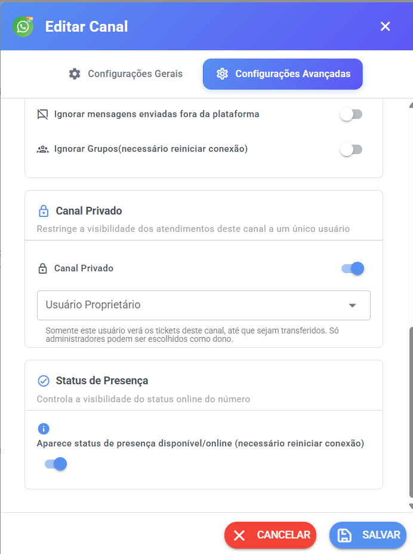

# Canal Privado

## O que é o Canal Privado?

O **Canal Privado** transforma um canal de atendimento em um canal **exclusivo para um único usuário**: o **usuário proprietário** escolhido na configuração.

É assim que o sistema descreve esse recurso:

> _"Restringe a visibilidade dos atendimentos deste canal a um único usuário"_

Na prática, quando um canal é configurado como privado:

* o canal fica **oculto** para os demais usuários do sistema;
* o usuário definido como **proprietário** é quem passa a visualizar o canal e os atendimentos (tickets) desse canal;
* os tickets continuam podendo ser **transferidos**, conforme as regras de atendimento do sistema.

> 🔒 **O Canal Privado é exclusivo para o usuário proprietário. O canal fica oculto para os demais usuários — inclusive outros administradores e supervisores.**

<figure><figcaption></figcaption></figure>

***

## 👤 Usuário Proprietário

O **usuário proprietário** é a pessoa escolhida para ter acesso exclusivo ao Canal Privado. É a ele que o canal fica associado.

### 👑 Somente administradores podem ser proprietários

Este é um ponto muito importante:

> **Para ativar um Canal Privado, o proprietário precisa ser um usuário administrador.**

Na prática, funciona assim:

* ao escolher o proprietário, a lista **já mostra apenas os usuários administradores** — os demais usuários simplesmente não aparecem para seleção;
* não é possível escolher um atendente comum ou um supervisor como proprietário;
* o campo é **obrigatório**: se você ativar o Canal Privado e não escolher o proprietário, o sistema pede — _"Selecione um usuário proprietário para o canal privado"_.

Essa regra existe para evitar que o canal fique "sem dono" — por exemplo, se a pessoa escolhida sair da empresa.

O próprio sistema explica a regra ao lado do campo:

> _"Somente este usuário verá os tickets deste canal, até que sejam transferidos. Só administradores podem ser escolhidos como dono."_

***

## 👁️ O canal fica oculto — para todos os outros

Esta é a parte mais importante de toda a documentação:

> ⚠️ **O Canal Privado é realmente oculto.** O fato de outro usuário ser administrador **não** significa que ele conseguirá visualizar esse canal. O canal fica associado ao usuário proprietário e não aparece para os demais usuários.

Ou seja, o Canal Privado **não é** uma configuração onde todos continuam vendo o canal, mas só alguns podem abrir os atendimentos. O objetivo é **esconder** o canal de verdade. Quem não é o proprietário:

* **não vê o canal na lista de canais**;
* **não vê os tickets** que chegam por ele;
* **não consegue abrir o canal nem a sua configuração** — para quem não é o dono, o sistema simplesmente não encontra o canal.

Veja como fica a visibilidade para cada tipo de usuário:

| Usuário                             | Vê o Canal Privado?                  |
| ----------------------------------- | ------------------------------------ |
| **Proprietário** (o dono escolhido) | ✅ Sim — é o único que vê normalmente |
| **Outro administrador**             | ❌ Não — mesmo sendo administrador    |
| **Supervisor**                      | ❌ Não                                |
| **Atendente e demais usuários**     | ❌ Não                                |

### 🚨 Não confunda "Administrador" com "acesso ao canal"

No funcionamento normal do sistema, administradores têm acesso amplo ao atendimento. **Porém, o Canal Privado possui uma regra específica de ocultação:**

> **Ser administrador não significa que o usuário verá todos os Canais Privados.**

Um administrador só enxerga um Canal Privado se **ele mesmo for o proprietário** daquele canal. Não existe filtro, menu especial ou configuração que libere o canal para outros administradores ou supervisores — isso é proposital, para garantir a privacidade do recurso.

***

## 🎫 Tickets do Canal Privado

Os **tickets** (atendimentos) que chegam por um Canal Privado seguem a mesma lógica de privacidade:

* **quem recebe e vê os tickets:** o **usuário proprietário** do canal, para todos os tickets que chegarem por ele;
* as **novas mensagens e atualizações em tempo real** desses tickets também aparecem somente para quem tem acesso;
* **outros administradores, supervisores e usuários não veem esses tickets** — a regra de ocultação vale também para as listas de atendimento;
* **exceções dentro de um ticket:** além do proprietário, conseguem ver um ticket específico:
  * o usuário que estiver **atendendo** aquele ticket no momento (o destinatário de uma transferência, por exemplo);
  * os **colaboradores** adicionados àquele ticket.

Fora isso, nenhum outro usuário vê os atendimentos do canal — inclusive porque a regra de "atendimentos sem fila e sem dono visíveis para todos" **não se aplica** a canais privados.

***

## 🔄 Transferência de tickets

O Canal Privado está associado ao proprietário, mas um ticket pode ser **transferido** conforme as regras de atendimento do sistema. Entenda a diferença entre as duas coisas:

### O que muda com a transferência

* **Antes da transferência:** o ticket aparece para o proprietário do canal (e para quem já estava atendendo ou colaborando nele).
* **Depois da transferência:** o usuário que **recebe** o ticket passa a visualizar aquele atendimento normalmente — mesmo que não seja o proprietário do canal.
* **O ticket deixa de aparecer para o proprietário?** Depende: se o ticket for transferido e passar a ser atendido por outro usuário, ele segue as regras normais de um atendimento atribuído. O importante é que **o destinatário da transferência consegue ver e atender o ticket**.

### O que NÃO muda com a transferência

* **O canal continua privado** — a transferência não transforma o canal em público.
* **O canal continua invisível** para os demais usuários — transferir um ticket não faz o canal aparecer para ninguém.
* **O proprietário do canal não muda** — transferir um ticket **não** transfere a propriedade do canal. A propriedade só muda se o próprio dono editar a configuração e escolher outro proprietário.

> 💡 **Resumindo:** a transferência muda o acesso **àquele ticket**, não ao canal. O destinatário vê o atendimento que recebeu; o restante do canal continua oculto, como sempre esteve.

***

## 🚫 Canal Privado não é uma permissão comum

É comum confundir o Canal Privado com uma simples restrição de acesso. A diferença é importante:

* **Em uma restrição comum**, o canal continua aparecendo para os usuários — apenas algumas ações ficam bloqueadas.
* **No Canal Privado**, o objetivo é **esconder** o canal dos demais usuários: ele não aparece na lista, seus tickets não aparecem no atendimento e sua configuração não pode ser aberta por quem não é o dono.

Por isso, o Canal Privado deve ser visto como uma configuração de **privacidade total** do canal, e não como um simples controle de permissão.

***

## ⚠️ Use o Canal Privado com cuidado

Antes de ativar, confirme se você realmente deseja esse comportamento. Lembre-se do que acontece:

* o canal ficará **oculto**;
* **outros administradores não verão** o canal;
* **supervisores não verão** o canal;
* **outros usuários não verão** o canal;
* isso pode fazer com que **outras pessoas da equipe não saibam que o canal existe** — e, portanto, não saibam que aqueles atendimentos estão acontecendo;
* o canal só voltará a aparecer para os demais quando **você desativar a privacidade**.

> ⚠️ **Recomendação:** use o Canal Privado **somente quando realmente for necessário** esconder um canal dos demais usuários — por exemplo, para um número de uso restrito de um setor ou de uma pessoa específica. Para números normais de atendimento em equipe, o modo padrão (canal visível) costuma ser o mais adequado.

***

## 🧭 Como configurar

> 📌 **Antes de começar:** o canal precisa **já estar criado** — a opção fica na aba de configurações avançadas, que só existe para canais salvos. Canais de **E-mail** e **SMS** não possuem essa opção.

### 1. Acesse a tela de canais

Entre no menu **Canais** do sistema, onde ficam listadas todas as conexões.

### 2. Encontre o canal

Localize o canal que será configurado como privado entre os cards exibidos.

### 3. Abra a configuração do canal

Clique na opção de **editar** do canal para abrir a janela de configuração.

### 4. Vá na aba "Configurações Avançadas"

A configuração de Canal Privado fica dentro da aba **"Configurações Avançadas"**, no card **"Canal Privado"** — identificado com um ícone de cadeado 🔒, junto à descrição _"Restringe a visibilidade dos atendimentos deste canal a um único usuário"_.

### 5. Ative o Canal Privado

Ligue a chave (toggle) **"Canal Privado"**.

> ⚠️ **Somente administradores podem alterar esta configuração.** Se o usuário que estiver editando não for administrador, a chave fica bloqueada e o sistema mostra o aviso _"Apenas administradores podem alterar esta configuração"_.

### 6. Escolha o usuário proprietário

Ao ativar, o campo **"Usuário Proprietário"** aparece logo abaixo. Nele, escolha o **administrador** que será o dono do canal — lembre-se de que a lista mostra apenas administradores.

É por isso que essa escolha importa: **esse será o único usuário que poderá ver o canal e os atendimentos dele**, até que um ticket seja transferido.

### 7. Salve

Clique em **"Salvar"** na janela do canal. Pronto — a partir daquele momento, o canal fica visível **apenas para o proprietário escolhido**.

***

## 🔓 Como desativar

Para fazer o canal voltar ao modo normal (visível para todos):

1. O **proprietário** do canal abre a configuração do canal (os outros usuários não conseguem — o canal não aparece para eles).
2. Vá na aba **"Configurações Avançadas"** → card **"Canal Privado"**.
3. **Desligue** a chave "Canal Privado".
4. Clique em **"Salvar"**.

Depois de salvar, o canal volta a aparecer normalmente para administradores e supervisores, e os tickets voltam a seguir as regras padrão de atendimento.

> 💡 **Segurança automática:** se o usuário proprietário for **excluído** do sistema, os canais privados dele **voltam ao modo normal automaticamente** — nenhum canal fica "travado" sem dono. As demais configurações do canal são mantidas.

***

## 🧑‍💼 Exemplos práticos

### Exemplo 1 — Canal exclusivo

**Canal:** WhatsApp da Diretoria **Proprietário:** Administrador João

João consegue visualizar o canal e os atendimentos dele normalmente. Todos os demais usuários **não visualizam** o canal — ele simplesmente não aparece na lista deles.

### Exemplo 2 — Outro administrador

Maria também é administradora da empresa. Mesmo assim, **ela não verá o Canal Privado de João** — ser administradora não dá acesso aos canais privados de outros proprietários.

### Exemplo 3 — Supervisor

Um supervisor também **não verá o Canal Privado**. A regra de ocultação vale para todos os perfis que não são o proprietário.

### Exemplo 4 — Transferência

João está atendendo um ticket que chegou pelo Canal Privado e o transfere para o atendente Carlos:

* **Carlos** passa a ver e atender **aquele ticket**;
* o **canal continua privado e oculto** para Carlos e para todos, exceto João;
* os **demais tickets** do canal continuam visíveis apenas para João;
* João **continua sendo o proprietário** do canal.

***

## ❓ Dúvidas comuns

### "Outro administrador consegue ver o canal?"

**Não.** O Canal Privado fica visível apenas para o proprietário. Outro administrador só verá o canal se **ele mesmo** for o dono.

### "O supervisor consegue ver?"

**Não.** Supervisores não veem Canais Privados, a menos que sejam o proprietário (e, como explicado, somente administradores podem ser proprietários).

### "Qualquer usuário pode ser proprietário?"

**Não.** Somente usuários **administradores** podem ser escolhidos como proprietários. A lista de seleção já mostra apenas administradores.

### "Posso escolher um atendente comum?"

**Não.** O campo só oferece usuários administradores. Essa regra evita que o canal fique sem dono se a pessoa sair da empresa.

### "O canal continua aparecendo para os outros usuários?"

**Não.** Esse é justamente o objetivo do recurso: o canal fica **oculto** para todos, exceto o proprietário. Ele não aparece na lista de canais e seus tickets não aparecem no atendimento.

### "O que acontece com os tickets?"

Eles ficam visíveis apenas para o **proprietário** do canal — com duas exceções pontuais: o usuário que estiver **atendendo** aquele ticket e os **colaboradores** daquele ticket.

### "Se eu transferir um ticket, o que acontece?"

O usuário que **recebe** a transferência passa a ver **aquele ticket**. O canal continua privado e oculto para os demais, e a propriedade do canal **não muda**.

### "Posso voltar o canal ao modo normal?"

**Sim.** O proprietário desliga a chave "Canal Privado" na configuração do canal e salva. O canal volta a aparecer para todos normalmente. E, se o proprietário for excluído do sistema, os canais dele voltam ao modo normal **automaticamente**.

### "Sou o administrador do sistema e não vejo um canal privado. Como acessar?"

Somente o **proprietário** definido na configuração tem acesso — ser administrador **não** libera a visualização de Canais Privados de outras pessoas. Para acessar, você precisaria ser definido como proprietário do canal (pelo dono atual, na configuração dele).

***

## 👣 Próximos passos

* Gerencie quem usa o sistema e com qual perfil: [Usuários](../funcionalidades/gestao/usuarios/).
* Entenda a organização dos atendimentos e as permissões: [Organização de Atendimentos, Filas e Permissões de Usuários](../funcionalidades/gestao/organizacao-de-atendimentos-filas-e-permissoes-de-usuarios.md).
* Conheça os demais recursos de canais: [Canais Disponíveis](./) e o [Modo Híbrido](modo-hibrido.md).
