# Como importar sua sessão do WhatsApp para o Whazing

## Como importar sua sessão do WhatsApp para o Whazing

> **Importante**
>
> Este procedimento utiliza uma **extensão não oficial** do navegador para exportar sua sessão do WhatsApp Web.
>
> Após importar a sessão para o Whazing, **não utilize a mesma sessão simultaneamente no WhatsApp Web**, pois isso pode causar desconexões.

***

## Método 1 - Exportar JSON e importar no Whazing (Recomendado)

### 1. Baixe a extensão

Acesse o repositório da extensão:

**GitHub:**\
[https://github.com/w3nder/wa-web-dump](https://github.com/w3nder/wa-web-dump)

Ou faça o download direto:

[https://github.com/w3nder/wa-web-dump/archive/refs/heads/main.zip](https://github.com/w3nder/wa-web-dump/archive/refs/heads/main.zip)

<figure>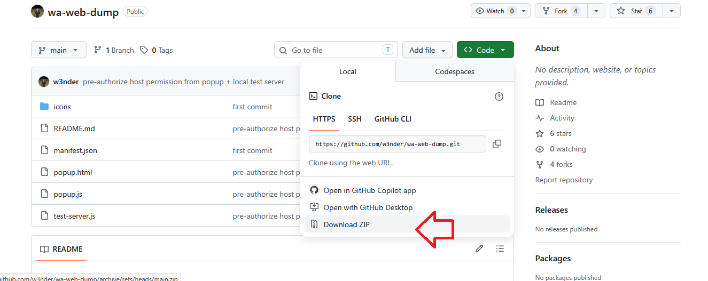<figcaption></figcaption></figure>

***

### 2. Descompacte o arquivo

Após baixar o arquivo ZIP:

* Clique com o botão direito.
* Escolha **Extrair Tudo...**
* Aguarde a extração.

Você terá uma pasta contendo a extensão.

***

### 3. Instale a extensão no Google Chrome

Abra o navegador e acesse:

```
chrome://extensions
```

Depois:

1. Ative o **Modo do desenvolvedor**.
2. Clique em **Carregar sem compactação**.
3. Selecione a pasta da extensão extraída.

A extensão será instalada.

<figure>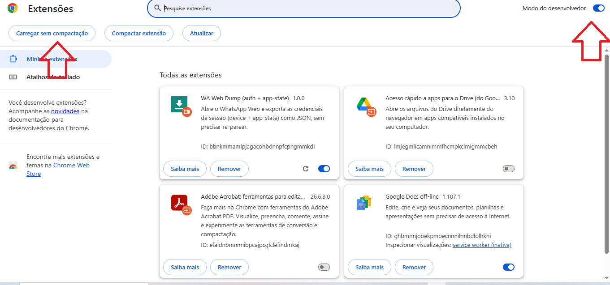<figcaption></figcaption></figure>

***

### 4. Entre no WhatsApp Web

Acesse:

[https://web.whatsapp.com](https://web.whatsapp.com)

Faça login normalmente utilizando seu celular.

Aguarde até que todas as conversas sejam carregadas.

***

### 5. Abra a extensão

Clique no ícone da extensão instalado no navegador.

<figure>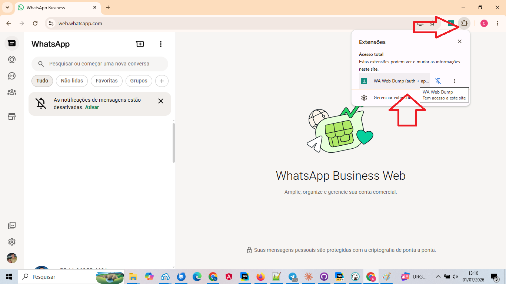<figcaption></figcaption></figure>

***

### 6. Marque a opção importante

Antes de gerar o arquivo, marque:

✅ **Limpar storage local após o dump (sem deslogar do servidor)**

Esta opção é **obrigatória**.

Ela remove os dados locais do navegador após gerar o arquivo, evitando conflitos quando a sessão for utilizada pelo Whazing.

<figure>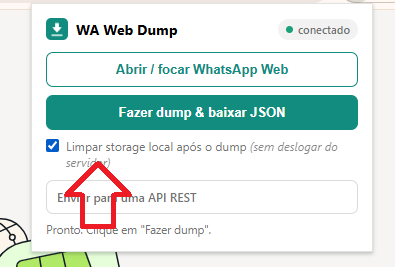<figcaption></figcaption></figure>

***

### 7. Gere o arquivo

Clique em:

**Fazer dump & baixar JSON**

Será feito o download de um arquivo JSON.

<figure>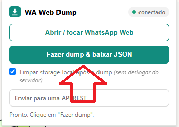<figcaption></figcaption></figure>

***

### 8. Confirme a limpeza

A extensão perguntará se deseja limpar o armazenamento local.

Confirme.

Isso é muito importante.

> **Atenção**
>
> A mesma sessão não deve permanecer conectada ao WhatsApp Web e ao Whazing ao mesmo tempo.

<figure><figcaption></figcaption></figure>

***

### 9. Importe o arquivo no Whazing

No painel do Whazing:

* Abra a tela QRCODE WHAZING
* Escolha a opção para importar credenciais.
* Selecione o arquivo JSON baixado.
* Aguarde a importação.

Após alguns segundos o WhatsApp deverá conectar normalmente.

<figure>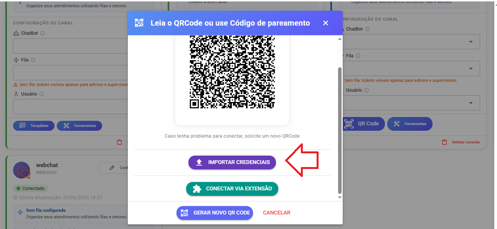<figcaption></figcaption></figure>

<figure>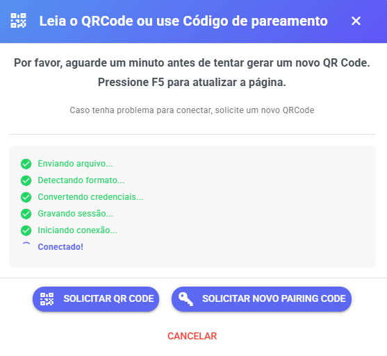<figcaption></figcaption></figure>

***

## Método 2 - Enviar diretamente para o Whazing (API REST)

Este método dispensa o download do arquivo JSON.

***

### 1. Abra a extensão

Com o WhatsApp Web conectado, abra a extensão.

***

### 2. Escolha "Enviar para uma API REST"

Selecione a opção:

**Enviar para uma API REST**

<figure>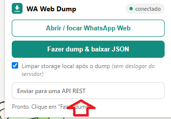<figcaption></figcaption></figure>

***

### 3. Copie a URL e o Token do Whazing

Abra modal QRCODE e clique em "Conectar via Extensão"

<figure>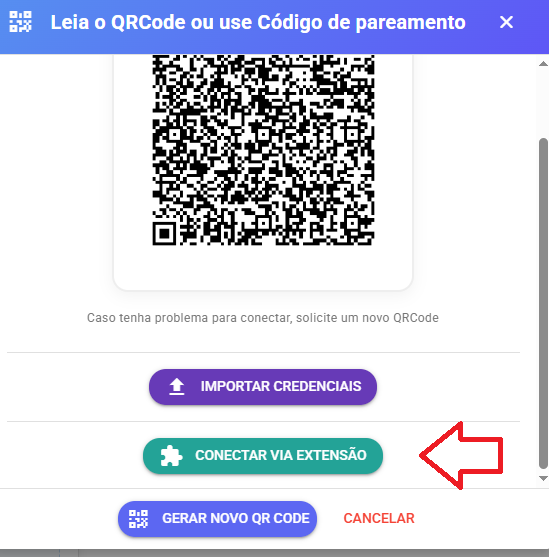<figcaption></figcaption></figure>

Sera gerado url e token valido por 30 minutos

<figure>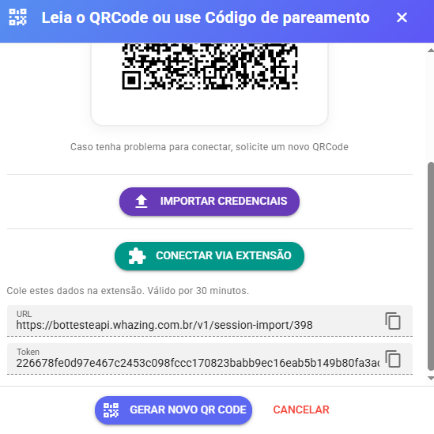<figcaption></figcaption></figure>

* URL da API
* Token

Copie ambos.

***

### 4. Preencha os dados

Cole na extensão:

* URL

Verifique se não existem espaços extras.

***

### 5. Autorize o envio

Antes do primeiro envio, clique em:

**Autorizar host**

O navegador solicitará permissão.

Confirme.

Sem essa autorização a extensão não conseguirá enviar os dados ao Whazing.

<figure>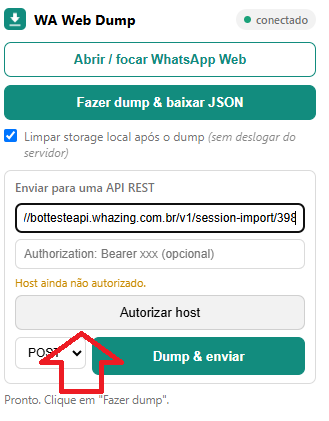<figcaption></figcaption></figure>

Após autorizar o host pode color token copiado

<figure>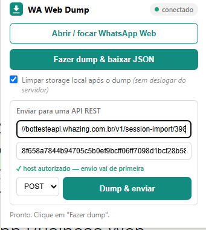<figcaption></figcaption></figure>

***

### 6. Envie os dados

Clique em:

**Dump & enviar**

Aguarde alguns segundos.

Se tudo estiver correto será exibida uma mensagem de sucesso.

Caso apareça erro:

* confira a URL;
* confira o Token;
* confirme que o host foi autorizado

***

### 7. Aguarde a conexão

Após o envio, volte ao painel do Whazing.

A conexão deverá ser estabelecida automaticamente em alguns segundos.

<figure>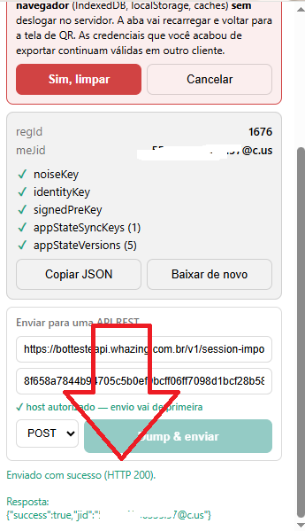<figcaption></figcaption></figure>

***

Após confirmar conexão clique "Sim, Limpar"

<figure>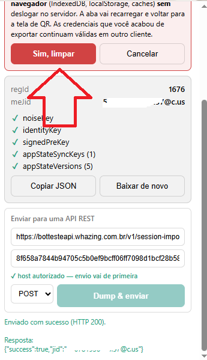<figcaption></figcaption></figure>

***

## Importante

* Não utilize a mesma sessão simultaneamente no WhatsApp Web e no Whazing.
* Sempre utilize a opção **Limpar storage local após o dump**.
* Se precisar utilizar novamente o WhatsApp Web, faça um novo login.

Seguindo esses passos, sua sessão será migrada para o Whazing com segurança.
