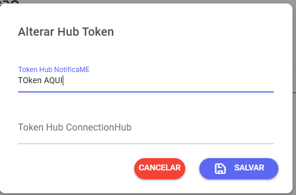

# Instagram, facebook e webchat via NotificaMe

## 🌐 Integração com Hub NotificaMe

Cadastrar através da URL [https://hub.whazing.com.br/](https://hub.whazing.com.br/)​

Usar cupom desconto: whazing

<figure><figcaption></figcaption></figure>

### 🔹 Acesso ao Hub

1. Acesse o site: [https://hub.notificame.com.br/](https://hub.notificame.com.br/)
2. Escolha a opção correta de acordo com o canal desejado:

*   **Apenas Instagram**: selecione **"Instagram V2 | Oficial"**.

    
*   **Apenas Facebook**: selecione **"Facebook | Oficial"**.

    
*   **Para usar ambos (Instagram e Facebook)**: selecione **"Facebook / Instagram | Oficial"**.

    
*   O sistema também suporta **WebChat**.

    

## Integração com o Whazing

1.  Após conectar o canal no Hub, copie o **token gerado**.

    
2.  Acesse o **Whazing**:

    * Navegue até **Configurações** > **Canais** > **Token Hub**.
    * Cole o **token copiado** do Hub e cadastre-o.

    
3. Agora, basta **adicionar o canal** e escolher o **Hub**.

### ⚠️ Observações importantes

* \*\* Atenção: O token deve pertencer à conta, não ao canal.
* **Não é possível iniciar conversas pelo Hub**.
* A interação **só pode começar** após o cliente entrar em contato primeiro.
* Você tem 24 horas para responder as mensagens, depois fecha janela de conversa
