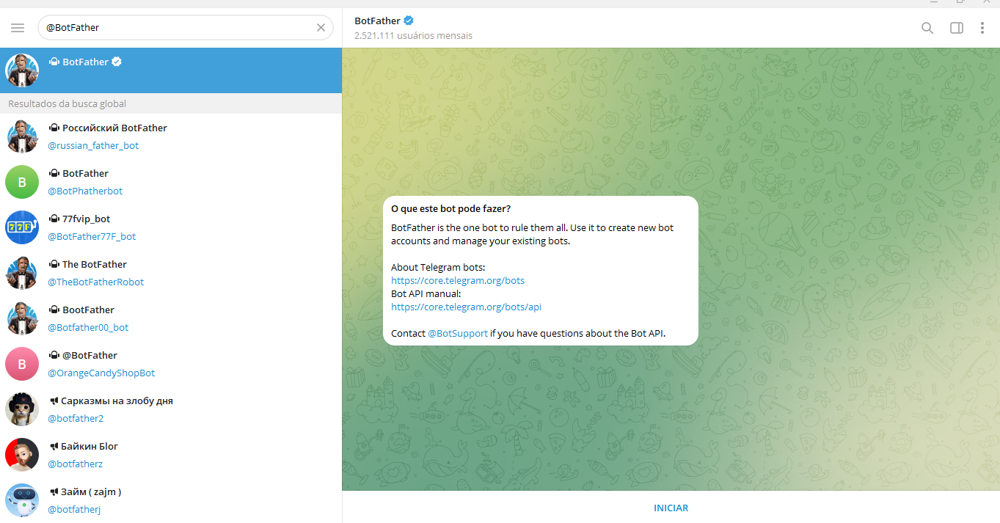
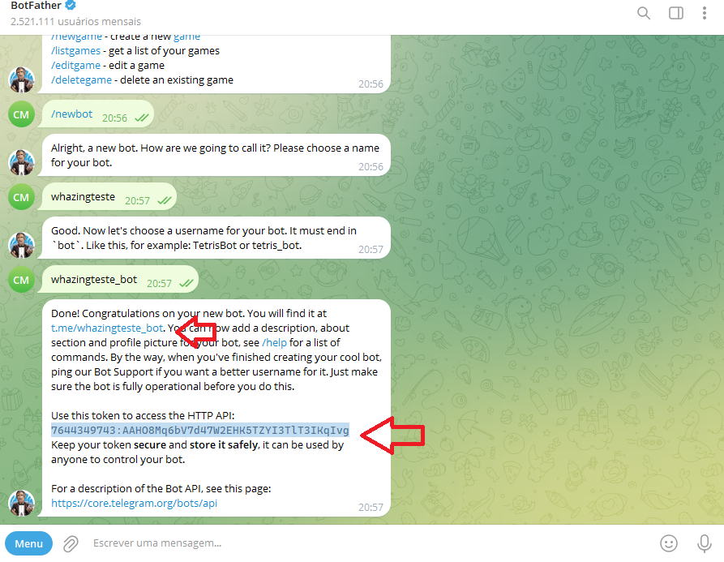

# Guia de Conexão do TELEGRAM

O **Telegram** é um canal de atendimento **sem custo por canal** e fácil de configurar. Você cria um bot no Telegram e o conecta ao sistema — assim, as mensagens enviadas para esse bot aparecem na tela de atendimento do Whazing.

> **Pré-requisito:** uma conta no Telegram (no celular ou no computador).

---

## 📲 Passo a passo para criar o bot

### 1. Acesse o Telegram e localize o BotFather

1. **Faça login** em sua conta do Telegram ou crie uma nova, caso ainda não possua.
2. No campo de **pesquisa**, digite **@BotFather** e acesse esse bot oficial.
3. Os bots oficiais do Telegram possuem um ✅ **visto azul** ao lado do nome.

### 2. Ative o BotFather

* Clique no botão **Iniciar** para ativar o BotFather.
* Você receberá uma lista de comandos disponíveis para criar e gerenciar bots.

### 3. Crie um novo bot

1. Digite ou selecione o comando **`/newbot`** e envie.
2. Escolha um **nome para o seu bot** (esse nome será exibido para os usuários).
3. Defina um **nome de usuário único**, que **deve terminar com "bot"**.
   * Exemplo: `whazing_bot`

### 4. Finalize a criação

* Após escolher o nome e o usuário, seu bot será criado.
* Você receberá:
  * Um **link do bot** no formato: `t.me/<bot_username>`
  * Recomendações para personalizar: imagem de perfil, descrição e comandos.

### 5. Obtenha o token do bot

* O BotFather fornecerá um **token de acesso**.
* **Copie esse token** — ele será usado para cadastrar o canal no Whazing.

.png)

> ⚠️ **Importante:** todas as mensagens devem ser enviadas para o **bot que você criou** para que apareçam no sistema Whazing.

---

## ⚙️ Configurações recomendadas do bot

No **@BotFather**, selecione seu bot e clique em **Bot Settings** e configure da forma abaixo:

<figure><figcaption></figcaption></figure>

---

## 👣 Próximos passos depois de conectar

1. **Crie as filas** e defina qual fila receberá os atendimentos do Telegram — veja [Organização de Atendimentos, Filas e Permissões de Usuários](../funcionalidades/gestao/organizacao-de-atendimentos-filas-e-permissoes-de-usuarios.md).
2. **Cadastre os usuários (atendentes)** e defina quais filas cada um pode acessar — veja [Usuários](../funcionalidades/gestao/usuarios/README.md).
3. **Configure mensagens automáticas** (saudação, despedida e transferência) — veja [Mensagens Automáticas](../funcionalidades/automacao/mensagens-automaticas.md).
4. **Crie um chatbot** para responder automaticamente — veja [Chatbot Interno](../funcionalidades/automacao/chatbotinterno/README.md).
5. **Nada funcionando?** Veja a [Solução de Problemas](../solucao-de-problemas/README.md).
