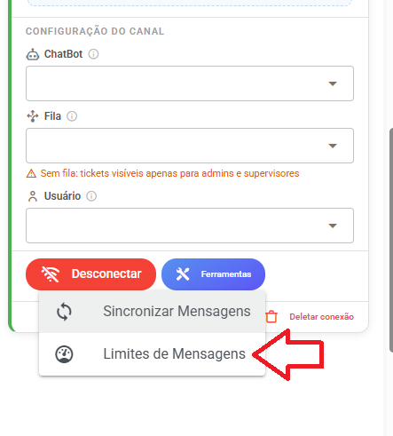
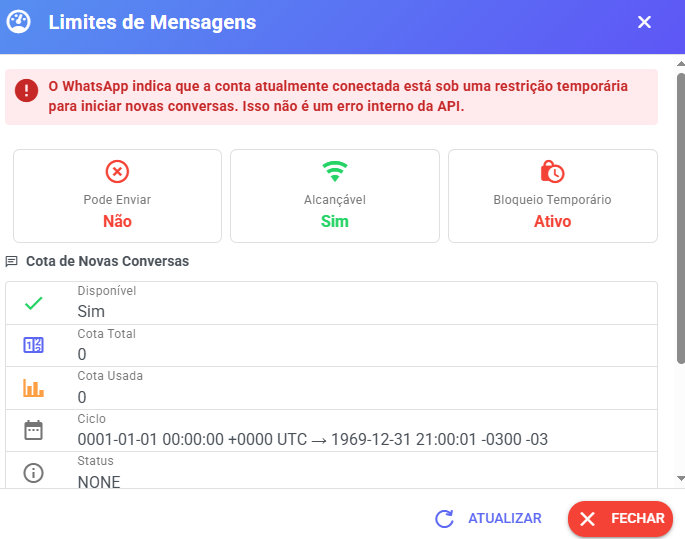

# Mensagem não enviando

Quando sistema fica aquele X e mensagem não está enviando e numero esta conectado

<figure><figcaption></figcaption></figure>

Pode ser que numero esteja com restrição

Como consultar. Na lista de canais.

<figure><figcaption></figcaption></figure>

<figure><figcaption></figcaption></figure>

Como saber quando termina restrição verifique JSON da consulta

<figure><figcaption></figcaption></figure>
