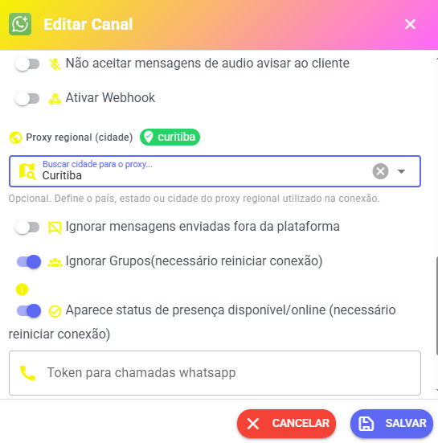

# WhatsApp API PLUS

## 📌 O que é a **WhatsApp API PLUS**?

A **WhatsApp API PLUS** é uma **API não oficial** que conecta seu WhatsApp ao sistema e oferece recursos extras (botões, listas, solicitação de localização etc.). É pensada para quem precisa de mais estabilidade e menor consumo de recursos do servidor (VPS) do que soluções simples.

***

⚠️ Recomendação Importante: WhatsApp Business É ALTAMENTE RECOMENDADO usar contas do WhatsApp Business em vez do WhatsApp normal para integração, o WhatsApp normal pode apresentar inconsistências, desconexões, limitações e instabilidades durante o uso com a nossa API.

### ✅ Recursos principais (o que você pode usar)

* **Botões interativos** — botões que o cliente toca para responder.
* **Listas** — menus com opções para o usuário escolher.
* **Botão “Copiar e colar”** — facilita copiar texto.
* **Links clicáveis** — abrir sites direto do chat.
* **Solicitação de localização** — usuário envia a localização automaticamente.

Em termos simples: são funcionalidades que deixam a conversa mais automática e profissional.

***

### 🌍 Proxy Regional (Cidade) – Melhorando a localização da conexão WhatsApp

O Proxy Regional (Cidade) permite definir uma cidade para que a conexão utilize um comportamento mais próximo da localização real do aparelho que fará a leitura do QR Code.\
Isso ajuda o WhatsApp identificar a conexão como mais compatível com a região do dispositivo, tornando o comportamento mais natural e reduzindo possíveis inconsistências de localização.

#### ✅ Exemplo recomendado

Se o aparelho que irá ler o QR Code está no Paraná, o ideal é selecionar uma cidade próxima, como:

* Curitiba
* Londrina
* Maringá

Isso torna a conexão mais coerente com a localização do dispositivo.

***

### ⚙️ Como configurar Proxy Regional (Cidade)

1. Com o canal desconectado, acesse:\
   **Configurações → Canais/API**
2. Clique em **Configurações** no canal desejado.
3. Role a página até localizar:\
   **Proxy Regional (Cidade)**
4. Preencha o nome da cidade desejada.
5. Clique em **Salvar**.
6. Após salvar, realize novamente a leitura do QR Code.

<figure><figcaption></figcaption></figure>

***

### ⚠️ Importante

* É obrigatório possuir um **token válido** configurado na conexão.
* Caso ocorra erro na busca da cidade, normalmente significa:
  * Token inválido
  * Servidor incorreto
  * Proxy indisponível

***

### 💡 Dicas importantes

* Prefira cidades grandes ou capitais próximas da localização real do aparelho.
* Algumas cidades pequenas podem não estar disponíveis na base de proxies.
* Caso a cidade não seja encontrada, tente utilizar uma cidade maior próxima da região.

#### Exemplos

* Interior do Paraná → usar Curitiba
* Interior de Santa Catarina → usar Florianópolis
* Interior de São Paulo → usar São Paulo

***

### 🔒 Recomendação

Para obter melhor estabilidade e comportamento mais realista da conexão:

* Configure o proxy antes de conectar o canal
* Utilize cidade próxima do aparelho
* Evite trocar cidade constantemente
* Após alterar o proxy regional, gere um novo QR Code para conexão do WhatsApp

***

### 🔎 Termos simples (Glossário rápido)

* **Canal**: cada “conexão” do WhatsApp que você ativa no painel. Ex.: 1 conta WhatsApp = 1 canal.
* **Token**: uma “chave” digital que identifica e autoriza um canal no nosso sistema. Cada canal precisa dessa chave.
* **VPS**: servidor virtual onde o sistema roda (painel / backend).
* **QR Code**: código que você escaneia com o WhatsApp para conectar o canal.
* **Baileys**: outra forma de conectar WhatsApp (biblioteca) — usamos aqui para explicar a troca entre modos.

***

### 💰 Preços (tabela clara)

| Plano / Pacote                    |                            Preço |
| --------------------------------- | -------------------------------: |
| Whazing Premium — 1 canal (teste) | **Grátis (1 canal para testar)** |
| Adicional: 1 canal                |                **R$ 5,00 / mês** |
| Adicional: 10 canais              |               **R$ 35,00 / mês** |
| Adicional: 20 canais              |               **R$ 60,00 / mês** |
| Adicional: 30 canais              |               **R$ 80,00 / mês** |
| Adicional: 40 canais              |               **R$ 95,00 / mês** |
| Adicional: 50 canais              |              **R$ 105,00 / mês** |

> Observação: **cada canal precisa de um token de acesso** Observação: **Api plus somente para clientes versão premium**

***

### 📢 Regra importante sobre pagamento (leia com atenção)

* **Não existe cobrança proporcional.**\
  Isso significa que **você sempre paga o valor cheio do canal**, mesmo que o contrate faltando poucos dias para o vencimento da sua fatura/VPS. Os dias “restantes” não são descontados — **esses dias se perdem**.

#### Como a cobrança funciona — explicação simples

1. Quando você **contrata um canal**, cobramos **o valor cheio** no momento da contratação.
2. Além disso, no vencimento da sua fatura da VPS, o mesmo valor pode aparecer novamente **incluído na fatura** (dependendo do fluxo de cobrança do painel).
3. Isso pode causar a impressão de “dupla cobrança” quando a contratação foi feita pouco antes do vencimento.

***

### 📅 Exemplos práticos (para entender melhor)

#### Exemplo A — contratar com antecedência

* Vencimento da VPS: dia **30** do mês.
* Você contrata 1 canal no dia **05** do mesmo mês.
* Cobrança: **R$ 5,00** no dia 05 (no ato).
* No dia 30 terá cobrança do canal

#### Exemplo B — contratar poucos dias antes do vencimento (situação a evitar)

* Vencimento da VPS: dia **15**.
* Você contrata 2 canais no dia **05**.
* Cobrança imediata: **R$ 10,00** (2 × R$ 5,00) — pago no ato.
* No dia 15 (vencimento da VPS), o mesmo valor pode aparecer **na fatura da VPS** (R$ 10,00) — resultado: **R$ 20,00** pagos em um curto período.
* **Resultado:** dias anteriores ao vencimento não são descontados — paga valor cheio sempre.

***

### ❓ Perguntas frequentes (FAQ)

**P: Posso testar um canal antes de pagar?**\
R: Sim — o plano Premium costuma oferecer **1 canal grátis para teste**

**P: Por que paguei e apareceu de novo na fatura?**\
R: Se comprou perto do vencimento, é possível que tenha sido cobrado na compra e, por segurança do sistema de faturas, o valor também tenha sido incluído na fatura da VPS. Por isso a recomendação de programar a compra.

**P: Contratei 11 canais — tenho desconto?**\
R: Não — **desconto só para pacotes oficiais** (10, 20, 40). No exemplo: 10 → R$ 35,00 + 1 → R$ 5,00 = R$ 40,00.

**P: O que é “token” e onde pego?**\
R: Token é uma chave gerada para conectar na api plus adquirir pelo Whatsapp +55 48 3197-0877 ou +55 48 3197-0599

***

***

### 🔒 Recomendações de segurança e boas práticas

* Nunca compartilhe seu **token** em lugares públicos.
* Faça backup dos tickets importantes antes de migrar.
* Teste 1 canal antes de ativar muitos de uma vez.

***

> **Aviso sobre cobrança de canais**\
> Ao contratar canais adicionais, **o valor será cobrado integralmente no ato**. Se a contratação ocorrer próximos ao vencimento da fatura da VPS, pode haver cobrança no ato e inclusão na fatura — programe suas compras para evitar cobranças em duplicidade. Em caso de dúvida, contate suporte com comprovante.

***
