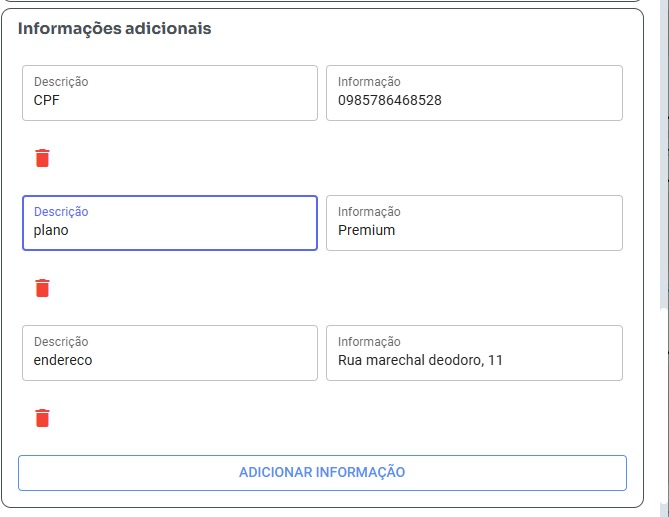
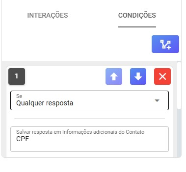

# 📌 Variáveis do Sistema

### 🔹 Tela de Atendimento - BOT INTERNO

#### 🔄 Variáveis Dinâmicas

Essas variáveis utilizam os valores cadastrados em **Informações Adicionais do Contato**.

📷 _Exemplo de cadastro:_\


**Exemplos**

*   Se o contato tiver `CPF = 0985786468528`:

    ```bash
    {{CPF}}
    ```

    ➝ Retorno: `0985786468528`
*   Se o contato tiver `plano = Premium`:

    ```bash
    {{plano}}
    ```

    ➝ Retorno: `Premium`
*   Se o contato tiver `endereco = Rua Marechal Deodoro, 11`:

    ```bash
    {{endereco}}
    ```

    ➝ Retorno: `Rua Marechal Deodoro, 11`

**Exemplo prático**

Mensagem configurada:

```bash
Por favor, confirme se seu endereço é {{endereco}}?
1 - Sim
2 - Não
```

Mensagem recebida pelo cliente:

```bash
Por favor, confirme se seu endereço é Rua Marechal Deodoro, 11?
1 - Sim
2 - Não
```

***

#### ✏️ Alterar Variáveis Dinâmicas pelo Chatbot

No **chatbot**, é possível salvar automaticamente a resposta do cliente como valor de uma variável.

📷 _Exemplo de configuração:_\


📂 Arquivo de exemplo disponível:\
`exemplo_fluxo_usando_novas_variaveis.json`

***

#### 🔒 Variáveis Fixas

Essas variáveis já estão disponíveis no sistema e não precisam ser cadastradas manualmente.

* Primeiro nome do contato → `{{firstName}}`
* Nome completo do contato → `{{name}}`
* Número do contato → `{{phoneNumber}}`
* E-mail do contato → `{{email}}`
* Saudação (PT) → `{{gretting}}`
* Saudação (ES) → `{{greetingEs}}`
* Saudação (EN) → `{{greetingEn}}`
* Saudação (alternativa) → `{{ms}}`
* ID do ticket → `{{ticket_id}}`
* Protocolo → `{{protocol}}`
* Hora → `{{hour}}`
* Data → `{{date}}`
* Fila → `{{fila}}`
* Nome do usuário → `{{user}}`
* E-mail do usuário → `{{userEmail}}`

***

### 🔹 Campanhas

As campanhas também suportam variáveis para personalizar mensagens em massa.

Variáveis disponíveis:

* Saudação (PT) → `{{gretting}}`
* Saudação (ES) → `{{greetingEs}}`
* Saudação (EN) → `{{greetingEn}}`
* Primeiro nome → `{{firstName}}`
* Nome completo → `{{name}}`
* Número → `{{phoneNumber}}`
* E-mail → `{{email}}`

***

### 🔹 Variáveis TypeBOT

No **TypeBOT**, algumas variáveis seguem um formato diferente:

* Número → `number`
* Nome do push → `pushName`
* Nome → `nome`
* E-mail → `email`
* ID do ticket → `ticketId`
* Protocolo → `protocol`
* Ticket → `ticket`
* Remote JID → `remoteJid`

***

👉 Dessa forma, o documento fica mais limpo, com títulos, divisões claras e exemplos diretos.

Quer que eu também prepare **uma tabela resumo** com todas as variáveis (dinâmicas, fixas e TypeBOT) em um só lugar para consulta rápida?
