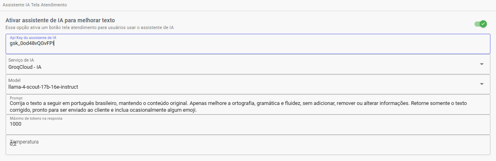
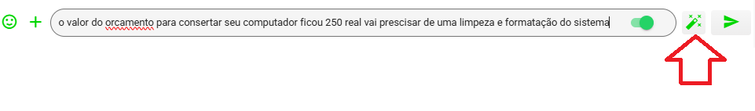

# Integração de IA para melhorar e sugerir mensagens no atendimento

Nas configurações tem nova opção onde você pode configurar, depois configurado ao preencher texto vai aparecer botão acima. Pode ser usado Groq ou Openai.

Sugestão de Prompt Corrija o texto a seguir em português brasileiro, mantendo o conteúdo original. Apenas melhore a ortografia, gramática e fluidez, sem adicionar, remover ou alterar informações. Retorne somente o texto corrigido, pronto para ser enviado ao cliente e inclua ocasionalmente algum emoji.

Apos configurado aparece tela atendimento aparece o botão acima, e abaixo resultado após melhoria

Obter key ChatGPT: https://platform.openai.com/settings/organization/api-keys
