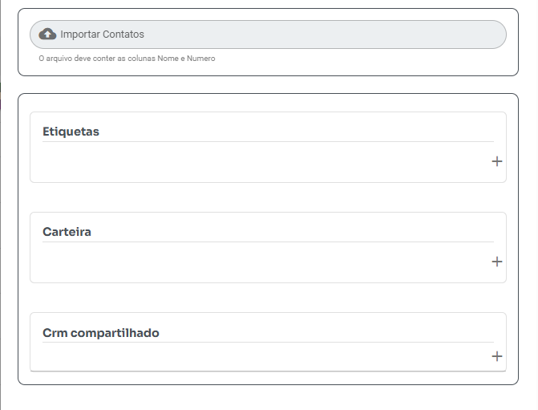

# **Como Importar Contatos Usando um Arquivo CSV**

---

**Antes de começar:** Certifique-se de que o WhatsApp esteja conectado. Esta funcionalidade só estará disponível com o WhatsApp ativo.

---

## **1. Baixe e Edite o Arquivo Modelo**

- Faça o [download do arquivo modelo](modelo.csv).  
- Ao abrir o arquivo em um editor de texto (ex.: Bloco de Notas), ele deve seguir o formato abaixo, com os valores separados por ponto e vírgula:

```
nome;numero  
User;5551900000
```

- Certifique-se de que o número de telefone inclua o código do país.  

- Use um editor que permita salvar o arquivo no formato acima.  

---

## **2. Importando no Whazing**

- Acesse a opção **Contatos** e clique em **Importar** no Whazing.  
- Selecione o arquivo CSV.  
- Opcionalmente:  
  - Adicione a carteira, caso necessário.
  - Marque etiquetas, caso necessário.  

