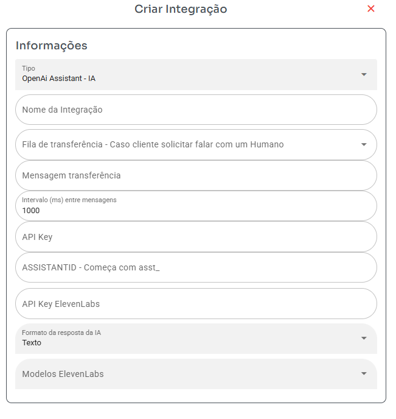

## ChatGPT Assistant

### Por que escolher essa integração?
- Você obterá uma IA mais ajustada para melhores resultados.

### Alguns vídeos sobre esse modelo de configuração:
- [Vídeo 1](https://www.youtube.com/watch?v=N2Ynpl16o4I)
- [Vídeo 2](https://www.youtube.com/watch?v=3A4rdBnCJPA)

### Configurar ChatGPT Assistant

1. **Fila**: Selecione a fila para a qual a IA deve transferir caso não consiga responder às perguntas ou resolver o problema.
2. **Intervalo (ms) entre mensagens**: Defina o tempo entre as respostas da IA. Por exemplo, 1000ms = 1 segundo.
3. **API Key**: Chave de API para conexão com a IA. Lembre-se que o ChatGPT cobra por token. Obtenha sua chave [aqui](https://platform.openai.com/settings/organization/api-keys).
4. **ASSISTANT ID**: Identificação do assistente (começa com `asst_`). Obtenha seu ID [aqui](https://platform.openai.com/playground/assistants).

   - Ao criar o assistente, o formato da resposta deve ser **texto**.

### Formato da Resposta da IA

- **Formato da resposta**: Caso selecione um formato diferente de texto, será necessário configurar uma conta "Microsoft Azure Text-to-Speech" nos campos abaixo.
- **API Key Speech Service**: Necessário caso o campo acima seja diferente de texto. Veja o manual abaixo para obter os dados.
- **Localização/Região Speech Service**: Necessário caso o campo acima seja diferente de texto. Veja o manual abaixo para obter os dados.

### Como obter a chave de API do Microsoft Azure Text-to-Speech

- Siga este [guia](https://docs.merkulov.design/how-to-get-microsoft-azure-tts-api-key) para obter sua chave de API.