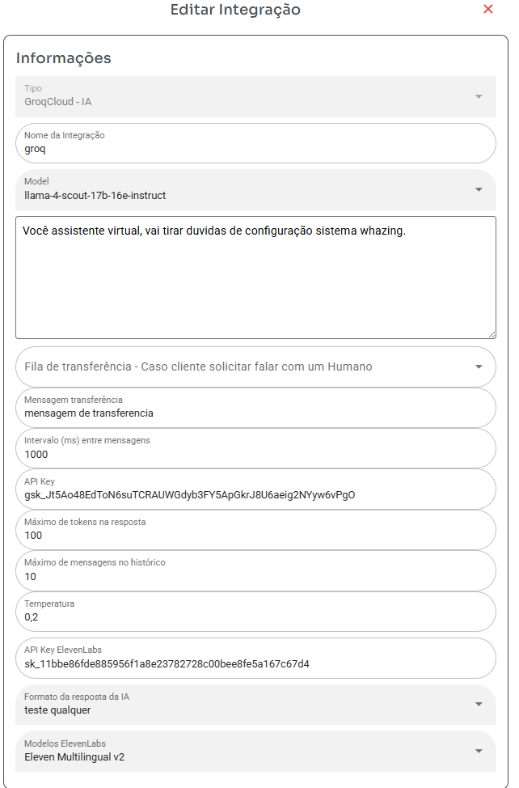

## Configurar Groq ou ChatGPT

### Passo 1: Configurar a Integração

- **Model**: Selecione o modelo de linguagem (Groq ou ChatGPT).
- **Prompt**: Escreva como a IA deve atender o cliente e agir.
- **Fila**: Escolha a fila para a qual a IA deve transferir se não conseguir responder ou resolver o problema.
- **Intervalo (ms) entre mensagens**: Tempo entre as respostas da IA (1000 ms = 1 segundo).
- **API Key**: Chave de API para conexão com a IA. Lembre-se de que o ChatGPT cobra por token.
- **Máximo de tokens na resposta**: Define o tamanho máximo da resposta. O ChatGPT cobra por token.
- **Máximo de mensagens no histórico**: Número de mensagens que a IA consultará para montar a resposta. Apenas mensagens do mesmo ticket são consultadas. Um valor muito alto pode fazer a IA travar e aumentar os custos com tokens.
- **Temperatura**: Controla a criatividade da IA. Valores mais altos tornam as respostas menos previsíveis. Pode ser valores como 0,2 ou 1,5.
- **Formato da resposta da IA**: Se selecionar um formato diferente de texto, será necessário configurar uma conta "Microsoft Azure Text-to-Speech" nos campos a seguir.
- **API Key Speech Service**: Necessária se o formato da resposta for diferente de texto. Veja o manual abaixo para obter os dados.
- **Localização/Região Speech Service**: Necessária se o formato da resposta for diferente de texto. Veja o manual abaixo para obter os dados.

### Como Obter a Chave de API do Microsoft Azure Text-to-Speech

Acesse o [guia](https://docs.merkulov.design/how-to-get-microsoft-azure-tts-api-key) para obter sua chave de API.