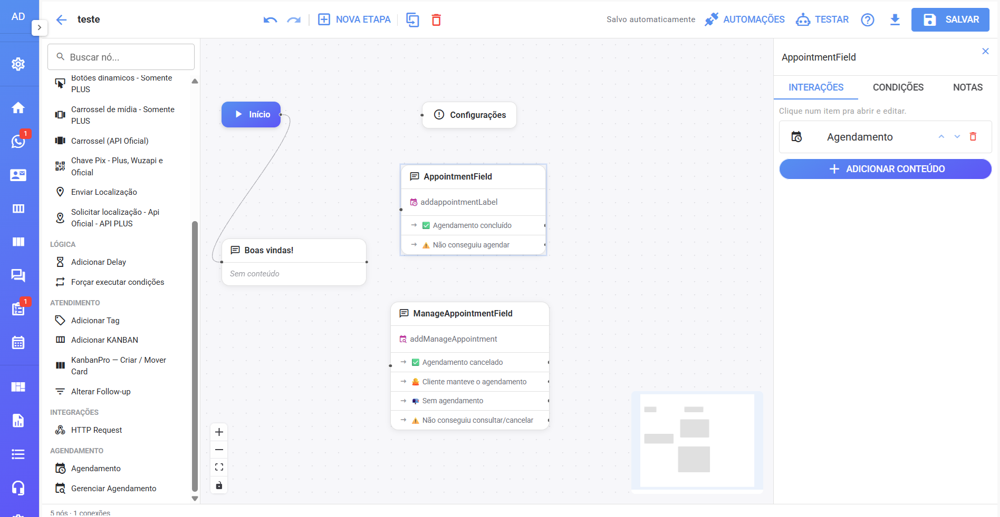
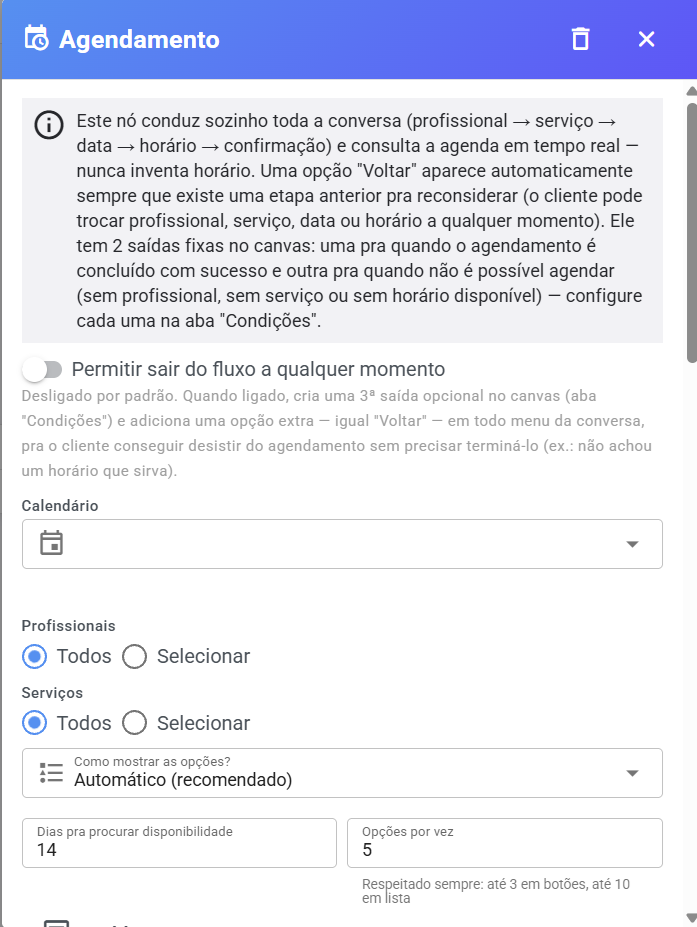
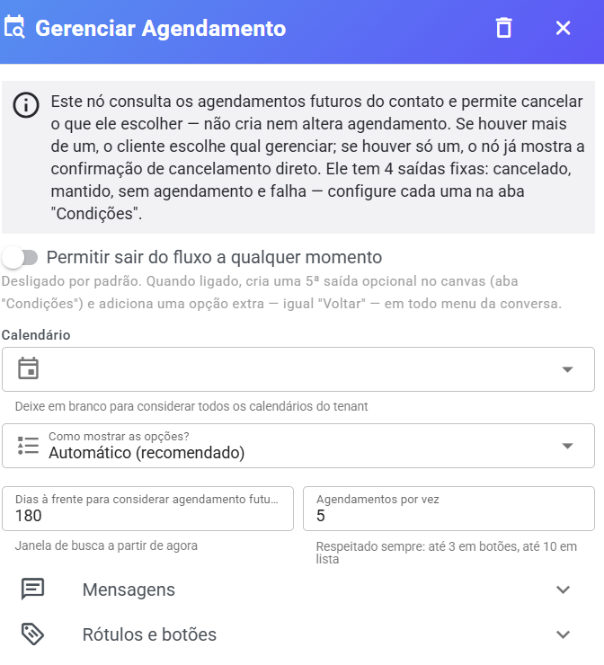

# Agendamento pelo Chatbot

Dentro do **ChatFlow** (o editor visual de chatbot do Whazing) existem dois blocos da categoria **Agendamento** que tornam o bot capaz de **agendar** e **cancelar** atendimentos sozinho, pelo WhatsApp ou por qualquer outro canal, consultando a **disponibilidade real** da Agenda em tempo real — o bot **nunca inventa horário**.

> ⚠️ **Antes de começar:** a Agenda precisa estar configurada (calendário, serviços, profissionais e horários). O chatbot usa exatamente essas informações. Se precisar, comece por [Antes de começar](antes-de-comecar.md).

## 📍 Onde encontrar os blocos

1. Abra o **ChatFlow** (editor de chatbot).
2. Edite uma etapa do fluxo e adicione uma nova **interação**.
3. Os blocos da Agenda estão na categoria **Agendamento** (ícone de calendário, destacado em rosa):

| Bloco                        | O que faz                                                        |
| ---------------------------- | ---------------------------------------------------------------- |
| **📅 Agendamento**           | Conduz o cliente na conversa e **marca o horário**               |
| **🔎 Gerenciar Agendamento** | Mostra os agendamentos futuros do contato e permite **cancelar** |

<figure><figcaption></figcaption></figure>

***

## 📅 Bloco "Agendamento" — como o cliente agenda

Você não monta o passo a passo do agendamento: **o bloco conduz a conversa inteira sozinho**, nesta sequência:

**Profissional → Serviço → Data → Horário → Confirmação → Agendamento criado** ✅

* Em cada etapa, o cliente escolhe entre as opções (ou digita o número da opção, conforme o modo de apresentação).
* Uma opção **"Voltar"** aparece automaticamente sempre que existe uma etapa anterior — o cliente pode **trocar** profissional, serviço, data ou horário a qualquer momento antes de confirmar.
* Na confirmação, o bot mostra o resumo (profissional, serviço, data e horário) e o cliente confirma.
* O sistema **revalida** o horário na hora da confirmação: se alguém o ocupou nesse intervalo, o bot avisa e consulta outros horários.

<figure><figcaption></figcaption></figure>

### Saídas do bloco (conexões no fluxo)

O bloco tem **2 saídas fixas** que você conecta no canvas:

* **Agendamento concluído com sucesso** → siga para a próxima etapa (agradecimento, etiqueta, transferência etc.).
* **Não foi possível agendar** (sem profissional, sem serviço ou sem horário disponível) → siga para uma etapa de fallback, ex.: _"Nossa equipe vai entrar em contato para ajudar no agendamento."_

### Configurações do bloco

| Opção                                         | O que faz                                                                                                                                                                                                                                                        |
| --------------------------------------------- | ---------------------------------------------------------------------------------------------------------------------------------------------------------------------------------------------------------------------------------------------------------------- |
| **Calendário**                                | ✅ Obrigatório — de qual agenda sairão os horários                                                                                                                                                                                                                |
| **Profissionais**                             | **Todos** ou **Selecionar** alguns específicos                                                                                                                                                                                                                   |
| **Serviços**                                  | **Todos** ou **Selecionar** alguns específicos                                                                                                                                                                                                                   |
| **Como mostrar as opções?**                   | **Automático (recomendado)** — o sistema decide o melhor formato por canal; **Texto**; **Lista**; **Botões**                                                                                                                                                     |
| **Dias pra procurar disponibilidade**         | Quantos dias à frente o bot procura horário (padrão: 14, máximo 60)                                                                                                                                                                                              |
| **Opções por vez**                            | Quantas opções mostrar de uma vez (limite respeitado: até 3 em botões, até 10 em lista)                                                                                                                                                                          |
| **Permitir sair do fluxo a qualquer momento** | Desligado por padrão. Quando ligado, cria uma **3ª saída** no canvas ("Sair") e adiciona a opção **Sair** em todos os menus da conversa — para o cliente desistir sem terminar o agendamento (ex.: não achou horário que sirva). O texto do botão é configurável |

> 💡 **Requisito por canal:** as apresentações **Lista** e **Botões** dependem do canal suportar esses recursos. No modo **Automático**, o sistema escolhe o formato adequado para você.

### Mensagens e rótulos personalizados

Em **"Mensagens"** você edita todos os textos da conversa (cada um já vem preenchido com um padrão): mensagem inicial, escolher profissional, escolher serviço, escolher data, escolher horário, confirmação (aceita as variáveis `{{appointment_professional}}`, `{{appointment_service}}`, `{{appointment_date}}`, `{{appointment_time}}`), sucesso, nenhum profissional/serviço/data disponível, resposta não reconhecida, horário ocupado ao confirmar e erro ao consultar a agenda.

Em **"Rótulos e botões"** você ajusta os textos curtos dos cabeçalhos e botões (ex.: trocar "Serviço" por "Consulta").

> 💡 **Teste antes de publicar!** O **simulador** do ChatFlow reproduz a conversa de agendamento ponta a ponta (profissional → serviço → data → horário → confirmação). É uma simulação: nenhum agendamento real é criado durante o teste.

***

## 🔎 Bloco "Gerenciar Agendamento" — como o cliente cancela

Este bloco **consulta os agendamentos futuros do contato** e permite **cancelar** o que ele escolher — **não cria nem altera** agendamento.

**Como funciona a conversa:**

1. O bot lista os agendamentos futuros (ex.: _"Corte — 12/05 às 14:00"_).
2. Se houver **mais de um**, o cliente escolhe qual gerenciar; se houver **só um**, vai direto à confirmação.
3. O bot confirma: _"Deseja cancelar este agendamento? \[Corte] com \[João] \[12/05] às \[14:00]"_, com botões **"Sim, cancelar"** e **"Não, manter"**.
4. Confirmado, o agendamento é **cancelado** e o cliente recebe _"Pronto! Seu agendamento foi cancelado."_

<figure><figcaption></figcaption></figure>

### Saídas do bloco (conexões no fluxo)

**4 saídas fixas** para você direcionar o fluxo:

* **Cancelado** — o cliente confirmou o cancelamento.
* **Mantido** — o cliente desistiu de cancelar ("seu agendamento continua confirmado").
* **Sem agendamento** — o contato não tem agendamentos futuros.
* **Falha** — não foi possível concluir a consulta ou o cancelamento.

### Configurações do bloco

| Opção                                                | O que faz                                                                          |
| ---------------------------------------------------- | ---------------------------------------------------------------------------------- |
| **Calendário**                                       | Deixe em branco para considerar **todos os calendários**; ou escolha um específico |
| **Como mostrar as opções?**                          | Automático / Texto / Lista / Botões                                                |
| **Dias à frente para considerar agendamento futuro** | Janela de busca a partir de agora (padrão: 180 dias)                               |
| **Agendamentos por vez**                             | Quantos itens mostrar por mensagem                                                 |
| **Permitir sair do fluxo a qualquer momento**        | Igual ao bloco de agendamento — cria a **5ª saída** opcional                       |

Em **"Mensagens"** e **"Rótulos e botões"** todos os textos são editáveis (mensagem inicial, modelo de cada item da lista com `{{service}}`, `{{professional}}`, `{{date}}`, `{{time}}`, confirmação, sucesso, erros etc.).

***

## 🔄 Exemplo de fluxo completo

1. **Boas-vindas** → menu com opções (ex.: "1 - Agendar", "2 - Cancelar", "3 - Falar com atendente").
2. Opção 1 → etapa com o bloco **Agendamento** → saída de sucesso: _"Pronto! Seu agendamento foi confirmado 😊"_ → saída de falha: transferência para fila.
3. Opção 2 → etapa com o bloco **Gerenciar Agendamento** → saída "Cancelado": mensagem de despedida → saída "Sem agendamento": _"Você não tem nenhum agendamento futuro no momento."_

> 💡 Depois que o cliente agenda pelo bot, o agendamento **cai na Agenda** imediatamente (com o contato vinculado) e pode receber [**lembretes**](lembretes.md) como qualquer outro.
