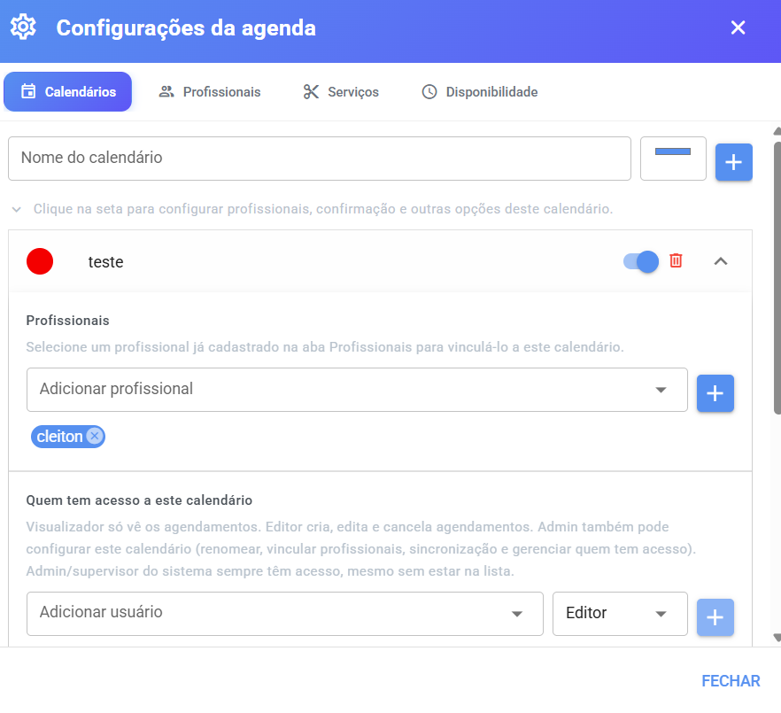
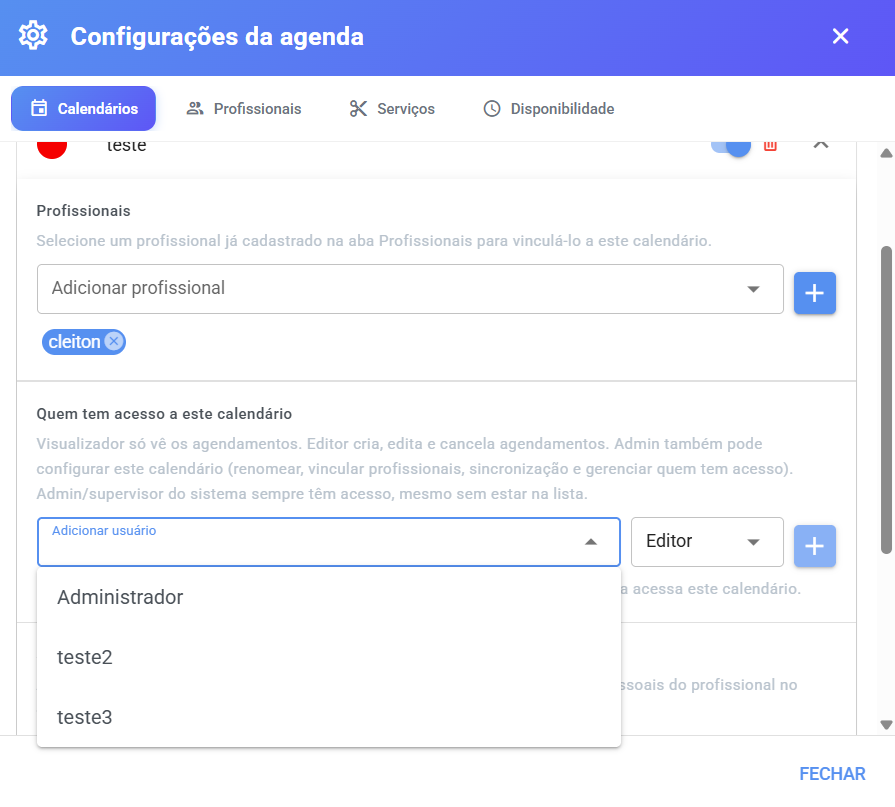

# Calendários e Permissões

Dentro da Agenda, cada **calendário** é uma agenda independente — com seus próprios profissionais, suas próprias permissões e seus próprios lembretes. Esta página explica como criar, organizar e controlar **quem pode usar** cada calendário.

> 💡 Está com dúvida sobre a diferença entre _calendário_, _profissional_ e _serviço_? Veja [Antes de começar](antes-de-comecar.md) — tem uma explicação simples de cada conceito.

## 🧠 O que é um calendário (e por que criar mais de um)

O calendário é onde os agendamentos são guardados. Criar mais de um ajuda a **separar os atendimentos** por setor, unidade ou tipo de atendimento, por exemplo:

* **"Barbearia"** e **"Depilação"** — serviços diferentes, equipes diferentes.
* **"Unidade Centro"** e **"Unidade Shopping"** — cada unidade com sua agenda.
* **"Consultas"** e **"Retornos"** — separação por tipo de atendimento.

Cada calendário tem um **nome** e uma **cor** — os agendamentos aparecem no calendário principal pintados com essa cor, para você identificar de longe de qual agenda cada um veio.

***

## 📍 Onde configurar

1. Acesse o menu **Agenda**.
2. Clique na **engrenagem ⚙️** (Configurações da agenda).
3. A primeira aba é justamente **Calendários**.

> ⚠️ A criação e edição de calendários é para **administradores e supervisores** do sistema — ou para usuários com papel **Admin** em um calendário específico.

<figure><figcaption></figcaption></figure>

***

## ➕ Como criar um calendário

1. No topo da aba **Calendários**, digite o **Nome do calendário** (ex.: "Barbearia").
2. Escolha a **cor** no quadradinho colorido ao lado — ela identificará os agendamentos desta agenda. O sistema já sugere a cor principal do seu sistema.
3. Clique no **botão +**.

Pronto! O calendário surge na lista logo abaixo, já com a cor escolhida.

***

## ✏️ O que dá para ajustar em cada calendário

Cada calendário aparece como uma **linha expansível** (clique na seta para abrir). Antes mesmo de abrir, você já pode:

* **Renomear** — clique no nome, edite e clique fora para salvar.
* **Trocar a cor** — clique no círculo colorido e escolha outra.
* **Ativar ou desativar** (chave liga/desliga) — um calendário desativado deixa de ser usado em novos agendamentos, mas mantém os antigos.
* **Excluir** 🗑️ — o sistema pede confirmação: _"Deseja realmente excluir este calendário?"_

> ⚠️ Excluir o calendário remove a agenda inteira — prefira **desativar** se quiser apenas tirá-la de circulação por um tempo.

***

## 👨‍⚕️ Vinculando profissionais ao calendário

Dentro do calendário aberto, a primeira seção é **Profissionais**. É aqui que você diz **quem atende nesta agenda**.

> 💡 O profissional precisa existir antes — se a lista aparecer vazia com o aviso _"Nenhum profissional disponível. Cadastre um na aba Profissionais."_, cadastre-o primeiro na aba **Profissionais** (veja [Profissionais](profissionais.md)).

**Como vincular:**

1. Abra o calendário (clique na seta).
2. No campo **"Adicionar profissional"**, escolha quem quer vincular.
3. Clique no **botão +**.

O nome do profissional aparece como uma etiqueta. Para **desvincular**, clique no **x** da etiqueta.

> ⚠️ Um profissional desvinculado **some imediatamente** das opções de agendamento daquele calendário (inclusive no link público, no chatbot e na Recepção Inteligente). Os agendamentos antigos dele continuam no histórico.

***

## 🔐 Quem tem acesso ao calendário

Na seção **"Quem tem acesso a este calendário"** você controla **quais usuários do sistema** podem usar a agenda — e o que cada um pode fazer nela.

### Entenda os papéis

| Papel            | O que a pessoa pode fazer                                                                                                                                |
| ---------------- | -------------------------------------------------------------------------------------------------------------------------------------------------------- |
| **Visualizador** | Só **vê** os agendamentos. Não cria, não edita, não cancela                                                                                              |
| **Editor**       | Cria, edita e cancela agendamentos. Não pode mexer nas configurações                                                                                     |
| **Admin**        | Tudo o que o Editor faz **+** configura o calendário: renomear, trocar cor, vincular profissionais, configurar sincronização e gerenciar quem tem acesso |

> 💡 **Administradores e supervisores do sistema** sempre têm acesso completo a todos os calendários, mesmo sem estar na lista de membros.

### Como adicionar um membro

1. Abra o calendário e localize a seção **"Quem tem acesso a este calendário"**.
2. Em **"Adicionar usuário"**, escolha a pessoa.
3. Ao lado, escolha o **papel** (Visualizador, Editor ou Admin) — o padrão é **Editor**.
4. Clique no **botão +** (ele fica desabilitado até você escolher um usuário).

Cada membro aparece na lista com nome, e-mail e o papel — que pode ser **trocado a qualquer momento** direto na lista. Para remover o acesso, clique no 🗑️ ao lado.

<figure><figcaption></figcaption></figure>

### E quem não está na lista?

* **Usuários comuns** (atendentes) que não forem adicionados como membros **não veem nem agendar** neste calendário.
* **Admins e supervisores** veem todos.
* No **Atendimento**, a aba **Agenda** do painel do contato só aparece se o usuário tiver acesso a pelo menos um calendário (ou for admin/supervisor).

***

## ❓ Por que o calendário não aparece para mim?

* Se você é **admin/supervisor**, todos os calendários aparecem sempre.
* Se você é **usuário comum**, só aparecem os calendários em que foi adicionado como membro — peça ao administrador para liberar seu acesso.
