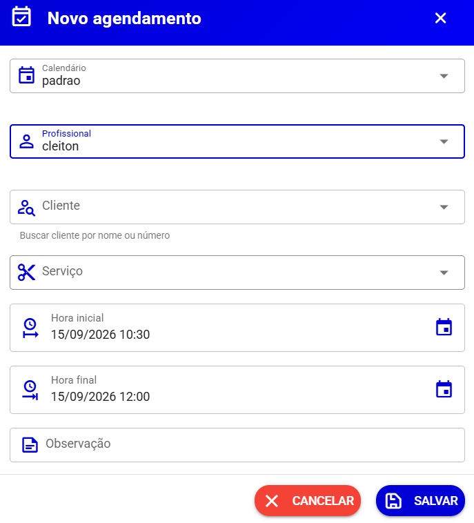
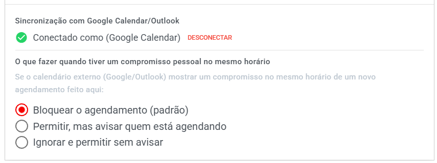
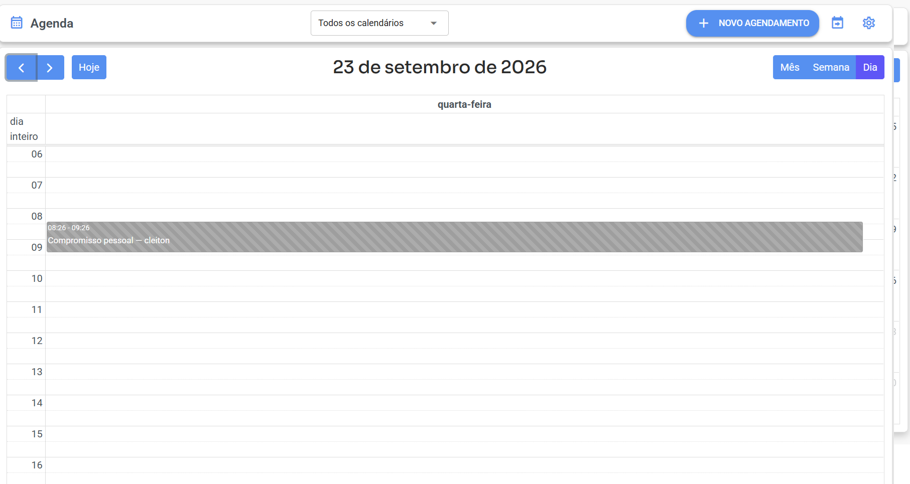

# Como usar a Agenda

Esta página mostra o dia a dia da tela principal da Agenda: como visualizar os horários, criar, editar, remarcar, cancelar e excluir agendamentos.

> 💡 Se você ainda não configurou calendários, serviços, profissionais e horários, comece pela página [Antes de começar](antes-de-comecar.md).

## 📍 Onde encontrar

No menu lateral do sistema, clique em **Agenda** (ícone de calendário).

A tela inicial já mostra o **calendário** com todos os agendamentos do período — na visão **Semana** por padrão.

***

## 🖥️ O que aparece na tela

| Elemento                            | O que faz                                                                                                     |
| ----------------------------------- | ------------------------------------------------------------------------------------------------------------- |
| **Seletor "Todos os calendários"**  | Filtra o calendário para mostrar agendamentos de apenas um calendário específico                              |
| **Botão "Novo agendamento"**        | Abre o formulário para criar um agendamento                                                                   |
| **Ícone de seta com calendário** 📤 | Leva para a tela **Links de Agendamento** (link público e Embed)                                              |
| **Engrenagem ⚙️**                   | Abre as **"Configurações da agenda"** (calendários, profissionais, serviços, disponibilidade)                 |
| **Botão "Recepção"**                | Leva ao módulo **Recepção**: o painel do dia para acompanhar chegadas, fila e atendimentos — veja [Recepção](recepcao.md) |
| **Interruptor "Sombrear horário fora de expediente"** | Aparece ao selecionar um **profissional** no filtro: destaca no calendário os horários em que ele **não pode atender** — veja seção abaixo |
| **Navegação do calendário**         | Botões ‹ › para mudar de período, botão **Hoje** para voltar ao dia atual e alternador **Mês / Semana / Dia** |

***

## 📅 Visualizações do calendário

Você pode alternar entre três formas de visualizar:

* **Mês** — visão geral do mês, com os agendamentos resumidos em cada dia.
* **Semana** — visão padrão, com as horas do dia em linhas (das 06:00 às 22:00).
* **Dia** — detalhe de um único dia, ideal para conferir a rotina.

> 💡 Os agendamentos aparecem **na cor do calendário** em que foram criados — uma forma fácil de separar visualmente agendamentos de filas ou setores diferentes.

***

## ➕ Como criar um agendamento

Existem duas formas:

### Opção 1 — Pelo botão

1. Clique em **"Novo agendamento"**.
2. Preencha o formulário (detalhado abaixo).
3. Clique em **Salvar**.

### Opção 2 — Clicando direto no calendário

1. Na visão **Semana** ou **Dia**, clique (ou arraste) no espaço do horário desejado.
2. O formulário já abre com a **hora inicial preenchida** com o período que você selecionou.
3. Preencha o restante e clique em **Salvar**.

> ⚠️ Se ao clicar no calendário aparecer o aviso _"Você só tem acesso de visualização a esta agenda — não é possível criar agendamentos aqui"_, significa que você é apenas **Visualizador** daquele calendário. Veja [Calendários e Permissões](calendarios-e-permissoes.md#quem-tem-acesso-ao-calendário).

### Campos do agendamento

| Campo            | Obrigatório?   | O que é                                                                                                                  |
| ---------------- | -------------- | ------------------------------------------------------------------------------------------------------------------------ |
| **Calendário**   | ✅ Sim          | Em qual calendário o agendamento será criado                                                                             |
| **Profissional** | ✅ Sim          | Quem vai realizar o atendimento (aparecem só os vinculados ao calendário escolhido)                                      |
| **Cliente**      | 🔶 Opcional    | Busque o cliente cadastrado no sistema **por nome ou número**. Vincular o cliente permite que ele receba lembretes       |
| **Serviço**      | 🔶 Opcional    | O que será feito. Ao escolher, a **hora final é calculada sozinha** com base na duração do serviço                       |
| **Hora inicial** | ✅ Sim          | Data e hora de início do atendimento                                                                                     |
| **Hora final**   | ⚠️ Condicional | Obrigatória **se nenhum serviço for escolhido** (ex.: bloco de reunião). Se escolher serviço, o sistema preenche sozinho |
| **Observação**   | 🔶 Opcional    | Anotações internas sobre o agendamento (ex.: "cliente pediu atendimento na porta")                                       |

#### 🕐 Escolhendo o horário: a grade de horários disponíveis

Quando você escolhe **profissional e serviço**, o campo de hora vira uma **grade de horários**: o sistema calcula os encaixes possíveis com base na **duração do serviço** e na **disponibilidade do profissional**, e mostra:

* ⬜ **Horários disponíveis** — em destaque, prontos para clicar;
* 🔒 **"Ocupado"** — horário que já tem outro agendamento (não é clicável);
* ⬛ **"Fora do expediente"** — horário fora da disponibilidade do profissional (não é clicável).

Enquanto os horários carregam, aparece **"Buscando horários..."**. Se o dia escolhido estiver cheio, o sistema avisa: _"Nenhum horário disponível nesse dia. Tente outra data."_

> 💡 Isso vale para a criação pelo **botão "Novo agendamento"**. Clicando direto no calendário, o formulário continua aceitando a data/hora do ponto selecionado — a grade aparece quando você escolhe profissional e serviço.

**📸 Sugestão de print:** grade de horários do novo agendamento com disponíveis, "Ocupado" e "Fora do expediente".

> 💡 **Serviço + profissional:** se o profissional tiver **serviços vinculados**, a lista mostra apenas esses serviços. Se ele não tiver nenhum vínculo, pode fazer **qualquer serviço**.

Após salvar, aparece a mensagem **"Agendamento criado com sucesso!"** e o evento surge no calendário na cor do calendário escolhido.

<figure><figcaption></figcaption></figure>

***

## 🔆 Sombrear horário fora de expediente

No topo da tela, ao selecionar um **profissional** no filtro, aparece o interruptor **"Sombrear horário fora de expediente"**. Ligando-o, o calendário **destaca visualmente os períodos em que aquele profissional não atende** (fora do expediente dele).

* **Para que serve:** ver de relance onde existem buracos úteis na agenda — e onde ninguém poderia ser encaixado — antes de prometer um horário ao cliente;
* **Como usar:** filtre o profissional → ligue o interruptor → as faixas fora do expediente dele ficam sombreadas no calendário;
* **Importante:** o sombreado é uma **dica visual** baseada na disponibilidade cadastrada. O bloqueio de verdade acontece na hora de agendar (na grade de horários e nas regras do calendário).

**📸 Sugestão de print:** calendário semanal com as faixas sombreadas fora do expediente.

***

## 📏 Período para agendamento (data limite)

Nas **Configurações da agenda** (engrenagem ⚙️), cada **calendário** e cada **profissional** têm o bloco **"Período para agendamento"**, que define **a faixa de datas aceita**:

### Agendamentos no futuro (a data limite)

| Opção                          | O que faz                                                                                     |
| ------------------------------ | --------------------------------------------------------------------------------------------- |
| **Sem limite**                 | Pode-se agendar para qualquer data futura                                                      |
| **Até X dias**                 | Aceita agendamentos só até X dias a partir de hoje (ex.: 30)                                   |
| **Até uma data específica**    | Aceita agendamentos só até a data escolhida (ex.: até 20/12)                                   |

Quando o limite é atingido, o calendário simplesmente **não oferece datas além dele** — nem na tela principal, nem no [link público](link-publico-e-embed.md), nem no chatbot. É a forma de evitar que alguém marque um horário muito distante no futuro (útil para agendas com tabelas de preço ou escala que mudam).

### Agendamentos no passado

| Opção                            | O que faz                                                                    |
| -------------------------------- | ----------------------------------------------------------------------------- |
| **Não permitir**                 | Nada de agendar em datas que já passaram (padrão do link público)             |
| **Permitir até X dias para trás** | Deixa lançar agendamentos retroativos (ex.: registrar um atendimento feito hoje mesmo sem agendamento) |

### Como os limites se combinam

* O **calendário** define a regra geral da agenda;
* O **profissional** pode ter um período **mais restrito** que o do calendário — o sistema avisa: _"Só preencha se este profissional precisar de um período mais curto que o do calendário. Deixe como está para seguir o calendário."_ (a opção "Usar a configuração do calendário" mantém a herança);
* Vale sempre **a janela mais restritiva** entre calendário e profissional.

> 💡 Bloqueios e exceções de dia específico (folgas, feriados) **continuam valendo** dentro da faixa permitida — a janela é a régua geral, a exceção é o detalhe.

**📸 Sugestão de print:** bloco "Período para agendamento" nas configurações do calendário.

***

## ✏️ Como editar ou remarcar

### Editando pelo formulário

1. **Clique no agendamento** no calendário.
2. A janela abre em modo de leitura, mostrando o **status** atual (etiqueta colorida no topo: **Agendado**, **Confirmado**, **Concluído** ou **Cancelado**).
3. Clique em **Editar** para liberar os campos.
4. Altere o que precisar e clique em **Salvar**.

### Remarcando arrastando (jeito rápido)

* **Para mudar de horário/dia:** arraste o agendamento para outro espaço do calendário.
* **Para mudar a duração:** arraste a borda de baixo do evento para esticar ou encurtar.

Ao soltar, o sistema salva e mostra **"Agendamento atualizado com sucesso!"**.

> ⚠️ Se o novo horário conflitar com um compromisso pessoal do profissional no calendário externo (Google/Outlook), o sistema pode **bloquear a mudança** ou **exibir um aviso**, conforme a configuração de [comportamento de conflito](google-agenda.md#o-que-acontece-quando-há-conflito-de-horário) feita pelo administrador. Em caso de erro, o evento volta sozinho para o horário anterior.

***

## 🔔 Status de um agendamento

Todo agendamento tem um dos status abaixo:

| Status         | Cor        | Significado                                                   |
| -------------- | ---------- | ------------------------------------------------------------- |
| **Agendado**   | Azul       | Criado, aguardando o atendimento                              |
| **Confirmado** | Verde-água | O cliente confirmou que vai (ex.: respondeu o lembrete)       |
| **Concluído**  | Verde      | O atendimento já aconteceu                                    |
| **Cancelado**  | Vermelho   | Foi cancelado — aparece **riscado e esmaecido** no calendário |

***

## ❌ Cancelar ou excluir?

São ações diferentes — veja a página [Cancelamento de agendamentos](cancelamento-de-agendamentos.md) para o resumo completo:

* **Cancelar** — o agendamento continua no calendário (aparece riscado), com o histórico preservado. O sistema pede confirmação: _"Deseja realmente cancelar este agendamento?"_.
* **Excluir** — o agendamento some do calendário. O sistema avisa que **"Esta ação não pode ser desfeita."**

Ambas as ações ficam disponíveis ao clicar no agendamento, exceto para agendamentos **Concluídos** ou **Cancelados**.

***

## 🟨 O que é o "Compromisso pessoal"

Se a [sincronização com Google Agenda/Outlook](google-agenda.md) estiver ativa, você pode ver no calendário eventos **listrados** (cinza) chamados **"Compromisso pessoal — Nome do profissional"**.

* São compromissos que o profissional tem no **calendário pessoal dele** (Google/Outlook).
* Eles **bloqueiam o horário** na Agenda: ninguém consegue agendar sobre esse período.
* Clicando no compromisso, o sistema mostra de quando a quando é e em qual calendário externo ele está.
* Esses compromissos **não podem ser editados por aqui** — só no Google Agenda ou no Outlook do próprio profissional.

<figure><figcaption></figcaption></figure>

<figure><figcaption></figcaption></figure>
