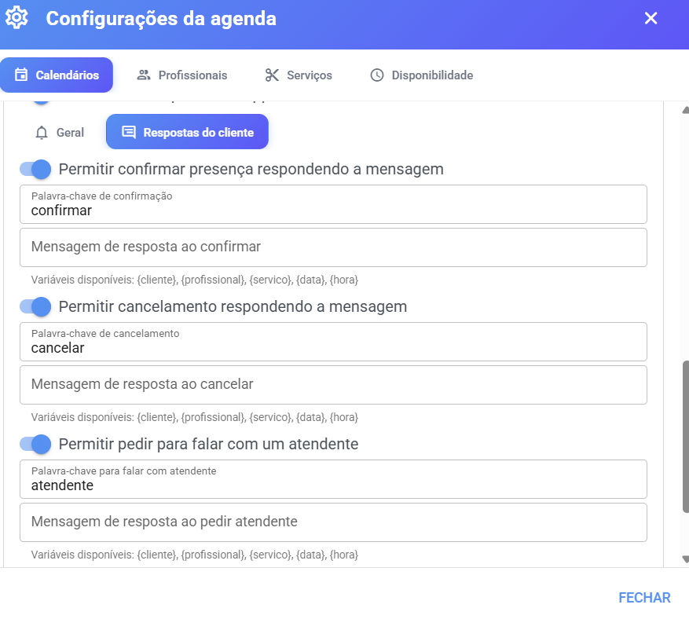

# Lembretes

O **lembrete** é uma mensagem automática enviada por **WhatsApp** ao cliente antes do atendimento — para lembrar do horário e, se você quiser, deixar que ele **confirme** ou **cancele** respondendo à própria mensagem. É o recurso que reduz faltas e evita telefonemas de confirmação.

## 📍 Onde configurar

Os lembretes são configurados **por calendário** — ou seja, cada agenda tem a sua própria configuração de lembrete:

1. Acesse o menu **Agenda**.
2. Clique na **engrenagem ⚙️** (Configurações da agenda).
3. Abra a aba **Calendários** e clique na seta do calendário desejado.
4. Role até a seção **Lembretes**.

<figure><figcaption></figcaption></figure>

***

## ➕ Como ativar o lembrete

1. Na seção **Lembretes** do calendário, ligue a opção **"Enviar lembrete por WhatsApp"**.
2. Novos campos aparecem:
   * **Horas de antecedência** — quantas horas **antes** do agendamento o lembrete será enviado. Ex.: `24` = o cliente recebe na tarde do dia anterior.
   * **Canal de envio** — qual conexão de WhatsApp será usada. Se deixar em branco, o sistema usa **o canal já vinculado ao cliente**.
3. Escreva a **mensagem do lembrete** (aba Geral) — detalhes abaixo.
4. Clique em **Salvar**.

Aparece a confirmação **"Configuração de lembrete salva com sucesso!"**.

> 💡 **Quando o lembrete é enviado?** Apenas para agendamentos que tenham **cliente vinculado** (com WhatsApp) e no intervalo de antecedência configurado. Agendamentos criados por link público, chatbot ou Recepção Inteligente também recebem lembrete — desde que tenham o contato associado.

***

## ✍️ Formas de enviar a mensagem

Na aba **Geral** você escolhe **como** a mensagem sai. Existem três formatos:

### 1. Texto livre (padrão)

Digite a mensagem do jeito que quiser, usando as **variáveis** disponíveis — palavras que o sistema troca pelos dados reais de cada agendamento:

| Variável         | Vira                 |
| ---------------- | -------------------- |
| `{cliente}`      | Nome do cliente      |
| `{profissional}` | Nome do profissional |
| `{servico}`      | Nome do serviço      |
| `{data}`         | Data do atendimento  |
| `{hora}`         | Hora do atendimento  |

Exemplo de mensagem:

```
Olá, {cliente}! Passando para lembrar do seu {servico} com {profissional} no dia {data} às {hora}. Até logo! 🎉
```

### 2. Template oficial (canais oficiais WABA/Hub)

Se o canal escolhido for **API Oficial**, aparece a opção **"Enviar lembrete via template oficial aprovado"** — porque a API Oficial do WhatsApp só permite iniciar conversas com **templates aprovados pela Meta**.

* Escolha o template na lista (carregada com seus templates aprovados) e preencha as variáveis do template com os dados do agendamento.
* ⚠️ Templates com **cabeçalho de mídia** (imagem/vídeo/documento) **não são suportados** em lembretes — o sistema avisa: _"Este template tem cabeçalho de mídia (imagem/vídeo/documento), que não é suportado em lembretes automáticos."_

### 3. Mensagem com botões (canais Plus e Wuzapi)

Se o canal for **Plus** ou **Wuzapi**, aparece a opção **"Enviar lembrete como mensagem com botões"** — a mensagem sai com botões interativos.

* Assim como no template oficial, mensagens com botões **não aceitam imagem de cabeçalho** em lembretes — o sistema avisa ao salvar.
* As variáveis `{cliente}`, `{profissional}`, `{servico}`, `{data}` e `{hora}` são digitadas **direto no texto** (não use o menu de variáveis do editor, que usa outro formato).

> 💡 Se o canal escolhido não for oficial nem suportar botões, o sistema informa que o envio via template oficial não está disponível — e a mensagem sai como **texto simples**.

***

## 💬 Respostas do cliente (confirmar, cancelar e falar com atendente)

Na aba **"Respostas do cliente"** você define o que o cliente pode fazer **respondendo ao lembrete**. Cada opção tem sua chave liga/desliga, palavra-chave e mensagem de resposta:

### ✅ Confirmar presença

* **"Permitir confirmar presença respondendo a mensagem"** — quando o cliente responde com a **palavra-chave de confirmação**, o agendamento fica com status **Confirmado**.
* **Mensagem de resposta ao confirmar** — a resposta automática que ele recebe.

### ❌ Cancelar

* **"Permitir cancelamento respondendo a mensagem"** — quando o cliente responde com a **palavra-chave de cancelamento**, o agendamento é **cancelado**.
* **Mensagem de resposta ao cancelamento** — a confirmação do cancelamento que ele recebe.
* O cancelamento por lembrete segue as mesmas regras da página [Cancelamento de agendamentos](cancelamento-de-agendamentos.md).

### 👨‍💼 Pedir atendente

* **"Permitir pedir para falar com um atendente"** — se o cliente responder com a **palavra-chave para falar com atendente**, a conversa é direcionada para a equipe (com a mensagem de resposta que você definir).

### 🎫 Fechar ticket automaticamente

* **"Fechar o ticket automaticamente após cancelar/confirmar"** — quando o cliente responde e o sistema já fez o que precisava, o atendimento é encerrado sozinho, sem deixar ticket aberto à toa.

<figure><figcaption></figcaption></figure>

> ⚠️ **Dica prática:** escolha palavras-chave curtas e claras — ex.: **SIM** para confirmar, **NÃO** para cancelar, **ATENDENTE** para falar com a equipe. E deixe as palavras evidentes no texto do lembrete, ex.: _"Responda SIM para confirmar ou NÃO para cancelar."_

***

## 🔁 O que acontece depois

* O cliente recebe a mensagem no WhatsApp dentro da antecedência configurada.
* Se ele **confirma** → o agendamento fica **Confirmado** (status verde-água no calendário).
* Se ele **cancela** → o horário é liberado e o agendamento fica **Cancelado** (riscado no calendário).
* Se ele **pede atendente** → a conversa é encaminhada para a equipe.
* Se ele **não responde** → nada acontece; o agendamento permanece **Agendado**.
