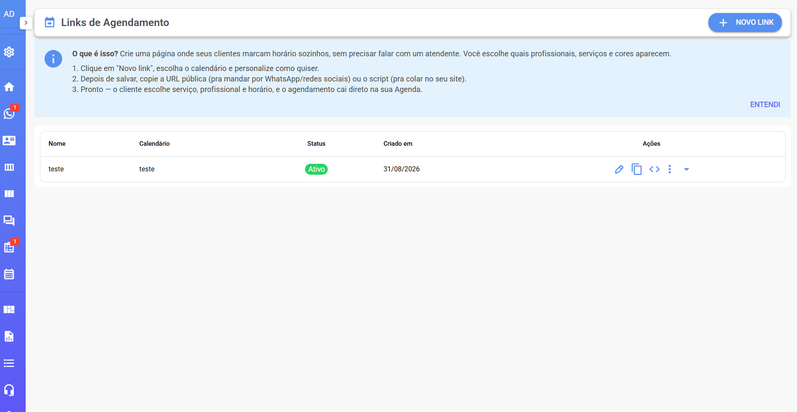
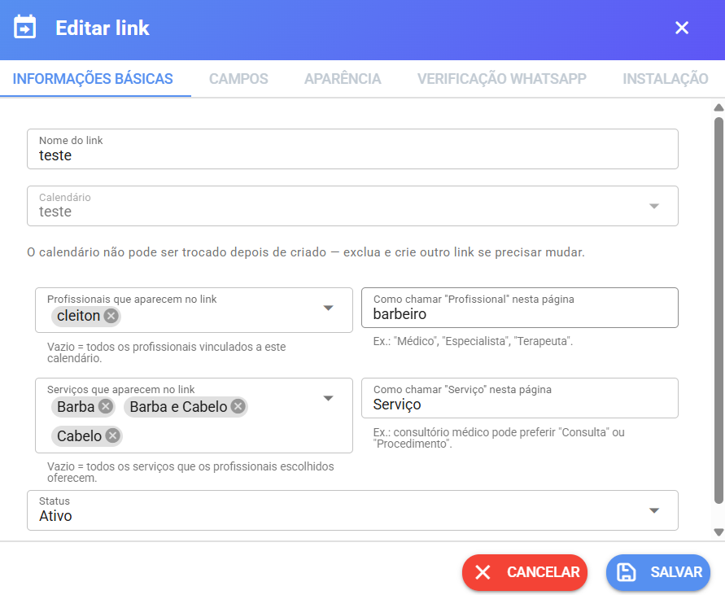
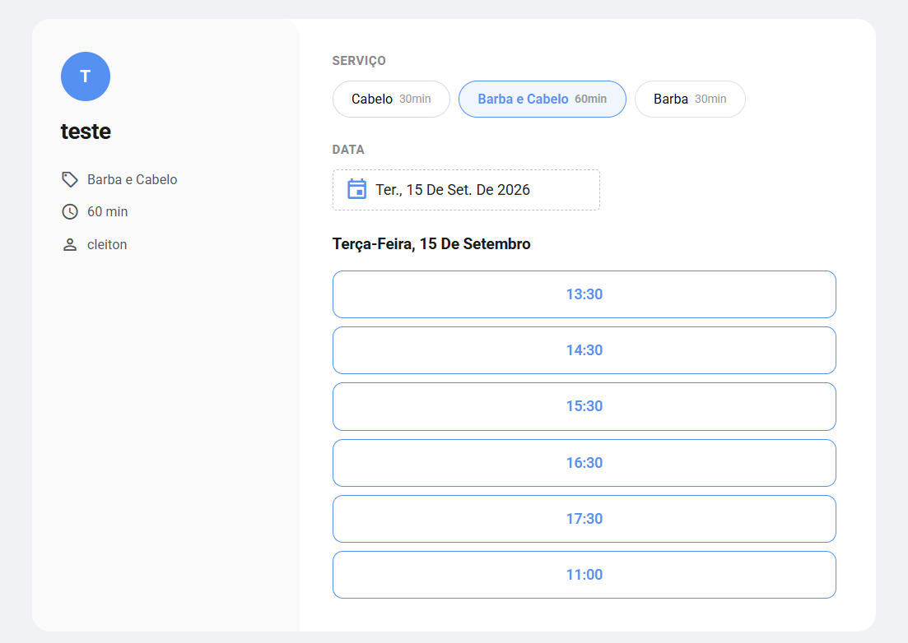
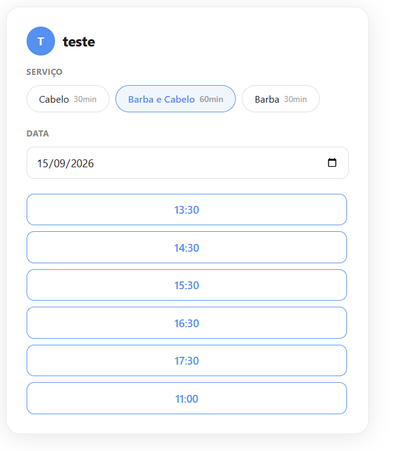

# Link público e Embed

O **link público** cria uma **página de agendamento** com a cara da sua empresa, onde o cliente marca horário **sozinho**, sem falar com ninguém. Você escolhe quais profissionais e serviços aparecem, personaliza as cores e depois **envia o link** por WhatsApp, redes sociais ou coloca o **QR Code** na recepção. Com o **Embed**, essa mesma página pode ficar **dentro do seu site**.

O sistema resume bem: _"Crie uma página onde seus clientes marcam horário sozinhos, sem precisar falar com um atendente."_

## 📍 Onde encontrar

1. Acesse o menu **Agenda**.
2. No topo da tela, clique no **ícone de seta com calendário** 📤 (ao lado da engrenagem) — ele leva à tela **"Links de Agendamento"**.
3. Clique em **"Novo link"**.

> ⚠️ Na primeira vez, o sistema mostra um quadro azul explicando o recurso em 3 passos. Clique em **Entendi** para fechá-lo.

<figure><figcaption></figcaption></figure>

***

## ➕ Criando um link de agendamento

A janela de criação tem **5 abas**. As duas informações obrigatórias ficam na primeira: **nome do link** e **calendário**.

### 📋 Aba "Informações básicas"

| Campo                                       | Obrigatório? | Para que serve                                                                                                                                            |
| ------------------------------------------- | ------------ | --------------------------------------------------------------------------------------------------------------------------------------------------------- |
| **Nome do link**                            | ✅ Sim        | Para você identificar na lista (ex.: "Barbearia - Instagram")                                                                                             |
| **Calendário**                              | ✅ Sim        | De qual agenda sairão os horários. ⚠️ **Não pode ser trocado depois** — o sistema avisa que, se precisar mudar, será preciso excluir o link e criar outro |
| **Profissionais que aparecem no link**      | 🔶 Opcional  | Escolha quem aparece. **Deixando vazio, entram todos os profissionais vinculados ao calendário**                                                          |
| **Serviços que aparecem no link**           | 🔶 Opcional  | Escolha o que pode ser agendado. **Vazio = todos os serviços que os profissionais escolhidos oferecem**                                                   |
| **Como chamar "Profissional" nesta página** | 🔶 Opcional  | Personaliza o rótulo (ex.: "Médico", "Barbeiro", "Terapeuta")                                                                                             |
| **Como chamar "Serviço" nesta página**      | 🔶 Opcional  | Ex.: consultório pode preferir "Consulta" ou "Procedimento"                                                                                               |
| **Status**                                  | —            | **Ativo** (link funcionando) ou **Inativo** (página fora do ar)                                                                                           |

<figure><figcaption></figcaption></figure>

### 🧾 Aba "Campos"

Define o que o cliente preenche. **Nome e telefone (WhatsApp) sempre aparecem e são obrigatórios** — só o e-mail é configurável:

* **Mostrar campo de email** — liga/desliga o campo.
* **Tornar o email obrigatório** — só funciona se o campo estiver sendo mostrado.

### 🎨 Aba "Aparência"

Deixa a página com a identidade visual da empresa:

* **Logo** — envie uma imagem (o upload fica disponível **depois de salvar o link** pela primeira vez).
* **Cores** — cor principal (botões e horário selecionado), cor de fundo do cartão e cor do texto (útil quando o fundo é escuro).
* **Pré-visualização** — um cartão de exemplo mostra "é assim que vai ficar" enquanto você escolhe as cores.
* **Como escolher a data** — **"Calendário completo (clicar no dia)"**, mais visual, ou **"Campo de data simples"**, mais compacto.
* **Texto de boas-vindas (opcional)** — a frase que aparece no topo da página.
* **Texto do botão** — o que estará escrito no botão de agendar (ex.: "Agendar horário").
* **Mensagem de sucesso** — o que o cliente lê ao concluir. Se deixar vazio, usa o padrão: _"Recebemos seu agendamento, até breve!"_

### 💬 Aba "Verificação WhatsApp" (opcional)

Quer garantir que o telefone informado é real? Ative **"Confirmar o WhatsApp com um código antes de agendar"**:

1. Escolha o **canal do WhatsApp** que enviará o código.
2. Se for canal **oficial (WABA/Hub)**, escolha também o **template aprovado** que carrega o código. Em canais comuns, uma mensagem personalizada é enviada.
3. No dia do uso, o cliente recebe um **código de 6 dígitos** e precisa digitá-lo na página antes de confirmar o agendamento.

### 🌐 Aba "Instalação" (aparece depois de salvar)

Aqui ficam as duas peças para divulgar — detalhadas nas seções abaixo: a **URL pública** (com QR Code) e o **script de incorporação**.

Ao clicar em **Salvar**, aparece a confirmação **"Link criado com sucesso!"**.

***

## 🔗 Como o cliente usa o link

O cliente não precisa de cadastro nem de senha. Basta abrir o endereço (ex.: `seusistema.com.br/#/agendar/nome-do-link`). A experiência dele:

1. **Escolhe o serviço** — botões com o nome e a duração ("Corte masculino · 30min"). Se houver só um serviço, essa etapa já vem pronta.
2. **Escolhe o profissional** — se houver mais de um, aparece a lista de botões. Só um? Etapa pula automático.
3. **Escolhe a data** — no calendário visual (ou no campo de data, conforme a configuração). Dias passados não aparecem.
4. **Escolhe o horário** — o sistema lista **somente horários realmente livres**, respeitando disponibilidade, exceções e compromissos externos. Sem horário, aparece _"Nenhum horário disponível nesta data."_
5. **Preenche os dados** — **Seu nome**, **WhatsApp (com DDD)** e o **email** (se configurado).
6. **Confirma** — clica no botão de agendar (com verificação WhatsApp ativa, digita antes o código de 6 dígitos recebido).
7. **Pronto** — tela de **"Agendamento confirmado!"** com a mensagem de sucesso que você definiu, e o agendamento **cai direto na sua Agenda** 🎉

> 💡 Se a página não abrir, o sistema mostra _"Link de agendamento indisponível"_ — verifique se o link está **Ativo**.

<figure><figcaption></figcaption></figure>

***

## 📲 Como enviar o link para os clientes

Na aba **Instalação** (ou no botão de copiar da lista de links) está a **URL pública**, no formato `.../#/agendar/nome-do-link`. O próprio sistema sugere os usos:

* **Enviar direto ao cliente** — WhatsApp, redes sociais, e-mail.
* **Usar como link na bio** das redes sociais.
* **Imprimir o QR Code** — gerado junto com a URL, ideal para cartão de visita ou balcão da recepção: o cliente aponta a câmera e a página abre.

### Ações na lista de links

Cada link da lista tem:

| Ação                      | O que faz                                                    |
| ------------------------- | ------------------------------------------------------------ |
| **Editar** ✏️             | Reabre a janela com todas as abas                            |
| **Copiar URL pública** 📋 | Copia o endereço para enviar ao cliente                      |
| **Copiar script** 📋      | Copia o código de incorporação (Embed)                       |
| **Duplicar**              | Cria uma cópia — ótimo para testar variações                 |
| **Desativar/Ativar** ⏸️▶️ | Tira a página do ar sem apagar nada (e volta)                |
| **Excluir** 🗑️           | Remove o link; o sistema pede confirmação com o nome do link |

> ⚠️ Quando um link é **desativado** ou **excluído**, a página do cliente deixa de funcionar imediatamente. Os agendamentos já feitos continuam na Agenda.

***

## 🌐 Embed: colocar o agendamento dentro do seu site

O **Embed** (do inglês, "incorporar") é a forma de mostrar a **mesma página de agendamento dentro de uma página do seu site**, para que o cliente agende **sem sair do seu site** e sem abrir o link separado.

> 💡 **Pense assim:** o link público é como um "balcão próprio" no endereço do sistema; o Embed transporta esse balcão para dentro do seu site.

### Onde copiar

1. Abra o link desejado em **Editar** (ou use o botão **Copiar script** na lista).
2. Vá na aba **Instalação**.
3. Localize **"Script para incorporar no site"** — um pequeno código que o sistema já monta pronto para o seu link.
4. Clique no **ícone de copiar** 📋 ao lado.

### Onde colocar

1. **Cole o código** no lugar da página do seu site onde o agendamento deve aparecer (o sistema orienta: _"Use pra deixar o agendamento integrado dentro do seu próprio site — cole este código na página onde ele deve aparecer"_).
2. Essa inserção normalmente é feita por **quem cuida do seu site** — pode pedir ao seu webmaster ou à empresa que administra o site. Em muitos editores de site (ex.: construtores visuais) basta colar em um bloco de "código personalizado/HTML".
3. Salve a página e abra no navegador: a tela de agendamento aparece **dentro do seu site**, com as cores e serviços que você configurou.

> 💡 O cliente não percebe que está "saindo" do seu site: escolhe serviço, profissional, data, horário e confirma ali mesmo. O agendamento cai na sua Agenda normalmente, igual ao link.

<figure><figcaption></figcaption></figure>
