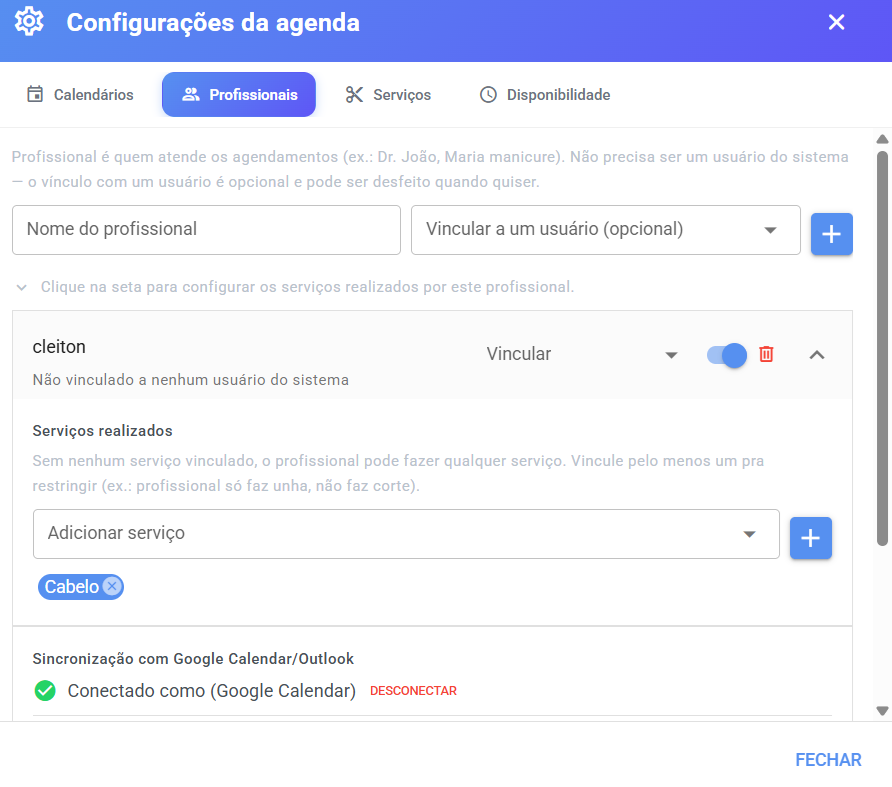
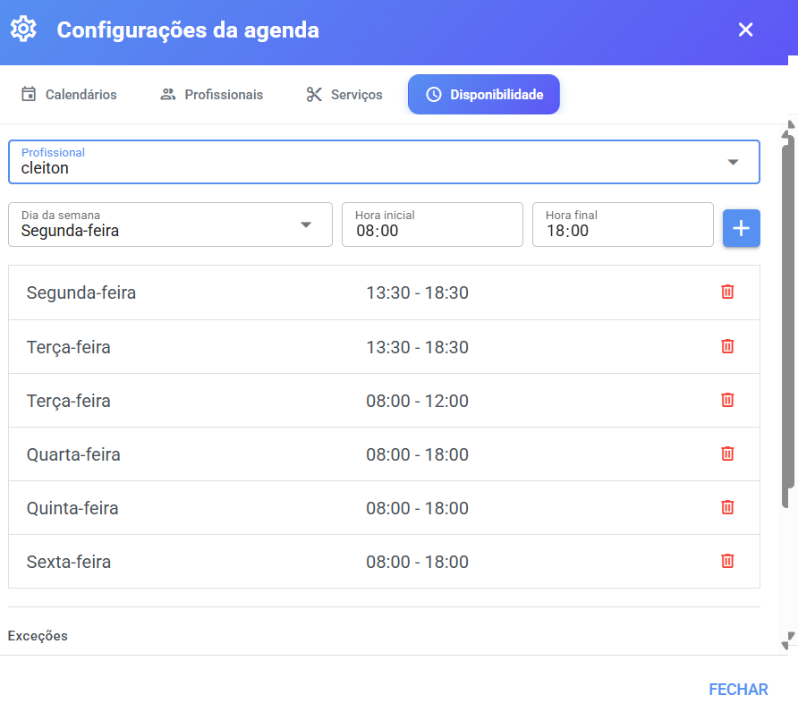

# Profissionais

**Profissional** é quem realiza os atendimentos: o barbeiro, a manicure, o médico, o personal trainer. É no cadastro do profissional que você define **quais serviços ele faz**, **quando ele trabalha** e, se quiser, o **vínculo com um usuário do sistema** (para sincronizar o calendário pessoal dele, por exemplo).

> 💡 O profissional **não precisa ser um usuário do sistema**. Você pode cadastrar "Dr. João" ou "Maria manicure" mesmo que essas pessoas nunca façam login no Whazing. O vínculo com um usuário é **opcional** e pode ser desfeito quando quiser.

## 📍 Onde configurar

1. Acesse o menu **Agenda**.
2. Clique na **engrenagem ⚙️** (Configurações da agenda).
3. Abra a aba **Profissionais**.

> ⚠️ A aba Profissionais só aparece para **administradores e supervisores** do sistema.

<figure><figcaption></figcaption></figure>

***

## ➕ Como cadastrar um profissional

1. No topo da aba, preencha:
   * **Nome do profissional** — ex.: "Dr. João", "Maria".
   * **Vincular a um usuário (opcional)** — escolha um usuário do sistema, se esse profissional **também for um login do Whazing**.
2. Clique no **botão +**.

O profissional entra na lista. Cada linha é expansível (clique na seta) e mostra logo de cara se está **vinculado a um usuário** ou se **não está vinculado a nenhum usuário do sistema**.

***

## 🔗 Vínculo com usuário do sistema

Este é um dos pontos que mais geram dúvida — vale a explicação detalhada:

* **Vincular** é conectar o profissional a um login do sistema. Quem é vinculado **herda a agenda**: o usuário passa a ver os calendários em que o profissional está (com papel **Editor**, podendo criar e editar agendamentos).
* **Para que serve:** principalmente para a [sincronização com Google Agenda/Outlook](google-agenda.md), que fica disponível **somente para profissionais vinculados a um usuário**.
* **Um usuário só pode ser vinculado a um profissional** — usuários já vinculados a outro profissional não aparecem na lista.
* Pode **desvincular** quando quiser (botão **Desvincular** na linha do profissional). Ao desvincular, o profissional continua cadastrado, apenas sem login associado.

> ⚠️ Precisa configurar o Google Agenda de um profissional e o botão de conexão não aparece? Verifique se ele está **vinculado a um usuário do sistema** — esse é o requisito.

***

## 🛠️ Serviços realizados pelo profissional

Dentro do cadastro do profissional (clique na seta da linha para abrir), a seção **"Serviços realizados"** define **o que ele pode fazer**:

* **Sem nenhum serviço vinculado** → o profissional pode fazer **qualquer serviço** cadastrado (comportamento padrão, prático para equipes pequenas ou generalistas).
* **Com serviços vinculados** → o profissional fica **restrito** a eles. Ex.: a manicure só recebe agendamentos de unha; o corte não aparece para ela.

**Como vincular:**

1. Abra o profissional.
2. Em **"Adicionar serviço"**, escolha o serviço desejado — só aparecem serviços **ativos** que ele ainda não tem.
3. Clique no **botão +**.

O serviço aparece como uma etiqueta. Para **desvincular**, clique no **x** da etiqueta.

> ⚠️ Se a lista aparecer vazia com o aviso _"Nenhum serviço disponível. Cadastre um na aba Serviços."_, cadastre o serviço primeiro — veja [Serviços](servicos.md).

***

## 🕐 Horários de atendimento

A aba **Disponibilidade** (a 4ª aba da janela de configurações) define **quando cada profissional trabalha**. É a partir daqui que o sistema monta os horários que os clientes podem agendar.

> ⚠️ **Nenhum profissional tem horário por padrão.** Se você não cadastrar disponibilidade, a agenda dele fica sem nenhum horário disponível — nem pelo link público, nem pelo chatbot, nem pela tela principal.

<figure><figcaption></figcaption></figure>

### Como cadastrar a disponibilidade

1. Na aba **Disponibilidade**, escolha o **Profissional** no seletor.
2. Preencha a nova disponibilidade:
   * **Dia da semana** — de Domingo a Sábado.
   * **Hora inicial** — ex.: 08:00.
   * **Hora final** — ex.: 18:00.
3. Clique no **botão +**.

A regra entra na lista (ex.: "Segunda-feira — 08:00 - 18:00"). Para **remover** uma regra, clique no 🗑️ ao lado dela.

> 💡 Quer almoçar no meio do expediente? Cadastre **dois turnos**: 08:00–12:00 e 13:00–18:00. As regras se somam.

### Exceções: folgas, feriados e horários diferentes

Embaixo da lista de horários fica a seção **Exceções** — perfeita para aqueles dias que fogem da rotina:

* **Dia todo indisponível** — bloqueia a data inteira (folga, feriado, atestado).
* **Horário customizado** — naquele dia, o profissional atende só em um período diferente do padrão (ex.: sairá mais cedo e atenderá 08:00–12:00).

**Como cadastrar:**

1. Escolha a **Data**.
2. Marque o tipo: **"Dia todo indisponível"** ou **"Horário customizado"** (nesse caso, informe **Hora inicial** e **Hora final**).
3. Preencha o **Motivo (opcional)** — ex.: "Feriado municipal". Ele aparece na lista para você lembrar por que bloqueou.
4. Clique no **botão +**.

A exceção entra na lista com data, período e motivo. Para **remover**, clique no 🗑️ — o sistema pede confirmação: _"Deseja realmente excluir esta exceção?"_.

***

## ✏️ Editar, ativar/desativar e excluir

Na linha de cada profissional você encontra:

| Ação                             | Como funciona                                                                                                                                        |
| -------------------------------- | ---------------------------------------------------------------------------------------------------------------------------------------------------- |
| **Renomear**                     | Clique no nome, edite e clique fora — salva automático                                                                                               |
| **Ativar/Desativar** (chave)     | Profissional desativado deixa de receber agendamentos e de aparecer nas escolhas de profissional (link público, chatbot, IA), mas mantém o histórico |
| **Vincular/Desvincular usuário** | No seletor do lado direito da linha                                                                                                                  |
| **Excluir** 🗑️                  | Remove o cadastro; o sistema pede confirmação: _"Deseja realmente excluir este profissional?"_                                                       |

> ⚠️ Prefira **desativar** em vez de excluir: o histórico de agendamentos do profissional continua legível e você pode reativá-lo depois.
