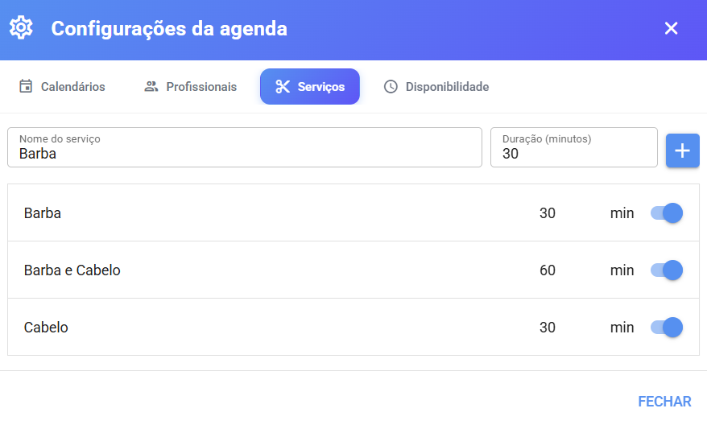

# Serviços

**Serviço** é tudo o que o cliente pode agendar: um corte de cabelo, uma consulta, uma avaliação. É o serviço que define **quanto tempo cada atendimento ocupa** na agenda — e por isso ele é a peça que determina quais horários o sistema oferece.

> 💡 Os serviços são **compartilhados entre todos os calendários** da empresa. O que muda de calendário para calendário é **quem** (quais profissionais) pode fazer cada serviço.

## 📍 Onde configurar

1. Acesse o menu **Agenda**.
2. Clique na **engrenagem ⚙️** (Configurações da agenda).
3. Abra a aba **Serviços**.

> ⚠️ A aba Serviços só aparece para **administradores e supervisores** do sistema.

<figure><figcaption></figcaption></figure>

## ➕ Como cadastrar um serviço

1. No topo da aba, preencha:
   * **Nome do serviço** — ex.: "Corte masculino", "Consulta de rotina", "Avaliação".
   * **Duração (minutos)** — quanto tempo o atendimento leva. O padrão sugerido é **30 minutos**.
   * **Valor** — quanto o serviço custa (opcional). Detalhes na seção [Valor do serviço](#valor-do-serviço) abaixo.
2. Clique no **botão +**.

Aparece a confirmação e o serviço entra na lista, já **ativo**.

### ⏱️ Por que a duração é tão importante

A duração é o que o sistema usa para **encaixar os horários**. Veja um exemplo:

* Maria atende de **09:00 às 12:00**.
* O serviço "Corte masculino" dura **30 minutos**.
* O sistema oferece aos clientes os horários **09:00, 09:30, 10:00, 10:30...** até o último que **cabe inteiro** antes do fim do expediente.

Se a duração for trocada para 1 hora, os horários passam a ser **09:00, 10:00, 11:00**. Ou seja: **quanto maior a duração, menos horários aparecem** — e um horário que não tem tempo hábil suficiente para o serviço terminar não é ofertado.

> ⚠️ Não existe duração "certa" — use o tempo médio que o atendimento realmente leva. Errou? É só editar.

***

## ✏️ Editando um serviço

Cada serviço na lista tem quatro controles, todos salvos **automaticamente** ao sair do campo:

| Controle                  | O que faz                                   |
| ------------------------- | ------------------------------------------- |
| **Nome** (campo de texto) | Clique, edite e clique fora para salvar     |
| **Duração** (campo `min`) | Ajuste os minutos e clique fora para salvar |
| **Valor** (campo com o símbolo da moeda) | Informe quanto o serviço custa — veja abaixo. Em branco, o serviço simplesmente não exibe valor |
| **Chave liga/desliga**    | Ativa ou desativa o serviço                 |

### 🔕 Desativar em vez de excluir

Não há botão de excluir serviço — em vez disso, use a chave para **desativar**:

* Serviço **desativado** deixa de aparecer em agendamentos, no link público, no chatbot e na Recepção Inteligente.
* Os agendamentos antigos continuam no histórico normalmente.
* Para reativar, ligue a chave de novo.

> 💡 Por padrão a lista mostra só os ativos. Para ver também os desativados, ligue a opção **"Mostrar serviços desativados"** — um contador com a quantidade aparece ao lado quando existem itens ocultos.

***

## ⚠️ "Este nome já existe"

Os serviços não podem ter **nomes repetidos** — nem entre ativos, nem entre ativos e desativados. Se tentar cadastrar (ou renomear) um serviço com nome já usado, o sistema avisa:

| Aviso                                          | O que significa                             | O que fazer                                                                                                                                 |
| ---------------------------------------------- | ------------------------------------------- | ------------------------------------------------------------------------------------------------------------------------------------------- |
| **Nome já existe (ativo)**                     | Já há um serviço ativo com esse nome        | Escolha outro nome ou edite o existente                                                                                                     |
| **Existe um serviço desativado com esse nome** | Você já teve um serviço assim e o desativou | O sistema **mostra o serviço desativado na lista** (destacado em laranja). Basta **ligar a chave dele** para reativar em vez de criar outro |

> 💡 Esse segundo aviso é ótimo para quem desativou um serviço e depois precisou dele de volta: não precisa recriar do zero, é só reativar.

***

## 💰 Valor do serviço

Cada serviço pode ter um **valor** — o preço daquele atendimento. É uma informação **informativa**: o sistema não faz cobrança nem envia link de pagamento, ele apenas **mostra o valor** nos lugares certos.

**Onde configurar:**

1. Acesse o menu **Agenda** → engrenagem ⚙️ → aba **Serviços**.
2. Informe o valor no campo com o **símbolo da moeda** — tanto ao criar um serviço novo quanto na lista dos existentes.
3. Saia do campo: o valor é salvo automaticamente.

**Formato:** digite o valor em números (ex.: `45` ou `45.90`) — o sistema exibe formatado com o símbolo da moeda da instalação (ex.: R$ 45,90). Serviço sem valor cadastrado simplesmente não mostra preço em lugar nenhum.

**Onde o valor aparece:**

* **No link público/Embed** — junto do nome do serviço (ex.: "Corte masculino · 30min · R$ 45,90") e no resumo da escolha, desde que o link tenha a opção **"Mostrar valor dos serviços"** ativada (veja [Link público e Embed](link-publico-e-embed.md#🧾-aba-campos)).
* **No chatbot** — quando o bloco de agendamento tem a opção **"Enviar valor do serviço para o cliente"** ligada, o valor aparece na lista de serviços e na mensagem de confirmação (veja [Agendamento pelo Chatbot](agendamento-pelo-chatbot.md)).

> 💡 O valor **não muda a duração nem os horários** — é apenas exibido. Para alterar a duração de um atendimento, mexa no campo **Duração**, não no valor.

***

## 🔗 E o vínculo com profissionais?

O serviço, sozinho, ainda não é agendável — ele precisa estar disponível por **alguém**. A ligação entre serviço e profissional é feita de duas formas:

* **Profissional sem nenhum serviço vinculado** → pode fazer **qualquer serviço** cadastrado.
* **Profissional com serviços vinculados** → só pode fazer **aqueles serviços** (ex.: a manicure só aparece para agendamento de unha, não de corte).

O passo a passo do vínculo está na página [Profissionais](profissionais.md#serviços-realizados-pelo-profissional).
