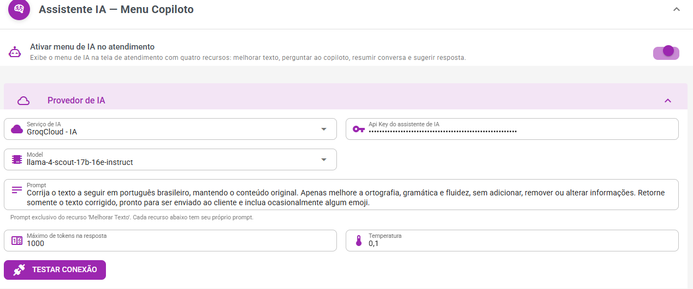
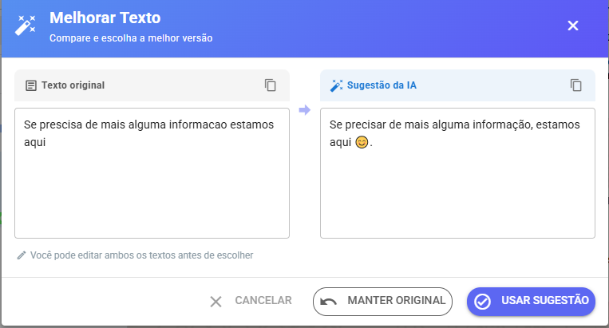

# Melhorar Texto de Atendimento

<figure><figcaption></figcaption></figure>

Nas configurações tem nova opção onde você pode configurar, depois configurado ao preencher texto vai aparecer botão acima. Pode ser usado Groq(grátis com um limite generoso) , Openai, Gemini entre outros.

Sugestão de Prompt&#x20;

```
Você é um especialista em comunicação para atendimento via WhatsApp.

Melhore o texto abaixo mantendo exatamente a mesma intenção e 
informações da mensagem original.

Objetivos:

* Corrigir ortografia e gramática.
* Melhorar clareza e naturalidade.
* Tornar a mensagem mais profissional e amigável.
* Preservar todos os dados informados.
* Não criar informações novas.
* Não remover informações existentes.
* Utilizar no máximo 1 emoji quando isso deixar a comunicação mais 
humana e natural.
* Evitar linguagem excessivamente formal ou robótica.

Retorne somente a versão final da mensagem, pronta para envio ao cliente.

```

Após configurado aparece tela atendimento aparece o botão acima, e abaixo resultado após melhoria

<figure><figcaption></figcaption></figure>

Obter key Groq (grátis com um limite generoso): [https://console.groq.com/keys](https://console.groq.com/keys)

Obter key ChatGPT: [https://platform.openai.com/settings/organization/api-keys](https://platform.openai.com/settings/organization/api-keys)

Obter key Gemini(será necessário para usar base conhecimento): [https://aistudio.google.com/api-keys?\_gl=1\*r](https://aistudio.google.com/api-keys?_gl=1*r)
