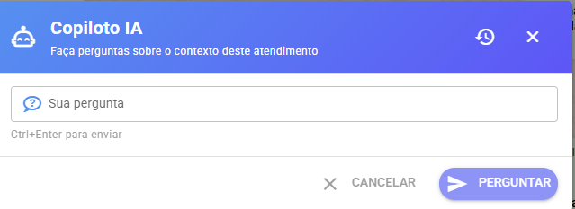
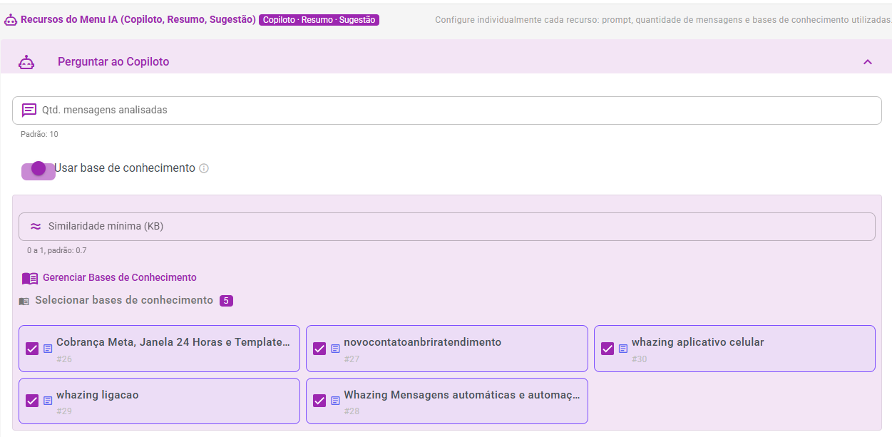
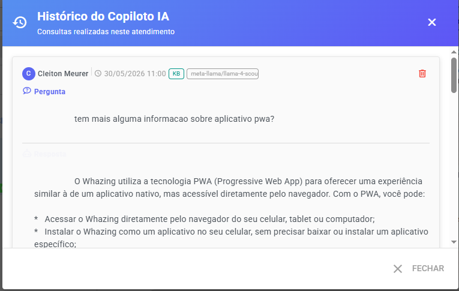

# Perguntar ao Copiloto IA

O recurso **Perguntar ao Copiloto IA** permite que o atendente faça perguntas sobre o atendimento em andamento e receba respostas contextualizadas com base nas mensagens da conversa e, opcionalmente, na Base de Conhecimento cadastrada.

### Como funciona

Ao realizar uma pergunta, a IA analisa as últimas mensagens do ticket e utiliza essas informações para responder ao atendente.

Exemplos de perguntas:

* O que o cliente está solicitando?
* Qual é o problema relatado?
* Existe alguma informação pendente de confirmação?
* Como posso ajudar este cliente?
* O cliente já informou o número do pedido?
* Qual produto está sendo mencionado na conversa?

A resposta é exibida apenas para o atendente e não é enviada automaticamente ao cliente.

<figure><figcaption></figcaption></figure>

***

### Configurações

<figure><figcaption></figcaption></figure>

#### Quantidade de mensagens analisadas

Define quantas mensagens mais recentes do ticket serão utilizadas para montar o contexto enviado à IA.

**Valor padrão:** 10 mensagens

Quanto maior o número configurado, mais contexto a IA terá para responder, porém maior será o consumo de tokens.

***

#### Usar Base de Conhecimento

Quando ativado, o Copiloto IA poderá consultar as Bases de Conhecimento selecionadas para complementar as respostas.

A IA utilizará simultaneamente:

* Histórico da conversa
* Conteúdo encontrado na Base de Conhecimento

Isso permite responder dúvidas utilizando procedimentos internos, políticas, manuais e informações cadastradas pela empresa.

***

#### Similaridade mínima

Determina o nível mínimo de relevância para que um conteúdo da Base de Conhecimento seja utilizado.

**Valor padrão:** 0.7

Faixa recomendada:

* 0.5 → Busca mais ampla
* 0.7 → Equilíbrio entre precisão e cobertura
* 0.9 → Apenas conteúdos muito semelhantes

***

#### Bases de Conhecimento

Selecione quais Bases de Conhecimento poderão ser consultadas pelo Copiloto IA.

Caso nenhuma base seja selecionada, nenhuma informação externa será utilizada.

***

### Requisito para uso da Base de Conhecimento

Para que a busca por similaridade funcione corretamente, é necessário configurar uma chave da API Gemini nas configurações de IA.

A mesma estrutura de Base de Conhecimento utilizada pela Recepção Inteligente é compartilhada com o recurso Perguntar ao Copiloto IA.

Não é necessário criar uma base separada.

***

### Prompt Personalizado

Permite personalizar o comportamento da IA.

Se o campo permanecer vazio, será utilizado o prompt padrão do sistema.

O prompt personalizado pode ser utilizado para:

* Definir tom de resposta
* Limitar respostas
* Orientar comportamento específico
* Adicionar regras internas da empresa

***

### Prompt padrão

Caso o campo **Prompt Personalizado** esteja vazio, o sistema utilizará automaticamente o seguinte prompt:

```
Você é um assistente copiloto de atendimento ao cliente.
Analise o contexto da conversa fornecida e responda à pergunta do atendente de forma clara e objetiva.
Baseie sua resposta apenas nas informações disponíveis no contexto.
Se houver base de conhecimento disponível, priorize as informações dela.
Responda no idioma da conversa com o cliente.
```

Além do prompt acima, o sistema envia automaticamente para a IA:

#### Dados do ticket

```
ID do ticket
Status do atendimento
Canal de atendimento
Nome do contato
Número do contato
```

#### Histórico da conversa

São enviadas as últimas mensagens configuradas na opção **Quantidade de mensagens analisadas**.

Exemplo:

```
[Cliente]: Preciso de ajuda para configurar meu WhatsApp.
[Atendente]: Claro, qual dificuldade está encontrando?
[Cliente]: Não estou conseguindo conectar o número.
```

#### Base de Conhecimento (opcional)

Quando a opção **Usar Base de Conhecimento** estiver ativada, o sistema busca conteúdos relevantes utilizando a similaridade configurada e adiciona os trechos encontrados ao contexto enviado para a IA.

Exemplo:

```
[Configuração WhatsApp]
Para conectar um número é necessário escanear o QR Code disponível na tela de conexões.
```

#### Pergunta do atendente

Por fim, a pergunta digitada pelo atendente é enviada juntamente com todo o contexto.

Exemplo:

```
Pergunta:
Como devo orientar este cliente?
```

A IA utiliza a combinação de:

* Dados do ticket
* Histórico da conversa
* Base de Conhecimento (quando habilitada)
* Pergunta do atendente

para gerar a resposta mais adequada ao contexto do atendimento.

***

### Histórico do Copiloto IA

Todas as consultas realizadas ao Copiloto podem ser armazenadas no histórico do ticket.

São registrados:

* Pergunta realizada pelo atendente
* Resposta gerada pela IA
* Modelo utilizado
* Provedor utilizado
* Tempo de resposta
* Consumo de tokens
* Indicação de uso da Base de Conhecimento

Isso permite auditoria e acompanhamento das consultas realizadas durante o atendimento.

<figure><figcaption></figcaption></figure>

***

### Boas práticas

* Faça perguntas objetivas.
* Utilize Bases de Conhecimento atualizadas.
* Configure uma quantidade adequada de mensagens para análise.
* Revise sempre a resposta antes de tomar decisões importantes.
* Utilize o Prompt Personalizado para adaptar o comportamento da IA ao seu processo de atendimento.
