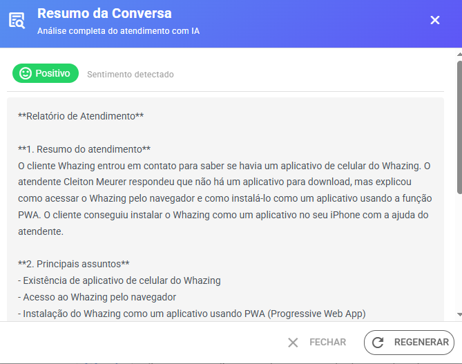
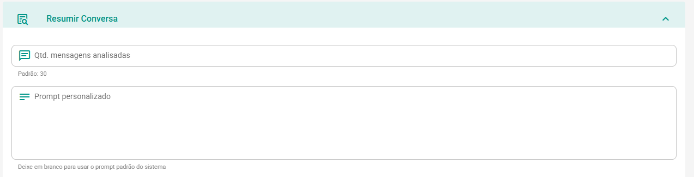

# Resumir Conversa com IA

O recurso **Resumir Conversa** analisa automaticamente o histórico do atendimento e gera um resumo estruturado para auxiliar atendentes, supervisores e gestores a compreender rapidamente o contexto da conversa.

É ideal para:

* Entender rapidamente o histórico do cliente;
* Registrar ocorrências importantes;
* Facilitar transferências entre atendentes;
* Obter uma visão geral do atendimento sem precisar ler toda a conversa.

### Como utilizar

Na tela de atendimento, clique em(ícone varinha de mágico) **Assistente IA → Resumir Conversa**.

A inteligência artificial irá analisar as mensagens mais recentes do ticket e gerar um relatório resumido contendo os principais pontos da conversa.

#### Exemplo de resumo gerado

**Resumo do atendimento**

O cliente entrou em contato relatando dificuldades para acessar sua conta após alteração de senha. Foram realizados procedimentos de validação e orientado o processo de recuperação de acesso.

**Principais assuntos**

* Recuperação de senha
* Validação de cadastro
* Acesso ao sistema

**Problemas relatados**

* Cliente não conseguia acessar a plataforma após redefinir a senha.

**Status geral**

* Atendimento em andamento.
* Cliente recebeu orientações para solucionar o problema.

**Sentimento do cliente**

* Neutro

<figure><figcaption></figcaption></figure>

***

### Configurações

<figure><figcaption></figcaption></figure>

#### Quantidade de mensagens analisadas

Define quantas mensagens mais recentes do ticket serão enviadas para análise da IA.

**Valor padrão:** `30`

Exemplo:

* 10 mensagens → resumo mais rápido e focado nas interações recentes.
* 30 mensagens → equilíbrio entre contexto e velocidade.
* 50 ou mais mensagens → maior contexto para conversas longas.

#### Prompt personalizado

Permite personalizar as instruções enviadas para a IA durante a geração do resumo.

Se o campo for deixado em branco, o sistema utilizará automaticamente o prompt padrão.

***

### Prompt padrão utilizado pelo sistema

```
Você é um assistente especializado em análise de atendimentos ao cliente.

Analise a conversa fornecida e produza um relatório estruturado com:

1. Resumo do atendimento (2-3 linhas)
2. Principais assuntos (lista com os tópicos abordados)
3. Problemas relatados (se houver)
4. Status geral (como o atendimento se desenvolveu)
5. Sentimento do cliente: responda exatamente com uma das palavras:
   positivo, neutro ou negativo

Formate a resposta em português do Brasil
(relatório interno para o atendente),
independentemente do idioma da conversa.
```

#### Importante

* O resumo é gerado apenas para uso interno dos atendentes.
* O cliente não visualiza o conteúdo gerado.
* O idioma do relatório será sempre Português do Brasil, mesmo que a conversa tenha ocorrido em outro idioma. Caso precise outro idioma use prompt personalizado e coloque idioma de sua preferência
* O resultado depende da quantidade de mensagens configuradas para análise.
