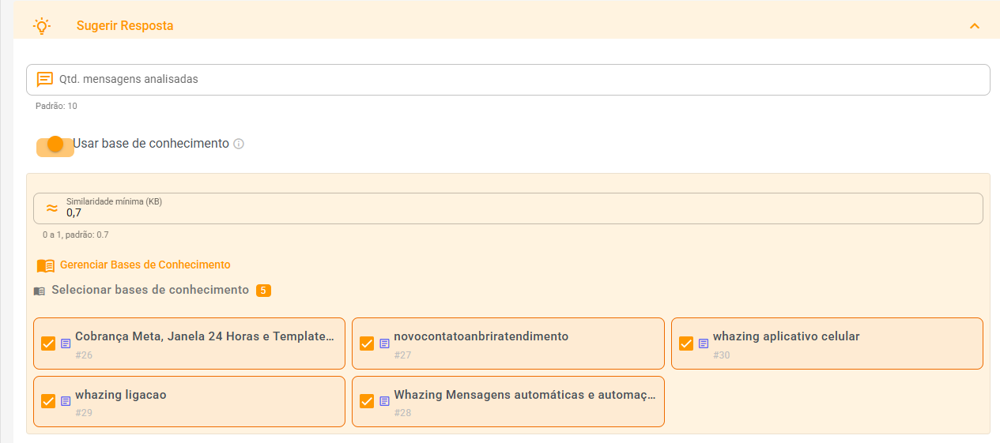

# Sugerir Resposta com IA

O recurso **Sugerir Resposta** utiliza Inteligência Artificial para analisar o contexto da conversa e gerar uma sugestão de resposta pronta para envio ao cliente.

A sugestão é baseada nas últimas mensagens do atendimento e, opcionalmente, pode utilizar informações da Base de Conhecimento para fornecer respostas mais precisas e alinhadas aos processos da empresa.

<figure><figcaption></figcaption></figure>

Exemplo acima atendimento feito usando sugerir resposta com base conhecimento

***

### Como utilizar

<figure><figcaption></figcaption></figure>

1. Abra um atendimento.
2. Clique no menu (ícone varinha mágica) **Assistente IA**.
3. Selecione **Sugerir uma Resposta**.
4. Aguarde alguns segundos enquanto a IA analisa a conversa.
5. A sugestão será exibida na caixa de mensagem.
6. Revise o conteúdo e envie ao cliente caso esteja de acordo.

> A resposta sugerida pode ser editada antes do envio.

***

## Configurações

<figure><figcaption></figcaption></figure>

### Quantidade de mensagens analisadas

Define quantas mensagens mais recentes do atendimento serão utilizadas para gerar a sugestão.

**Valor padrão:** `10`

Exemplo:

* Valor 10 → analisa as últimas 10 mensagens.
* Valor 20 → analisa as últimas 20 mensagens.

Quanto maior o número, maior será o contexto analisado pela IA.

***

### Prompt Personalizado

Permite personalizar as instruções enviadas para a IA.

Caso o campo seja deixado em branco, o sistema utilizará automaticamente o prompt padrão.

O prompt personalizado pode ser utilizado para:

* Definir o tom de comunicação.
* Adaptar respostas para seu segmento.
* Criar regras específicas de atendimento.
* Padronizar a comunicação da equipe.

***

### Utilizar Base de Conhecimento

Quando ativado, a IA pesquisará informações na Base de Conhecimento antes de gerar a resposta.

Isso permite que as sugestões sejam baseadas em procedimentos, políticas, produtos e informações oficiais cadastradas pela empresa.

#### Similaridade mínima

Define o nível mínimo de relevância que um conteúdo da Base de Conhecimento precisa possuir para ser utilizado na resposta.

**Valor padrão:** `0.7`

Exemplos:

* `0.5` → busca mais resultados, mesmo que menos relacionados.
* `0.7` → equilíbrio recomendado.
* `0.9` → somente conteúdos muito semelhantes.

***

### Bases de Conhecimento

Selecione quais bases poderão ser consultadas pela IA durante a geração das respostas.

É possível selecionar uma ou várias bases.

Somente os conteúdos das bases selecionadas serão considerados.

***

## Requisitos para uso da Base de Conhecimento

Para que a busca por similaridade funcione corretamente, é necessário:

* Configurar uma chave da API Gemini.
* Possuir ao menos uma Base de Conhecimento cadastrada.
* Habilitar a opção **Utilizar Base de Conhecimento**.

A mesma infraestrutura utilizada pela **Recepção Inteligente** é utilizada pelo recurso **Sugerir Resposta**.

***

## Funcionamento do Prompt Padrão

Quando nenhum prompt personalizado é configurado, o sistema utiliza automaticamente instruções semelhantes às abaixo:

> Você é um assistente de atendimento ao cliente.
>
> Com base no histórico da conversa, gere UMA resposta pronta para o atendente enviar ao cliente.
>
> Diretrizes:
>
> * Utilize um tom humano e natural.
> * Responda no mesmo idioma do cliente.
> * Utilize informações da Base de Conhecimento quando disponíveis.
> * Considere o canal de atendimento (WhatsApp, Instagram, Facebook, Telegram, E-mail, etc.).
> * Retorne apenas a resposta pronta para envio.
>
> Não inclua explicações ou comentários adicionais.

***

## Comportamento por Canal

A IA adapta automaticamente o estilo da resposta conforme o canal utilizado.

#### WhatsApp, Instagram e Facebook

* Linguagem natural e conversacional.
* Comunicação mais próxima do cliente.
* Pode utilizar emojis quando apropriado.

#### E-mail

* Linguagem profissional.
* Estrutura mais formal.
* Saudação e encerramento adequados.

#### SMS

* Respostas curtas e objetivas.
* Foco na limitação de caracteres.
* Sem textos longos.

***

## Idioma Automático

A IA identifica automaticamente o idioma utilizado pelo cliente e gera a resposta no mesmo idioma.

Idiomas suportados incluem:

* Português
* Inglês
* Espanhol

***

## Observações

* A sugestão gerada pela IA não é enviada automaticamente.
* O atendente sempre pode revisar e editar o conteúdo antes do envio.
* Quanto melhor o histórico da conversa e a Base de Conhecimento, mais precisas serão as sugestões.
* O uso da Base de Conhecimento pode aumentar significativamente a qualidade das respostas em atendimentos técnicos e operacionais.
