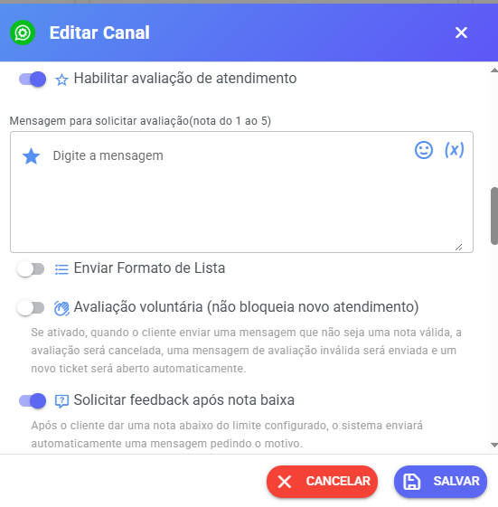
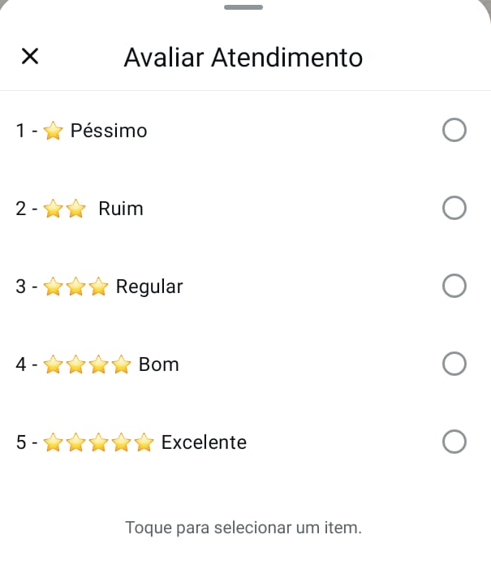
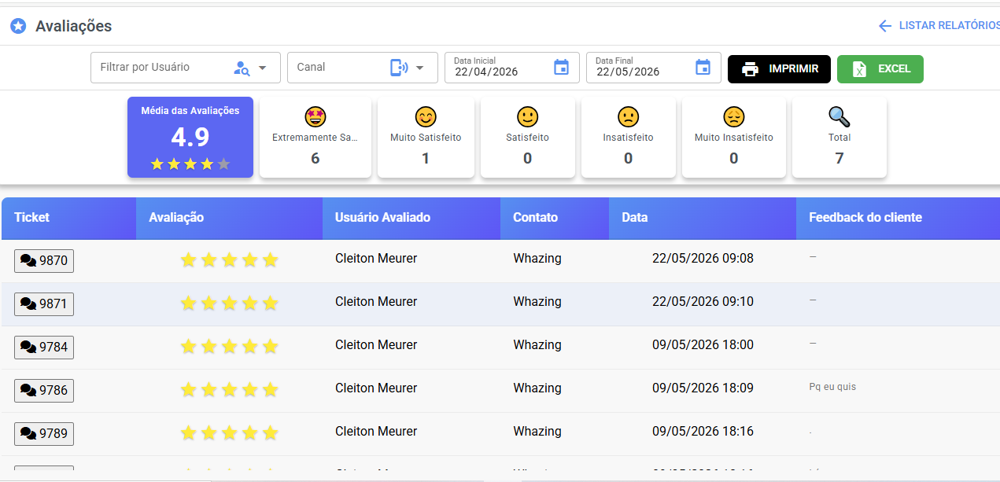

# Avaliação de Atendimento

## ⚙️ Passos para Configuração

1. Acesse **Canais** na plataforma.
2. Clique no ícone de lápis para editar o canal desejado.
3. Localize a opção **Habilitar Avaliação de Atendimento** e ative-a.

<figure><figcaption></figcaption></figure>

***

## 🛠️ Campos para Configuração

Ao habilitar a avaliação de atendimento, você poderá configurar os seguintes campos:

***

### 1. Mensagem para Solicitar Avaliação

Mensagem enviada ao cliente solicitando uma nota para o atendimento.

#### Exemplo

> "Por favor, avalie nosso atendimento com uma nota de 1 a 5. Sua opinião é muito importante para nós!"

***

### 2. Mensagem Após o Cliente Avaliar

Texto enviado automaticamente após o cliente enviar uma avaliação válida.

#### Exemplo

> "Obrigado por compartilhar sua opinião! Estamos sempre buscando melhorar."

***

### 3. Mensagem para Avaliação Inválida

Mensagem enviada quando o cliente responder fora do formato esperado.

#### Exemplo

> "Sua avaliação não foi válida. Por favor, envie uma nota entre 1 e 5."

***

### 4. Tempo em Minutos que Aguarda Cliente Avaliar

Define por quanto tempo o sistema aguardará a resposta do cliente após solicitar a avaliação.

#### Exemplo

> Defina 10 minutos para permitir que o cliente responda nesse intervalo.

***

### 5. Mensagem de Encerramento Caso o Prazo de Avaliação Seja Ultrapassado

Mensagem enviada quando o prazo configurado for atingido sem resposta do cliente.

> Caso o campo fique vazio, nenhuma mensagem será enviada.

#### Exemplo

> "O prazo para avaliação foi encerrado. Agradecemos seu atendimento!"

***

### 6. Intervalo em Horas Entre as Solicitações de Avaliação

Define o tempo mínimo necessário para solicitar uma nova avaliação ao mesmo cliente.

#### Exemplo

> Configurando 6 horas, o cliente somente receberá uma nova solicitação após esse período.

***

### ✅ Avaliação Voluntária (não bloqueia novo atendimento)

Quando essa opção estiver ativada:

* Caso o cliente envie uma mensagem que não seja uma nota válida, a avaliação será automaticamente cancelada.
* O sistema enviará a mensagem de avaliação inválida configurada.
* Um novo ticket será aberto automaticamente para continuidade do atendimento.

Essa funcionalidade evita que o cliente fique preso aguardando uma avaliação obrigatória antes de continuar o atendimento.

#### Exemplo de fluxo

1. Cliente recebe solicitação de avaliação.
2.  Em vez de enviar uma nota, responde:

    > "Preciso de mais ajuda"
3. O sistema:
   * Cancela a avaliação pendente.
   * Envia mensagem de avaliação inválida.
   * Abre automaticamente um novo ticket.

***

### ✅ Solicitar Feedback Após Nota Baixa

Permite solicitar automaticamente um comentário adicional quando o cliente enviar uma nota abaixo ou igual ao limite configurado.

#### Campo de Configuração

**Solicitar feedback quando a nota for menor ou igual a:**

Defina a nota limite para que o sistema solicite automaticamente um feedback complementar do cliente.

#### Exemplo

Se configurado:

> Menor ou igual a 3

Quando o cliente enviar:

* 1
* 2
* 3

O sistema enviará automaticamente uma mensagem solicitando mais detalhes sobre a experiência.

#### Exemplo de mensagem

> "Sentimos muito pela sua experiência. Poderia nos informar o motivo da sua avaliação para melhorarmos nosso atendimento?"

#### Exemplo de fluxo

1. Cliente recebe solicitação de avaliação.
2.  Cliente responde:

    > 2
3. Sistema identifica que a nota está dentro do limite configurado.
4. Sistema envia automaticamente a solicitação de feedback complementar.
5. Equipe poderá analisar os motivos nos relatórios e histórico do atendimento.

***

## 📋 Enviar Formato de Lista

Disponível para:

* API Oficial WhatsApp
* Plus WhatsApp (`plus_whatsapp`)

Ao ativar essa opção, a solicitação de avaliação poderá ser enviada utilizando listas interativas do WhatsApp.

***

### Campos adicionais da lista

#### Texto do Botão

Texto exibido no botão da lista.

#### Exemplo

> "Avaliar Atendimento"

***

#### Texto Adicional da Lista

Mensagem complementar exibida junto à lista de opções.

#### Exemplo

> "Selecione abaixo a nota para nosso atendimento."

***

#### Opções da Lista

Permite configurar as opções de avaliação que serão exibidas ao cliente.

#### Exemplo

* ⭐ Péssimo
* ⭐⭐  Ruim
* ⭐⭐⭐ Regular
* ⭐⭐⭐⭐ Bom
* ⭐⭐⭐⭐⭐ Excelente

<figure><figcaption></figcaption></figure> <figure><figcaption></figcaption></figure>

***

## 📊 Monitoramento do Desempenho

Para acompanhar os resultados:

1. Acesse **Relatórios** na plataforma.
2. Consulte os dados de avaliações recebidas.

Os relatórios exibem informações como:

* Quantidade de avaliações recebidas
* Média das notas atribuídas
* Percentual de avaliações válidas
* Percentual de avaliações inválidas
* Desempenho individual da equipe

<figure><figcaption></figcaption></figure>

***

## 💬 Exemplo de Fluxo Completo

#### Fluxo padrão

1. Atendimento é finalizado.
2.  Cliente recebe:

    > "Por favor, avalie nosso atendimento com uma nota de 1 a 5."
3.  Cliente responde:

    > 5
4.  Sistema envia:

    > "Obrigado por compartilhar sua opinião!"

***

#### Fluxo com feedback automático

1. Atendimento é finalizado.
2. Cliente recebe solicitação de avaliação.
3.  Cliente responde:

    > 2
4.  O sistema identifica nota baixa e envia:

    > "Poderia nos informar o motivo da sua avaliação?"
5. Cliente responde com mais detalhes.
6. A equipe poderá analisar as informações nos relatórios e histórico do atendimento.

***

#### Fluxo com avaliação voluntária

1. Cliente recebe solicitação de avaliação.
2.  Cliente envia:

    > "Ainda preciso de ajuda"
3. O sistema:
   * Cancela a avaliação.
   * Envia mensagem de avaliação inválida.
   * Reabre automaticamente um novo ticket para continuidade do suporte.
