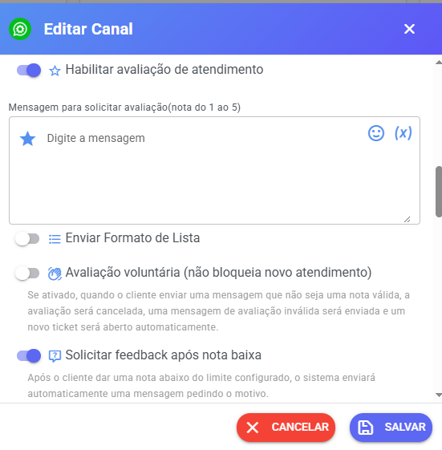
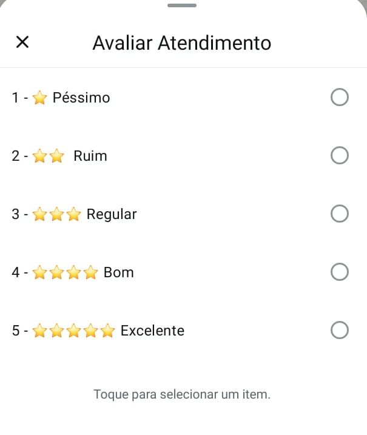
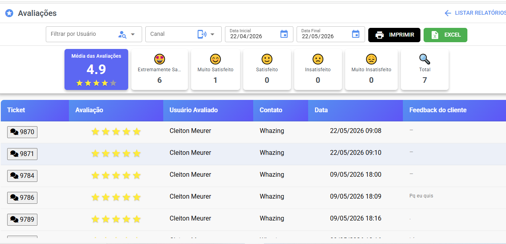

# Avaliação de Atendimento

Solicite uma pesquisa de satisfação automaticamente após finalizar um atendimento.

## ⚙️ Passos para Configuração

1. Acesse **Configurações de Atendimento → Avaliação de Atendimento**.
2. No campo **Selecione o Canal**, escolha o canal onde deseja ativar a pesquisa de satisfação.
3. Ative a opção **Ativar avaliação automática**.

<figure><figcaption></figcaption></figure>

> 💡 A pesquisa é enviada automaticamente após o encerramento do atendimento. Você pode personalizar a mensagem enviada ao cliente.

***

## 🛠️ Campos para Configuração

Ao habilitar a avaliação de atendimento, você poderá configurar os seguintes campos:

***

### 1. Mensagem enviada ao cliente

Mensagem enviada ao cliente solicitando uma nota para o atendimento. Digite a mensagem no campo.

#### Exemplo

> "Por favor, avalie nosso atendimento com uma nota de 1 a 5. Sua opinião é muito importante para nós!"

***

### 2. Mensagem de agradecimento

Texto enviado automaticamente após o cliente enviar uma avaliação válida. Digite a mensagem no campo.

#### Exemplo

> "Obrigado por compartilhar sua opinião! Estamos sempre buscando melhorar."

***

### 3. Mensagem de avaliação inválida

Mensagem enviada quando o cliente responder fora do formato esperado. Digite a mensagem no campo.

#### Exemplo

> "Sua avaliação não foi válida. Por favor, envie uma nota entre 1 e 5."

***

### 4. Tempo de espera (minutos)

Quanto tempo o sistema aguarda o cliente responder a avaliação.

#### Exemplo

> Defina 10 minutos para permitir que o cliente responda nesse intervalo.

***

### 5. Mensagem quando o prazo expira

Mensagem enviada quando o prazo configurado for atingido sem resposta do cliente. Digite a mensagem no campo.

> Caso o campo fique vazio, nenhuma mensagem será enviada.

#### Exemplo

> "O prazo para avaliação foi encerrado. Agradecemos seu atendimento!"

***

### 6. Intervalo entre avaliações (horas)

Tempo mínimo entre solicitações de avaliação para o mesmo cliente.

#### Exemplo

> Configurando 6 horas, o cliente somente receberá uma nova solicitação após esse período.

***

### ✅ Avaliação voluntária

Quando essa opção estiver ativada, se o cliente enviar uma mensagem que não seja uma nota válida, a avaliação será cancelada, a mensagem de avaliação inválida será enviada e um novo ticket será aberto automaticamente.

Detalhes do funcionamento:

* Caso o cliente envie uma mensagem que não seja uma nota válida, a avaliação será automaticamente cancelada.
* O sistema enviará a mensagem de avaliação inválida configurada.
* Um novo ticket será aberto automaticamente para continuidade do atendimento.

Essa funcionalidade evita que o cliente fique preso aguardando uma avaliação obrigatória antes de continuar o atendimento.

#### Exemplo de fluxo

1. Cliente recebe solicitação de avaliação.
2.  Em vez de enviar uma nota, responde:

    > "Preciso de mais ajuda"
3. O sistema:
   * Cancela a avaliação pendente.
   * Envia mensagem de avaliação inválida.
   * Abre automaticamente um novo ticket.

***

### ✅ Solicitar feedback após nota baixa

Após o cliente dar uma nota abaixo do limite, o sistema envia uma mensagem pedindo o motivo.

Detalhes do funcionamento:

#### Campo de Configuração

**Solicitar feedback quando a nota for menor ou igual a:**

Defina a nota limite para que o sistema solicite automaticamente um feedback complementar do cliente.

#### Exemplo

Se configurado:

> Menor ou igual a 3

Quando o cliente enviar:

* 1
* 2
* 3

O sistema enviará automaticamente uma mensagem solicitando mais detalhes sobre a experiência.

#### Exemplo de mensagem

> "Sentimos muito pela sua experiência. Poderia nos informar o motivo da sua avaliação para melhorarmos nosso atendimento?"

#### Exemplo de fluxo

1. Cliente recebe solicitação de avaliação.
2.  Cliente responde:

    > 2
3. Sistema identifica que a nota está dentro do limite configurado.
4. Sistema envia automaticamente a solicitação de feedback complementar.
5. Equipe poderá analisar os motivos nos relatórios e histórico do atendimento.

***

## 📋 Formato de Lista

Em canais compatíveis, envie a avaliação como uma **lista interativa com opções de 1 a 5**.

Disponível para:

* API Oficial WhatsApp
* Plus WhatsApp (`plus_whatsapp`)

Ao ativar essa opção, a solicitação de avaliação poderá ser enviada utilizando listas interativas do WhatsApp.

***

### Campos adicionais da lista

#### Texto do Botão

Texto exibido no botão da lista.

#### Exemplo

> "Avaliar Atendimento"

***

#### Texto Adicional da Lista

Mensagem complementar exibida junto à lista de opções.

#### Exemplo

> "Selecione abaixo a nota para nosso atendimento."

***

#### Opções da Lista

Permite configurar as opções de avaliação que serão exibidas ao cliente.

#### Exemplo

* ⭐ Péssimo
* ⭐⭐  Ruim
* ⭐⭐⭐ Regular
* ⭐⭐⭐⭐ Bom
* ⭐⭐⭐⭐⭐ Excelente

<figure><figcaption></figcaption></figure> <figure><figcaption></figcaption></figure>

***

## 📊 Monitoramento do Desempenho

Para acompanhar os resultados:

1. Acesse **Relatórios** na plataforma.
2. Consulte os dados de avaliações recebidas.

Os relatórios exibem informações como:

* Quantidade de avaliações recebidas
* Média das notas atribuídas
* Percentual de avaliações válidas
* Percentual de avaliações inválidas
* Desempenho individual da equipe

<figure><figcaption></figcaption></figure>

***

## 💬 Exemplo de Fluxo Completo

#### Fluxo padrão

1. Atendimento é finalizado.
2.  Cliente recebe:

    > "Por favor, avalie nosso atendimento com uma nota de 1 a 5."
3.  Cliente responde:

    > 5
4.  Sistema envia:

    > "Obrigado por compartilhar sua opinião!"

***

#### Fluxo com feedback automático

1. Atendimento é finalizado.
2. Cliente recebe solicitação de avaliação.
3.  Cliente responde:

    > 2
4.  O sistema identifica nota baixa e envia:

    > "Poderia nos informar o motivo da sua avaliação?"
5. Cliente responde com mais detalhes.
6. A equipe poderá analisar as informações nos relatórios e histórico do atendimento.

***

#### Fluxo com avaliação voluntária

1. Cliente recebe solicitação de avaliação.
2.  Cliente envia:

    > "Ainda preciso de ajuda"
3. O sistema:
   * Cancela a avaliação.
   * Envia mensagem de avaliação inválida.
   * Reabre automaticamente um novo ticket para continuidade do suporte.
