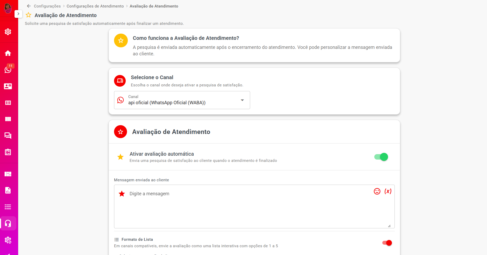
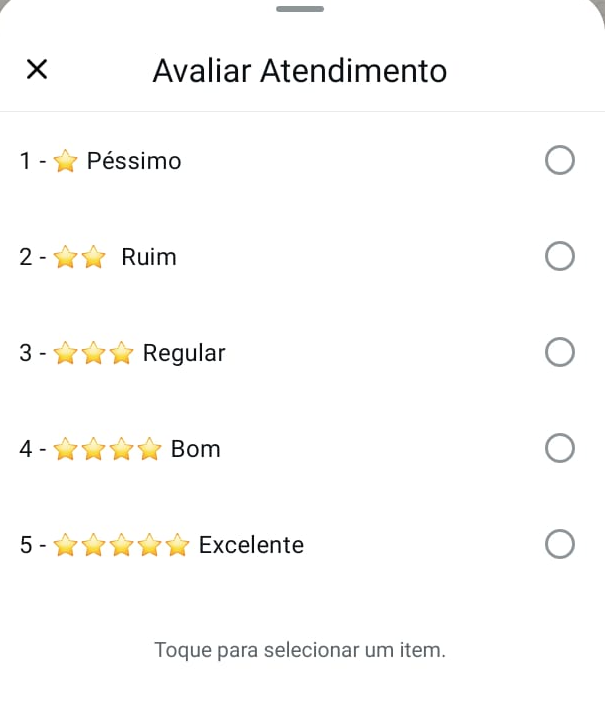
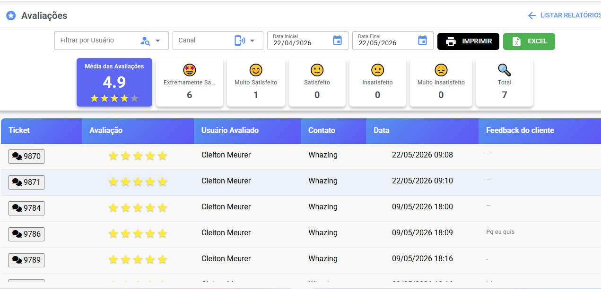

# Avaliação de Atendimento

Solicite uma pesquisa de satisfação automaticamente após finalizar um atendimento.

## ⚙️ Passos para Configuração

1. Acesse **Configurações de Atendimento → Avaliação de Atendimento**.
2. No campo **Canal**, escolha o canal onde deseja ativar a pesquisa de satisfação.
3. Ative a opção **Ativar avaliação automática**.
4. Configure as opções da pesquisa e clique em **Salvar Configuração**.

<figure><figcaption></figcaption></figure>

> 💡 A pesquisa é enviada automaticamente após o encerramento do atendimento. Você pode personalizar a mensagem enviada ao cliente.

> 💡 **Configuração é por canal:** cada canal tem a sua própria configuração de avaliação. Quer usar a mesma em vários canais? Depois de configurar, use o botão **"Copiar para outros canais"** (veja no final desta página).

***

## 🛠️ Campos para Configuração

Ao habilitar a avaliação de atendimento, você poderá configurar os seguintes campos:

***

### 1. Mensagem enviada ao cliente

Mensagem enviada ao cliente solicitando uma nota para o atendimento. Digite a mensagem no campo.

#### Exemplo

> "Por favor, avalie nosso atendimento com uma nota de 1 a 5. Sua opinião é muito importante para nós!"

***

### 2. Mensagem de agradecimento

Texto enviado automaticamente após o cliente enviar uma avaliação válida. Digite a mensagem no campo.

#### Exemplo

> "Obrigado por compartilhar sua opinião! Estamos sempre buscando melhorar."

***

### 3. Mensagem de avaliação inválida

Mensagem enviada quando o cliente responder fora do formato esperado. Digite a mensagem no campo.

#### Exemplo

> "Sua avaliação não foi válida. Por favor, envie uma nota entre 1 e 5."

***

### 4. Tempo de espera (minutos)

Quanto tempo o sistema aguarda o cliente responder a avaliação.

#### Exemplo

> Defina 10 minutos para permitir que o cliente responda nesse intervalo.

***

### 5. Mensagem quando o prazo expira

Mensagem enviada quando o prazo configurado for atingido sem resposta do cliente. Digite a mensagem no campo.

> Caso o campo fique vazio, nenhuma mensagem será enviada.

#### Exemplo

> "O prazo para avaliação foi encerrado. Agradecemos seu atendimento!"

***

### 6. Intervalo entre avaliações (horas)

Tempo mínimo entre solicitações de avaliação para o mesmo cliente.

#### Exemplo

> Configurando 6 horas, o cliente somente receberá uma nova solicitação após esse período.

***

### ✅ Avaliação voluntária

Quando essa opção estiver ativada, se o cliente enviar uma mensagem que não seja uma nota válida, a avaliação será cancelada, a mensagem de avaliação inválida será enviada e um novo ticket será aberto automaticamente.

Detalhes do funcionamento:

* Caso o cliente envie uma mensagem que não seja uma nota válida, a avaliação será automaticamente cancelada.
* O sistema enviará a mensagem de avaliação inválida configurada.
* Um novo ticket será aberto automaticamente para continuidade do atendimento.

Essa funcionalidade evita que o cliente fique preso aguardando uma avaliação obrigatória antes de continuar o atendimento.

#### Exemplo de fluxo

1. Cliente recebe solicitação de avaliação.
2.  Em vez de enviar uma nota, responde:

    > "Preciso de mais ajuda"
3. O sistema:
   * Cancela a avaliação pendente.
   * Envia mensagem de avaliação inválida.
   * Abre automaticamente um novo ticket.

***

### ✅ Solicitar feedback após nota baixa

Após o cliente dar uma nota abaixo do limite, o sistema envia uma mensagem pedindo o motivo.

Detalhes do funcionamento:

#### Campo de Configuração

**Solicitar feedback quando a nota for menor ou igual a:**

Defina a nota limite para que o sistema solicite automaticamente um feedback complementar do cliente.

#### Exemplo

Se configurado:

> Menor ou igual a 3

Quando o cliente enviar:

* 1
* 2
* 3

O sistema enviará automaticamente uma mensagem solicitando mais detalhes sobre a experiência.

#### Exemplo de mensagem

> "Sentimos muito pela sua experiência. Poderia nos informar o motivo da sua avaliação para melhorarmos nosso atendimento?"

#### Exemplo de fluxo

1. Cliente recebe solicitação de avaliação.
2.  Cliente responde:

    > 2
3. Sistema identifica que a nota está dentro do limite configurado.
4. Sistema envia automaticamente a solicitação de feedback complementar.
5. Equipe poderá analisar os motivos nos relatórios e histórico do atendimento.

***

## 🧠 Análise com IA: o que causou a nota

Em vez de ficar adivinhando **por que o cliente deu aquela nota**, você pode deixar a **IA ler o atendimento** e apontar o que pode ter causado a nota e o que pode ser melhorado.

**Onde configurar:** na mesma tela de **Avaliação de Atendimento**, opção **"Analisar avaliações com IA"**.

### Como ativar

1. Ligue a opção **"Analisar avaliações com IA"**.
2. Escolha **quais avaliações analisar** — clique nas notas (1★ a 5★) que a IA deve analisar, ou use o botão **"Todas as notas"**. A análise será feita **apenas para as notas selecionadas**.
3. Defina a **quantidade de mensagens analisadas** — quantas mensagens do atendimento a IA vai considerar (50, 100, 200 ou 500). Quanto mais mensagens, mais contexto a IA tem — e mais conteúdo ela processa.
4. Clique em **Salvar Configuração**.

> 💡 **Dica prática:** analisar todas as notas pode ser caro e desnecessário — na maioria dos casos, o que interessa é entender as **notas baixas** (1★, 2★ e 3★). As notas altas raramente escondem problemas.

### Qual IA é usada?

A análise usa **a mesma IA configurada no Copiloto** (Assistente IA). Se ainda não há IA configurada, o próprio card mostra o botão **"Configurar IA"** para levar você direto à configuração. O admin configura uma vez e todos os recursos de IA do sistema usam a mesma conexão.

> ⚠️ **Limite da análise:** a IA tem um limite de quanto conteúdo consegue ler por vez. O sistema **ajusta automaticamente** o conteúdo do atendimento para caber nesse limite e evitar erros — você não precisa se preocupar com isso.

### Onde aparece a análise

No **Relatório de Avaliações** (menu **Relatórios → Avaliações**), cada avaliação ganha a coluna **"Análise da IA"** com um botão que muda de acordo com o estado:

| Botão                       | Cor      | Significado                                        |
| --------------------------- | -------- | -------------------------------------------------- |
| **Analisar com IA** 🧠      | Azul     | Ainda não analisada — clique para analisar agora   |
| **Analisando...**           | —        | IA em processo (botão fica bloqueado até terminar) |
| **Ver análise** 👁️         | Verde    | Já analisada — clique para ler o resultado         |
| **Analisar com IA** ↻       | Amarelo  | A última tentativa falhou — clique para tentar de novo |

Clicando no botão, abre a janela **"Análise da IA"** com a **nota do cliente**, o **feedback escrito** (quando houver) e o **texto da análise**: o que pode ter causado a nota e o que pode ser melhorado.

> 💡 **Quando a análise é feita?** Pela configuração acima o sistema analisa automaticamente as notas escolhidas — mas você também pode pedir a análise de qualquer avaliação na hora, pelo botão **"Analisar com IA"** no relatório. Análise feita uma vez fica salva (verde).

> ⚠️ **Sem IA configurada?** Ao clicar em analisar, o sistema avisa: _"Não há uma IA configurada para realizar a análise. Configure a IA para continuar."_ — com o botão **Configurar IA** para resolver na hora.

***

## 📋 Formato de Lista

Em canais compatíveis, envie a avaliação como uma **lista interativa com opções de 1 a 5**.

Disponível para:

* API Oficial WhatsApp (WABA e Hub)
* Plus WhatsApp (`plus_whatsapp`)

> 💡 Em canais sem suporte à lista, a opção nem aparece — a avaliação é enviada como mensagem de texto normal.

Ao ativar essa opção, a solicitação de avaliação poderá ser enviada utilizando listas interativas do WhatsApp.

***

### Campos adicionais da lista

#### Texto do Botão

Texto exibido no botão da lista.

#### Exemplo

> "Avaliar Atendimento"

***

#### Texto Adicional da Lista

Mensagem complementar exibida junto à lista de opções.

#### Exemplo

> "Selecione abaixo a nota para nosso atendimento."

***

#### Opções da Lista

Permite configurar as opções de avaliação que serão exibidas ao cliente.

#### Exemplo

* ⭐ Péssimo
* ⭐⭐ Ruim
* ⭐⭐⭐ Regular
* ⭐⭐⭐⭐ Bom
* ⭐⭐⭐⭐⭐ Excelente

<figure><figcaption></figcaption></figure> <figure><figcaption></figcaption></figure>

***

## 📊 Monitoramento do Desempenho

Para acompanhar os resultados:

1. Acesse **Relatórios → Avaliações** (ou o botão **"Ver Relatório de Avaliações"** na tela de configuração).
2. Consulte os dados de avaliações recebidas.

No topo, cards de resumo mostram a **média das notas** e a quantidade de avaliações em cada nível (🤩 Extremamente Satisfeito a 😞 Muito Insatisfeito) — os cards são **clicáveis** e funcionam como filtro rápido.

### Filtros e colunas

O relatório aceita **filtro por usuário, canal e período** (abre mostrando os últimos 30 dias). A tabela mostra:

* **Ticket** — clicável, abre a conversa do atendimento;
* **Avaliação** — as estrelas dadas pelo cliente;
* **Usuário Avaliado** — quem atendeu;
* **Contato** — quem avaliou;
* **Data**;
* **Feedback do cliente** — o texto que ele escreveu (quando houver);
* **Análise da IA** — o botão de análise (veja [Análise com IA](#-análise-com-ia-o-que-causou-a-nota)).

O relatório também pode ser **exportado para Excel** pelo botão no topo.

<figure><figcaption></figcaption></figure>

***

## 📄 Copiar configuração para outros canais

A configuração da avaliação é **por canal** — mas ninguém precisa configurar canal por canal. O botão **"Copiar para outros canais"** (ao lado de Salvar) aplica a configuração atual aos canais que você escolher:

1. Configure a avaliação do canal atual e **salve**.
2. Clique em **"Copiar para outros canais"**.
3. Selecione os canais que devem receber a configuração (há botão para **selecionar todos** os compatíveis).
4. Confirme — o sistema avisa quantos canais receberam a configuração.

> ⚠️ **O que a cópia afeta:** apenas as **configurações de avaliação** — as demais configurações do canal não mudam. Canais **sem suporte ao Formato de Lista** não recebem os campos de lista. E canais **criados no futuro** não herdam a configuração automaticamente — copie de novo quando criar um canal novo.

***

## 💬 Exemplo de Fluxo Completo

#### Fluxo padrão

1. Atendimento é finalizado.
2.  Cliente recebe:

    > "Por favor, avalie nosso atendimento com uma nota de 1 a 5."
3.  Cliente responde:

    > 5
4.  Sistema envia:

    > "Obrigado por compartilhar sua opinião!"

***

#### Fluxo com feedback automático

1. Atendimento é finalizado.
2. Cliente recebe solicitação de avaliação.
3.  Cliente responde:

    > 2
4.  O sistema identifica nota baixa e envia:

    > "Poderia nos informar o motivo da sua avaliação?"
5. Cliente responde com mais detalhes.
6. A equipe poderá analisar as informações nos relatórios e histórico do atendimento.

***

#### Fluxo com avaliação voluntária

1. Cliente recebe solicitação de avaliação.
2.  Cliente envia:

    > "Ainda preciso de ajuda"
3. O sistema:
   * Cancela a avaliação.
   * Envia mensagem de avaliação inválida.
   * Reabre automaticamente um novo ticket para continuidade do suporte.
