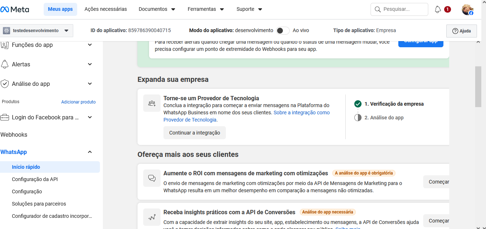

## description: Disponível somente para canais API PLUS

# 🔑 Chave PIX

Esta funcionalidade permite **enviar uma Chave PIX diretamente pela tela de atendimento**, facilitando o envio de dados de pagamento ao cliente.

> ⚠️ **Disponível apenas para canais do tipo API PLUS**

---

## 📍 Onde configurar

Acesse o menu:

**Configurações → Canais → Gerenciar Chaves Pix**

<figure><figcaption></figcaption></figure>

---

## ➕ Como cadastrar uma Chave PIX

O cadastro é simples e rápido.

1. Informe uma **identificação da chave**

   * Serve apenas para organização interna
   * Exemplo: *PIX Principal*, *PIX Loja Centro*, etc.

2. Preencha os **dados da Chave PIX**

   * Pode ser CPF, CNPJ, e-mail, telefone ou chave aleatória

<figure><figcaption></figcaption></figure>

✅ Após salvar, a chave estará pronta para uso.

---

## 💬 Usando a Chave PIX no atendimento

Depois de cadastrada, a Chave PIX ficará disponível **na tela de atendimento**, somente para **canais API PLUS**.

<figure><figcaption></figcaption></figure>

### Para enviar ao cliente:

1. Selecione a **Chave PIX desejada**
2. Clique em **Enviar**

<figure><figcaption></figcaption></figure>

---

## 📄 Formato da mensagem enviada

A mensagem será enviada automaticamente neste formato padrão:

<figure><figcaption></figcaption></figure>

---

## 📝 Informações adicionais (opcional)

Se desejar, você pode adicionar **informações extras**, como:

* Valor do pagamento
* Descrição
* Observações para o cliente

<figure><figcaption></figcaption></figure>

### Resultado final para o cliente:

<figure><figcaption></figcaption></figure>