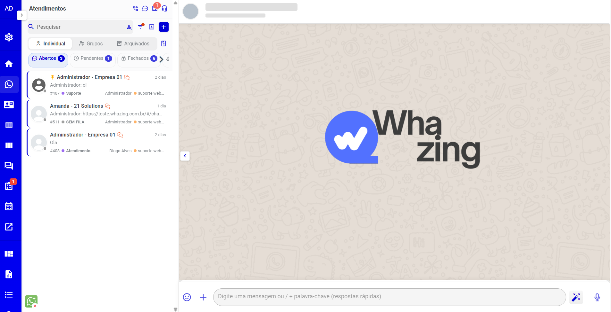
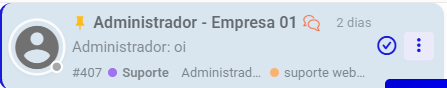
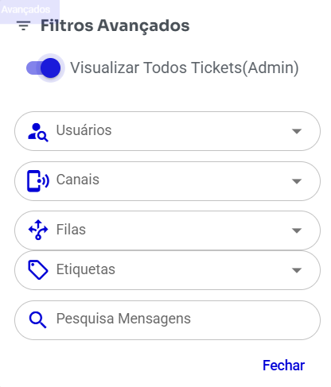
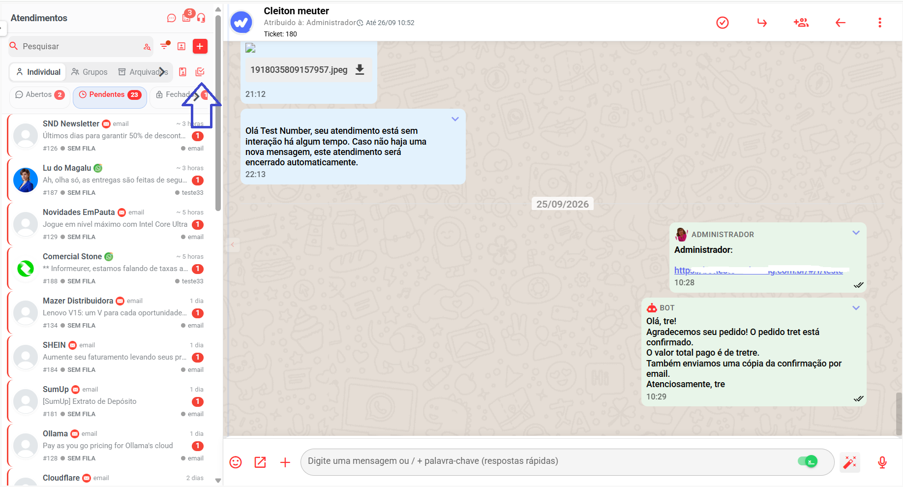
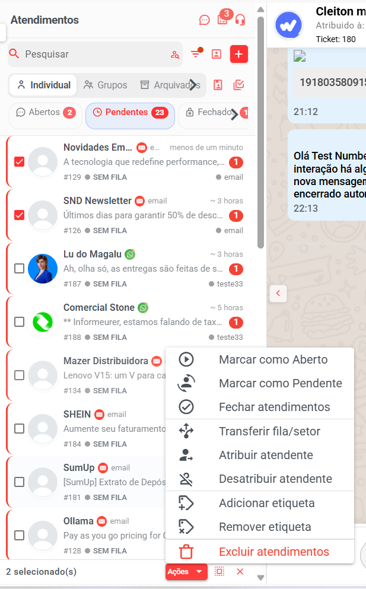
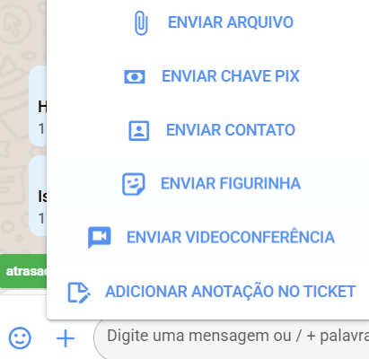
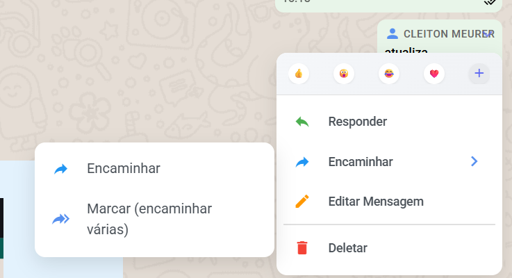
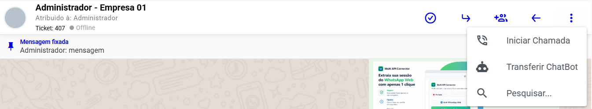
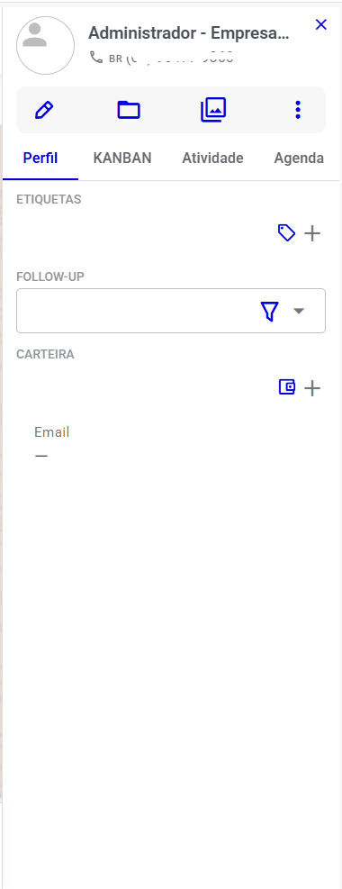

# Tela Atendimento

A tela **Atendimento** é o coração do Whazing: é nela que sua equipe lê as mensagens dos clientes, responde, transfere conversas e encerra atendimentos. Todo o trabalho do dia a dia acontece aqui.

> 💡 **Nunca usou o sistema?** Veja primeiro o [Glossário de Termos](../../glossario.md) e os [Primeiros Passos](../../primeiros-passos.md).
>
> 📄 Nesta seção você também encontra guias que aprofundam recursos citados aqui: [Avaliação de Atendimento](avaliacao.md), [Formatação de Texto](formatacao-de-texto.md), [Chave PIX](chave-pix.md), [Agendamento pela tela de Atendimento](../agenda/agendamento-pelo-atendimento.md) e [Assistente IA — Menu Copiloto](assistente-ia-menu-copiloto/).

***

## Índice

1. [Conhecendo a tela](tela-atendimento.md#conhecendo-a-tela)
2. [Status dos atendimentos](tela-atendimento.md#status-dos-atendimentos)
3. [A lista de atendimentos em detalhe](tela-atendimento.md#a-lista-de-atendimentos-em-detalhe)
4. [Como encontrar um atendimento](tela-atendimento.md#como-encontrar-um-atendimento)
5. [Como abrir uma conversa](tela-atendimento.md#como-abrir-uma-conversa)
6. [Conversando com o cliente](tela-atendimento.md#conversando-com-o-cliente)
7. [Ações dentro da conversa (mensagens)](tela-atendimento.md#ações-dentro-da-conversa-mensagens)
8. [Ações do atendimento (cabeçalho da conversa)](tela-atendimento.md#ações-do-atendimento-cabeçalho-da-conversa)
9. [Informações do cliente (painel do cliente)](tela-atendimento.md#informações-do-cliente-painel-do-cliente)
10. [Criar um novo atendimento](tela-atendimento.md#criar-um-novo-atendimento)
11. [Permissões: o que muda entre administrador, supervisor e atendente](tela-atendimento.md#permissões-o-que-muda-entre-administrador-supervisor-e-atendente)
12. [Diferenças por canal (WhatsApp, Instagram, Telegram etc.)](tela-atendimento.md#diferenças-por-canal-whatsapp-instagram-telegram-etc)
13. [Configurações que mudam o que aparece na tela](tela-atendimento.md#configurações-que-mudam-o-que-aparece-na-tela)
14. [Problemas comuns](tela-atendimento.md#problemas-comuns)

***

## Conhecendo a tela

Ao entrar no menu **Atendimento**, você verá a tela dividida em algumas áreas principais:

| Área                                 | O que é                                                                               |
| ------------------------------------ | ------------------------------------------------------------------------------------- |
| **Lista de atendimentos** (esquerda) | A fila de conversas, organizada por status (abertos, pendentes, fechados, arquivados) |
| **Barra de busca e filtros**         | Onde você pesquisa e filtra os atendimentos                                           |
| **Área da conversa** (centro)        | As mensagens trocadas com o cliente                                                   |
| **Painel do cliente** (direita)      | Informações do contato: etiquetas, carteira, CRM, anotações, agenda                   |

<figure><figcaption></figcaption></figure>

### Botões do topo da lista

No topo da lista de atendimentos há alguns botões rápidos:

* **💬 Chat Interno** — abre a conversa interna da equipe (não é com o cliente, é entre seus colegas de trabalho). Um número vermelho indica mensagens internas não lidas.
* **📋 Criar Tarefa** — cria uma tarefa para você ou um colega. Um número vermelho indica tarefas atrasadas ou que vencem hoje.
* **❓ Suporte** — abre o suporte do sistema.
* **📞 Telefone** _(aparece só se sua conta tiver telefone/SIP configurado pelo administrador)_ — abre um discador para fazer ligações.
* No celular aparecem ainda **↻ Atualizar conversas** e **↩ Retornar ao menu**.

> No desktop, a lista de conversas pode ser **recolhida** para dar mais espaço à conversa: passe o mouse na borda direita da lista e clique na setinha que aparece. Para mostrar de novo, clique na seta no canto esquerdo da tela. Você também pode **arrastar a borda** para alargar ou estreitar a lista.

### Abas da lista de atendimentos

Logo abaixo dos botões, a lista é dividida em três abas:

* **Individual** — conversas com um cliente por vez.
* **Grupos** — conversas de grupos (ex.: grupos de WhatsApp). _Esta aba só aparece quando o sistema está configurado para atender grupos._
* **Arquivados** — conversas que alguém arquivou para tirar da lista normal.

Dentro das abas **Individual** e **Grupos** há pílulas de status:

* **Abertos** — conversas em andamento com você ou com algum atendente.
* **Pendentes** — conversas aguardando alguém assumir (normalmente quem chega por robô ou transferência).
* **Fechados** — atendimentos já concluídos.
* **Chatbot** _(aparece só se a função "Chatbot em lane separada" estiver ativada no sistema)_ — conversas que estão sendo atendidas por robô (chatbot/IA). Enquanto ela existir, as pílulas **Pendentes** mostram apenas as conversas que NÃO estão com robô.

Cada pílula mostra um **número**: quantas conversas existem naquele status. Na pílula **Abertos**, esse número fica **vermelho** quando há mensagens não lidas.

> 💡 Abas/pílulas **vazias podem ficar escondidas** — depende da configuração "Ocultar abas vazias" feita pelo administrador. Se você não vê uma pílula, provavelmente é porque ela está vazia ou desativada.`ores]`

***

## Status dos atendimentos

O Whazing usa estes status para as conversas (os nomes são exatamente os da tela):

| Status       | O que significa em linguagem simples                                                                                                                                        |
| ------------ | --------------------------------------------------------------------------------------------------------------------------------------------------------------------------- |
| **Aberto**   | A conversa está com um atendente responsável e ativa. É o único status em que se pode enviar mensagens ao cliente.                                                          |
| **Pendente** | A conversa chegou, mas **ninguém assumiu ainda** — ficou na fila aguardando. O atendente só pode **visualizar** as mensagens (a não ser que seja administrador/supervisor). |
| **Fechado**  | O atendimento terminou. A conversa fica guardada para consulta e pode ser reaberta.                                                                                         |

Abaixo, extras que também mudam o comportamento na lista:

* **Fixado** — o atendimento foi preso no topo da lista com um alfinete 📌, e pode ter **prioridade** (subir/descer entre os fixados).
* **Arquivado** — a conversa saiu da lista normal e foi para a aba **Arquivados** (não é o mesmo que fechar).
* **Sem resposta** — conversa **aberta** em que o cliente mandou mensagem depois da sua última resposta e você ainda não respondeu (a borda do item fica amarela).
* **Mensagens não lidas** — bolinha vermelha com o número de mensagens que você ainda não leu.
* **Com robô (chatbot/IA)** — ícone 🤖 no item indica que um chatbot, Typebot ou IA está atendendo no momento (enquanto o status for _Pendente_).
* **Janela de conversa** — em canais com janela de 24 horas (explicada adiante), um relógio sobre o avatar mostra se a janela está aberta 🟢, perto de expirar 🟡 ou expirada 🔴. Passe o mouse para ver quanto tempo falta.

**Como muda de status:** _Pendente → Aberto_ quando alguém assume o atendimento ("Iniciar Atendimento"); _Aberto → Fechado_ quando alguém clica em "Resolver/Finalizar"; _Fechado → Aberto_ quando alguém reabre (permissão necessária); e _Aberto → Pendente_ quando o atendimento é devolvido à fila ("Retornar Ticket para a Fila").

***

## A lista de atendimentos em detalhe

Cada item da lista mostra:

* **Avatar** do cliente (a foto do WhatsApp, Instagram etc.) — o relógio da janela de conversa aparece sobre ele; em WebChat, um pontinho verde/ cinza mostra se o cliente está online.
* **Nome do cliente** + ícone do canal (WhatsApp, Instagram, Telegram...). Em canal de e-mail, aparece também o nome da conta de e-mail.
* **Hora** da última mensagem ("há 5 minutos"). **Atendimento antigo?** Conversas que estão sem atualização há **mais de 7 dias** passam a mostrar a **data exata** (ex.: `12/05/2026`) no lugar do tempo relativo — facilita achar e navegar pelo histórico de atendimentos antigos.
* **Última mensagem** (resumo) + badge vermelho de **não lidas**.
* **Número do ticket** (#123) — o "protocolo" da conversa.
* **Fila** atual, com bolinha colorida (a cor é a cadastrada da fila). Sem fila aparece "SEM FILA".
* **Ícones menores**: 💼 carteira (nome no passar o mouse), 🏷️ etiquetas (cor e nome no passar o mouse), ✓ verde "Atendimento Resolvido" (fechados), 📢/🔗 origem do lead (anúncio Meta ou link rastreado), 🤖 robô atendendo.
* **Nome do atendente responsável** e o **nome do canal/conexão** conectada (ex.: o número de WhatsApp usado). O nome do canal pode estar escondido por configuração.

### Ações rápidas no item (aparecem ao passar o mouse)

<figure><figcaption></figcaption></figure>

* **Iniciar Atendimento** ➤ _(só em conversas Pendentes)_ — assume a conversa para você.
* **Finalizar Atendimento** ✓ _(só em conversas Abertas/Pendentes)_ — encerra o atendimento. Em grupos, só administrador e supervisor veem este botão.
* **Opções** ⋮ (três pontinhos) — abre o menu:
  * **Fixar no topo / Desafixar** — prende o atendimento no começo da lista, para não se perder entre tantas conversas.
  * **Prioridade** _(só aparece quando o item está fixado)_ — **Subir prioridade** e **Descer prioridade** reordenam os fixados entre si. O de cima da lista é o mais prioritário.
  * **Arquivar / Desarquivar** — guarda a conversa na aba Arquivados (ou traz de volta). Ao arquivar, o sistema pede confirmação. Não é possível arquivar um atendimento **fechado** que ainda não está arquivado — primeiro feche, depois arquive, ou arquive antes de fechar.

> 💡 **Fixar ≠ Prioridade ≠ Arquivar.** Fixar deixa sempre visível no topo; prioridade ordena entre os fixados; arquivar tira da lista normal. Nenhuma dessas ações muda o status do atendimento.

***

## Como encontrar um atendimento

### Pesquisa (barra acima da lista)

O campo de pesquisa tem **três modos**, e você alterna clicando no ícone dentro do próprio campo (do lado direito):

1. 🔍 **Pesquisar** _(padrão)_ — busca pelo **nome ou número do contato**.
2. 💬 **Pesquisa Mensagens** — busca por **palavras dentro das mensagens** das conversas.
3. \#️⃣ **Buscar Ticket ID...** — busca direto pelo **número do ticket** (protocolo).

A busca é automática: enquanto você digita, a lista já se atualiza. Para limpar, use o ✖ do campo.

### Filtros avançados (ícone de funil)

Clique no **funil** ao lado da busca para abrir os **Filtros Avançados**. Qualquer filtro ativo faz o funil ficar **destacado com uma bolinha laranja** — assim você sabe que a lista está filtrada.

<figure><figcaption></figcaption></figure>

**Filtros disponíveis (modo normal):**

| Filtro                                                | Para que serve                                                                                                                                   |
| ----------------------------------------------------- | ------------------------------------------------------------------------------------------------------------------------------------------------ |
| **Ordenar por data de criação**                       | Coloca as conversas em ordem pela data (as mais antigas primeiro). Os fixados continuam no topo.                                                 |
| **Com mensagens não lidas**                           | Mostra só as conversas que têm mensagens que você ainda não leu.                                                                                 |
| **Sem resposta**                                      | Mostra só as conversas abertas em que o **cliente** mandou mensagem e a equipe ainda **não respondeu** — ótimo para não deixar cliente no vácuo. |
| **Somente meus tickets**                              | Mostra só as conversas em que você é o responsável.                                                                                              |
| **Filas**                                             | Mostra apenas os atendimentos de determinada(s) fila(s). Como atendente, você escolhe entre **as filas em que você trabalha**.                   |
| **Etiquetas**                                         | Mostra apenas conversas do cliente que têm as etiquetas escolhidas (ex.: "VIP").                                                                 |
| **Usuários**                                          | Mostra apenas conversas responsáveis pelos atendentes escolhidos — inclui conversas em que eles participam como colaboradores.                   |
| **Pesquisa Mensagens** (campo extra)                  | Outro lugar para buscar palavra dentro das mensagens, sem sair do menu.                                                                          |
| **Status** (caixinhas Abertos / Pendentes / Fechados) | Escolhe quais status aparecer na lista. Por padrão já vêm marcados Abertos + Pendentes.                                                          |

**Filtros do modo "Ver Todos" (admin/supervisor):** ao ligar **Visualizar Todos Tickets(Admin)**, o menu muda e passa a mostrar:

* **Usuários** (todos, com indicador Online/Offline),
* **Canais** (por qual conexão/número a conversa entrou),
* **Filas** (todas as filas do sistema, não só as suas).

Ou seja: o admin/supervisor consegue enxergar **todos os atendimentos da empresa** e recortar por quem atende, por qual número/canal entrou e por qual setor.

> **Como voltar ao normal:** desligue o "Visualizar Todos Tickets(Admin)" ou desmarque os filtros. Os filtros escolhidos ficam **guardados** — quando você voltar ao Atendimento (mesmo em outro dia ou no celular), a lista já abre como você deixou.

### Carregar mais conversas

A lista carrega as conversas aos poucos. Role até o fim para carregar mais automaticamente, ou clique no botão **📄 Carregar Mais Tickets** ao lado das abas. _(Com "Visualizar Todos" ligado, use o botão — a rolagem automática fica desligada nesse modo.)_

### Aba Arquivados

Na aba **Arquivados** existe um campo próprio "**Buscar arquivados...**" para localizar conversas arquivadas por nome, número, texto da última mensagem ou número do ticket. Clique em **Carregar mais** para ver mais resultados.

### Canais desconectados

Se um canal (número de WhatsApp, Instagram...) **desconectar**, um aviso aparece na parte de baixo da lista com o ícone do canal. Passe o mouse para ver o motivo. _(Aparece só se a configuração "Exibir conexões" estiver ativa.)_ Conversas novas desse canal param de chegar até a conexão voltar.

***

## Ações em massa (selecionar vários atendimentos)

Para administradores e supervisores, é possível aplicar uma mesma ação em **vários atendimentos de uma vez**, escolhendo **exatamente quais** participarão. Somente admin e Supervisor

### Como selecionar

1. No topo da lista de atendimentos, clique no botão de **checkbox múltiplo** — o tooltip mostra **"Selecionar atendimentos"**. Ele fica destacado enquanto o modo está ativo. (_Não aparece na aba **Arquivados**._)
2. **Aparecem os checkboxes** em cada card da lista. Clique nos cards que quiser — o card inteiro alterna a marcação (no modo seleção, clicar no card **não abre** a conversa, só marca/desmarca).
3. Uma **barra fixa no rodapé** da lista mostra **"{n} selecionado(s)"** e os atalhos:
   * **"Selecionar todos os carregados"** — marca de uma vez todos os atendimentos visíveis naquela aba;
   * **"Limpar seleção"** — desmarca tudo e sai do modo.
4. Para sair do modo, clique no **X** (Limpar seleção) ou no botão de seleção novamente.

### Ações disponíveis

Com um ou mais atendimentos selecionados, clique em **"Ações"** na barra do rodapé:

| Ação                      | O que faz                                                                           |
| ------------------------- | ----------------------------------------------------------------------------------- |
| **Marcar como Aberto**    | Coloca os atendimentos selecionados em status **Aberto**                            |
| **Marcar como Pendente**  | Devolve para a fila (status **Pendente**)                                           |
| **Fechar atendimentos**   | Encerra todos os selecionados — **pede confirmação** com a quantidade               |
| **Transferir fila/setor** | Escolhe a fila de destino para todos                                                |
| **Atribuir atendente**    | Define um responsável para todos                                                    |
| **Desatribuir atendente** | Tira o responsável dos selecionados                                                 |
| **Adicionar etiqueta**    | Aplica uma etiqueta em todos                                                        |
| **Remover etiqueta**      | Tira uma etiqueta de todos                                                          |
| **Excluir atendimentos**  | **Apaga** os selecionados — **pede confirmação** e a ação **não pode ser desfeita** |

Ao concluir, o sistema informa **"{n} atendimento(s) atualizado(s)."** — e, quando algum fica de fora por regra (ex.: já estava naquele status, ou desatribuir um atendimento aberto), avisa quantos foram **ignorados** e por quê.

> 💡 As confirmações só aparecem nas ações difíceis de desfazer (fechar e excluir). As demais são aplicadas direto — mas vale conferir a seleção antes, pela contagem na barra.

<figure><figcaption></figcaption></figure>

<figure><figcaption></figcaption></figure>

***

## Como abrir uma conversa

1. Localize o atendimento na lista (pela pesquisa, filtro ou rolando a lista).
2. **Clique no item** da lista. A conversa abre no centro da tela e o painel do cliente aparece à direita.
3. Pronto — agora você pode ler as mensagens e, se o atendimento estiver **Aberto**, responder.

**E se a conversa estiver Pendente (ninguém assumiu)?**

* Na lista, passe o mouse sobre o item e clique no botão **➤ Iniciar Atendimento**; ou
* Abra a conversa e clique no botão verde **"Iniciar o atendimento"** no rodapé.

O que acontece depois: a conversa fica **Aberta com você** como responsável, o campo de mensagem é liberado e você já pode responder.

**E se aparecer "Ticket já atribuído"?**

Se você tentou iniciar um atendimento que **outro atendente já assumiu**, o sistema mostra a janela **"Ticket já atribuído"** com quem é o responsável. Ali você pode:

* **Participar deste atendimento** _(se o administrador liberou a função de colaboradores)_ — você entra como ajudante, sem tirar o atendimento do responsável.
* **Enviar mensagem interna** — manda um recadinho pelo Chat Interno para o responsável (ex.: "pode assumir por mim?").
* **Fechar** e seguir com outra conversa.

Já a janela **"Ticket bloqueado"** aparece quando o atendimento está preso a uma **fila, chatbot ou regra** — com a opção **Assumir este atendimento** (quando o administrador permitir assumir tickets bloqueados).

***

## Conversando com o cliente

### Enviar mensagem

1. Clique no campo **"Digite uma mensagem ou / + palavra-chave (respostas rápidas)"** no rodapé.
2. Escreva a mensagem.
3. **Enter** envia. Para pular linha, use **Shift + Enter**.

O que você vê ao enviar: a mensagem aparece na conversa à direita, com os "vistos" (✓ enviada, ✓✓ recebida, ✓✓ azul lida) no cantinho — detalhados em [Ícones e etiquetas nas mensagens](tela-atendimento.md#ações-dentro-da-conversa-mensagens).

> ⚠️ Só é possível enviar mensagens em conversas com status **Aberto**. Em conversas Pendentes o campo mostra o botão "Iniciar o atendimento"; em Fechadas é preciso reabrir.

### Formatação de texto (negrito, itálico...)

Funciona como no WhatsApp. Selecione um trecho do texto e uma **barra de formatação flutua sobre ele**: **N**egrito, _Itálico_, ~~Tachado~~, `Código`, Citação, listas numeradas e com marcadores. Também existem atalhos: **Ctrl+B**, **Ctrl+I**, **Ctrl+X** (tachado), **Ctrl+E** (código), **Ctrl+Q** (citação).

> 📄 Detalhes e exemplos: [Formatação de Texto](formatacao-de-texto.md).

### Emojis

Clique no ícone de **carinha** 😀 à esquerda do campo para abrir o seletor de emojis e inserir onde o cursor estiver.

### Mensagens rápidas (respostas prontas)

São respostas que a equipe cadastrou antes para agilizar o dia a dia.

* **Atalho "/":** digite **/** no campo de mensagem e um painel abre listando as mensagens rápidas disponíveis (com prévia do texto e aviso de mídia). Continue digitando para filtrar (ex.: `/endereco`), use as **setas ↑↓** e **Enter** para escolher.
* **Etiquetas acima do campo:** quando o campo está vazio, as mensagens rápidas aparecem como etiquetas coloridas prontas para clicar.
* Ao escolher, o texto da mensagem rápida entra no campo para você revisar e enviar. Mensagens rápidas podem vir **com imagem/arquivo** junto (neste caso são enviadas direto).
* Se a mensagem rápida for vinculada a filas, ela só aparece em conversas dessas filas.

### Anexos (arquivos, imagens, documentos)

Pelo **botão ➕ (Mais opções)** ao lado do campo:

* **📎 Enviar arquivo** — escolha um ou vários arquivos (até 20; imagens, PDF, DOC, planilhas, vídeos, áudios, ZIP e mais). Alguns canais têm limites de tamanho/tipo — veja a seção [Diferenças por canal](tela-atendimento.md#diferenças-por-canal-whatsapp-instagram-telegram-etc).

Outras formas rápidas:

* **Arraste e solte** o arquivo sobre a área de mensagens;
* **Cole uma imagem** copiada (Ctrl+V) direto no campo.

Nos dois casos abre uma **prévia** para você confirmar o envio (dá para escrever um texto junto).

### Gravar e enviar áudio

* O botão **🎙️ Enviar áudio** fica à direita do campo (aparece quando o campo de texto está vazio).
* Clique para começar a gravar — o campo se transforma em painel de gravação com o tempo decorrido.
* Clique de novo para **parar**: você recebe uma **prévia** do áudio e escolhe:
  * **Enviar** — manda o áudio como mensagem;
  * **Transcrever** — a IA transforma o áudio em texto (se a transcrição estiver configurada no sistema); o texto abre em um editor para você conferir e **enviar como texto**, ou ainda **melhorar com IA** antes;
  * **Descartar** ou **Gravar novamente**.

### Menu ➕ (Mais opções) completo

<figure><figcaption></figcaption></figure>

| Opção                                            | O que faz                                                                                                     | Onde aparece                                      |
| ------------------------------------------------ | ------------------------------------------------------------------------------------------------------------- | ------------------------------------------------- |
| **Marcar Usuários / Marcação Usuários Fantasma** | Marca participantes do grupo na mensagem (com notificação; a versão "fantasma" marca sem aparecer para todos) | Só em conversas de grupo                          |
| **📎 Enviar arquivo**                            | Abre o seletor de arquivos                                                                                    | Todos, menos SMS                                  |
| **💰 Enviar Chave PIX**                          | Envia chave PIX/pagamento formatado ao cliente                                                                | WhatsApp Plus, Wuzapi e API Oficial (WABA)        |
| **👤 Enviar Contato**                            | Envia o cartão de um contato cadastrado                                                                       | Canais de WhatsApp (não oficiais, WABA, MultiAPI) |
| **😀 Enviar Figurinha**                          | Abre o seletor de stickers                                                                                    | WhatsApp, Telegram, WebChat e variações           |
| **📞 Atendimento por chamada**                   | Cria uma **chamada de vídeo ou áudio** interna e manda o link para o cliente; a chamada abre na sua tela      | Todos                                             |
| **📝 Enviar template**                           | Envia mensagem modelo aprovada pela Meta (para conversas fora da janela de 24h)                               | Hub WhatsApp e WABA                               |
| **☎️ Solicitar permissão para chamada**          | Envia mensagem pedindo autorização para ligar (regra da API oficial)                                          | Só WABA                                           |
| **🗒️ Adicionar anotação no ticket**             | Cria uma anotação interna (o cliente não vê)                                                                  | Todos                                             |

> 📄 A Chave PIX tem guia próprio: [Chave PIX](chave-pix.md).

### Assinatura

O botão de **assinatura ✍️** (dentro do campo, à direita) liga/desliga se o sistema inclui automaticamente **seu nome** no início das mensagens (ex.: `*João*:\n Bom dia!`). Fica **guardado** — na próxima conversa a assinatura já está como você deixou. _(Pode ser desativada para os atendentes pelo administrador; aí só o admin a controla.)_

### Rascunho automático

Se você estava digitando e trocou de conversa sem enviar, **não se preocupe**: o que você escreveu fica salvo como rascunho daquela conversa por até 7 dias. Ao voltar para ela, o texto (e as marcações de grupo) volta ao campo.

### Contador de SMS

Em conversas do canal **SMS**, ao digitar aparece um aviso com a quantidade de caracteres e quantos **créditos SMS** a mensagem vai gastar (SMS longo é dividido em partes). Serve para você dimensionar a mensagem antes de enviar.

### Janela de 24 horas (WhatsApp oficial)

Nos canais com API oficial (WABA, Hub WhatsApp etc.) existe a **janela de atendimento de 24 horas**: você só pode mandar mensagem livre até 24h depois da última mensagem do cliente. Depois disso:

* Ao tentar enviar, o sistema **avisa que a janela expirou** e oferece **abrir o envio de template** (mensagem modelo aprovada) — veja [Templates](../../canais-disponiveis/api-oficial/como-enviar-template.md);
* Na lista de conversas, o relógio sobre o avatar mostra a situação da janela: aberta 🟢 / quase expirando 🟡 / expirada 🔴 (passe o mouse para ver o tempo).

Esse aviso vale para mensagens de texto, áudio e chamadas — não para os templates.

### Chat externo (link de conversa na web)

Em canais **Hub WhatsApp e WABA** existe o botão **"Enviar link do chat externo"** (ícone de janelinha). Ele manda ao cliente um **link para conversar por uma página web parecida com o WhatsApp** — útil quando a janela de 24h fecha e você não quer gastar template. Enquanto o chat externo está ativo, um **aviso verde** aparece acima do campo ("Chat externo ativo — suas mensagens vão pelo chat, não pelo WhatsApp"), mostrando se o cliente está online, com o botão **"Voltar para WhatsApp"** para encerrar o modo.

### IA (Copiloto)

O botão **✨ Assistente IA** (à direita do campo) abre o menu do Copiloto. Se a IA não estiver configurada no sistema, os itens abrem a tela de configuração:

* **Melhorar Texto** — reescreve o texto que você digitou, mostrando **original e sugestão lado a lado** para você comparar, editar e escolher.
* **Perguntar ao Copiloto IA** — faça perguntas para a IA sobre a conversa.
* **Resumir Conversa com IA** — gera um resumo do atendimento (bom para pegar o contexto rapidamente).
* **Sugerir Resposta com IA** — a IA lê a conversa e preenche uma sugestão de resposta no campo, que você revisa antes de enviar.

> 🔋 **E o limite de IA?** Esses recursos podem usar a **IA compartilhada do sistema**, que tem um **limite mensal**. Se o limite da empresa acabar, o sistema informa o que fazer: quem é **administrador/supervisor** recebe na hora a opção de **adquirir mais acesso** (adicional), e quem é **atendente** vê a orientação para **solicitar a um administrador ou supervisor**. Detalhes em [Limite de uso da IA](assistente-ia-menu-copiloto/limite-de-uso-da-ia.md).

> 📄 Guia completo: [Assistente IA — Menu Copiloto](assistente-ia-menu-copiloto/).

### Conversas de e-mail

Quando o atendimento é do canal **E-mail**, o rodapé muda: aparece um **editor de e-mail completo** (Para, CC, CCO, Assunto, texto rico com formatação, **anexos**), com os modos **Responder / Responder a todos / Encaminhar**, botão para **salvar rascunho** no servidor (reabre sozinho depois) e opção de **maximizar** o editor. Funciona como um e-mail dentro do atendimento: a mensagem e a resposta ficam no histórico da conversa.

***

## Ações dentro da conversa (mensagens)

Cada mensagem tem ações próprias. No **computador**, elas aparecem ao **passar o mouse** sobre a mensagem; no **celular**, sempre visíveis.

### Responder citando (responder uma mensagem específica)

Abra o menu ⌄ da mensagem (ou passe o mouse) → **Responder**. A mensagem citada aparece acima do campo de texto; a sua resposta vai "grudada" nela, como no WhatsApp. Para cancelar, clique no ✖ da citação. _(Disponível nos canais WhatsApp, Telegram e variações; some quando o atendimento não está Aberto.)_

### Reagir com emoji

No menu ⌄ da mensagem, o topo mostra **reações rápidas** (👍 ❤️ 😂 😮 😢...) e um **➕** para escolher qualquer emoji. A reação aparece na mensagem para todos, como no WhatsApp. Os emojis que você mais usa ficam no topo automaticamente. _(Canais WhatsApp, Telegram e variações; só em conversas Abertas.)_

### Menu ⌄ da mensagem — todas as opções

<figure><figcaption></figcaption></figure>

* **Fixar / Desafixar** — prende **uma** mensagem no topo da conversa. Aparece uma **faixa fixa** acima das mensagens com um resumo ("Mensagem fixada"); clique nela para ir direto à mensagem, ou no alfinete com tracejado para desafixar. Fixar outra mensagem substitui a anterior. _(Só em conversas Abertas.)_
* **Encaminhar** — envia a mensagem para **contatos** (clientes) ou para a **equipe**:
  * _Contatos:_ busque e selecione (até **5** contatos por envio), escolha o **canal** e a **fila** de saída; o sistema valida se o contato tem WhatsApp válido e avisa sobre conversas já em andamento.
  * _Equipe:_ encaminha como **mensagem interna** para colegas (usuários) ou **equipes** inteiras, pelo Chat Interno.
* **Marcar (encaminhar várias)** — modo de seleção: vá clicando nas mensagens que quer levar (até **10**), uma barra aparece no rodapé com o total e os botões **Cancelar** e **Enviar** para escolher o destino.
* **Salvar nos arquivos do contato** — guarda o arquivo da mensagem (imagem, PDF...) na **pasta de arquivos daquele cliente** (menu 📁 do painel do cliente).
* **Download** _(áudios)_ — baixa o arquivo de áudio.
* **Editar Mensagem** — corrige uma mensagem **que você enviou** (só canais WhatsApp não oficial, Wuzapi e Telegram, e só se ela já foi entregue). Aparece "editada" na mensagem.
* **Deletar** — abre a janela "Apagar mensagem" com duas escolhas:
  * **Apagar para todos** — some para o cliente também (vira "Mensagem apagada em...").
  * **Apagar para mim** — apaga **permanentemente** só do seu sistema (com aviso de ação irreversível; admin/supervisor podem apagar mensagens de qualquer um).
* **Abrir Ticket Privado** _(só em grupos)_ — abre um atendimento **individual** com a pessoa que mandou aquela mensagem no grupo.
* **Ver JSON/ACK** _(avançado, quando disponível)_ — mostra os dados técnicos da mensagem; útil para diagnóstico com suporte.

### Ícones e etiquetas nas mensagens

* **Vistos (suas mensagens):** 🕐 enviando · ✓ enviada · ✓✓ recebida · ✓✓ azul lida · ✖ erro/inválida · 🌐 fora do WhatsApp.
* **Dispositivo (mensagens do cliente):** ícone discreto de Apple/Android/Web/Desktop mostrando de onde o cliente escreve.
* **Mensagem encaminhada** — etiqueta "Mensagem encaminhada".
* **Resposta de status (Stories)** — cartão com a miniatura do status que o cliente está respondendo e botão **Visualizar**.
* **Origem de anúncio** — etiqueta mostrando que o cliente veio de um anúncio (Meta Ads).
* **Comentário do Instagram/Facebook/TikTok** — card com a plataforma, o autor e o texto do comentário, com o botão **Responder comentário** que responde o comentário na própria rede social.
* **Mídia:** imagens e stickers abrem em tela cheia ao clicar; vídeos tocam ali mesmo; **PDF** aparece em miniatura; todos com botão **Baixar** com o nome do arquivo. Várias mídias em sequência viram um **card de download ZIP** ("Baixar X arquivos") para baixar tudo de uma vez.
* **Localização** — mostra o mapa e abre no Google Maps ao clicar.
* **Enquete/botões/listas/templates** — aparecem formatados; botões e listas permitem clicar para responder (o sistema envia o texto da opção escolhida); enquetes recebidas mostram aviso de indisponibilidade de resposta.
* **Anotações internas** (mediaType nota) aparecem destacadas na conversa — só a equipe vê.
* **Mensagens agendadas** mostram um calendário com o horário programado.

### Buscar dentro da conversa

No menu **⋮ Mais ações** do cabeçalho (explicado adiante) → **Pesquisar...**. Digite pelo menos **3 letras** e o sistema lista as mensagens encontradas; use as **setas ↑ ↓** para navegar entre os resultados — a conversa rola e **destaca** a mensagem encontrada por alguns segundos.

> Em conversas de **e-mail** a busca tem sua própria janela, adaptada ao histórico de e-mails.

***

## Ações do atendimento (cabeçalho da conversa)

O cabeçalho (topo da conversa) mostra **foto, nome do cliente**, para quem o atendimento está **"Atribuido à:"**, o **número do Ticket**, e possíveis etiquetas extras (🌡️ temperatura do lead classificada por IA, 📢 origem em anúncio, presença do cliente em WebChat, avatares dos colaboradores). Clicar no **nome/avatar** abre o painel do cliente.

À direita ficam os botões de ação:

<figure><figcaption></figcaption></figure>

> 📱 **No celular** os botões ficam dentro de um menu **"Ações"** que abre para baixo — são os mesmos recursos.

### Finalizar (Resolver) ✓

* **O que faz:** encerra o atendimento (status **Fechado**).
* **Quando usar:** quando o atendimento foi concluído e não há mais nada a resolver.
* **Como fazer:** clique no **✓ Resolver** no cabeçalho (ou no botão **Finalizar Atendimento** no item da lista).
* **O que acontece depois:** se a equipe tiver configurado, o sistema pede, em sequência: escolher uma **mensagem de despedida** para enviar ao cliente (ou enviar nenhuma) e escolher um **motivo de encerramento** (ex.: "Resolvido", "Sem resposta"). Se não houver motivos cadastrados, encerra direto. Em seguida a conversa sai da lista de abertos, o cliente pode receber uma **avaliação** (se ativada) e a conversa fica consultável na pílula **Fechados**.

> Em conversas de **grupo**, só administrador e supervisor veem o botão Resolver/Transferir/Retornar.

### Retornar Ticket para a Fila ↩

* **O que faz:** devolve o atendimento para **Pendente**, liberando-o para outro atendente assumir.
* **Quando usar:** quando você não vai conseguir atender (fim do expediente, não é o seu assunto...) e não quer transferir para uma pessoa específica.
* **Como fazer:** botão **↩ Retornar** no cabeçalho → confirme "Retornar à fila?".
* **O que acontece depois:** o atendimento volta para a pílula **Pendentes**, você deixa de ser o responsável e a conversa sai da sua tela.

### Reabrir Ticket ↻

* **O que faz:** volta um atendimento **Fechado** para **Aberto**.
* **Quando usar:** quando o cliente voltou a falar de um assunto já encerrado (assim não se perde o histórico).
* **Como fazer:** com a conversa fechada aberta na tela, use o menu **⋮ Mais ações → Reabrir Ticket** (no celular o botão ↻ aparece direto no cabeçalho).
* **O que acontece depois:** a conversa volta a ser **Aberta** e você pode responder normalmente. _Observação:_ o sistema pode **recusar reabrir tickets muito antigos** (aviso "Não é possível reabrir um ticket mais antigo") e criar uma conversa nova em vez disso — a permissão "Reabrir Ticket" precisa estar liberada para o seu perfil.

### Transferir ⇢

* **O que faz:** manda o atendimento para **outra fila** e/ou **outro atendente**.
* **Quando usar:** quando o assunto pertence a outro setor (Financeiro, Suporte...) ou quando você vai passar o atendimento para um colega.
* **Como fazer:** botão **⇢ Transferir** no cabeçalho → na janela **"Selecione o destino:"** escolha a **Fila** (obrigatória) e, se quiser, o **Usuário** (mostrando Online/Offline/Indisponível; ao escolher uma fila, a lista de usuários passa a mostrar só quem faz parte dela) → **Salvar**.
* **O que acontece depois:**
  * Com **fila + usuário** → o atendimento vai direto para o atendente escolhido (**Aberto**).
  * Com **só a fila** → o atendimento volta como **Pendente** naquela fila, aguardando alguém assumir.
  * Você deixa de ser o responsável e a conversa sai da sua lista.

### Transferir ChatBot 🤖

* **O que faz:** entrega a conversa para um **chatbot** da automação continuar.
* **Quando usar:** quando a conversa deve voltar para o robô (ex.: atendimento simples).
* **Como fazer:** menu **⋮ Mais ações → Transferir ChatBot** → procure e selecione o bot → **Salvar**. _(Não aparece para grupos, e-mail ou quando a conversa tem resposta bloqueada.)_
* **O que acontece depois:** a conversa sai da sua tela e passa a ser conduzida pelo chatbot escolhido.

### Colaboradores 👥

* **O que faz:** permite que **outros atendentes participem** da conversa com você, ao mesmo tempo.
* **Quando usar:** quando um colega precisa ajudar no mesmo atendimento (um suporte técnico junto com o vendedor, por exemplo).
* **Como fazer:** botão **👥 Colaboradores** no cabeçalho → **Adicionar colaborador** (escolha quem) → escreva uma mensagem interna opcional → **Adicionar e enviar** (ou só **Adicionar apenas**). Quem pode gerenciar: o **dono do atendimento** e administradores/supervisores.
* **O que acontece depois:** o colega recebe um convite pelo **Chat Interno**; ao aceitar, passa a ver e responder a conversa. Os avatares dos colaboradores aparecem no cabeçalho; para remover, volte no 👥 e clique no ✖ do nome. _(Função habilitada pelo administrador — e só em conversas individuais Abertas.)_

### Agendamento de mensagem 🕐

* **O que faz:** agenda uma mensagem para ser enviada **automaticamente** numa data/hora futura.
* **Quando usar:** lembretes, confirmações, cobranças — qualquer mensagem que deva sair mais tarde.
* **Como fazer:** menu **⋮ Mais ações → Agendamento de mensagem** → escreva a mensagem, escolha data/hora e confirme. _(Canais de WhatsApp: oficial e não oficiais.)_
* **O que acontece depois:** a mensagem agendada aparece na aba **Atividade** do painel do cliente (em "Mensagens Agendadas"), com a data e um botão de **🗑️ excluir** caso você mude de ideia. Ao chegar na hora, o sistema envia sozinho.
* No painel do cliente também aparece a **Agenda** (agendamentos da funcionalidade Agenda da empresa — ex.: horários de serviços). Veja [Agendamento pela tela de Atendimento](../agenda/agendamento-pelo-atendimento.md).

### Chamadas 📞

No menu **⋮ Mais ações** do cabeçalho podem aparecer até três formas de ligar (todas só em conversas Abertas, individuais e com número do cliente):

* **Iniciar Chamada** — discador interno (SIP) do sistema; aparece se seu usuário tiver telefonia SIP configurada.
* **Iniciar Chamada pelo Whatsapp (Wavoip)** — liga usando o próprio WhatsApp conectado via Wavoip; aparece se o canal do atendimento tiver Wavoip ativo.
* **Chamada WaCalls** — chamada pelo serviço WaCalls; aparece se o canal tiver WaCalls ativo.

### Lançar Pedido 🧾

* Em sistemas integrados ao cardápio/pedidos (Menu Integrado), aparece o botão **Lançar Pedido**, que abre o painel do parceiro já com os dados do cliente para registrar um pedido. _(Só quando essa integração está ativada; desligado em conversas Pendentes/Fechadas.)_

### Pesquisar... 🔍

Abre a **busca dentro da conversa** (explicada acima). Também fica no menu ⋮.

***

## Informações do cliente (painel do cliente)

À direita da conversa fica o **painel do cliente** — um resumo de tudo que o sistema sabe sobre aquele contato. Ele abre automaticamente quando você entra numa conversa; para fechar/mostrar, clique no **nome do cliente no cabeçalho**.

<figure><figcaption></figcaption></figure>

### Cabeçalho do painel

Mostra **foto, nome e telefone** (o telefone pode estar oculto por configuração — e clicável para ligar quando visível), e os botões:

* **✏️ Editar** — abre o cadastro do contato para alterar nome, e-mail etc.
* **📁 Arquivos** — todos os arquivos salvos do cliente.
* **🖼️ Central de mídias** — galeria com todas as imagens/vídeos/áudios já trocados.
* **⋮ Mais ações** — abre o menu com:
  * **Desativar bot deste atendimento** _(aparece só quando um robô está atendendo)_ — tira a conversa do chatbot/IA e deixa ela Pendente para humanos.
  * **Sincronizar Mensagens** _(só canais WhatsApp Plus/Wuzapi, com conversa aberta)_ — importa de novo as últimas mensagens que não chegaram; você escolhe a quantidade (até 100).
  * **Exibir Chat Completo** — abre a conversa em modo de consulta (leitura), incluindo histórico de conversas anteriores do mesmo contato.
  * **Baixar PDF mensagens ticket ativo** — gera um **PDF do atendimento** com todas as mensagens (bom para anexar em um chamado ou guardar como comprovante).
  * **Logs** — linha do tempo do ticket: quem assumiu, transferiu, adicionou colaborador etc. (com data e hora). Também registram **menções em anotações**: quando alguém cria uma anotação marcando um usuário ou equipe, aparece "Mencionou {nome} na anotação" — veja [Anotação Tickets](../../gestao/anotacao-tickets.md).
  * **Deletar Ticket** _(só admin/supervisor)_ — **exclui permanentemente** o atendimento, com confirmação. Cuidado: não tem volta.

### Aba Perfil

* **Etiquetas** 🏷️ — rótulos do cliente (ex.: "VIP", "Cliente novo"). Adicione/remova no próprio campo; salvam na hora e aparecem na lista de conversas. Se não houver etiquetas, aparece o aviso de que elas são cadastradas pelo administrador.
* **Follow-up (túnel)** — seleciona em qual fluxo de follow-up o cliente está (acompanhamento automático pós-atendimento).
* **Carteira** 💼 _(só em conversas individuais)_ — define o **responsável pela carteira** deste cliente: quando o cliente falar de novo, o atendimento vai direto para essa pessoa.
* **Card de origem do lead** — quando o cliente veio de **link rastreado** (Tracking Links) ou de **anúncio Meta**, aparece um card com nome da campanha, origem, primeiro clique, cliques e botão de estatísticas _(estatísticas só para admin/supervisor)_.
* **Dados do cadastro** — usuário (@ do Instagram, por exemplo), país, **e-mail** (clicável; em sistemas com canal e-mail, clicar nele já prepara um novo atendimento de e-mail com o cliente).
* **Informações extras** — campos adicionais cadastrados no cliente; **clique no valor para copiar**.

### Aba KANBAN (CRM)

* **KANBAN** — mostra/em qual **coluna de quadro Kanban** o cliente está (funil de vendas etc.); altere direto aqui e a mudança aparece no Kanban do sistema.
* **Preço** — se o contato tiver valor cadastrado no Kanban, aparece formatado (R$).
* **Painel Kanban Pro** — se o sistema usa Kanban Pro, aparecem os cards do cliente nesse quadro.

> 📄 Veja [Kanban](../kanban.md) e [Kanban Pro](../kanban-pro/).

### Aba Atividade

* **Anotações** 🗒️ — notas internas sobre o cliente (o cliente **não vê**). Botão **Adicionar anotação no ticket**: escreva a nota e, se quiser, marque **usuários/equipes** para serem notificados no Chat Interno. Cada nota mostra autor e data; **ver mais** abre o texto completo; **excluir** (admin/supervisor).
* **Mensagens Agendadas** 🕐 _(canais de WhatsApp)_ — as mensagens agendadas deste cliente, com data e botão de excluir.

### Aba Agenda

Mostra os **agendamentos da Agenda** (serviços, profissionais) ligados a este cliente, separados em **Próximos** e **Anteriores**, com o status (agendado, confirmado, concluído, cancelado). Quem tem permissão cria um agendamento pelo botão **Agendar** — pré-preenchido com este cliente. _(A aba aparece para administradores, supervisores e usuários com acesso a algum calendário.)_

***

## Criar um novo atendimento

Além de responder quem te chamou, você pode **iniciar** uma conversa:

### Botão ➕ (novo ticket rápido)

Clique no **➕** ao lado dos filtros. Na janela **"Novo Ticket"**:

1. **Tipo de canal** — WhatsApp, Telegram, WebChat, E-mail ou SMS (conforme o que a empresa usa).
2. **Cliente** — procure um **contato já cadastrado** (digitando o nome), **ou** informe o **Telefone** (com DDI, ex.: 55...), **ou** o **E-mail** (no canal e-mail).
3. **Canal** — o número/conexão que vai enviar (aparecem os que **você** tem permissão e estão conectados).
4. **Fila** — o setor responsável.

Clique em **Salvar**: a conversa é criada e já abre para você começar a falar.

**Avisos que podem aparecer:**

* _"Já existe um atendimento para este contato"_ → perguntando se você quer **abrir o atendimento existente** (o sistema não cria duas conversas iguais).
* _"Ticket já atribuído"_ / _"Ticket bloqueado"_ → abre as opções [Participar/Assumir](tela-atendimento.md#como-abrir-uma-conversa) explicadas antes.
* Mensagens sobre **permissão de canal**, **canal desconectado** ou **nenhuma fila vinculada a você** → fale com o administrador (para ele liberar canal, reconectar a conexão ou te vincular à fila).

### Botão 👤 Contatos

O botão de **Contatos** ao lado do funil abre a tela de gerenciamento de contatos da empresa. _(Aparece para todos; se o administrador ativar "ContactAdmin", fica restrito a admin/supervisor.)_

***

## Permissões: o que muda entre administrador, supervisor e atendente

O Whazing tem perfis de usuário (veja [Perfil de Usuário](../gestao/perfil_usuario.md)). Na **tela Atendimento**, o código confirma estas diferenças:

| Recurso                                                     | Admin | Supervisor                             | Supervisor de Fila | Atendente                         |
| ----------------------------------------------------------- | ----- | -------------------------------------- | ------------------ | --------------------------------- |
| Ver todos os tickets da empresa (filtro "Visualizar Todos") | ✅     | ✅                                      | —                  | —                                 |
| Filtrar por todos os canais/usuarios/filas                  | ✅     | ✅                                      | —                  | —                                 |
| Finalizar/Retornar/Transferir conversas de **grupos**       | ✅     | ✅                                      | ✅                  | —                                 |
| Reabrir ticket fechado                                      | ✅     | conforme configuração "Reabrir Ticket" | —                  | conforme configuração             |
| Deletar Ticket (excluir conversa)                           | ✅     | ✅                                      | —                  | —                                 |
| Ver Logs do ticket                                          | ✅     | ✅                                      | ✅                  | ✅                                 |
| Excluir anotações do cliente                                | ✅     | ✅                                      | —                  | —                                 |
| Gerenciar colaboradores de conversa que não é dele          | ✅     | ✅                                      | ✅                  | só se for o responsável           |
| Ver o número do cliente com "Ocultar Número" ligado         | ✅     | ✅                                      | —                  | número fica oculto                |
| Apagar mensagens de qualquer pessoa na conversa             | ✅     | ✅                                      | —                  | só as suas (em canais suportados) |
| Ver o botão de Contatos com "ContactAdmin" ligado           | ✅     | ✅                                      | —                  | —                                 |
| Estatísticas dos Tracking Links no card do lead             | ✅     | ✅                                      | —                  | —                                 |
| Ler mensagens de conversa **Pendente** (sem assumir)        | ✅     | ✅                                      | —                  | precisa assumir¹                  |

¹ _Exceto se o administrador ativar a configuração "Espionar ticket" (`spyticket`), que libera a leitura para todos; e leitura é permitida quando a conversa tem resposta bloqueada._

> 💡 Resumo para leigos: **admin e supervisor enxergam e mexem em quase tudo**; o **atendente enxerga suas conversas e as das filas que faz parte** — e algumas ações sensíveis (excluir ticket, apagar mensagem alheia, ver todos os tickets) são exclusivas dos cargos de gestão.

***

## Diferenças por canal (WhatsApp, Instagram, Telegram etc.)

A tela muda conforme o canal da conversa. O resumo do que **só aparece** em cada um:

| Recurso                                | WhatsApp (todas as variações) | WABA / Hub (API oficial) | Telegram | Instagram / Facebook           | WebChat     | E-mail          | SMS |
| -------------------------------------- | ----------------------------- | ------------------------ | -------- | ------------------------------ | ----------- | --------------- | --- |
| Responder citando mensagem             | ✅                             | ✅                        | ✅        | —                              | —           | —¹              | —   |
| Reações com emoji                      | ✅                             | ✅                        | ✅        | —                              | —           | —               | —   |
| Encaminhar mensagem                    | ✅                             | ✅                        | —²       | —                              | —           | —               | —   |
| Fixar mensagem na conversa             | ✅                             | ✅                        | ✅        | ✅                              | ✅           | ✅               | ✅   |
| Editar mensagem enviada                | ✅ (não oficial/Wuzapi)        | —                        | ✅        | —                              | —           | —               | —   |
| Mensagem agendada                      | ✅                             | ✅                        | —        | —                              | —           | —               | —   |
| Template (mensagem modelo)             | —                             | ✅                        | —        | —                              | —           | —               | —   |
| Enviar Chave PIX                       | ✅ (Plus/Wuzapi)               | ✅ (WABA)³                | —        | —                              | —           | —               | —   |
| Enviar Contato / Sticker               | ✅                             | ✅⁴                       | ✅        | —                              | ✅ (sticker) | —               | —   |
| Solicitar permissão p/ chamada         | —                             | ✅                        | —        | —                              | —           | —               | —   |
| Sincronizar Mensagens                  | ✅ (Plus/Wuzapi)               | —                        | —        | —                              | —           | —               | —   |
| Chat externo (link web)                | —                             | ✅ (Hub/WABA)             | —        | —                              | —           | —               | —   |
| Responder comentário (post/story)      | —                             | —                        | —        | ✅                              | —           | —               | —   |
| Presença do cliente (online/digitando) | —                             | —                        | —        | —                              | ✅           | —               | —   |
| Composer de e-mail próprio             | —                             | —                        | —        | —                              | —           | ✅               | —   |
| Janela de 24 horas                     | —                             | ✅                        | —        | ✅                              | —           | —               | —   |
| Anexos                                 | ✅ (até 100 MB)                | ✅ (limites por tipo)     | ✅        | ✅ (até 25 MB, tipos restritos) | ✅           | ✅ (no composer) | —   |
| Contador de créditos SMS               | —                             | —                        | —        | —                              | —           | —               | ✅   |

¹ No canal e-mail a resposta funciona pelo composer de e-mail, sem citação estilo WhatsApp. ² No Telegram existem responder e reações, mas o encaminhamento de mensagem é exclusivo dos canais de WhatsApp. ³ PIX: Plus, Wuzapi e WABA. ⁴ Envio de contato: WhatsApp não oficial, WABA e MultiAPI.

> ⚠️ Tamanhos e tipos de anexo são validados pelo próprio seletor: em **Instagram/Facebook** o limite é 25 MB (imagens, GIF, mp4, áudios); em **WhatsApp (Hub/WABA)** existem limites menores por tipo (vídeo/áudio \~16 MB, imagem \~5 MB); nos demais canais até 100 MB por arquivo.

***

## Configurações que mudam o que aparece na tela

Estas opções são definidas pelo administrador em **Configurações do Atendimento** (veja o guia). Elas fazem recursos **aparecerem ou sumirem** para todos os usuários:

| Configuração                                                 | Efeito na tela Atendimento                                            |
| ------------------------------------------------------------ | --------------------------------------------------------------------- |
| **Ocultar abas vazias** (`hidetab`)                          | Pílulas de status sem conversas ficam escondidas                      |
| **Chatbot em lane separada** (`chatbotLane`)                 | Cria a pílula "Chatbot" e tira os robôs da pílula "Pendentes"         |
| **Exibir conexões** (`ExibirConexao`)                        | Mostra o aviso de canais desconectados no fim da lista                |
| **Mostrar nome do canal** (`ShowChannelName`)                | Exibe/oculta o nome da conexão em cada conversa                       |
| **Ocultar número** (`HideNumber`)                            | Esconde o telefone do cliente de quem não é admin/supervisor          |
| **Reabrir Ticket** (`userReopenTicket`)                      | Libera o botão "Reabrir Ticket" para atendentes                       |
| **Assinatura do usuário** (`userDisableSignature`)           | Quando ligada, atendentes não podem desligar a assinatura             |
| **Espionar ticket** (`spyticket`)                            | Permite ler conversas Pendentes sem assumi-las                        |
| **Assistente IA** (`AiAssist`)                               | Ativa o menu ✨ Assistente IA no campo de mensagem                     |
| **Contatos apenas admin** (`ContactAdmin`)                   | Restringe o botão Contatos a admin/supervisor                         |
| **Lançar Pedido** (`PedidoMI`)                               | Mostra o botão de integração de pedidos no cabeçalho                  |
| **Visualizar Todos Tickets**                                 | Disponível nativamente a admin/supervisor (filtro do funil)           |
| **Colaboradores** (`AllowJoinTicketCollaborator`)            | Habilita "Participar deste atendimento" na janela de ticket atribuído |
| **Assumir tickets bloqueados** (`AllowAssumeBlockedTickets`) | Habilita "Assumir este atendimento" em conversas presas em fila/bot   |
| **Reação como mensagem** (`reactionResponse`)                | Mostra as reações também como mensagens na conversa                   |

> Se algum recurso deste guia **não está aparecendo** para você, provavelmente é uma destas configurações — ou a permissão do seu perfil. Confira com o administrador.

***

## Problemas comuns

**"Não encontrei meu atendimento / ele não aparece na lista."** Confira: (1) a **pílula de status** certa (Abertos/Pendentes/Fechados); (2) os **filtros do funil** — se o funil está laranja, algo está filtrando; desligue "Somente meus tickets" ou limpe as etiquetas/filas; (3) se a conversa foi **arquivada**, procure na aba **Arquivados**; (4) no modo "Visualizar Todos" a rolagem automática fica desligada — use **Carregar Mais Tickets**; (5) ainda sem achar? Use a busca por **Ticket ID** (o número # da conversa).

**"A lista sumiu / quero mais espaço para a conversa."** No desktop, passe o mouse na borda direita da lista e clique na setinha para **recolher**; clique na seta do canto esquerdo para trazer de volta.

**"Não consigo enviar mensagem."** Verifique: (1) o atendimento precisa estar **Aberto** — se estiver Pendente, clique em "Iniciar o atendimento"; (2) se aparecer o aviso de **janela de 24 horas expirada** (WhatsApp oficial), envie um **template** pelo botão indicado no próprio aviso, ou use o **chat externo**; (3) se o atendimento foi Fechado, é preciso **reabrir** (com permissão).

**"Meu anexo foi rejeitado."** Cada canal tem limites: Instagram/Facebook aceitam 25 MB com tipos restritos (ex.: não aceitam PDF); Hub WhatsApp/WABA têm limites menores por tipo (vídeo/áudio/imagem). Os avisos do sistema mostram o motivo exato.

**"Não aparece a opção X" (transferir, resolver, reabrir, deletar...).** Pode ser **permissão do seu perfil** (veja a tabela de permissões) ou **uma configuração do administrador** (veja a tabela acima). Em conversas de **grupo**, resolver/transferir/retornar são exclusivos de admin/supervisor/supervisor de fila.

**"Não consigo transferir o atendimento."** A **fila é obrigatória** na janela de transferência — escolha uma fila e, se quiser, um usuário. Se transferir só para a fila, o atendimento fica Pendente aguardando alguém assumir (isso é o esperado).

**"Tentei iniciar um atendimento e disse que já tem responsável."** É a janela "Ticket já atribuído": peça para **participar como colaborador** (se habilitado), mande uma mensagem interna ao responsável ou atenda outra conversa.

**"Não consigo reabrir um atendimento."** A reabertura precisa de permissão (admin tem sempre; atendente depende da configuração "Reabrir Ticket") — e o sistema **bloqueia reabrir tickets muito antigos** para evitar confusão de histórico.

**"O canal desconectou e as conversas pararam de chegar."** Veja o aviso no rodapé da lista de conversas; o administrador deve reconectar o canal em **Sessões/Conexões** até a conversa voltar ao normal.

***

_Documentação baseada no funcionamento atual do sistema (frontend Whazing). Os nomes de botões e opções citados aqui são os mesmos que aparecem na tela._
