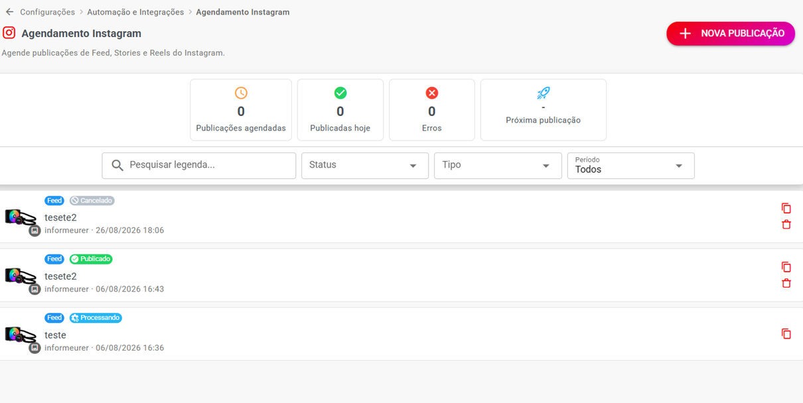

# Agendamento de Publicações no Instagram

A partir da **versão 3.0**, o Whazing permite programar publicações do Instagram para serem publicadas automaticamente.

O recurso permite agendar:

* 🖼️ **Feed**
* ⏳ **Stories**
* 🎬 **Reels**

> ⚠️ **Importante:** o Agendamento de Instagram está disponível **somente para canais Instagram conectados através do Hub NotificaMe**.

***

### 📍 Onde encontrar

Acesse:

**Automação e Integrações → Agendamento Instagram**

***

## 📅 Tela de Agendamento

Ao acessar a tela, você poderá visualizar as publicações que já foram agendadas e acompanhar o status delas.

A tela possui opções para facilitar a localização das publicações.

#### 🔎 Pesquisar legenda

Digite uma palavra ou trecho da legenda para encontrar uma publicação específica.

#### 📊 Status

Permite filtrar as publicações de acordo com seu estado.

Exemplos:

* **Processando**
* **Publicado**
* **Cancelado**

#### 📅 Período

Permite consultar publicações de acordo com o período desejado.

<figure><figcaption></figcaption></figure>

***

## 📋 Lista de publicações

A lista apresenta informações das publicações agendadas.

Por exemplo:

| Status      | Tipo | Informações                        |
| ----------- | ---- | ---------------------------------- |
| Cancelado   | Feed | publicação cancelada               |
| Publicado   | Feed | publicação já enviada ao Instagram |
| Processando | Feed | publicação sendo processada        |

Também são exibidos dados como:

* Nome da publicação;
* Conta do Instagram;
* Data e horário;
* Tipo da publicação;
* Status.

***

## ➕ Criar um novo agendamento

Para criar uma publicação programada, clique no botão para adicionar um novo agendamento.

Será aberta a tela de configuração.

***

## 📱 Selecionar Instagram

Primeiro, escolha qual conta do Instagram receberá a publicação.

#### Exemplo

**Instagram:**

`informeurer`

Caso sua empresa possua mais de uma conta Instagram conectada ao sistema, selecione a conta desejada.

***

## 📢 Tipo da publicação

Você poderá escolher entre três tipos de publicação:

### 🖼️ Feed

Publicação permanente no perfil do Instagram.

É indicada para fotos e conteúdos que você deseja manter disponíveis no perfil.

***

### ⏳ Stories

Conteúdo que desaparece após **24 horas**.

É indicado para publicações temporárias, avisos, promoções e conteúdos rápidos.

***

### 🎬 Reels

Vídeos em formato curto.

É indicado para conteúdos em vídeo preparados para o formato de Reels do Instagram.

***

## 📎 Enviar mídia

Depois de escolher o tipo de publicação, envie o arquivo que será publicado.

Você pode utilizar a área:

**Enviar mídia**

e:

* Arrastar o arquivo para a área indicada;
* Ou selecionar o arquivo pelo computador.

O arquivo será utilizado na publicação programada.

***

## ✍️ Legenda

No campo **Legenda**, escreva o texto que acompanhará a publicação.

Exemplo:

> Novidades chegando! 🚀 Confira nosso novo conteúdo.

A legenda é opcional quando permitido pelo tipo de publicação.

***

## 🕐 Agendamento

Na seção **Agendamento**, informe:

**Data / Hora**

Exemplo:

**12/08/2026 17:27**

A publicação será programada para esse momento.

#### ⚠️ Fuso horário

O horário utilizado no agendamento considera o **fuso horário configurado para a empresa**.

> 💡 Antes de agendar uma publicação importante, confira se o fuso horário da empresa está configurado corretamente.

***

## 📋 Resumo

Antes de finalizar, o sistema apresenta um resumo da publicação.

Por exemplo:

**Instagram**

informeurer

**Tipo**

Feed

**Arquivo**

brodski-kontejneri-dimenzije-prodaja-kontejneri-brodski-kontejner-20-prodaja.jpg

**Legenda**

Sem legenda

**Data / Hora**

12/08/2026 17:27

Esse resumo permite conferir os dados antes de confirmar o agendamento.

***

## ✅ Exemplo completo

Imagine que você queira publicar uma imagem amanhã às 18h.

#### 1. Acesse

**Automação e Integrações → Agendamento Instagram**

#### 2. Crie um novo agendamento

Clique em **Novo Publicação**.

#### 3. Escolha a conta

**Instagram:** informeurer

#### 4. Escolha o tipo

**Feed**

#### 5. Envie a imagem

Selecione a imagem que deseja publicar.

#### 6. Digite a legenda

Exemplo:

> Confira nossa novidade! 🚀

#### 7. Escolha a data e horário

**26/08/2026 — 18:00**

#### 8. Confira o resumo

Verifique:

* Instagram;
* Tipo;
* Arquivo;
* Legenda;
* Data;
* Horário.

#### 9. Confirme

A publicação ficará programada para ser processada no horário definido.

***

## 📊 Status das publicações

Depois de criar um agendamento, você poderá acompanhar o status na tela principal.

### 🟡 Processando

A publicação está sendo processada pelo sistema.

***

### 🟢 Publicado

A publicação foi enviada e publicada no Instagram.

***

### 🔴 Cancelado

O agendamento foi cancelado e a publicação não será realizada.

***

## 💡 Dicas para usar o Agendamento Instagram

#### 📅 Planeje suas publicações

Você pode deixar conteúdos preparados antecipadamente e programar os horários em que deseja que sejam publicados.

#### 📝 Prepare as legendas

Deixe as legendas prontas antes do horário da publicação.

#### 🖼️ Confira a mídia

Antes de confirmar, verifique se o arquivo correto foi selecionado.

#### 🕐 Confira o horário

Lembre-se de que o horário considera o **fuso horário configurado para a empresa**.

#### 📊 Acompanhe os status

Depois de agendar, consulte a tela de **Agendamento Instagram** para verificar se a publicação foi processada, publicada ou cancelada.

***

## ⚠️ Importante: Hub NotificaMe

O recurso de **Agendamento de Instagram** é disponibilizado para canais Instagram conectados através do:

**Hub NotificaMe**

Portanto, se a opção de agendamento não estiver disponível para determinada conta, verifique primeiro como o canal Instagram está conectado ao Whazing.

***

## 🚀 Resumo

A partir da **versão 3.0**, você pode programar publicações do Instagram diretamente pelo Whazing.

Acesse:

**Automação e Integrações → Agendamento Instagram**

Depois:

**Nova Publicação**

↓

Selecione o **Instagram**

↓

Escolha:

**Feed / Stories / Reels**

↓

Envie a mídia

↓

Adicione a legenda

↓

Escolha **data e horário**

↓

Confira o resumo

↓

**Confirme o agendamento**

O sistema ficará responsável por processar a publicação no horário configurado.

> 📌 **Disponibilidade:** esse recurso é exclusivo para canais Instagram conectados pelo **Hub NotificaMe**.
