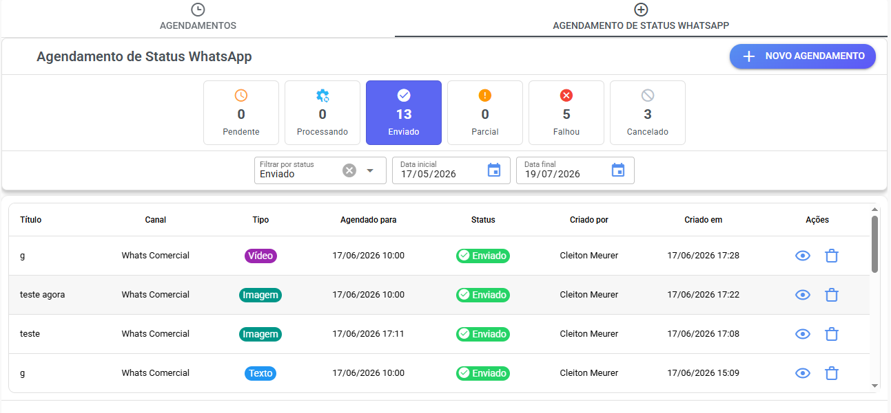
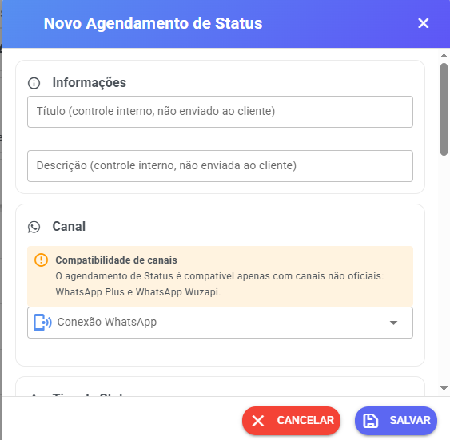
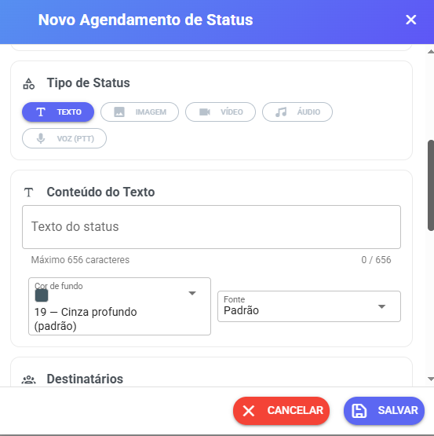
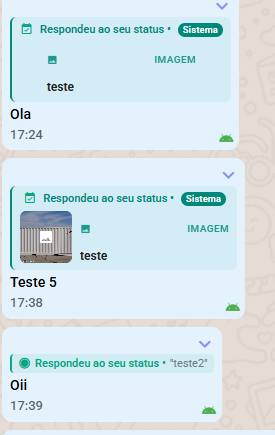
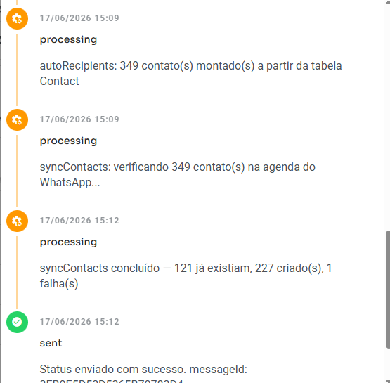

# Agendamento de Status (Stories) WhatsApp

Disponível para conexões compatíveis com:

* WhatsApp Plus (API Não Oficial)
* WhatsApp Wuzapi  (API Não Oficial)

O recurso permite agendar a publicação automática de Status (Stories) do WhatsApp para uma data e horário específicos.

***

## Visão Geral

<figure><figcaption></figcaption></figure>

O Agendamento de Status permite publicar conteúdos automaticamente no Status do WhatsApp sem necessidade de intervenção manual no momento da publicação.

Tipos suportados:

* Texto
* Imagem
* Vídeo
* Áudio
* Voz (PTT)

As respostas recebidas nos Status publicados são encaminhadas automaticamente para a tela de atendimento do Whazing.

***

## Permissões de Acesso

O módulo fica disponível no menu **Agendamentos**

Por padrão, apenas os perfis abaixo possuem acesso:

* Administrador
* Supervisor

***

## Informações

<figure><figcaption></figcaption></figure>

#### Título

Utilizado apenas para organização interna.

O título não é enviado para os destinatários e não aparece no WhatsApp.

#### Descrição

Campo opcional para observações internas.

Também não é enviado aos destinatários.

#### Canal

Selecione a conexão WhatsApp que será utilizada para publicar o Status.

***

## Tipo de Status

<figure><figcaption></figcaption></figure>

O formulário exibirá campos diferentes conforme o tipo selecionado.

#### Texto

Permite publicar um Status apenas com texto.

#### Imagem

Permite enviar uma imagem para o Status.

#### Vídeo

Permite publicar um vídeo.

#### Áudio

Permite publicar um arquivo de áudio.

#### Voz (PTT)

Permite publicar uma mensagem de voz semelhante às enviadas pelo WhatsApp.

***

## Destinatários

Esta é uma das configurações mais importantes do recurso.

O WhatsApp possui uma regra própria para exibição de Status:

> Um Status normalmente só será exibido para pessoas que fazem parte da agenda de contatos do aparelho conectado ao WhatsApp.

Importante:

* Não estamos falando dos contatos cadastrados no Whazing.
* Estamos falando da agenda de contatos do celular utilizado pela conexão WhatsApp.

***

### Preencher destinatários automaticamente

Quando ativado, o sistema irá preencher automaticamente a lista de destinatários utilizando os contatos disponíveis para a conexão selecionada.

Ideal para automatizar o processo sem precisar selecionar números manualmente.

***

### Criar contatos automaticamente na agenda

Quando esta opção estiver habilitada, o sistema irá:

1. Obter os contatos relacionados ao número selecionado.
2. Comparar com a agenda atual do WhatsApp.
3. Identificar números que ainda não existem na agenda.
4. Criar automaticamente os contatos faltantes.

Isso evita a necessidade de cadastrar novos contatos manualmente antes da publicação.

#### Quando utilizar?

Se seus destinatários mudam frequentemente e novos contatos são adicionados todos os dias.

#### Quando não utilizar?

Se você sempre publica para o mesmo grupo de contatos e sua agenda já está atualizada.

***

### Importante

Mesmo que um contato esteja na sua agenda, o WhatsApp pode exigir que a outra pessoa também tenha seu número salvo para visualizar seus Status, dependendo das configurações de privacidade utilizadas.

***

### Limite de Destinatários

Permite limitar a quantidade de contatos que receberão o Status.

O preenchimento é opcional.

#### Observação importante

O campo **Máximo de Destinatários (max\_recipients)** foi criado como uma mitigação operacional.

Já observamos situações em que o WhatsApp bloqueia imediatamente a publicação de Status quando a audiência é muito grande (por exemplo, aproximadamente 3.000 contatos).

A causa exata ainda não é totalmente conhecida.

**Recomendação:**

* Comece com limites menores.
* Monitore os resultados.
* Aumente gradualmente a quantidade de destinatários conforme os testes.

***

## Agendamento

Defina:

* Data da publicação
* Horário da publicação

No momento programado, o sistema realizará a publicação automaticamente.

Não é necessário manter nenhuma tela aberta.

***

## Respostas dos Status

<figure><figcaption></figcaption></figure>

Quando um contato responder a um Status publicado pelo sistema:

* Um atendimento será criado ou localizado.
* A mensagem aparecerá normalmente na tela de atendimento.
* O histórico identificará que a interação teve origem em uma resposta ao Status.

***

## Monitoramento e Logs

<figure><figcaption></figcaption></figure>

A tela de agendamentos permite acompanhar:

* Status agendados
* Status publicados
* Publicações com erro
* Logs de execução
* Logs de criação automática de contatos
* Logs de envio para destinatários

Isso facilita a auditoria e identificação de possíveis problemas.
