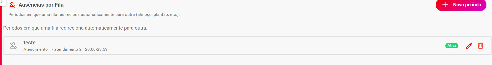
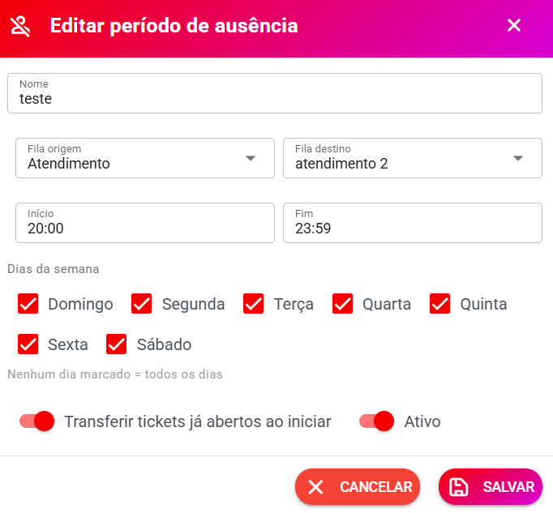
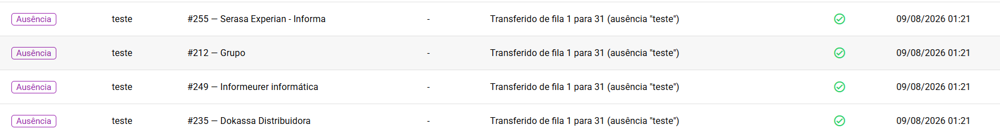

# 📅 Ausências por Fila

> **Disponível a partir da versão 3.0**

O recurso **Ausências por Fila** permite configurar períodos em que uma fila de atendimento fica temporariamente indisponível e os novos atendimentos são direcionados automaticamente para outra fila.

É útil para situações como:

* 🍽️ Horário de almoço
* 🌙 Plantão noturno
* 📅 Finais de semana
* 🎉 Feriados
* ⏰ Horários específicos
* 👥 Redirecionamento temporário para uma equipe de apoio

#### Exemplo simples

Imagine que você tenha:

**Fila Atendimento**

e:

**Fila Atendimento 2**

Durante o almoço, das **12:00 às 13:00**, você pode configurar:

> Atendimento → Atendimento 2

Assim, durante esse período, os atendimentos serão direcionados automaticamente para a fila de destino.

***

## 📍 Onde encontrar

No sistema, acesse:

**Configurações de Atendimento → Ausências por Fila**

Essa é a tela onde o administrador pode criar e gerenciar os períodos de ausência.

<figure><figcaption></figcaption></figure>

***

## 📋 Lista de ausências

A tela apresenta os períodos cadastrados.

Exemplo:

> **teste**\
> Atendimento → Atendimento 2 · 01:00–02:00

As informações ajudam a identificar rapidamente:

* Nome da ausência
* Fila de origem
* Fila de destino
* Horário configurado

***

## ➕ Como criar uma ausência

Clique em:

**Novo período de ausência**

Será aberto o formulário de cadastro.

***

## 📝 1. Nome

Informe um nome para identificar facilmente a configuração.

Exemplos:

```
Almoço
```

ou:

```
Plantão noturno
```

ou:

```
Finais de semana
```

#### 💡 Dica

Use nomes que expliquem claramente o motivo da ausência.

Por exemplo:

> **Almoço — Atendimento**

é mais fácil de entender do que:

> **Ausência 01**

***

## 🔵 2. Fila origem

A **Fila origem** é a fila que ficará temporariamente indisponível.

Exemplo:

```
Fila origem:
Atendimento
```

Durante o período configurado, essa fila terá o comportamento de ausência.

***

## 🟢 3. Fila destino

A **Fila destino** é a fila que receberá o atendimento durante o período de ausência.

Exemplo:

```
Fila origem:
Atendimento

Fila destino:
Atendimento 2
```

O fluxo será:

```
Cliente
   ↓
Atendimento
   ↓
Fila está em período de ausência
   ↓
Atendimento 2
```

<figure><figcaption></figcaption></figure>

***

## ⏰ 4. Início

Informe o horário em que a ausência começa.

Exemplo:

```
12:00
```

Nesse exemplo, o redirecionamento começa às 12h.

***

## ⏰ 5. Fim

Informe o horário em que a ausência termina.

Exemplo:

```
13:00
```

Assim, a ausência será aplicada entre:

**12:00 e 13:00**

***

## 📅 6. Dias da semana

Você pode escolher em quais dias a ausência será aplicada.

As opções são:

* Domingo
* Segunda
* Terça
* Quarta
* Quinta
* Sexta
* Sábado

#### Exemplo

Para configurar o almoço somente de segunda a sexta:

☐ Domingo\
☑ Segunda\
☑ Terça\
☑ Quarta\
☑ Quinta\
☑ Sexta\
☐ Sábado

***

## 💡 Nenhum dia marcado

Existe uma regra importante:

> **Nenhum dia marcado = todos os dias**

Ou seja, se você não selecionar nenhum dia da semana, a configuração será aplicada todos os dias.

#### Exemplo

Você configura:

**Início:** 12:00\
**Fim:** 13:00

e não marca nenhum dia.

Resultado:

> O redirecionamento acontecerá das 12h às 13h, todos os dias.

***

## 🔄 7. Transferir tickets já abertos ao iniciar

Essa opção determina o que acontece com os **tickets que já estavam abertos** quando o período de ausência começar.

Se ativada:

> **Transferir tickets já abertos ao iniciar**

os tickets que estiverem abertos na fila de origem poderão ser transferidos para a fila de destino quando o período de ausência começar.

#### Exemplo

Configuração:

```
12:00 → início da ausência
```

Às 11:59 existem tickets na fila:

**Atendimento**

Às 12:00 começa a ausência.

Com a opção ativada, os tickets já abertos poderão ser transferidos para:

**Atendimento 2**

***

## ⚠️ Qual a diferença entre ativar ou não?

#### Opção desativada

A ausência afeta o fluxo de novos atendimentos, mas os tickets que já estavam abertos não são transferidos automaticamente pelo início do período.

#### Opção ativada

Além do redirecionamento durante o período, os tickets já abertos são considerados para transferência quando a ausência começa.

> 💡 Essa opção é útil quando a equipe realmente precisa "esvaziar" uma fila durante o período de almoço ou plantão.

***

## ✅ 8. Ativo

Marque:

**Ativo**

para que a configuração possa ser executada automaticamente.

Se estiver desativado, o período permanece cadastrado, mas não deve executar o redirecionamento.

***

## 🧪 Exemplo completo — Horário de almoço

Imagine uma empresa com:

**Fila origem:** Atendimento

**Fila destino:** Atendimento 2

A equipe principal faz almoço das 12h às 13h.

Configure:

| Campo                         | Configuração         |
| ----------------------------- | -------------------- |
| Nome                          | Almoço               |
| Fila origem                   | Atendimento          |
| Fila destino                  | Atendimento 2        |
| Início                        | 12:00                |
| Fim                           | 13:00                |
| Dias                          | Segunda a sexta      |
| Transferir tickets já abertos | Conforme necessidade |
| Ativo                         | Sim                  |

Resultado:

```
08:00 ─────────────── 12:00
        Atendimento

12:00 ─────────────── 13:00
        Atendimento
             ↓
        Atendimento 2

13:00 ───────────────
        Atendimento
```

***

## 🌙 Exemplo — Plantão noturno

Você também pode utilizar para organizar um plantão.

Exemplo:

**Fila origem:**

Atendimento Comercial

**Fila destino:**

Plantão

**Horário:**

18:00 → 08:00

Nesse cenário, a fila comercial pode direcionar os atendimentos para a fila de plantão fora do horário normal.

> 💡 Para horários que atravessam a meia-noite, faça um teste em ambiente controlado para confirmar o comportamento esperado da configuração utilizada na sua versão.

***

## 📅 Exemplo — Finais de semana

Você pode configurar uma ausência somente para:

* Sábado
* Domingo

Exemplo:

```
Nome:
Final de semana

Fila origem:
Atendimento

Fila destino:
Plantão

Dias:
☐ Domingo
☐ Segunda
☐ Terça
☐ Quarta
☐ Quinta
☐ Sexta
☐ Sábado
```

Marque apenas os dias desejados.

***

## 🤖 O que acontece automaticamente?

Depois de configurada, a automação funciona sem que o operador precise fazer a transferência manualmente.

O fluxo básico é:

```
Sistema verifica o horário
        ↓
Verifica o dia da semana
        ↓
Encontra ausência ativa
        ↓
Fila está dentro do período?
        ↓
       SIM
        ↓
Redireciona para a fila destino
```

***

## 📊 Histórico das automações

O sistema também possui um histórico para acompanhar as execuções.

Acesse:

**Configurações de Atendimento → Histórico de Automações**

Essa tela permite consultar as execuções realizadas pelas automações.

<figure><figcaption></figcaption></figure>

***

## 🔎 Por que consultar o histórico?

O histórico é especialmente útil quando alguém pergunta:

> "Por que esse atendimento foi parar em outra fila?"

Você pode verificar se havia uma automação de ausência configurada para aquele horário.

Também é útil para identificar:

* Execuções automáticas
* Horários das execuções
* Filas envolvidas
* Possíveis problemas de configuração

***

## 🛠️ Exemplo prático

Imagine que um operador pergunte:

> "Por que os atendimentos foram para a fila Plantão às 18h?"

Você pode verificar:

**Configurações de Atendimento → Ausências por Fila**

e encontrar:

```
Plantão noturno

Atendimento → Plantão

18:00 → 08:00
```

Depois consulte:

**Configurações de Atendimento → Histórico de Automações**

para verificar a execução.

***

## ⚠️ Cuidados importantes

#### 1. Confira a fila de destino

Antes de ativar, certifique-se de que a fila destino é realmente a equipe que deverá receber os atendimentos.

#### 2. Confira os horários

Um horário errado pode fazer o redirecionamento acontecer em momentos inesperados.

#### 3. Confira os dias

Se nenhum dia estiver marcado, a regra será aplicada **todos os dias**.

#### 4. Cuidado com tickets já abertos

Se você ativar:

**Transferir tickets já abertos ao iniciar**

a mudança também poderá afetar atendimentos que já estavam na fila quando o período começou.

#### 5. Faça um teste

Antes de utilizar em produção, faça um teste com:

* Uma fila de teste
* Um período curto
* Um atendimento de teste

Depois confirme o resultado no **Histórico de Automações**.

***

## ❓ Perguntas frequentes

#### O que é Ausência por Fila?

É uma automação que permite redirecionar uma fila para outra durante determinados horários.

#### Posso usar para horário de almoço?

Sim. Esse é um dos principais exemplos de uso.

#### Posso usar para plantão?

Sim. Você pode direcionar os atendimentos para uma fila de plantão.

#### Posso escolher os dias?

Sim. É possível selecionar domingo a sábado.

#### Se eu não selecionar nenhum dia, o que acontece?

A regra será aplicada **todos os dias**.

#### Posso transferir tickets que já estavam abertos?

Sim. Utilize a opção:

**Transferir tickets já abertos ao iniciar**

#### Onde vejo o que foi executado?

Acesse:

**Configurações de Atendimento → Histórico de Automações**

#### Preciso fazer a transferência manualmente todos os dias?

Não. Depois de configurada e ativada, a automação executa o redirecionamento automaticamente.

***

## ✅ Checklist antes de ativar

Confira:

* [ ] Nome da ausência definido
* [ ] Fila de origem correta
* [ ] Fila de destino correta
* [ ] Horário inicial correto
* [ ] Horário final correto
* [ ] Dias da semana configurados
* [ ] Verificado se nenhum dia significa "todos os dias"
* [ ] Decidido se tickets já abertos serão transferidos
* [ ] Opção **Ativo** habilitada
* [ ] Feito um teste
* [ ] Conferido o **Histórico de Automações**

> 🎉 **Pronto!** Com as Ausências por Fila, sua equipe pode automatizar horários de almoço, plantões e outros períodos de indisponibilidade, mantendo os atendimentos direcionados para a equipe correta sem precisar fazer transferências manualmente.
