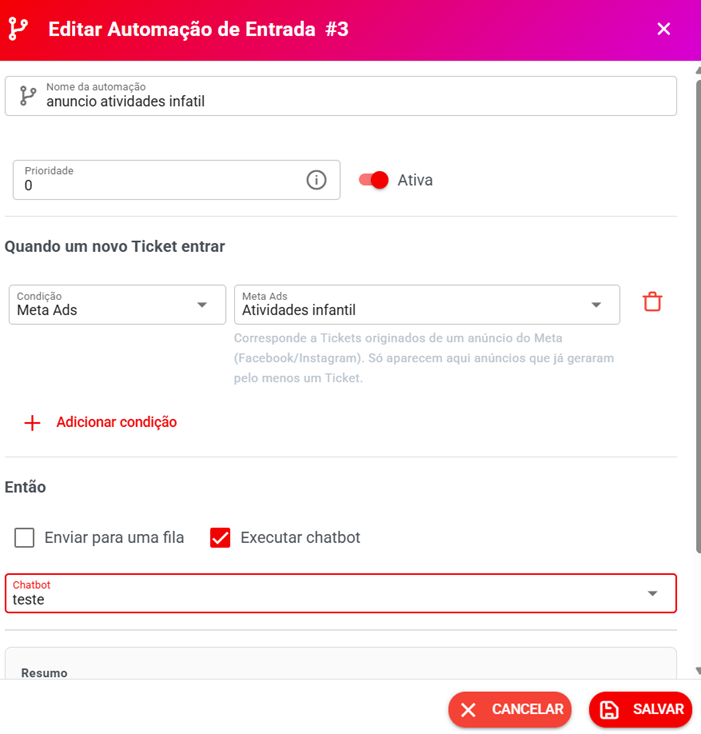

# Automação de Entrada

A partir da **versão 3.0**, o Whazing possui uma nova **Automação de Entrada**, criada para controlar automaticamente o que acontece quando um **novo Ticket entra no sistema**.

Com ela, você pode identificar a origem ou as características do novo Ticket e, de acordo com as condições configuradas:

* Enviar o Ticket para uma **fila**;
* Executar um **chatbot**;
* Combinar várias condições;
* Criar regras diferentes para diferentes tipos de contatos.

A nova Automação de Entrada substitui funcionalidades que anteriormente estavam separadas em módulos diferentes, tornando a configuração muito mais completa e flexível.

***

## 📍 Onde encontrar

Acesse:

**Automação e Integrações → Automação de Entrada**

***

## ➕ Criar uma nova automação

Clique em:

**Nova Automação**

Você verá a tela para configurar a regra.

Os principais campos são:

* **Nome da automação**
* **Prioridade**
* **Ativa**
* **Quando um novo Ticket entrar**
* Condições
* Ações

<figure><figcaption></figcaption></figure>

***

## ⚙️ Como funciona

A lógica da Automação de Entrada é simples:

**Quando um novo Ticket entrar**

↓

**Verificar as condições**

↓

**Se as condições forem atendidas**

↓

**Executar as ações configuradas**

Por exemplo:

> Quando entrar um novo Ticket vindo do Instagram e for um novo contato → enviar para a fila Comercial.

***

## 🔎 Condições disponíveis

A nova Automação de Entrada possui várias condições que podem ser utilizadas para identificar o Ticket.

Você pode utilizar **uma condição isolada ou combinar várias condições**.

Isso torna o comportamento dos novos Tickets muito mais personalizável.

***

### 🔑 Palavra-chave

A condição **Palavra-chave** verifica a **primeira mensagem enviada pelo cliente em um Ticket novo**.

Você pode cadastrar uma ou várias palavras-chave.

Para adicionar mais de uma:

1. Digite a palavra;
2. Pressione **Enter**;
3. Digite outra palavra;
4. Pressione **Enter** novamente.

#### ⚠️ Importante

A palavra-chave considera somente a **primeira mensagem do cliente em um Ticket novo**.

Ela não funciona como uma busca em todas as mensagens da conversa.

#### Exemplo

Você pode configurar:

**Palavras-chave:**

* preço
* orçamento
* comprar

Quando um novo Ticket começar com uma dessas palavras, a automação poderá ser executada.

***

## 🔗 Tracking Link

É possível utilizar um **Tracking Link** como condição.

Isso permite criar regras diferentes para contatos que chegaram através de links específicos.

#### Exemplo

Você possui um Tracking Link:

**Campanha Instagram**

Quando um novo Ticket entrar através desse link:

→ Enviar para a fila **Vendas**

Ou:

→ Executar o chatbot **Atendimento Instagram**

Isso permite conectar o rastreamento de campanhas diretamente com a automação de atendimento.

> Consulte também a documentação de **Tracking Links** para entender como criar e utilizar os links.

***

## 📢 Meta Ads

A condição **Meta Ads** permite identificar Tickets que tiveram origem em anúncios do **Facebook ou Instagram**.

Você pode utilizar:

**Qualquer anúncio**

ou selecionar um anúncio específico, quando disponível.

#### Importante

Só aparecem nessa condição os anúncios que **já geraram pelo menos um Ticket**.

#### Exemplo

Você criou um anúncio no Instagram para vender um produto.

Quando um cliente entrar em contato através desse anúncio:

→ Enviar para a fila **Vendas**

Isso permite criar uma automação específica para leads provenientes de anúncios.

***

## 🏷️ Etiqueta do contato

Permite verificar se o contato possui determinada **etiqueta**.

#### Exemplo

Contato possui a etiqueta:

**Cliente VIP**

Então:

→ Enviar o Ticket para a fila **Atendimento VIP**

Outro exemplo:

**Etiqueta: Lead**

→ Executar chatbot **Qualificação de Lead**

***

## 📋 Lane do Kanban

Permite utilizar a coluna/lane do **Kanban** como condição.

Isso possibilita criar automações baseadas na posição atual do contato no Kanban.

#### Exemplo

Se o contato estiver na lane:

**Proposta enviada**

Então:

→ Enviar para uma fila específica.

***

## 📊 Lane do Kanban Pro

Para quem utiliza o **Kanban Pro**, também é possível utilizar suas informações como condição.

Você poderá selecionar:

* **Board do Kanban Pro**
* **Coluna do Kanban Pro**

#### Exemplo

**Board:** Vendas

**Coluna:** Negociação

Então:

→ Executar chatbot específico.

Isso permite criar regras diferentes de acordo com o processo comercial da empresa.

***

## 📱 Canal

Permite criar uma automação específica para determinado canal.

Por exemplo:

* WhatsApp;
* Instagram;
* Facebook;
* E-mail;
* SMS;
* Outros canais disponíveis no sistema.

#### Exemplo

Se o novo Ticket entrar pelo:

**Instagram**

Então:

→ Executar chatbot **Recepção Instagram**

Ou:

**E-mail**

→ Enviar para fila **Suporte**

***

## 🆕 Novo contato

Essa condição permite identificar quando o Ticket pertence a um **contato que acabou de ser criado**.

Ou seja, é a primeira vez que aquele número ou perfil fala com a empresa.

#### Exemplo

Um telefone nunca havia entrado em contato com a empresa.

O cliente envia a primeira mensagem.

O contato é criado e um novo Ticket é aberto.

A condição **Novo contato** será atendida.

#### ⚠️ Importante

Um contato que já existe no sistema e posteriormente abre um novo Ticket **não será considerado um novo contato**.

Essa condição é útil para criar um tratamento especial para novos leads.

#### Exemplo

**Novo contato**

→ Executar chatbot de boas-vindas.

***

## 🔀 Combinar várias condições

Uma das principais vantagens da nova Automação de Entrada é poder **combinar várias condições**.

Você não precisa criar uma automação diferente para cada situação simples.

É possível criar regras mais específicas.

#### Exemplo

Você pode configurar:

**Novo contato**

*

**Tracking Link: Instagram**

*

**Canal: WhatsApp**

Então:

→ Fila **Vendas Instagram**

→ Chatbot **Qualificação Instagram**

Isso permite criar um comportamento muito mais preciso.

***

## 🎯 Ações

Depois de definir as condições, você determina o que o sistema deverá fazer.

Atualmente você pode configurar:

#### 📂 Enviar para uma fila

Escolha a fila que receberá o Ticket.

Exemplo:

**Fila: Vendas**

***

#### 🤖 Executar chatbot

Escolha o chatbot que deverá ser executado.

Exemplo:

**Chatbot: Qualificação de Leads**

***

## 🧩 É possível utilizar fila e chatbot juntos

Você pode configurar as duas ações na mesma automação.

Por exemplo:

**Então:**

→ Fila: **Vendas**

→ Chatbot: **Qualificação de Leads**

Dessa forma, o Ticket pode ser direcionado para a equipe correta e também iniciar automaticamente o chatbot configurado.

***

## 📋 Resumo da automação

Enquanto você configura a regra, o sistema apresenta um resumo.

Por exemplo:

**Quando um novo Ticket entrar**

**Se**

🔗 Tracking Link: —

📢 Meta Ads: Qualquer anúncio

🏷️ Etiqueta do contato: —

📋 Lane do Kanban: —

📊 Lane do Kanban Pro: — / —

📱 Canal: —

🆕 Novo contato

**Então**

→ Fila: —

→ Chatbot: —

Esse resumo facilita a conferência da regra antes de salvá-la.

***

## 🔢 Prioridade

As automações possuem o campo **Prioridade**.

Ele permite organizar a ordem de importância das regras quando existem várias automações de entrada configuradas.

> 💡 Quando você possui muitas automações, recomendamos utilizar prioridades organizadas e nomes claros para facilitar a manutenção.

#### Exemplo de nomes

* **01 — Novos Leads Instagram**
* **02 — Leads Meta Ads**
* **03 — Clientes VIP**
* **04 — Suporte**
* **05 — Novo contato**

***

## 💡 Exemplos práticos

### Exemplo 1 — Novo cliente recebe chatbot

**Condição:**

🆕 Novo contato

**Então:**

→ Chatbot: **Boas-vindas**

Resultado:

Todo cliente que falar com a empresa pela primeira vez poderá entrar automaticamente no chatbot de recepção.

***

### Exemplo 2 — Leads do Instagram vão para vendas

**Condição:**

🔗 Tracking Link: **Instagram**

**Então:**

→ Fila: **Vendas**

Resultado:

Os clientes que chegaram pelo link do Instagram são direcionados automaticamente para a equipe de vendas.

***

### Exemplo 3 — Anúncios vão para chatbot comercial

**Condição:**

📢 Meta Ads: **Qualquer anúncio**

**Então:**

→ Chatbot: **Qualificação de Leads**

Resultado:

Os contatos provenientes de anúncios do Facebook ou Instagram iniciam automaticamente o fluxo de qualificação.

***

### Exemplo 4 — Cliente VIP

**Condição:**

🏷️ Etiqueta: **VIP**

**Então:**

→ Fila: **Atendimento VIP**

Resultado:

Clientes identificados como VIP podem ser encaminhados para uma equipe específica.

***

### Exemplo 5 — Vendas pelo Kanban

**Condição:**

📋 Lane do Kanban: **Negociação**

**Então:**

→ Fila: **Comercial**

Resultado:

Tickets relacionados a contatos que estão na etapa de negociação podem ser encaminhados automaticamente para o comercial.

***

### Exemplo 6 — Combinação de condições

Uma regra mais avançada:

**Novo contato**

*

**Meta Ads**

*

**Canal: WhatsApp**

Então:

→ Fila: **Novos Leads**

→ Chatbot: **Qualificação**

Assim, somente novos contatos provenientes de anúncios e que chegaram pelo WhatsApp serão tratados dessa maneira.

***

## ⚠️ Substituição dos módulos antigos

A partir da **versão 3.0**, a nova **Automação de Entrada** substitui funcionalidades que anteriormente estavam separadas.

Os módulos relacionados a:

* **Chatbot por palavra-chave**
* **Bot por Kanban Lane**

foram **descontinuados**.

A nova Automação de Entrada reúne essas possibilidades em uma única ferramenta e adiciona novas condições, como:

* Tracking Link;
* Meta Ads;
* Etiqueta;
* Kanban;
* Kanban Pro;
* Canal;
* Novo contato;
* Palavra-chave.

#### ⚠️ Antes de atualizar

Se você utiliza os módulos antigos, recomendamos **salvar ou registrar suas configurações antes de atualizar para a versão 3.0**.

As regras antigas foram substituídas pela nova estrutura de Automação de Entrada.

***

## 🚀 Por que utilizar a nova Automação de Entrada?

A nova estrutura permite criar regras muito mais completas para controlar o início dos atendimentos.

Você pode identificar:

**De onde veio o cliente?**

→ Tracking Link / Meta Ads

**Quem é o cliente?**

→ Novo contato / Etiqueta

**Onde ele está no processo?**

→ Kanban / Kanban Pro

**Por qual canal entrou?**

→ Canal

**O que ele escreveu?**

→ Palavra-chave

E então decidir:

→ **Qual fila deve atender?**

→ **Qual chatbot deve executar?**

Isso transforma a entrada de novos Tickets em um processo automático e personalizado.

***

## 📌 Resumo

Acesse:

**Automação e Integrações → Automação de Entrada**

Configure:

**Quando um novo Ticket entrar**

↓

**Escolha uma ou várias condições**

↓

**Defina a ação**

↓

**Enviar para uma fila**

e/ou

**Executar chatbot**

↓

**Salve a automação**

> 💡 **Dica:** comece criando automações simples. Depois que entender o funcionamento, combine condições como **Novo contato + Tracking Link + Canal** para criar fluxos mais específicos.
