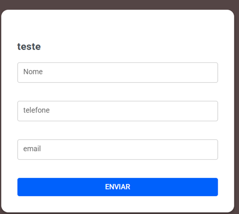

# Formulários

A partir da **versão 3.0**, o Whazing possui o recurso de **Formulários**, que permite criar formulários para **captura de leads**.

Você pode disponibilizar o formulário de duas maneiras:

* 🌐 Incorporado diretamente em um site;
* 🔗 Através de um link público.

Os dados enviados pelo visitante podem ser utilizados para capturar informações de potenciais clientes.

<figure><figcaption></figcaption></figure>

***

## 📍 Onde encontrar

Acesse:

**Campanhas → Formulários**

***

## ➕ Criar um formulário

Na tela de Formulários, clique em:

**Novo Formulário**

Você poderá configurar o formulário de acordo com as informações que deseja coletar.

***

## 🏷️ Nome do link

Defina um nome para identificar o formulário.

Exemplo:

**teste**

Esse nome também será utilizado para criar o endereço público do formulário.

Por exemplo:

`https://seusistema.com/#/f/teste`

> 💡 Recomendamos utilizar nomes simples e fáceis de identificar, como `contato`, `orcamento`, `campanha-agosto` ou `interesse-produto`.

***

## 🟢 Status

O formulário possui um status para controlar se ele está disponível.

#### Ativo

Quando estiver **Ativo**, o formulário poderá ser acessado e preenchido pelos visitantes.

Se estiver desativado, ele não deverá ser utilizado para novas captações.

***

## 🧩 Campos do formulário

Você pode adicionar diferentes tipos de campos.

Isso permite criar formulários simples ou mais completos.

***

### ✏️ Texto curto

Utilizado para informações pequenas.

Exemplos:

* Nome;
* Cidade;
* Empresa;
* Telefone;
* CPF;
* Código.

#### Exemplo

**Rótulo:**

Nome

**Obrigatório:**

Sim

O visitante verá:

> **Nome:** \[\_\_\_\_\_\_\_\_\_\_\_\_\_\_\_\_]

***

## 📧 E-mail

Utilizado para solicitar o endereço de e-mail do visitante.

#### Exemplo

**Rótulo:**

E-mail

**Obrigatório:**

Sim

O visitante verá:

> **E-mail:** \[\_\_\_\_\_\_\_\_\_\_\_\_\_\_\_\_]

***

## 📝 Texto longo

Utilizado quando o visitante precisa escrever uma mensagem maior.

É indicado para:

* Dúvidas;
* Solicitações;
* Observações;
* Descrição de interesse;
* Mensagens.

#### Exemplo

**Rótulo:**

Como podemos ajudar?

**Obrigatório:**

Sim

***

## 🔘 Múltipla escolha

Permite que o visitante escolha **uma opção** entre várias disponíveis.

No campo **Opções**, informe as opções separadas por vírgula.

#### Exemplo

**Rótulo:**

Qual produto você procura?

**Opções:**

WhatsApp, Instagram, Facebook, E-mail

O visitante poderá escolher uma das opções.

***

## ☑️ Caixas de seleção

Permite que o visitante selecione **uma ou várias opções**.

No campo **Opções**, informe as opções separadas por vírgula.

#### Exemplo

**Rótulo:**

Quais serviços interessam?

**Opções:**

WhatsApp, Instagram, Automação, IA

O visitante poderá selecionar mais de uma opção.

***

## ⚠️ Campo obrigatório

Cada campo pode ser configurado como:

**Obrigatório**

Quando ativado, o visitante precisará preencher ou selecionar aquele campo antes de enviar o formulário.

Utilize essa opção somente para informações realmente necessárias.

#### 💡 Exemplo

Um formulário de orçamento pode ter:

**Nome** → Obrigatório ✅

**E-mail** → Obrigatório ✅

**Mensagem** → Obrigatório ✅

**Empresa** → Opcional

***

## 🎨 Personalização

O formulário também permite personalizar sua aparência.

Você pode configurar:

#### Cor

Define a cor principal do formulário.

Exemplo:

`#5690F0`

#### Cor de fundo

Define a cor de fundo.

Exemplo:

`#FFFFFF`

#### Texto do botão

Define o texto apresentado no botão de envio.

Exemplo:

**Enviar**

#### Mensagem de sucesso

Define a mensagem apresentada depois que o formulário é enviado.

Exemplo:

> **Recebemos sua mensagem, obrigado!**

***

## 💾 Salvar o formulário

Depois de configurar os campos e a aparência, salve o formulário.

> 💡 **Importante:** o formulário precisa ser salvo primeiro para que algumas opções adicionais, como o envio de uma logo, fiquem disponíveis.

***

## 🖼️ Logo

Depois de salvar o formulário, você poderá enviar uma **logo** para personalizar sua apresentação.

Isso permite deixar o formulário com a identidade visual da sua empresa.

***

## 🔗 Vincular a um Tracking Link

Uma das funcionalidades mais importantes é a possibilidade de vincular o formulário a um **Tracking Link**.

Campo:

**Vincular a um Tracking Link (opcional)**

Quando o formulário estiver vinculado a um Tracking Link:

> **Cada envio do formulário será contabilizado como uma conversão desse link nos relatórios.**

Isso permite medir não somente quem clicou no link, mas também quem realmente preencheu e enviou o formulário.

***

## 📊 Exemplo de uso com Tracking Link

Imagine que você criou um Tracking Link para uma campanha no Instagram.

O link leva o visitante até uma página com seu formulário.

O visitante:

**Clica no link**

↓

**Preenche o formulário**

↓

**Envia os dados**

O envio será registrado como uma **conversão** do Tracking Link vinculado.

Isso permite avaliar o resultado da campanha.

***

## 🌐 URL pública

Depois de salvar o formulário, o sistema disponibiliza uma **URL pública**.

Exemplo:

`https://seusistema.com/#/f/teste`

Essa URL pode ser compartilhada diretamente.

Você pode enviar o endereço por:

* WhatsApp;
* Instagram;
* Facebook;
* E-mail;
* Sites;
* Redes sociais;
* Anúncios;
* QR Code;
* Outros canais.

#### 💡 Exemplo

Você pode criar um formulário chamado:

**Solicite um orçamento**

e compartilhar diretamente o link com seus clientes.

***

## 🌐 Incorporar o formulário no seu site

Além do link público, você pode **incorporar o formulário diretamente em um site**.

Para isso, utilize o código fornecido pelo sistema na seção:

**Script para incorporar no site**

O Whazing gera automaticamente o código necessário.

#### Exemplo

```html
<div id="wz-form-teste"></div>
<script src="https://seusistema.com/tracking-forms/public/widget.js" data-form-slug="teste"></script>
```

> ⚠️ **Importante:** utilize exatamente o código fornecido pelo seu Whazing. O endereço apresentado acima é apenas um exemplo.

***

## 🖥️ Como fica no site?

Depois de adicionar o código à página, o formulário será carregado automaticamente no local onde você colocou:

```html
<div id="wz-form-teste"></div>
```

Você não precisa criar manualmente os campos do formulário no seu site.

As configurações feitas no Whazing serão utilizadas pelo formulário incorporado.

***

## 📢 Exemplos de utilização

### 🎯 Captura de leads de anúncios

Você pode criar um formulário específico para uma campanha.

Exemplo:

**Campanha: Promoção de Agosto**

Campos:

* Nome;
* WhatsApp;
* E-mail;
* Produto de interesse.

Depois, divulgue o formulário nos anúncios.

***

### 🌐 Formulário no site

Adicione o formulário na página:

**Solicite um orçamento**

O visitante preenche os dados sem precisar entrar em contato pelo WhatsApp.

***

### 📱 Link enviado pelo WhatsApp

Você pode enviar a URL pública para um cliente.

Exemplo:

> "Para solicitar seu orçamento, preencha nosso formulário: \[link]"

***

### 📧 Campanha de e-mail

O link do formulário também pode ser incluído em uma campanha de e-mail.

***

### 📱 QR Code

A URL pública pode ser transformada em QR Code e utilizada em materiais físicos.

Exemplos:

* Cartazes;
* Panfletos;
* Banners;
* Cartões;
* Eventos;
* Adesivos.

***

## 📊 Formulário + Tracking Link

A combinação dos dois recursos permite criar um funil de marketing.

#### Exemplo

Você cria um Tracking Link:

**Instagram — Campanha Agosto**

↓

Visitante clica

↓

Acessa o formulário

↓

Preenche os dados

↓

Envia o formulário

↓

**Conversão registrada no Tracking Link**

Dessa forma, você consegue entender melhor o resultado da campanha.

***

## 💡 Dicas para criar um bom formulário

#### 1. Peça somente informações necessárias

Quanto mais campos forem obrigatórios, maior pode ser a dificuldade para o visitante concluir o formulário.

#### 2. Use títulos claros

Prefira:

**Nome**

em vez de:

**Informe aqui sua identificação pessoal**

#### 3. Use opções de múltipla escolha

Quando existem respostas previsíveis, utilize **Múltipla escolha** ou **Caixas de seleção**.

Isso facilita o preenchimento.

#### 4. Explique o objetivo

Use uma mensagem clara para o visitante saber o que acontecerá depois do envio.

#### 5. Personalize a aparência

Utilize as cores da sua empresa e, quando possível, adicione sua logo.

***

## 🚀 Resumo

Para criar um formulário:

**Campanhas → Formulários**

↓

**Novo Formulário**

↓

Defina o nome

↓

Adicione os campos

↓

Escolha quais são obrigatórios

↓

Personalize cores e mensagens

↓

Salve

↓

Configure a logo, se desejar

↓

Opcionalmente, vincule um **Tracking Link**

↓

Copie a **URL pública**

ou

↓

Utilize o **Script para incorporar no site**

***

## 🎯 Em resumo

Os **Formulários** permitem transformar visitantes em leads de forma simples.

Você pode:

* 📝 Criar formulários personalizados;
* 🌐 Incorporar em sites;
* 🔗 Compartilhar através de uma URL;
* 🎨 Personalizar cores;
* 🖼️ Adicionar logo;
* 📊 Integrar com Tracking Links;
* 🎯 Medir conversões de campanhas;
* 📱 Utilizar em campanhas e anúncios;
* 📧 Compartilhar por e-mail;
* 📱 Divulgar através do WhatsApp;
* 📲 Utilizar QR Codes.

> **Dica:** para campanhas de marketing, recomendamos combinar **Formulários + Tracking Links**. Assim você consegue descobrir não apenas quantas pessoas acessaram sua campanha, mas também quantas realmente preencheram o formulário e converteram em lead.
