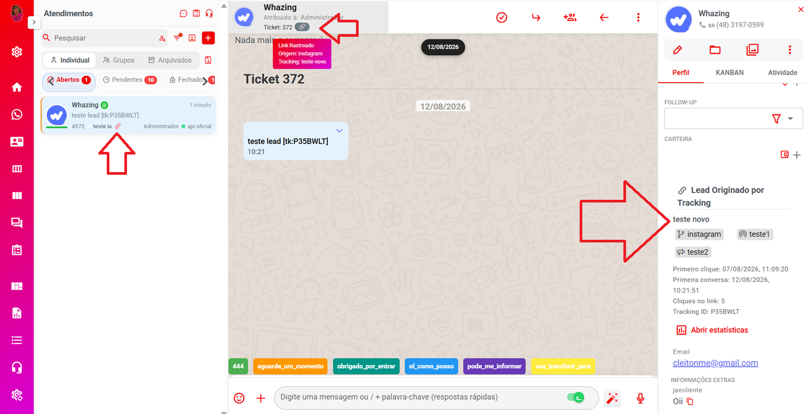
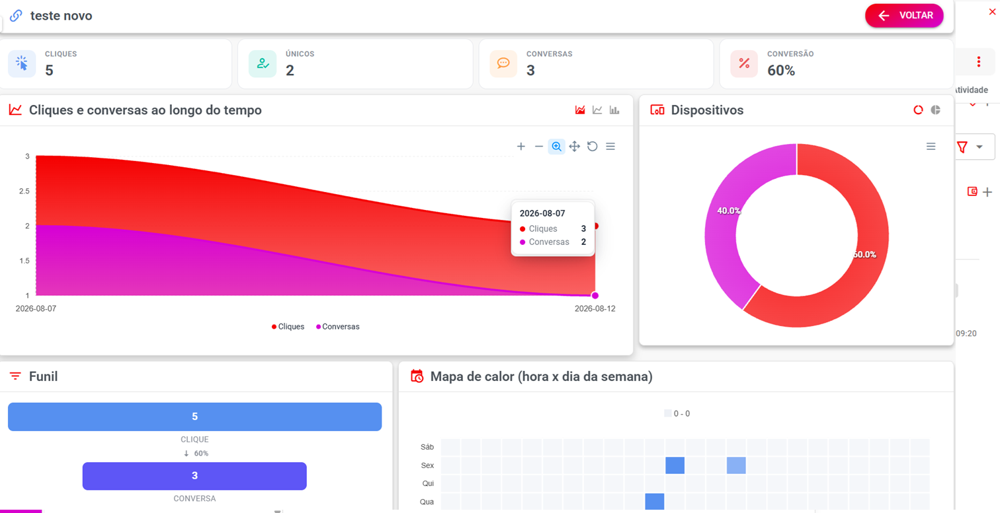
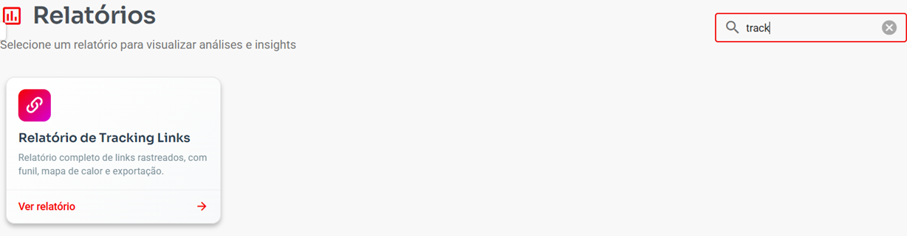

# Tracking Links

A partir da **versão 3.0**, o Whazing possui o recurso **Tracking Links**, que permite criar links especiais para descobrir **de onde vieram seus contatos** e acompanhar o que acontece depois que uma pessoa clica no link.

O recurso é especialmente útil para campanhas de marketing, anúncios, Instagram, Facebook, sites e outras fontes de divulgação.

***

### 📌 Onde encontrar

No menu do Whazing, acesse:

**Campanhas → Tracking Links**

***

## 🎯 Para que serve?

Imagine que você divulgue seu WhatsApp em vários lugares:

* Instagram;
* Facebook;
* Google;
* Site;
* Anúncios;
* E-mail;
* QR Code;
* Cartões ou materiais impressos.

Sem rastreamento, você pode saber que uma pessoa entrou em contato, mas não saber exatamente **qual divulgação trouxe aquele contato**.

Com o Tracking Link, cada divulgação pode ter seu próprio link.

#### Exemplo

Você pode criar:

**Instagram**

`https://seusistema.com/t/instagram`

**Facebook**

`https://seusistema.com/t/facebook`

**Campanha de anúncio**

`https://seusistema.com/t/promocao`

Quando alguém clicar, o Whazing registra a origem e permite acompanhar o resultado.

***

## 🔗 Como funciona

O funcionamento é simples:

**1. Criar o Tracking Link**

↓

**2. Divulgar o link**

↓

**3. Cliente clica**

↓

**4. Whazing registra o clique**

↓

**5. Cliente inicia uma conversa**

↓

**6. Whazing identifica a conversa**

↓

**7. Você acompanha a conversão nos relatórios**

Dessa forma, você consegue saber não apenas quantas pessoas clicaram, mas também quantas realmente iniciaram uma conversa e quantas chegaram ao atendimento.

***

## 📊 O que pode ser acompanhado?

O Tracking Links permite acompanhar um funil de conversão.

Por exemplo:

**4 Cliques**

↓ 50%

**2 Conversas**

↓ 100%

**2 Atendimentos**

↓ 100%

**2 Finalizados**

Isso permite entender o desempenho real de cada link.

***

## 📱 Rastreamento no WhatsApp

Quando o destino do Tracking Link é um **WhatsApp**, o Whazing adiciona um código especial à mensagem inicial para identificar a origem do lead.

Por exemplo:

`Quero comprar [tk:P35BWLT]`

Esse código permite que o sistema reconheça que aquela conversa veio de um Tracking Link específico.

#### ⚠️ Importante

O código de rastreamento faz parte da mensagem enviada pelo cliente.

Se o cliente **editar a mensagem antes de enviá-la**, o código poderá ser removido e o rastreamento poderá não ser registrado.

Por outro lado, se a mensagem for enviada normalmente contendo o código, o sistema conseguirá registrar a origem.

> **Importante:** o código `[tk:...]` é utilizado internamente pelo sistema para identificar o Tracking Link.

***

## 👤 Tracking dentro do Atendimento

Depois que o cliente inicia uma conversa através de um Tracking Link, as informações de origem ficam associadas ao atendimento.

Isso permite consultar a origem do contato diretamente no fluxo de atendimento e posteriormente utilizar essas informações nos relatórios.

<figure><figcaption></figcaption></figure>

***

## 📈 Relatório do Tracking Link

Cada Tracking Link possui informações detalhadas sobre seu desempenho.

Entre as informações disponíveis estão:

* Cliques;
* Visitantes únicos;
* Conversas;
* Atendimentos;
* Finalizações;
* Conversão;
* Origem;
* Dispositivo;
* Navegador;
* Sistema operacional;
* Cidade;
* País;
* Data e hora dos cliques.

***

## 📊 Cliques e conversas ao longo do tempo

O relatório apresenta a evolução dos cliques e conversas ao longo do período.

Isso permite identificar quais dias tiveram maior quantidade de acessos e conversões.

#### Exemplo de funil

**4 — Clique**\
50%

**2 — Conversa**\
100%

**2 — Atendimento**\
100%

**2 — Finalizado**

<figure><figcaption></figcaption></figure>

***

## 📱 Dispositivos

O relatório também permite identificar quais dispositivos estão sendo utilizados para acessar o link.

Exemplos:

* Desktop;
* Mobile.

Isso pode ajudar a entender o comportamento do público.

***

## 🗺️ Localização

Quando essas informações estão disponíveis, o Tracking Link também pode registrar:

* Cidade;
* País.

#### Exemplo

**Blumenau — BR**

Isso permite identificar de quais regiões estão vindo os acessos.

***

## 🕐 Mapa de calor

O sistema também disponibiliza um **Mapa de calor (hora x dia da semana)**.

Ele ajuda a identificar os períodos em que os Tracking Links recebem mais acessos.

Com essa informação, você pode descobrir, por exemplo, quais dias e horários apresentam maior movimentação.

***

## 📱 QR Code

Cada Tracking Link também pode disponibilizar um **QR Code**.

Isso é útil para materiais físicos, como:

* Cartazes;
* Panfletos;
* Cardápios;
* Adesivos;
* Cartões;
* Banners;
* Materiais de eventos.

A pessoa simplesmente aponta a câmera do celular para o QR Code e acessa o Tracking Link.

***

## 🕘 Cliques recentes

O sistema também apresenta os cliques realizados recentemente.

Exemplo:

| Data                | Dispositivo | Navegador | Sistema | Cidade   | País |
| ------------------- | ----------- | --------- | ------- | -------- | ---- |
| 12/08/2026 10:05:24 | Desktop     | Chrome    | Windows | Blumenau | BR   |
| 07/08/2026 14:09:53 | Mobile      | Chrome    | Android | —        | BR   |
| 07/08/2026 11:26:02 | Desktop     | Chrome    | Windows | —        | BR   |
| 07/08/2026 11:09:20 | Mobile      | Chrome    | Android | —        | BR   |

Essas informações ajudam a entender o perfil das pessoas que estão acessando o link.

***

## 📊 Relatório geral de Tracking Links

Além do relatório individual, existe um relatório geral para analisar vários Tracking Links.

Acesse:

**Relatórios → Tracking Links**

<figure><figcaption></figcaption></figure>

***

## 🔎 Filtros disponíveis

No relatório geral é possível utilizar diversos filtros para encontrar informações específicas.

Entre eles:

* Data inicial;
* Data final;
* Nome do link;
* Categoria;
* Origem;
* Canal;
* Campanha;
* Conteúdo;
* Tags;
* Status;
* Destino;
* Conversão;
* Responsável;
* Operador;
* Fila;
* Contato;
* Dispositivo;
* Navegador;
* Sistema operacional;
* Cidade;
* País.

Isso permite fazer análises mais detalhadas das campanhas.

***

## 📋 Lista de Tracking Links

O relatório também apresenta um resumo dos links cadastrados.

Exemplo:

| Nome       | Destino  | Status | Cliques | Únicos | Conversas | Conversão | Origem    | Último clique       |
| ---------- | -------- | ------ | ------: | -----: | --------: | --------: | --------- | ------------------- |
| teste novo | WhatsApp | Ativo  |       4 |      2 |         2 |       50% | instagram | 12/08/2026 10:05:24 |
| gfdg       | WhatsApp | Ativo  |       0 |      0 |         0 |        0% | —         | —                   |
| rr         | WhatsApp | Ativo  |       0 |      0 |         0 |        0% | —         | —                   |
| teste      | WhatsApp | Ativo  |       5 |      4 |         2 |       40% | face      | 22/07/2026 21:19:24 |

***

## 🤖 Usar Tracking Links com Automação

O Tracking Link também pode ser utilizado junto com a **Automação de Entrada**.

Isso permite criar regras diferentes dependendo da origem do lead.

Por exemplo:

> Uma pessoa acessou o link da campanha "Promoção Instagram".

Quando ela iniciar uma conversa, você pode configurar uma automação para:

* Enviar o contato para uma fila específica;
* Direcionar para um chatbot específico;
* Iniciar um fluxo de atendimento diferente;
* Aplicar regras específicas para aquele lead.

***

## 💡 Exemplo prático

Imagine uma empresa que possui três campanhas:

#### Instagram

Link:

`https://seusistema.com/t/instagram`

Destino:

**WhatsApp**

Origem:

**Instagram**

***

#### Facebook

Link:

`https://seusistema.com/t/facebook`

Destino:

**WhatsApp**

Origem:

**Facebook**

***

#### Promoção

Link:

`https://seusistema.com/t/promocao`

Destino:

**WhatsApp**

Campanha:

**Promoção de Agosto**

***

Agora você pode configurar uma Automação de Entrada para que:

**Link Instagram**

→ Fila **Vendas**

**Link Facebook**

→ Fila **Comercial**

**Link Promoção**

→ Chatbot **Promoção**

Assim, além de saber **de onde veio o cliente**, você pode definir automaticamente **como ele será atendido**.

***

## 📌 Exemplos de utilização

O Tracking Link pode ser utilizado em praticamente qualquer lugar onde você divulgue um link.

#### 📱 Redes sociais

Criar um link específico para Instagram e outro para Facebook.

#### 📢 Anúncios

Criar um link para cada campanha ou anúncio.

#### 🌐 Site

Criar links diferentes para páginas ou botões diferentes.

#### 📧 E-mail

Criar um link específico para uma campanha de e-mail.

#### 🖨️ Material impresso

Utilizar o QR Code em:

* Panfletos;
* Cartazes;
* Adesivos;
* Cartões;
* Banners.

#### 🛍️ Promoções

Criar um link exclusivo para cada promoção e acompanhar quantos clientes vieram daquela divulgação.

***

## 🎯 Por que utilizar Tracking Links?

Sem Tracking Links, você pode saber que recebeu **100 contatos**, mas pode não saber de onde eles vieram.

Com Tracking Links, você consegue descobrir:

**Qual campanha gerou mais cliques?**

**Qual campanha gerou mais conversas?**

**Qual campanha realmente gerou atendimentos?**

**Qual campanha teve melhor conversão?**

Isso ajuda a tomar decisões baseadas em dados e identificar quais canais de divulgação estão trazendo melhores resultados.

***

## 🚀 Resumo

O **Tracking Links** permite:

* 🔗 Criar links exclusivos;
* 📊 Rastrear cliques;
* 👤 Identificar visitantes únicos;
* 💬 Identificar conversas;
* 🎫 Acompanhar atendimentos;
* ✅ Acompanhar finalizações;
* 📈 Calcular conversão;
* 📱 Identificar dispositivos;
* 🌐 Identificar navegador e sistema operacional;
* 🗺️ Identificar cidade e país quando disponível;
* 🕐 Analisar horários e dias com maior movimentação;
* 📱 Gerar QR Code;
* 🤖 Integrar com Automação de Entrada;
* 👥 Direcionar leads para filas;
* 🤖 Direcionar leads para chatbots específicos.

> **Em resumo:** crie um link diferente para cada origem que deseja medir. Assim você consegue descobrir não apenas **quem clicou**, mas também **quantos desses cliques realmente se transformaram em conversas e atendimentos**.
