# CHATBOT 3.0 (ChatFlow)

O **ChatFlow** é o editor visual de chatbot do Whazing. Com ele você monta **fluxos de atendimento automático**: o bot envia mensagens, apresenta menus, coleta informações e encaminha o cliente para a fila, usuário ou outro fluxo — tudo sem precisar programar.

## 📚 Índice

1. [Como o ChatFlow funciona](./#como-o-chatflow-funciona)
2. [A interface do editor](./#a-interface-do-editor)
3. [Criando um fluxo — passo a passo](./#criando-um-fluxo--passo-a-passo)
4. [Tipos de blocos (interações)](./#tipos-de-blocos-interações)
5. [Ordem das Interações](./#ordem-das-interações)
6. [Configuração de Condições](./#configuração-de-condições)
7. [Conexões entre etapas](./#conexões-entre-etapas)
8. [Configurações do bot](./#configurações-do-bot)
9. [Variáveis](./#variáveis)
10. [Testando o fluxo (Simulador)](./#testando-o-fluxo-simulador)
11. [Automações (integrações)](./#automações-integrações)
12. [Atalhos de teclado](./#atalhos-de-teclado)
13. [Exportar fluxo](./#exportar-fluxo)
14. [Exemplos Práticos de Fluxos](./#exemplos-práticos-de-fluxos)

***

## 🧠 Como o ChatFlow funciona

* Um **fluxo** é um conjunto de **etapas** (nós) ligados por **conexões**.
* Toda conversa **começa na etapa "Boas-vindas!"** (chamada internamente de `nodeC`). É dela que partem o menu inicial e as primeiras mensagens.
* Cada **etapa** possui dois tipos de conteúdo:
  * **Interações (Conteúdo):** o que o bot **envia ou faz** ao chegar na etapa (mensagens, arquivos, botões, delay, etiqueta, requisição HTTP etc.).
  * **Condições:** as regras que definem **para onde ir** de acordo com a resposta do cliente.
* Existem **3 tipos de nó**:
  * **Início** (fixo) — ponto de partida do fluxo.
  * **Configurações** (fixo) — onde ficam as opções gerais do bot (mensagens padrão, tentativas, horário etc.).
  * **Etapas** — os nós que você cria para montar o atendimento.
* O bot **só avança de etapa quando o cliente envia uma mensagem** (exceto quando você usa o bloco **"Forçar executar condições"**, que permite avançar sem esperar resposta).

> 💡 **Etapa inicial (Início):** representa o primeiro contato do cliente.
> * Caso seja o primeiro contato, o sistema **salva automaticamente as informações do cliente** na agenda.
> * O bot **interage nos atendimentos iniciados pelos clientes**.
> * O bot **para de interagir** quando o atendimento é assumido por um usuário.

***

## 🖥️ A interface do editor

A configuração do fluxo é feita pela interface visual do novo editor:

<figure>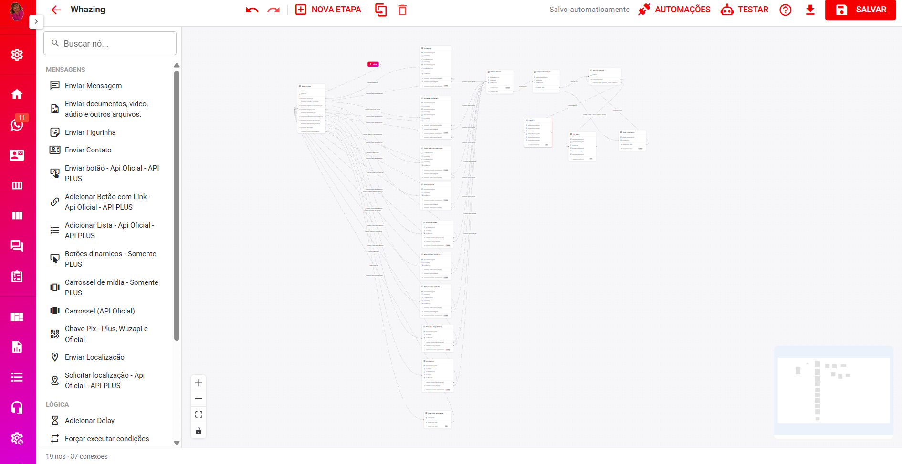<figcaption></figcaption></figure>

### Barra superior (Toolbar)

* **Voltar** — retorna para a listagem de chatbots.
* **Nome do fluxo** — identificação do fluxo atual.
* **Desfazer / Refazer** (`Ctrl+Z` / `Ctrl+Shift+Z`).
* **Nova Etapa** — cria uma etapa vazia no canvas.
* **Duplicar** (`Ctrl+D`) — duplica a(s) etapa(s) selecionada(s).
* **Excluir** (`Delete`) — exclui a(s) etapa(s) selecionada(s).
* **Indicador de salvamento** — o fluxo **salva automaticamente** ("Salvando..." / "Salvo automaticamente"). O botão **Salvar** também está disponível para salvar manualmente.
* **Automações** — abre o painel de automações (integrações vinculadas a filas). Veja [Automações](./#automações-integrações).
* **Testar** — abre o [Simulador](./#testando-o-fluxo-simulador) para validar o fluxo.
* **Ajuda** — lista os atalhos de teclado.
* **Exportar** — baixa o fluxo em formato JSON (compatível com a importação do sistema).

### Lateral esquerda (paleta de blocos)

Contém um campo de **busca** e os blocos organizados por categoria:

* **💬 Mensagens** — texto, arquivos, figurinhas, contato, botões, listas, carrosséis, PIX, localização.
* **🧮 Lógica** — delay e forçar execução de condições.
* **🎯 Atendimento** — tag, CRM/Kanban, Kanban Pro e follow-up.
* **🔌 Integrações** — HTTP Request.

Para usar: **clique** no bloco (cria uma nova etapa com ele) ou **arraste** para o canvas.
> 💡 **Arrastar um bloco por cima de uma etapa já existente** adiciona o conteúdo **dentro daquela etapa**, em vez de criar uma etapa nova.

### Área central (canvas)

* Grade de fundo, **minimapa** e controles de **zoom** (canto inferior direito).
* Os nós **encaixam na grade** (snap de 16px) para manter o alinhamento.
* **Shift + clique** seleciona múltiplos nós (para mover, duplicar ou excluir em grupo).
* Clicar numa área vazia desmarca a seleção.

### Lateral direita (painel da etapa)

Ao clicar numa etapa, o painel abre com abas:

* **Conteúdo** — lista as interações da etapa (com botões de **reordenar** ⬆⬇ e **excluir** 🗑), e o botão **"Adicionar conteúdo"** com todos os blocos disponíveis.
* **Condições** — lista as condições da etapa, com opções de **reordenar** e **excluir**, e botão para adicionar novas condições.
* **Notas** — campo de **anotação interna** da etapa (não afeta a execução do bot).

### Edição em janela grande

Clique em uma **interação específica** (no canvas ou na lista do painel) para abrir um **modal grande de edição** — mais confortável para preencher mensagens, botões, listas etc. O modal de uma interação também permite **removê-la** pelo ícone de lixeira.

### Barra de status

Na parte inferior do editor, mostra a **quantidade de etapas e de conexões** do fluxo.

***

## 🚀 Criando um fluxo — passo a passo

**1. Abra o Chatbot**

Acesse o menu do chatbot (ex.: **Configurações → Chatbot**) e **crie um novo fluxo** ou **edite um existente**.

**2. Monte a etapa de Boas-vindas**

Na etapa **"Boas-vindas!"** (já criada por padrão), abra a aba **Conteúdo** e adicione as primeiras interações — por exemplo, um **Enviar Mensagem** com o menu:

```
Olá! Seja bem-vindo(a) à nossa loja! 🛍️
1 - Ver tabela de preços
2 - Falar com um atendente
```

**3. Crie as condições para responder o cliente**

Ainda na etapa de Boas-vindas, abra a aba **Condições** e adicione regras, por exemplo:

* Se o cliente responder **"1"** → ir para a etapa **Tabela de Preços**.
* Se o cliente responder **"2"** → encaminhar para a **Fila de Atendimento**.
* **Qualquer resposta** (por último) → mostrar o menu novamente.

**4. Crie novas etapas**

Use o botão **Nova Etapa** na barra, ou arraste um bloco da paleta para o canvas. Cada nova etapa recebe automaticamente o conteúdo do bloco escolhido (ex.: arrastar "Enviar Mensagem" já cria uma etapa que envia mensagem).

**5. Conecte as etapas**

Arraste do **puxador (●)** que aparece na linha de cada condição até a etapa de destino. A conexão **Fila/Usuário/Fechar** não tem puxador — ela encerra o bot (veja [Conexões entre etapas](./#conexões-entre-etapas)).

**6. Configure o bot**

Clique no nó **Configurações** e ajuste: mensagem de resposta inválida, limite de tentativas, horário de atendimento, mensagem de saudação etc. (veja [Configurações do bot](./#configurações-do-bot)).

**7. Salve e teste**

O fluxo salva automaticamente. Use o botão **Testar** para simular a conversa antes de ativar para os clientes.

***

## 🧩 Tipos de blocos (interações)

> ⚠️ Alguns blocos funcionam apenas em canais específicos (API Oficial, API Plus etc.). As observações de compatibilidade de cada bloco estão indicadas abaixo.

### 💬 Mensagens

#### 📝 Enviar Mensagem

* Permite definir o texto a ser enviado ao cliente.
* Suporta **emoji** (seletor integrado) e **variáveis dinâmicas** `{{variavel}}` (botão `{}` para inserir — veja a seção [Variáveis](./#variáveis)).
* O texto aceita formatação simples: **negrito** (`*texto*`), _itálico_ (`_texto_`), ~~tachado~~ (`~texto~`) e quebras de linha.

#### 📎 Enviar Documentos, Vídeos, Áudios e Arquivos

* Envio de **qualquer tipo de arquivo** (imagens, vídeos, áudios, PDF, Word, Excel, ZIP, PowerPoint etc.).
* **Tamanho máximo: 50 MB** por arquivo.
* Permite adicionar uma **legenda (descrição)** opcional com emoji.
* Mostra prévia do arquivo selecionado (imagem, vídeo, áudio ou documento).

#### 😄 Enviar Figurinhas

* Converte automaticamente a **imagem enviada em figurinha**.
* Aceita JPG, PNG, WEBP e GIF.

#### 👤 Enviar Contato

* Envia um **cartão de contato** para o cliente.
* Campos: **Nome do contato** e **Número de telefone** (com DDI, ex.: `5511999999999`).

#### 🔘 Enviar Botões

* Envia uma mensagem com botões de **resposta rápida**.
* Campos: **cabeçalho opcional** (texto, imagem, vídeo ou documento — vídeo e documento somente na API Oficial) e **texto** da mensagem.
* Mínimo de **2** e máximo de **3 botões**.
* Compatível com **WhatsApp oficial**, **Facebook**, **Instagram** e **API Plus**.

<figure>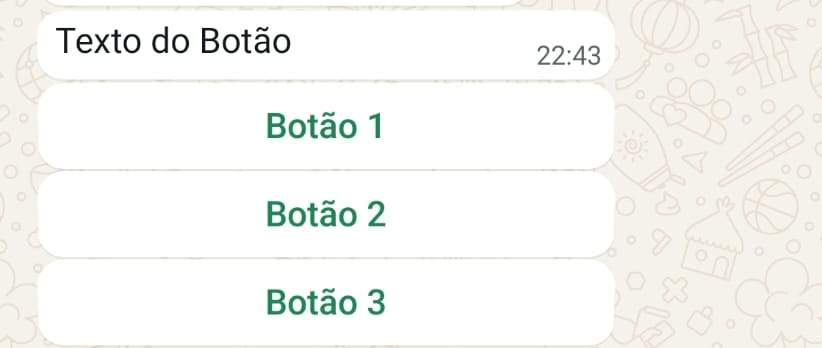<figcaption></figcaption></figure>

#### 🔗 Botão com Link

* Envia uma mensagem com um **botão que abre um link**.
* Campos: **cabeçalho** (texto ou mídia), **corpo** do texto, **rodapé**, **texto do botão** e **URL** de destino.
* Compatível com **API oficial** e **API Plus**.

<figure>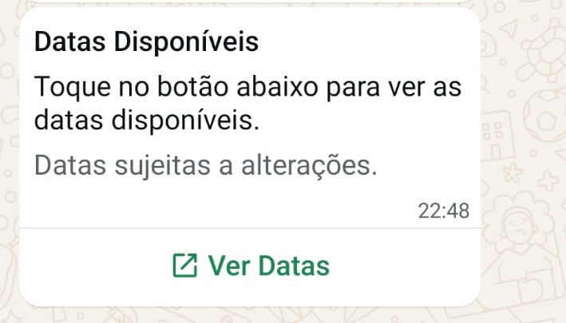<figcaption></figcaption></figure>

#### 🗂️ Adicionar Lista

* Envia uma mensagem com **lista de opções** (menus de seleção).
* Campos: **Título**, **Descrição**, **Seções** (cada seção com **linhas** de título + descrição) e **texto do botão** que abre a lista.
* Compatível com **API oficial** e **API Plus**.
* Funciona **parcialmente no Baileys/Wuzapi** (sem suporte oficial, pode parar a qualquer momento).

<figure>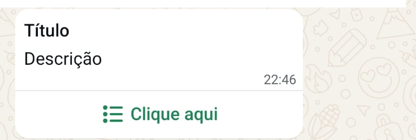<figcaption></figcaption></figure>

<figure>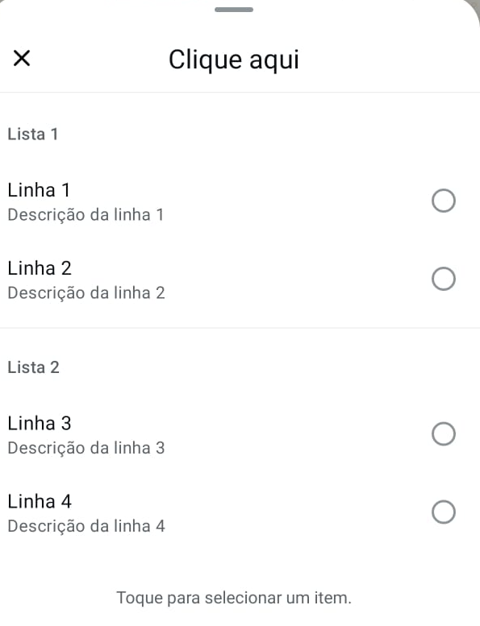<figcaption></figcaption></figure>

#### 🧩 Botão Dinâmico

* Exclusivo da **API Plus**.
* Permite **misturar tipos de botões** na mesma mensagem:
  * **Resposta** — envia o texto como resposta (dispara condição).
  * **Cópia** — copia um texto para a área de transferência.
  * **Chamada** — inicia uma ligação para um número.
  * **Link** — abre uma URL.
* Campos: **imagem de cabeçalho** (opcional), **mensagem principal**, **rodapé** e os botões.
* ⚠️ Alguns dispositivos podem exibir "mensagem não compatível".

<figure>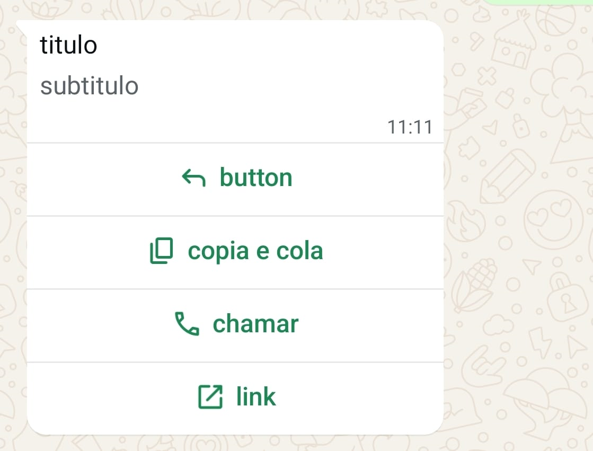<figcaption></figcaption></figure>

#### 🎠 Carrossel de Mídia

* Exclusivo da **API Plus**.
* Envia **várias imagens** com botões interativos abaixo de cada uma.
* Campos: **mensagem principal** e **itens** (imagem + texto + botões do tipo resposta/cópia/chamada/link).
* ⚠️ Alguns dispositivos podem exibir "mensagem não compatível".

<figure><figcaption></figcaption></figure>

<figure><figcaption></figcaption></figure>

#### 🎠 Carrossel (API Oficial)

* Exclusivo da **API Oficial (WABA)**.
* Envia um **carrossel de cards**, cada um com imagem e botões.
* Regras: **mínimo 2 e máximo 10 cards**; cada card exige **imagem** e **ao menos 1 botão**; todos os cards devem ter o **mesmo tipo e quantidade de botões**.
* Os botões podem ser **Resposta** ou **Link** (máx. 2 por card). A **estrutura dos botões é definida no Card 1** e replicada nos demais — nos outros cards você só preenche o texto (e a URL, quando for link).
* O editor mostra um selo **"Válido"** quando a configuração atende às regras da API oficial.

#### 💳 Chave Pix

* Envia um **botão de pagamento PIX** com a chave cadastrada.
* Campos: **tipo da chave** (CPF, CNPJ, Telefone, E-mail ou Chave Aleatória), **chave** e **nome do recebedor**.
* Opcional: ativar **"Adicionar informações de pagamento"** para enviar **valor, descrição, título, rodapé e nome do item**.
* Comportamento por canal:
  * **Wuzapi** — envia apenas a chave, o tipo e o nome do recebedor.
  * **Plus WhatsApp** — envia chave, tipo e nome, com valor, mensagem, título, rodapé e item (opcionais).
  * **API Oficial (WABA)** — exige **valor e mensagem**; o código PIX, reference ID, moeda e demais dados técnicos são gerados automaticamente (experiência "Revisar e pagar").
* Compatível com **Plus, Wuzapi e API Oficial**.

<figure>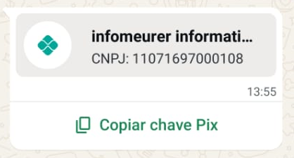<figcaption></figcaption></figure>

<figure>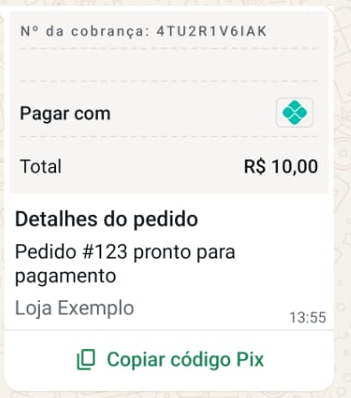<figcaption></figcaption></figure>

#### 📍 Enviar Localização

* Envia um **ponto de localização** para o contato.
* Campos: **latitude**, **longitude**, **nome do local** e **endereço**.
* Compatível com **WhatsApp oficial e não oficial**.

#### 📍 Solicitar Localização

* Envia um **botão pedindo a localização do cliente**.
* Útil para serviços de **entrega**.
* Compatível com **API oficial** e **API Plus**.

<figure>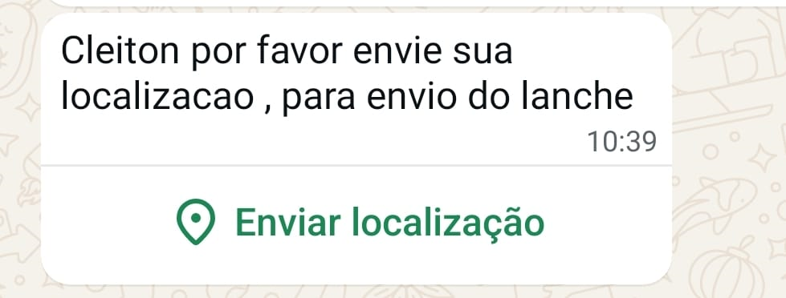<figcaption></figcaption></figure>

### 🧮 Lógica

#### ⏱️ Adicionar Delay

* Define o tempo (em **segundos**) de espera antes de continuar.
* Garante a **sequência correta de envio** entre mensagens de uma mesma etapa.

#### ⚡ Forçar Execução de Condições

* Faz o bot **avaliar as condições da etapa atual sem esperar uma nova mensagem** do cliente.
* O bloco usa a **última mensagem recebida** para avaliar as condições — se uma condição "casar", o fluxo avança na hora.
* Permite informar um **tempo opcional (segundos)** antes de avaliar.
* **Exemplo:** o bot envia as boas-vindas e já encaminha o cliente para uma fila, sem precisar que ele responda.
* **Exemplo avançado:** fazer um HTTP Request, salvar o resultado em uma variável e usar "Forçar executar condições" para comparar a variável e rotear o atendimento automaticamente.

### 🎯 Atendimento

#### 🏷️ Adicionar Tag

* Marca o contato com uma **etiqueta** específica (as etiquetas devem estar cadastradas no módulo de etiquetas do sistema).

#### 📂 Adicionar KANBAN (CRM)

* Move o contato para uma **coluna (lane) do Kanban/CRM compartilhado**.
* Também é possível escolher a opção **"Remover da Lane KANBAN"** para tirar o contato do CRM.

#### 🗂️ KanbanPro — Criar / Mover Card

* Cria ou move um **card no Kanban Pro** automaticamente conforme o contato avança no bot.
* Campos: **Quadro (Board)**, **Coluna (Etapa)**, **Ação** (o que fazer se já existir card), **Título do card** (aceita variáveis como `{{name}}`, `{{protocol}}`, `{{ticket_id}}`...), **Prioridade** (nenhuma/baixa/média/alta/urgente) e **Observação** (vai para o histórico do card).
* As 4 ações disponíveis:
  * **Criar ou Mover para a coluna** — cria se não existir; move se já existir (a mais usada).
  * **Criar ou Atualizar dados** — cria se não existir; atualiza dados sem mudar de coluna.
  * **Sempre criar novo card** — cria um novo card a cada passagem.
  * **Apenas mover** — move se já existir; não faz nada se não existir.
* Requer o módulo **Kanban Pro** configurado. Veja o guia completo: [KanbanPro no Fluxo do Bot](../../kanban-pro/kanbanpro-no-fluxo-do-bot.md).

#### 🔁 Alterar Follow-up

* Adiciona o cliente a um **follow-up (funil)** ou o **remove** (opção "Remover cliente Follow-up").
* Requer funis de follow-up cadastrados no sistema.

### 🔌 Integrações

#### 🌐 HTTP Request

* Realiza uma **requisição HTTP externa** e salva partes da resposta em **variáveis**.
* Campos de configuração:
  * **Método** — GET, POST, PUT, DELETE ou PATCH.
  * **URL** — endereço da API (aceita variáveis `{{variavel}}`).
  * **Query Params** — parâmetros adicionados à URL (chave/valor).
  * **Headers** — cabeçalhos da requisição (chave/valor, ex.: `Authorization`).
  * **Body** — corpo em JSON (para POST, PUT e PATCH).
  * **Timeout (ms)** — tempo limite da requisição (padrão 30000).
* **Variáveis:** mapeie campos da resposta para variáveis informando **nome da variável**, **caminho na resposta** (ex.: `data.items.0.id`, `status`) e **tipo** (string, number, boolean, object, array).
* O botão **"Testar API"** executa a requisição na hora, mostra o **status HTTP e o corpo da resposta**, e permite **marcar campos da resposta** para criar as variáveis automaticamente.
* **Como usar na prática:** faça o request, guarde o resultado em uma variável e use uma condição do tipo **"Variável igual a valor"** (ou "Forçar executar condições") para decidir o próximo passo.

> 💡 Em fluxos antigos também pode existir o bloco legado **"Mensagem com opções"** (MessageOptions). Ele **não é mais criado** no novo editor, mas continua **editável e funcional** em fluxos importados de versões anteriores.

***

## 🔄 Ordem das Interações

<figure>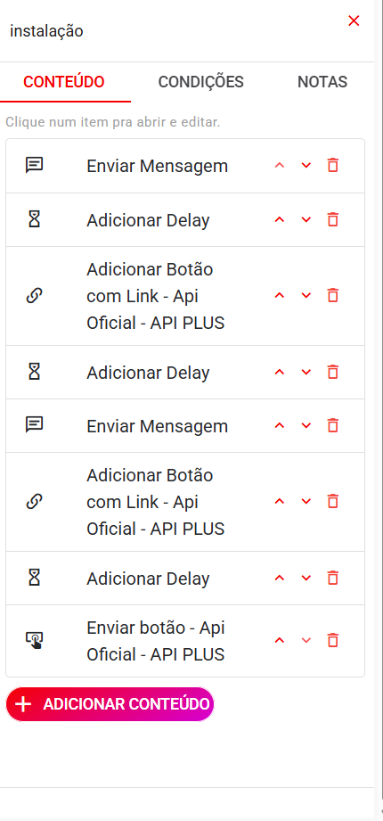<figcaption></figcaption></figure>

* As interações de uma etapa são executadas **na ordem em que aparecem** (de cima para baixo).
* Use o botão **⬆ ⬇** (na aba Conteúdo) para **reordenar** as interações.
* Quando há **várias mensagens seguidas**, use **Delays** entre elas para manter a ordem correta e o ritmo natural de conversa.
* Uma etapa nova **só executa após a resposta do cliente** — exceto quando o bloco **"Forçar executar condições"** é usado.

> ⚠️ **Importante:**
>
> * Os números indicam a **sequência exata de execução**.
> * Use **delays** entre mensagens múltiplas para manter a ordem correta.

***

## 🧩 Configuração de Condições

<figure>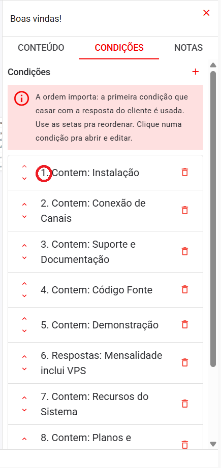<figcaption></figcaption></figure>

As **condições** definem o que o bot faz com a resposta do cliente. Ao receber uma mensagem, o bot **avalia as condições na ordem em que aparecem** e executa a **primeira que "casar"** — as condições seguintes são ignoradas.

> 💡 A ordem importa! Use as **setas ⬆⬇** (na aba Condições) para reordenar as regras. Coloque as regras mais específicas primeiro e a **"Qualquer resposta" sempre por último**.

### Campos comuns a toda condição

* **Se** — o tipo da condição (veja abaixo).
* **Respostas esperadas** — lista de textos que o bot compara com a resposta do cliente (para os tipos de resposta/contém).
* **Salvar resposta na variável (opcional)** — guarda o texto que o cliente respondeu em uma **variável**, para usar em mensagens (`{{variavel}}`) ou em outras condições (ex.: comparar a variável depois).

### Tipos de Condições

#### 🕓 Dentro / Fora do Horário de Atendimento

* Usa o horário de atendimento configurado no sistema (Configurações do Atendimento).
* Funciona apenas na etapa **"Boas-vindas!"** e deve estar **no início** das condições.
* **Dentro do horário** — casa quando o horário atual está dentro do expediente.
* **Fora do horário** — casa quando o horário atual está fora do expediente.
* Permite definir ações diferentes para dentro e fora do horário comercial.

#### ⏰ Dentro / Fora de Horário Personalizado

* Define horários próprios da condição, sem depender do horário do sistema.
* Campos: **dias da semana** (segunda a domingo), **início** e **fim** (formato `HH:MM`).
* Suporta intervalos que passam da meia-noite (ex.: início `22:00`, fim `06:00`).
* **Dentro** — casa quando o dia/hora atual está no intervalo configurado.
* **Fora** — casa quando o dia/hora atual está fora do intervalo.

#### ✅ Respostas

* Compara a resposta com uma lista de **textos exatos**.
* Exemplo: "1" ou "01". A resposta precisa ser **idêntica** ao configurado (diferenças de maiúsculas/minúsculas e espaços nas pontas são ignoradas).

#### 🔍 Contém Exato

* Casa quando a resposta **contém a palavra ou frase como termo inteiro**.
* Exemplo: a opção "quero comprar" é encontrada em "Eu **quero comprar** um tênis".

#### 🧠 Contém

* Casa quando a resposta **contém o texto em qualquer posição** (inclusive no meio de palavras).
* Exemplo: a opção "compra" é encontrada em "comprando" e em "comprador".

#### 🧮 Comparação de Variáveis

* Compara o **valor de uma variável** salva no atendimento (webhook ou "salvar resposta na variável").
* Tipos disponíveis:
  * **Variável existe** / **Variável não existe**.
  * **Variável igual a valor** / **diferente de valor**.
  * **Variável igual a variável** / **diferente de variável** (compara duas variáveis entre si).
  * **Variável contém valor** / **não contém valor**.
  * **Variável maior que valor** / **menor que valor** (comparação numérica).

#### ✳️ Qualquer Resposta

* Casa com **qualquer mensagem** do cliente.
* Deve ser posicionada **por último**, para não sobrepor as outras condições.

***

### Rotear para (o que acontece quando a condição é atendida)

Ao atender uma condição, o bot executa a ação escolhida em **"Rotear para"**. As condições seguintes são ignoradas.

| Ação | O que faz |
| --- | --- |
| **Etapa** | Avança para a **próxima etapa** selecionada (única ação com conexão visual no canvas). |
| **Fila** | Transfere o atendimento para a **fila** selecionada. A partir daí o ticket **sai do bot** e as condições/configurações do fluxo não têm mais efeito. Permite definir uma **mensagem de transferência**. |
| **Usuário** | Transfere para um **usuário** específico. O ticket sai do bot (se estiver sem fila, continua sem fila). Permite definir uma **mensagem de transferência**. |
| **Fila + Usuário** | Transfere para a **fila e o usuário** escolhidos ao mesmo tempo. Permite definir uma **mensagem de transferência**. |
| **Fechar Ticket** | **Finaliza automaticamente** o atendimento. Permite definir uma **mensagem de encerramento**. |
| **Fazer Nada** | Não faz nada. Ideal combinado com "Qualquer resposta" por último para o bot **não repetir** a mensagem de "não entendi" — mas lembre-se de deixá-la por último. |
| **Fluxo** | Transfere para **outro fluxo de chatbot** (ideal para dividir fluxos grandes e facilitar a manutenção). |

> 💡 **Mensagem de transferência:** além da mensagem informada na condição, o bot também envia a **"Mensagem de saudação (Fila/Usuário)"** configurada no nó Configurações sempre que transfere para fila ou usuário.

> 💡 **Automação na fila:** se a fila de destino tiver uma **automação vinculada** (veja [Automações](./#automações-integrações)), o badge da integração aparece ao lado da condição, e a automação é **executada automaticamente** quando o atendimento é transferido para essa fila.

***

### ⚠️ Respostas Inesperadas

Se **nenhuma condição for atendida**, o bot:

1. Envia a mensagem padrão de resposta inválida (configurável no nó **Configurações**):
   > "Desculpe! Não entendi sua resposta. Vamos tentar novamente! Escolha uma opção válida."
2. Se a opção **"Repetir etapa após resposta inválida"** estiver ativada (padrão), **reenvia as mensagens da etapa** para ajudar o cliente a escolher uma opção válida. Caso contrário, envia apenas a mensagem e aguarda uma nova resposta.

Para evitar que o bot fique repetindo mensagens, adicione uma condição **"Qualquer resposta"** por último com a ação **"Fazer Nada"**.

***

## 🔗 Conexões entre etapas

* **Criar conexão:** arraste do **puxador (●)** da linha da condição até a etapa de destino. Ao soltar, a condição passa a apontar para aquela etapa.
* **Conexão direta:** se você arrastar do puxador geral de uma etapa (quando não há condições roteáveis) para outra etapa, o sistema **cria automaticamente uma condição "Qualquer resposta"** apontando para o destino.
* **Etapa não pode se conectar a ela mesma.**
* O nó **Início** possui uma **conexão fixa** para a etapa de Boas-vindas (ela não pode ser alterada pelas condições).
* Ações **terminais** (Fila, Usuário, Fechar, Nada, Fluxo, Fila + Usuário) **não têm puxador** — na etapa aparece um **selo** com a ação (ex.: "Fila") indicando o fim do fluxo.
* Cada linha de conexão exibe um **rótulo** com o resumo da condição (ex.: "Respostas: 1, 2") para facilitar a leitura do fluxo.

***

## ⚙️ Configurações do bot

Ao clicar no nó **Configurações**, um **painel/modal** abre com as opções gerais do bot:

<figure><figcaption></figcaption></figure>

<figure>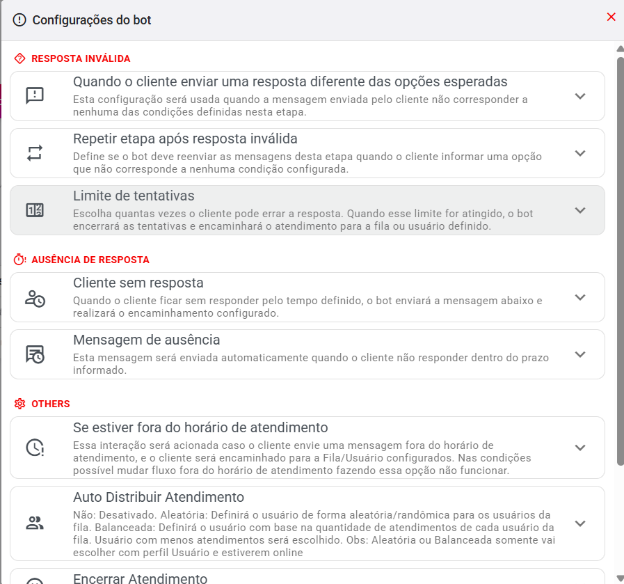<figcaption></figcaption></figure>

### 🔴 Resposta inválida

* **Mensagem de resposta inválida (opcional):** enviada quando o cliente responde algo que **não corresponde a nenhuma condição** da etapa atual. Se vazia, o bot usa a mensagem padrão do sistema.
* **Repetir etapa após resposta inválida (ativado por padrão):** depois de informar que a resposta é inválida, o bot **reenvia as mensagens da etapa** para o cliente escolher uma opção válida. Desativando, o bot envia apenas a mensagem de resposta inválida e aguarda.
* **Limite de tentativas:** quantas vezes o cliente pode **errar a resposta**. Quando o limite é atingido, o bot **encaminha o atendimento** para a **fila** ou **usuário** escolhido. Se nenhum destino for definido, o bot apenas para de tentar.

### ⏱️ Ausência de resposta

* **Cliente sem resposta:** define o que fazer quando o cliente **não responde dentro do tempo** configurado.
  * **Tempo de espera (minutos)** — use `0` para desativar.
  * **Ação** — encaminhar para **Fila**, para **Usuário**, ou **Fechar Ticket**.
* **Mensagem de ausência:** mensagem enviada automaticamente quando o prazo é atingido, antes do encaminhamento.

### ⚙️ Demais configurações

* **Se estiver fora do horário de atendimento:**
  * Ative **"Verificar horário de atendimento"** para o sistema interromper o bot fora do expediente e executar o comportamento abaixo.
  * **Ação** — encaminhar para **Fila**, para **Usuário**, ou **Sem Fila** (apenas interrompe o bot sem encaminhar).
  * ⚠️ Se o seu fluxo já usa as condições **"Dentro/Fora do Horário de Atendimento"**, essa configuração global **não é aplicada** (as condições têm prioridade).
* **Auto Distribuir Atendimento:**
  * **Não** — distribuição automática desativada.
  * **Aleatória** — escolhe um usuário da fila de forma randômica.
  * **Balanceada** — escolhe o usuário da fila **com menos atendimentos ativos**.
  * ⚠️ As opções Aleatória/Balanceada só consideram usuários com **perfil "Usuário"** e que estejam **online**.
* **Encerrar Atendimento:** lista de **palavras** que, se digitadas pelo cliente, **encerram o atendimento**. Acompanhada da **mensagem de despedida** enviada ao cliente.
* **Palavras-chave para reiniciar o atendimento:** lista de palavras (ex.: `#menu`) que fazem o bot **voltar para o início** (etapa Boas-vindas) a partir de qualquer etapa.
* **Mensagem de saudação (Fila/Usuário):** mensagem enviada automaticamente **sempre que o bot transfere** o atendimento para uma fila ou usuário.

***

## 🔤 Variáveis

As variáveis personalizam as mensagens com **dados do cliente, do atendimento, do usuário ou da data/hora**. Para usá-las, digite `{{nome}}` no texto ou clique no botão **`{}`** do editor de mensagens para inserir a variável.

### Variáveis fixas (já disponíveis no sistema)

| Variável | O que insere |
| --- | --- |
| `{{name}}` | Nome completo do contato |
| `{{firstName}}` | Primeiro nome do contato |
| `{{phoneNumber}}` | Telefone do contato |
| `{{email}}` | E-mail do contato |
| `{{protocol}}` | Número do protocolo do atendimento |
| `{{ticket_id}}` | ID do ticket |
| `{{fila}}` | Nome da fila do atendimento |
| `{{user}}` | Nome do usuário (atendente) |
| `{{userEmail}}` | E-mail do usuário |
| `{{date}}` | Data atual |
| `{{hour}}` | Hora atual |
| `{{greeting}}` | Saudação conforme o horário (Bom dia / Boa tarde / Boa noite) |
| `{{greetingEn}}` | Saudação em inglês |
| `{{greetingEs}}` | Saudação em espanhol |

### Variáveis dinâmicas (Informações Adicionais do Contato)

Se o contato tiver campos adicionais cadastrados (ex.: `CPF`, `plano`, `endereco`), eles podem ser usados como `{{CPF}}`, `{{plano}}`, `{{endereco}}`.

**Exemplo:**

```
Template:
Por favor, confirme se seu endereço é {{endereco}}?
1 - Sim
2 - Não

Mensagem enviada:
Por favor, confirme se seu endereço é Rua Marechal Deodoro, 11?
1 - Sim
2 - Não
```

### Variáveis salvas pelo bot

* **Resposta do cliente:** no campo **"Salvar resposta na variável (opcional)"** da condição, o texto digitado pelo cliente fica salvo e pode ser usado em mensagens e condições.
* **Respostas de HTTP Request:** os campos mapeados no bloco HTTP Request são salvos como variáveis (ex.: `{{status}}`, `{{data.cep}}`).

> 💡 Veja o guia completo em [Variáveis do Sistema](../../gestao/variaveis-sistema.md).

***

## 🧪 Testando o fluxo (Simulador)

O botão **"Testar"** (na barra superior) abre o **simulador do chatbot**, que executa o fluxo atual em tempo real, do lado direito da tela:

* Digite as respostas como se fosse o cliente e veja as **mensagens, botões, listas, delays e transferências** serem executadas.
* O simulador mostra **qual condição foi atendida** (`✓` com o tipo da condição) e **em qual variável a resposta foi salva** (`→ variavel`).
* **Configurações da simulação** (ícone de engrenagem):
  * **Contato simulado** — nome, telefone, e-mail e protocolo usados nas variáveis.
  * **Horário simulado** — hora e dia da semana (para testar condições de horário), além do interruptor **"Dentro do horário comercial"** (controla as condições Dentro/Fora do Horário).
  * **Modo de webhook** — **Chamada real** (executa a requisição de verdade), **Simular sucesso**, **Simular erro** ou **Pular**.
* **Painel de debug** (ativo no menu de configurações):
  * **Estado** — etapa atual, tentativas inválidas, nós visitados e status.
  * **Nós** — lista das etapas com opção de **pular para qualquer nó**.
  * **Variáveis** — variáveis salvas (com opção de remover/criar) e variáveis fixas do contato.
  * **Histórico** — log de eventos (navegação, condições, retries, transferências, erros).
* Use **Reiniciar** para voltar ao início da simulação.

***

## 🔌 Automações (integrações)

O botão **"Automações"** (na barra superior) abre o painel de **automações** — integrações que podem ser **vinculadas a filas** e executadas automaticamente quando o atendimento é transferido para elas.

**Como funciona:**

1. Você **cria uma automação** (ex.: Recepção Inteligente, N8N, Typebot, 2ª via Asaas, boleto/desbloqueio de provedores, GLPI etc.).
2. A automação fica **vinculada a uma fila** (na ativação da integração).
3. Quando o atendimento é **transferido para essa fila** (por uma condição do tipo **Fila** ou **Fila + Usuário**), a **automação é executada** automaticamente.

**No painel você pode:**

* **Criar** uma nova automação (escolha o tipo e siga o assistente).
* **Ativar** — vincular a automação a uma fila (criando a fila, se necessário).
* **Editar**, **duplicar** e **excluir** automações.
* Ver automações **"sem fila vinculada"** (que nunca serão executadas) e vinculá-las com "Ativar agora".

**No editor do fluxo:**

* No **seletor de fila** de uma condição, a fila que possui automação aparece com o **ícone/nome da integração**, e um aviso informa: _"🤖 {nome} será executado quando o atendimento chegar aqui"_.
* O botão **"+ Adicionar automação"** cria uma automação **sem sair do editor** — ao terminar a ativação, a **fila resultante é aplicada automaticamente** na condição.
* O botão "Automações" só aparece se o **plano da empresa** incluir o recurso de integrações.

> 💡 O rodízio de atendimentos depende de um chatbot configurado para encaminhar para uma fila com **Auto Distribuir Atendimento** ativo. Veja: [Rodízio Automático de Atendimentos](./rodizio-automatico-de-atendimentos.md).

***

## ⌨️ Atalhos de teclado

| Ação | Atalho |
| --- | --- |
| Desfazer | `Ctrl+Z` |
| Refazer | `Ctrl+Shift+Z` |
| Copiar seleção | `Ctrl+C` |
| Colar | `Ctrl+V` |
| Duplicar seleção | `Ctrl+D` |
| Excluir seleção | `Delete` |
| Salvar | `Ctrl+S` |
| Selecionar múltiplos nós | `Shift + clique` |
| Criar nó arrastando | Drag & Drop da paleta |

***

## 📥 Exportar fluxo

O botão de **exportar** (ícone de download na barra superior) baixa o fluxo atual em **JSON** no mesmo formato aceito pela **importação do sistema** — útil para salvar modelos, compartilhar fluxos ou restaurar em outra instalação.

***

## 🧠 Exemplos Práticos de Fluxos

### 1️⃣ Fluxo com Horário de Atendimento

Ideal para empresas com **plantão ou suporte emergencial**.

<figure><figcaption></figcaption></figure>

<figure><figcaption></figcaption></figure>

[Baixar exemplo](https://github.com/cleitonme/Whazing-SaaS/blob/main/docs/chatbotinterno/horario_de_atendimento.json)

***

### 2️⃣ Fluxo com Variáveis Dinâmicas

Permite personalizar mensagens com **dados do cliente**.

[Baixar exemplo](https://github.com/cleitonme/Whazing-SaaS/blob/main/docs/chatbotinterno/exemplo_fluxo_usando_novas_variaveis.json)

**Exemplo de uso:**

```
Template:
Por favor, confirme se seu endereço é {{endereco}}?
1 - Sim
2 - Não

Mensagem enviada:
Por favor, confirme se seu endereço é Rua Marechal Deodoro, 11?
1 - Sim
2 - Não
```

***

### 3️⃣ Fluxo de Agendamento com Cal.com

Integração com [https://cal.com/](https://cal.com/)

<figure><figcaption></figcaption></figure>

[Baixar exemplo](https://github.com/cleitonme/Whazing-SaaS/blob/main/docs/chatbotinterno/agendamentobarbearia.json)

<figure><figcaption></figcaption></figure>

[Baixar exemplo com botões](https://github.com/cleitonme/Whazing-SaaS/blob/main/docs/chatbotinterno/agendamentobarbeariabotao.json)

***

### 4️⃣ Fluxo sobre Whazing (lista, botão e links)

[Baixar exemplo](https://github.com/cleitonme/Whazing-SaaS/blob/main/docs/chatbotinterno/exemplo_whazing.json)

***

### 5️⃣ Fluxo com HTTP Request e Comparação de Variável

Exemplo que valida **CEP e cidade** via API.

[Baixar exemplo](https://github.com/cleitonme/Whazing-SaaS/blob/main/docs/chatbotinterno/exemplo_http_request.json)

***

### 6️⃣ Fluxo para Teste de API SaaS

Usa **HTTP Request** para gerar teste automático para o cliente.

[Baixar exemplo](https://github.com/cleitonme/Whazing-SaaS/blob/main/docs/chatbotinterno/exemplo_teste_whazing.json)

***

### 7️⃣ Fluxo de Boas-vindas Simples

Envia mensagem de boas-vindas e direciona o cliente para uma fila.

[Baixar exemplo](https://github.com/cleitonme/Whazing-SaaS/blob/main/docs/chatbotinterno/boas_vindas.json)

> Usa "Forçar executar condições" para simular uma resposta automática e avançar o fluxo.

***

### 8️⃣ Seleção de Fila por Palavra-chave

[Baixar exemplo](https://github.com/cleitonme/Whazing-SaaS/blob/main/docs/chatbotinterno/bot_por_palavra_chat.json)

Permite enviar o cliente para uma fila específica conforme a palavra digitada. Com a automação vinculada à fila, o sistema já ativa a integração automaticamente ao transferir.

***

### 9️⃣ Consulta de CPF via API

[Baixar exemplo](https://github.com/cleitonme/Whazing-SaaS/blob/main/docs/chatbotinterno/consulta_cpf.json)

Usa a API pública [cpfhub.io](https://www.cpfhub.io/).

> O token do exemplo é limitado; recomenda-se gerar um novo para testes.

***

### 🔟 Bot muda comportamento conforme horário

[Baixar exemplo](https://github.com/cleitonme/Whazing-SaaS/blob/main/docs/chatbotinterno/botporhorario.json)

Esse modelo apresenta diversos exemplos de como o bot interno pode ser utilizado. De acordo com o horário em que o cliente entra em contato, ele envia automaticamente uma mensagem informando o horário de atendimento. Se o cliente escolher a opção **"Retirar na loja"**, o bot envia a **localização da loja**. Além disso, o bot solicita o **CNPJ do cliente** e salva o valor em uma **variável** — caso essa informação já exista, o atendimento é encaminhado diretamente para a equipe.
