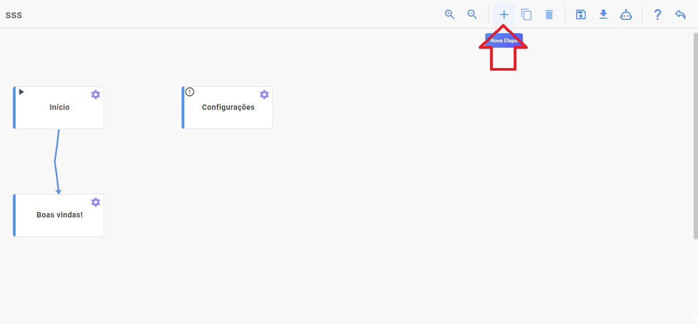
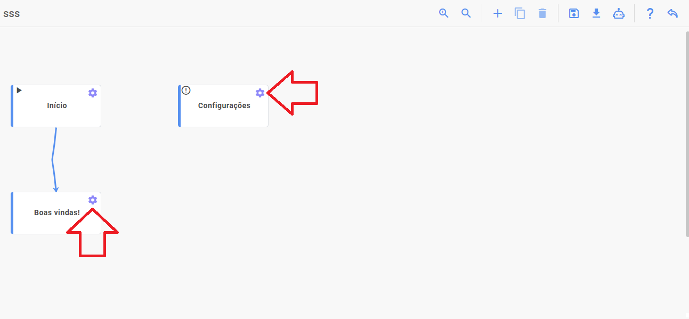
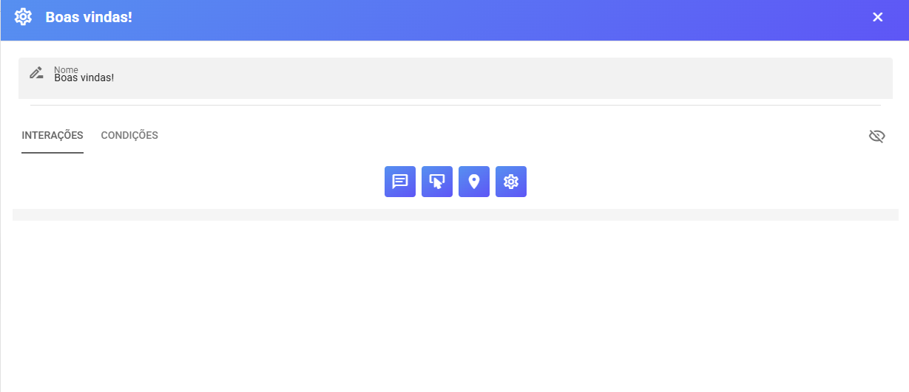
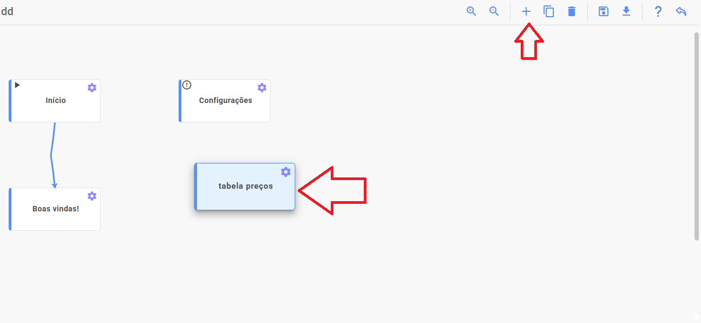
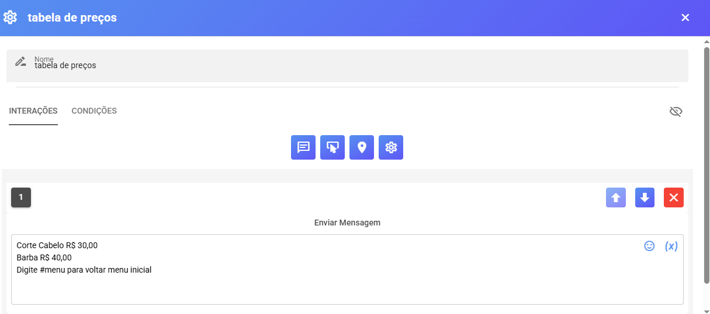
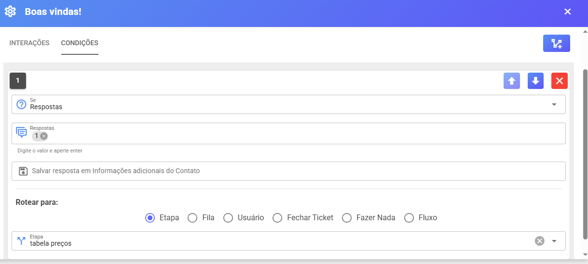
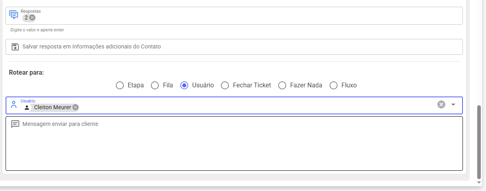
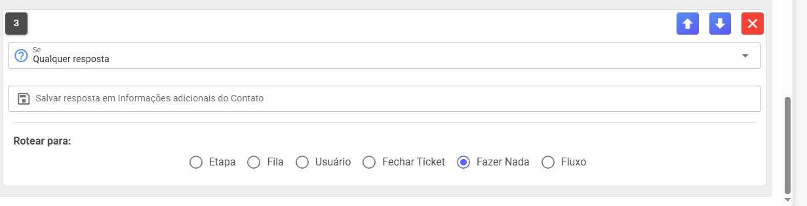
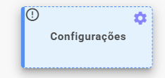
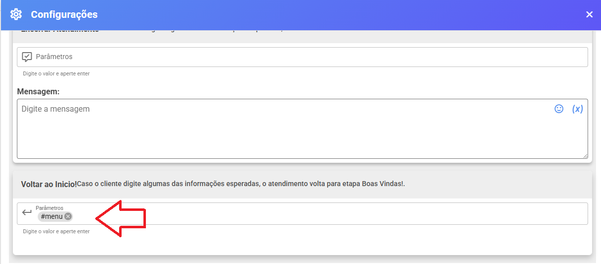

# Criando as Etapas de atendimento

#### Iremos Aprender a Criar as ETAPAS do Fluxo de atendimento nesse Tutorial 

<figure><figcaption></figcaption></figure>

#### Fluxo 

Para abrir configurações nas etapas ou configurações clique nas engrenagem

<figure><figcaption></figcaption></figure>

<figure><figcaption></figcaption></figure>

**Interações**

Onde você coloca o que bot irá enviar para cliente ou ação fazer.

Exemplo enviar mensagem, foto, menu pode criar varias interações a cada etapa

Algumas interações somente funciona API PLUS ou Api Oficial

**Condições**

Onde você escolhe ação bot vai realizar ao receber mensagem cliente.

Exemplo simples abaixo:

Você adiciona etapa tabela de preços

<figure><figcaption></figcaption></figure>

<figure><figcaption></figcaption></figure>

Nas interações etapa boas vindas você coloca um menu:

Olá Seja Bem Vindo Barbearia Whazing\
1 - Tabela Preços\
2 - Falar com atendente

Nas condições você cria condição se cliente escrever "1" ir para etapa tabela preços.

<figure><figcaption></figcaption></figure>

Assim cliente mandar mensagem ele recebe menu:

Olá Seja Bem Vindo Barbearia Whazing\
1 - Tabela Preços\
2 - Falar com atendente

Caso ele responder 1 vai para etapa tabela de preços onde bot vai enviar

Corte Cabelo R$ 30,00\
Barba R$ 40,00\
Digite #menu para voltar menu inicial

Acima exemplo simples de uso iremos disponibilizar alguns modelos prontos para serem importando para conhecer melhor.

Outros exemplos pode usar exemplo escolher opção 2 colocar encaminhar usuários especifico ou para fila que terá vários usuários podem fazer atendimento

<figure><figcaption></figcaption></figure>

Bot no exemplo acima espera resposta 1 ou 2 caso cliente escrever algo bot não espera

**⚠️ Respostas Inesperadas**

Se nenhuma condição for atendida, o bot enviará:

> “Desculpe! Não entendi sua resposta. Vamos tentar novamente! Escolha uma opção válida.”

_(Essa mensagem pode ser personalizada nas configurações.)_

Caso não queria bot responda isso pode usar condições qualquer resposta

<figure><figcaption></figcaption></figure>

Nesse caso qualquer resposta cliente o bot não faz nada.

As condições são executadas pela ordem que aparece canto esquerdo então se colocar qualquer resposta antes próximas não serão executadas

#### Configuração de Fluxo 

Para comando #menu funcionar devemos colocar nas configurações&#x20;

<figure><figcaption></figcaption></figure>

<figure><figcaption></figcaption></figure>

Assim qualquer etapa bot cliente digitar #menu automaticamente volta para etapa "boas vindas"

Sempre começa no boas vindas a execução do bot



