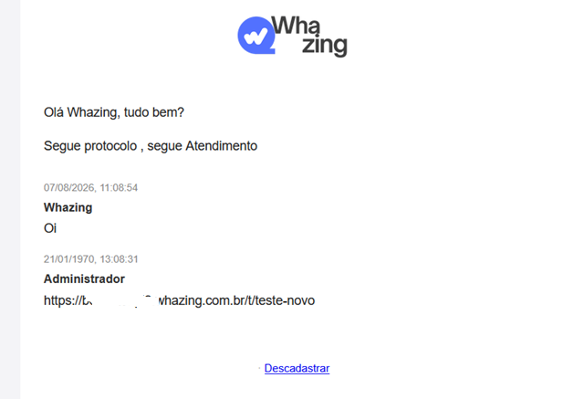

# Envio da Cópia do Atendimento por E-mail

## Envio da Cópia do Atendimento por E-mail

> **Disponível a partir da versão 3.0**
>
> O sistema permite enviar automaticamente uma **cópia da conversa por e-mail** para o cliente quando um atendimento for encerrado.
>
> Dessa forma, o cliente pode receber por e-mail o histórico do atendimento realizado, incluindo as informações configuradas pela empresa.

***

### 📌 O que é o Envio da Cópia do Atendimento?

Quando um atendimento é finalizado, o sistema pode enviar automaticamente uma cópia da conversa para o **e-mail cadastrado no contato**.

O envio é realizado utilizando um **canal de e-mail configurado no sistema**.

#### Exemplo

Um cliente entra em contato pelo WhatsApp e conversa com um atendente.

Depois que o atendimento é encerrado:

**Atendimento encerrado**\
⬇️\
**Sistema gera a cópia da conversa**\
⬇️\
**Sistema envia o e-mail para o cliente**\
⬇️\
**Cliente recebe o histórico do atendimento**

***

## 📍 Onde encontrar

No menu do sistema, acesse:

**Configurações de Atendimento → Envio da Cópia do Atendimento**

***

## 1. Selecionar o canal

Na tela de configuração, primeiro escolha para qual canal a funcionalidade será aplicada.

#### Canal

Selecione o canal desejado.

Exemplo:

> **Comercial (WhatsApp Plus)**

Isso significa que os atendimentos realizados por esse canal poderão utilizar o envio automático da cópia por e-mail.


***

## 2. Ativar o envio automático

Ative:

**Ativar envio automático**

A descrição da opção é:

> Enviar a conversa para o e-mail informado pelo cliente quando o atendimento for encerrado.

Depois de ativada, o sistema tentará enviar automaticamente a cópia da conversa quando o atendimento for finalizado.

#### ⚠️ Importante

O cliente precisa possuir um **endereço de e-mail informado no cadastro** para que o sistema possa realizar o envio.

***

## 3. Canal de E-mail

#### Canal de E-mail

Selecione qual canal de e-mail será utilizado para realizar o envio.

Esse canal precisa estar previamente configurado no sistema.

Por exemplo, você pode ter um canal utilizado para os e-mails da empresa:

> [atendimento@empresa.com.br](mailto:atendimento@empresa.com.br)

O sistema utilizará esse canal como remetente do e-mail.

***

## 4. Nome do remetente

#### Nome do remetente (opcional)

Define o nome que aparecerá para o cliente como remetente do e-mail.

Por exemplo:

> **Equipe de Atendimento**

ou:

> **Empresa Exemplo**

#### 💡 Dica

Recomendamos utilizar o nome comercial da empresa ou um nome que deixe claro que o e-mail foi enviado pelo atendimento.

***

## 5. Responder para / Reply-To

#### Responder para / Reply-To (opcional)

Permite definir para qual endereço as respostas do cliente deverão ser direcionadas.

Por exemplo:

O e-mail pode ser enviado pelo endereço:

> [atendimento@empresa.com.br](mailto:atendimento@empresa.com.br)

Mas você pode configurar o **Reply-To** para:

> [suporte@empresa.com.br](mailto:suporte@empresa.com.br)

Assim, quando o cliente clicar em **Responder**, a resposta será direcionada para o endereço configurado.

***

## 6. Idioma padrão do e-mail

Escolha o idioma utilizado no conteúdo padrão do e-mail.

Exemplo:

> **Português**

Esse idioma será utilizado para os textos automáticos do e-mail.

***

## 7. Informações que podem ser incluídas

O sistema permite escolher quais informações serão apresentadas na cópia do atendimento.

Você poderá ativar ou desativar:

* **Incluir data e hora**
* **Incluir nome do atendente**
* **Incluir departamento/fila**
* **Incluir protocolo**
* **Incluir arquivos enviados**

#### 📅 Incluir data e hora

Mostra a data e o horário das mensagens no histórico.

#### 👤 Incluir nome do atendente

Mostra qual atendente participou do atendimento.

#### 🏢 Incluir departamento/fila

Mostra o departamento ou fila relacionado ao atendimento.

#### 🔢 Incluir protocolo

Inclui o número de protocolo do atendimento.

Isso pode ser útil para localizar posteriormente o atendimento no sistema.

#### 📎 Incluir arquivos enviados

Permite incluir informações relacionadas aos arquivos enviados durante o atendimento, conforme a disponibilidade do conteúdo para envio.

***

## 8. Enviar apenas se existir troca de mensagens

#### Enviar apenas se existir troca de mensagens

Quando ativado, o sistema somente enviará a cópia caso tenha ocorrido uma **troca de mensagens no atendimento**.

Isso evita o envio de e-mails para atendimentos que foram encerrados sem nenhuma conversa relevante.

#### 💡 Recomendação

Para a maioria das empresas, recomendamos deixar essa opção ativada.

***

## 9. Enviar apenas uma vez

#### Enviar apenas uma vez

Essa opção evita que o sistema envie várias cópias do mesmo atendimento.

Quando ativada, a cópia será enviada somente uma vez para aquele atendimento, mesmo que ocorram ações posteriores relacionadas ao encerramento.

#### 💡 Recomendação

Normalmente é recomendado manter essa opção ativada para evitar que o cliente receba e-mails duplicados.

***

## 10. Assinatura da empresa

#### Incluir assinatura da empresa (opcional)

Permite adicionar uma assinatura ao final do e-mail.

Por exemplo:

> Atenciosamente,\
> **Equipe de Atendimento**\
> Empresa Exemplo

Essa opção ajuda a deixar o e-mail mais profissional e personalizado.

***

## 📧 Modelos de E-mail

A seção **Modelos de E-mail** permite personalizar o conteúdo que será enviado ao cliente.

Você poderá definir:

* Assunto
* Textos
* Conteúdo da conversa
* Variáveis
* Estrutura do e-mail

***

## 11. Assunto do e-mail

Defina o assunto que será exibido na caixa de entrada do cliente.

Exemplo:

> **Cópia do seu atendimento**

Você também pode utilizar variáveis para personalizar o assunto.

Por exemplo:

> Atendimento \{{ticket\_number\}} - \{{company\}}

***

## 🔤 12. Variáveis

As variáveis permitem inserir automaticamente informações do atendimento no e-mail.

As variáveis disponíveis são:

| Variável            | Informação            |
| ------------------- | --------------------- |
| `{{contact_name}}`  | Nome do cliente       |
| `{{ticket_number}}` | Número do atendimento |
| `{{company}}`       | Nome da empresa       |
| `{{agent}}`         | Nome do atendente     |
| `{{date}}`          | Data                  |
| `{{time}}`          | Horário               |
| `{{conversation}}`  | Conteúdo da conversa  |
| `{{protocol}}`      | Protocolo             |
| `{{queue}}`         | Fila                  |
| `{{department}}`    | Departamento          |

#### Exemplo

Você pode escrever:

`Olá {{contact_name}}`

E o sistema substituirá automaticamente pela informação do cliente.

Por exemplo:

> Olá João

***

## 13. Blocos do e-mail

O modelo permite montar o conteúdo utilizando **blocos de texto**.

Cada bloco pode conter um conteúdo diferente.

Por exemplo:

#### Bloco 1 — Saudação

```html
<p>Olá {{contact_name}}</p>
<p>Segue abaixo uma cópia do atendimento realizado.</p>
```

#### Bloco 2 — Conversa

```
{{conversation}}
```

#### Bloco 3 — Encerramento

```html
<p>Caso possua dúvidas, basta responder este e-mail.</p>
```

O sistema juntará os blocos para formar o e-mail final.

***

## 🧩 HTML no conteúdo

O campo **Conteúdo** permite utilizar HTML.

Isso possibilita criar e-mails mais organizados, utilizando elementos como:

* Parágrafos
* Negrito
* Quebras de linha
* Títulos
* Estruturas personalizadas

Por exemplo:

```html
<p>Olá <strong>{{contact_name}}</strong></p>

<p>Segue abaixo uma cópia do atendimento realizado.</p>

<p>{{conversation}}</p>

<p>Caso possua dúvidas, basta responder este e-mail.</p>
```

> 💡 **Para usuários leigos:** não é necessário saber HTML para utilizar o modelo padrão. Você pode manter o modelo fornecido pelo sistema e alterar apenas os textos.

***

## 👀 14. Pré-visualização

A área **Pré-visualização** permite verificar como o e-mail ficará antes de utilizá-lo.

É importante conferir:

* Assunto
* Nome do cliente
* Conversa
* Nome do atendente
* Protocolo
* Data e horário
* Assinatura
* Organização do conteúdo

***

## 🔄 Como funciona na prática?

Imagine o seguinte cenário:

#### 1️⃣ Cliente entra em contato

O cliente conversa com sua equipe pelo WhatsApp.

⬇️

#### 2️⃣ Atendente realiza o atendimento

O atendente responde às mensagens normalmente.

⬇️

#### 3️⃣ Atendimento é encerrado

O ticket é finalizado.

⬇️

#### 4️⃣ Sistema verifica as configurações

O sistema verifica se:

* O envio automático está ativado.
* Existe um canal de e-mail configurado.
* O cliente possui e-mail.
* Existe troca de mensagens, caso essa opção esteja ativada.
* A cópia ainda não foi enviada, caso "Enviar apenas uma vez" esteja ativado.

⬇️

#### 5️⃣ Sistema monta o e-mail

O sistema utiliza o modelo configurado e substitui as variáveis pelas informações reais.

⬇️

#### 6️⃣ Cliente recebe a cópia

O cliente recebe o e-mail com o histórico do atendimento.

***

## 📧 Exemplo do e-mail recebido

Um exemplo de e-mail pode ficar assim:

**Assunto:**

> Cópia do seu atendimento

**Conteúdo:**

> Olá João,
>
> Segue abaixo uma cópia do atendimento realizado.
>
> **Atendente:** Maria\
> **Protocolo:** 123456\
> **Data:** 12/08/2026
>
> **Conversa:**
>
> Cliente: Olá, gostaria de informações sobre o produto.
>
> Atendente: Claro! Vou te ajudar.
>
> Cliente: Obrigado.
>
> Caso possua dúvidas, basta responder este e-mail.
>
> Atenciosamente,\
> Equipe de Atendimento

<figure><figcaption></figcaption></figure>

***

## ⭐ Configuração recomendada

Para quem está começando, recomendamos uma configuração simples:

| Configuração          | Sugestão              |
| --------------------- | --------------------- |
| Envio automático      | ✅ Ativado             |
| Canal de E-mail       | Seu canal de e-mail   |
| Nome do remetente     | Nome da empresa       |
| Reply-To              | E-mail de atendimento |
| Idioma                | Português             |
| Data e hora           | ✅ Ativado             |
| Nome do atendente     | ✅ Ativado             |
| Departamento/fila     | Conforme necessidade  |
| Protocolo             | ✅ Ativado             |
| Arquivos enviados     | Conforme necessidade  |
| Somente com mensagens | ✅ Ativado             |
| Enviar apenas uma vez | ✅ Ativado             |
| Assinatura            | Recomendado           |

***

## ⚠️ Antes de ativar

Antes de utilizar o recurso em produção, confira:

* [ ] O canal de e-mail está configurado corretamente.
* [ ] O canal de e-mail consegue enviar mensagens.
* [ ] O cliente possui um e-mail cadastrado.
* [ ] O envio automático está ativado.
* [ ] O modelo do e-mail está correto.
* [ ] As variáveis estão escritas corretamente.
* [ ] A pré-visualização está adequada.
* [ ] Foi realizado um teste com um atendimento.

***

## ❓ Perguntas frequentes

#### O cliente precisa ter e-mail cadastrado?

Sim. O sistema precisa ter um endereço de e-mail para onde a cópia será enviada.

#### Posso escolher qual e-mail será utilizado para enviar?

Sim. Você deve selecionar um **Canal de E-mail** configurado no sistema.

#### Posso personalizar o assunto?

Sim. O assunto pode ser personalizado e pode utilizar variáveis.

#### Posso personalizar o conteúdo?

Sim. Você pode alterar os blocos de texto e utilizar variáveis.

#### Posso colocar o nome do cliente automaticamente?

Sim. Utilize:

`{{contact_name}}`

#### Posso colocar o número do protocolo?

Sim. Utilize:

`{{protocol}}`

#### Posso incluir toda a conversa?

Sim. Utilize:

`{{conversation}}`

#### O sistema pode enviar mais de uma cópia?

A opção **Enviar apenas uma vez** pode ser utilizada para evitar o envio duplicado da cópia do atendimento.

#### Posso incluir o nome do atendente?

Sim. Ative **Incluir nome do atendente** e utilize a variável:

`{{agent}}`
