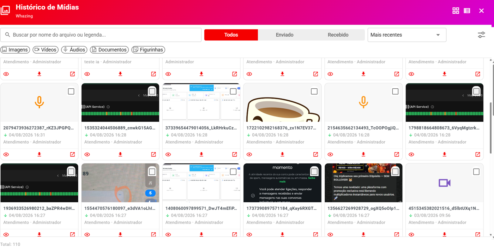

# Histórico de Mídias por Contato

> **Disponível a partir da versão 3.0**
>
> O **Histórico de Mídias** permite consultar os arquivos e mídias relacionados a um contato diretamente pelo sistema.
>
> O recurso facilita encontrar rapidamente imagens, vídeos, documentos, áudios e outros arquivos enviados ou recebidos durante os atendimentos.

***

### 📌 O que é o Histórico de Mídias?

<figure><figcaption></figcaption></figure>

Durante um atendimento, o cliente e os atendentes podem trocar diversos tipos de arquivos.

Por exemplo:

* 🖼️ Imagens
* 🎥 Vídeos
* 📄 Documentos
* 🎵 Áudios
* 📎 Outros arquivos enviados durante o atendimento

Com o **Histórico de Mídias**, você pode consultar essas mídias posteriormente sem precisar procurar manualmente em todas as mensagens do atendimento.

***

## 👥 Quem pode acessar?

O acesso ao histórico respeita o perfil e as filas que o usuário possui permissão para acessar.

#### 👑 Administrador

O perfil **Administrador** pode acessar o histórico de mídias de todos os contatos e atendimentos.

#### 👨‍💼 Supervisor

O perfil **Supervisor** também pode acessar o histórico conforme as permissões definidas para esse perfil, incluindo os atendimentos das filas às quais possui acesso.

#### 👤 Outros usuários

Usuários com outros perfis somente poderão visualizar mídias relacionadas às **filas que possuem acesso**.

> 🔐 **Importante:** o sistema respeita as permissões de acesso. Um usuário não deve conseguir visualizar mídias de atendimentos de filas às quais não possui permissão.

***

## 📍 Onde encontrar

O Histórico de Mídias pode ser acessado através da:

**Lista de Contatos**

Depois de localizar o contato desejado, abra o atendimento.

Na tela de atendimento, será disponibilizado um **drawer lateral no lado direito**.

Nesse painel você encontrará:

> **Histórico de Mídias**

***

## 🧭 Como acessar passo a passo

### 1️⃣ Abra a Lista de Contatos

Acesse a **Lista de Contatos** do sistema.

***

### 2️⃣ Escolha o contato

Localize o contato que deseja consultar.

Na coluna ações estara disponivel icone para acessar

***

### 3️⃣ Abra o Histórico de Mídias

Na tela de atendimento, o histórico estará disponível em um **painel lateral (drawer)**.

O painel será aberto no **lado direito da tela**.

Nesse painel aparecerá:

> **Histórico de Mídias**

***

## 🔎 Pesquisar mídias

O histórico possui um campo de pesquisa:

> **Buscar por nome do arquivo ou legenda...**

Você pode utilizar esse campo para encontrar uma mídia específica.

#### Exemplos

Se o nome do arquivo for:

> contrato-empresa.pdf

Você pode pesquisar:

> contrato

Ou, se uma imagem possuir uma legenda como:

> "Foto do produto azul"

Você pode pesquisar:

> produto azul

***

## 📅 Ordenação por data

O histórico possui a opção:

> **Mais recentes**

Essa opção permite organizar os resultados começando pelas mídias mais recentes.

Isso é útil quando o contato possui muitos arquivos.

***

## 🗓️ Filtrar por período

Também é possível pesquisar mídias utilizando um período específico.

Existem dois campos:

#### Data inicial

Informe a data de início.

Exemplo:

> 01/08/2026

#### Data final

Informe a data final.

Exemplo:

> 12/08/2026

Dessa forma, o sistema exibirá somente as mídias relacionadas ao período informado.

***

## 🏢 Filtrar por fila

O campo:

> **Fila**

permite limitar os resultados de acordo com a fila de atendimento.

Por exemplo:

* Comercial
* Suporte
* Financeiro
* Vendas

Isso é especialmente útil para empresas que possuem vários departamentos.

***

## 👤 Filtrar por responsável

O campo:

> **Responsável**

permite localizar mídias relacionadas ao atendente responsável pelo atendimento.

Por exemplo:

> Maria

O sistema poderá apresentar as mídias relacionadas aos atendimentos desse responsável, respeitando as permissões do usuário.

***

## 🔍 Como fazer uma pesquisa completa

Imagine que você queira encontrar um documento enviado por um cliente no mês de agosto.

Você pode utilizar:

**Nome ou legenda:**

> contrato

**Data inicial:**

> 01/08/2026

**Data final:**

> 12/08/2026

**Fila:**

> Comercial

**Responsável:**

> Maria

Depois, o sistema apresentará os resultados que correspondem aos filtros utilizados.

***

## 🔐 Permissões de acesso

O Histórico de Mídias segue as permissões de acesso do usuário.

#### Administrador

**Visualização:**

> Todos os contatos e atendimentos.

#### Supervisor

**Visualização:**

> Conforme as filas que possui acesso.

#### Outros perfis

**Visualização:**

> Somente mídias relacionadas às filas às quais o usuário possui acesso.

#### ⚠️ Importante

Os filtros disponíveis não devem ser utilizados para ultrapassar as permissões do usuário.

Por exemplo:

> Um usuário que não possui acesso à fila **Financeiro** não deverá conseguir visualizar mídias de atendimentos dessa fila apenas utilizando o filtro.

***

## 📂 O que posso encontrar no histórico?

O histórico pode apresentar as mídias relacionadas aos atendimentos do contato, como:

* 🖼️ Fotos
* 🎬 Vídeos
* 🎧 Áudios
* 📄 PDFs
* 📎 Documentos
* 📁 Outros arquivos enviados durante o atendimento

A disponibilidade e a visualização podem variar conforme o tipo de mídia e o conteúdo armazenado no sistema.

***

## 💡 Exemplo de uso

Imagine que um cliente enviou um contrato há vários dias.

Você precisa encontrar o arquivo novamente.

Em vez de procurar manualmente em toda a conversa:

**Lista de Contatos**

⬇️

**Abrir contato**

⬇️

**Abrir Histórico de Mídias**

⬇️

**Pesquisar "contrato"**

⬇️

**Encontrar o arquivo**

Isso torna a localização dos arquivos muito mais rápida.

***

## ⭐ Dicas para usuários

#### 🔎 Use palavras específicas

Em vez de pesquisar:

> documento

Experimente:

> contrato

ou:

> orçamento

Isso pode facilitar a localização.

#### 📅 Utilize filtros de data

Se você sabe aproximadamente quando o arquivo foi enviado, utilize **Data inicial** e **Data final**.

#### 🏢 Utilize a fila

Se a empresa possui muitos departamentos, selecionar a **Fila** pode reduzir bastante os resultados.

#### 👤 Utilize o responsável

Se você sabe qual atendente realizou o atendimento, utilize o filtro **Responsável**.

***

## ❓ Perguntas frequentes

#### O administrador consegue ver todos os arquivos?

Sim. O perfil Administrador possui acesso ao histórico de todos os contatos e atendimentos.

#### Um usuário comum consegue ver todas as mídias?

Não. O acesso respeita as filas às quais o usuário possui permissão.

#### Posso pesquisar pelo nome do arquivo?

Sim. Utilize o campo:

> **Buscar por nome do arquivo ou legenda...**

#### Posso pesquisar por período?

Sim. Utilize **Data inicial** e **Data final**.

#### Posso filtrar por fila?

Sim.

#### Posso filtrar por responsável?

Sim.

#### Posso ordenar pelas mídias mais recentes?

Sim. Utilize a opção **Mais recentes**.

#### Preciso procurar a mídia dentro da conversa?

Não. O Histórico de Mídias foi criado justamente para facilitar a localização dos arquivos relacionados ao contato.
