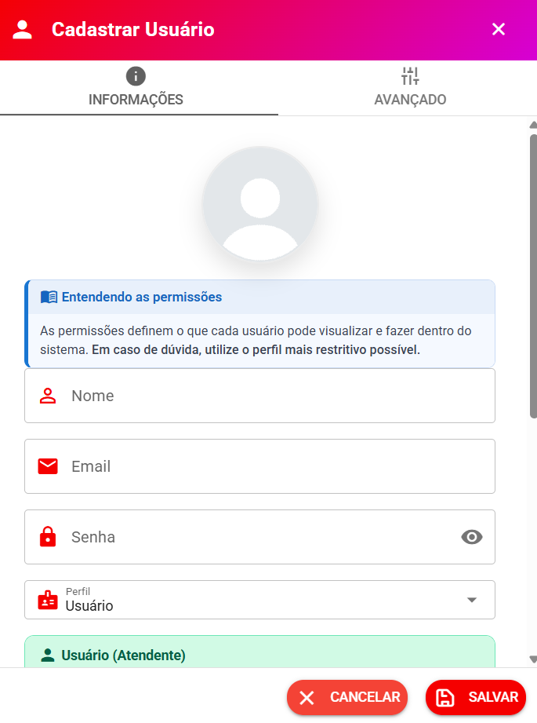

# Usuários

Nesta tela você cadastra as pessoas da sua equipe que vão usar o sistema (atendentes, supervisores e administradores) e define o que cada uma pode acessar.

> 🔒 **Quem pode acessar esta tela?** Apenas usuários com perfil **Administrador** ou **Supervisor Geral**.
>
> 📍 **Onde fica?** Em **Cadastros → Usuários**.

<figure><figcaption></figcaption></figure>

> 💡 **Antes de cadastrar usuários, crie as filas.** As filas definem quais conversas cada usuário pode ver. Veja [Organização de Atendimentos, Filas e Permissões de Usuários](../organizacao-de-atendimentos-filas-e-permissoes-de-usuarios.md).

***

## 📋 Visão geral da tela

No topo da tela você encontra:

* **Campo de busca (Localize)** — filtra a lista de usuários pelo nome ou e-mail enquanto você digita;
* **Botão Adicionar** — abre o cadastro de um novo usuário.

A lista de usuários mostra, para cada pessoa:

| Coluna            | O que mostra                                                      |
| ----------------- | ----------------------------------------------------------------- |
| **#**             | Status online: ponto **verde** (online) ou **vermelho** (offline) |
| **Foto**          | Foto de perfil do usuário                                         |
| **Nome / E-mail** | Dados de identificação                                            |
| **Perfil**        | Administrador, Supervisor Geral, Supervisor de Fila ou Usuário    |
| **Filas**         | Filas às quais o usuário está vinculado                           |
| **Canais**        | Canais que o usuário pode usar                                    |
| **Status**        | Situação da configuração do usuário                               |
| **Ações**         | Alertas, Central de Atendimento, editar e excluir                 |

***

### ✅ Status de configuração

O sistema analisa automaticamente se o usuário tem **filas** e **canais** vinculados e mostra o resultado na coluna **Status**:

* 🟢 **Configurado** — o usuário tem o que precisa para atender (ou é Administrador/Supervisor, que não dependem de filas);
* 🔴 **Atenção** — falta **fila** vinculada: o usuário não verá nem responderá atendimentos;
* 🟡 **Incompleto** — falta **canal**: o usuário não conseguirá iniciar conversas manualmente, mas ainda consegue atender pelas filas.

Na coluna **Filas** e **Canais**, quando o usuário não tem nada vinculado aparecem os avisos **Sem fila** e **Sem canal** — clique neles para ir direto à configuração.

Quando a configuração está incompleta, um **ícone de alerta** aparece na coluna Ações. Clique nele para ver o que falta e configurar com um clique.

***

### 🎧 Central de Atendimento

O botão com o ícone de **fone de ouvido** (🎧), na coluna Ações, abre a **Central de Atendimento**: o ponto único onde você gerencia todas as permissões do usuário. Ela também é aberta automaticamente **logo após cadastrar um novo usuário**.

Nela você encontra:

* **Filas de atendimento** — quais tickets o usuário vê e responde;
* **Canais de comunicação** — canais que o usuário pode usar para abrir ticket manualmente e agendar mensagens;
* **Horário de acesso** — dias e horários em que o usuário pode entrar no sistema;
* **Logs de acesso** — histórico de entradas do usuário;
* **Ligações WhatsApp (WaCalls)** — aparece apenas se existirem canais compatíveis no sistema;
* **Ligações Wavoip** — aparece apenas se existirem canais compatíveis no sistema.

Cada seção mostra um resumo do que já está configurado e um botão para **Configurar** ou **Visualizar**.

***

## ➕ Cadastrar usuário

Clique em **Adicionar** e preencha os campos da aba **Informações**:

* **Foto de perfil** — opcional. Clique na foto para escolher uma imagem (somente imagens). Depois é possível remover a foto.
* **Nome** — nome completo (mínimo 3 caracteres).
* **E-mail** — usado para o login. Deve ser um e-mail válido.
* **Senha** — obrigatória no cadastro. Deve ter **no mínimo 6 caracteres**, com **pelo menos uma letra maiúscula, uma letra minúscula e um número**.
* **Perfil** — Administrador, Supervisor Geral, Supervisor de Fila ou Usuário (veja [Perfis de usuário](./#perfis-de-usuario)).
* **Ignorar carteira — Listar todos contatos** — só aparece quando o perfil é **Usuário**. Quando ativado, o usuário visualiza **todos os contatos** mesmo com a carteira de clientes ativa. Normalmente usado para supervisores e gestores.
* **Bloquear Múltiplos Logins** — impede que o usuário acesse o sistema em mais de um dispositivo ao mesmo tempo. Veja [Bloquear Múltiplos Logins](bloquear-multiplos-logins.md).

> 💡 Ao escolher o perfil, o sistema mostra um cartão explicando o que aquele perfil pode fazer — leia antes de salvar.

### ⚙️ Aba Avançado

A aba **Avançado** do cadastro possui duas configurações opcionais:

* **Telefonia SIP** — configuração de ramal telefônico via SIP (Asterisk, FreeSWITCH, PBX etc.). É **independente** das ligações pelo WhatsApp: preencha apenas se a empresa usa um provedor SIP para fazer e receber chamadas telefônicas. Campos: **Habilitar SIP**, **Servidor SIP**, **Porta WSS**, **Usuário SIP** e **Senha SIP**.
* **Botões personalizados no menu (Botão Coringa)** — até **2 atalhos** personalizados que aparecem no menu lateral do usuário (ex.: link para sistema parceiro, painel externo ou documentação). Para cada botão informe **Nome**, **Ícone (MDI)** e **URL**. Veja [🎛️ Botão Coringa](../../../modulo-saas/botao-coringa.md).

Após salvar, o sistema **abre automaticamente a Central de Atendimento** para você configurar filas, canais e demais permissões do novo usuário.

***

## ✏️ Editar usuário

Clique no ícone de **lápis** (editar) na linha do usuário. É possível alterar nome, e-mail, senha, perfil, foto e as opções da aba Avançado.

* A senha **só é obrigatória no cadastro**. Na edição, deixe o campo vazio para manter a senha atual.
* Um **Supervisor Geral** não pode cadastrar ou editar usuários com perfil **Administrador**.
* O sistema impede que o **último administrador** da empresa tenha o perfil alterado.

> 💡 Depois de editar os dados de um usuário, ele precisa **sair e entrar novamente** no sistema para carregar as novas informações.

***

## 🗑️ Excluir usuário

O botão de **excluir** (lixeira) está disponível **apenas para o perfil Administrador**. O sistema pede confirmação antes de excluir e mostra uma notificação de sucesso ao final.

***

## 👥 Perfis de usuário

| Perfil                  | Resumo                                                                                                                                                                                                                                                                |
| ----------------------- | --------------------------------------------------------------------------------------------------------------------------------------------------------------------------------------------------------------------------------------------------------------------- |
| **Administrador**       | Acesso completo a todas as funcionalidades do sistema. Recomendado apenas para proprietários, gestores ou responsáveis pela administração.                                                                                                                            |
| **Supervisor Geral**    | Acompanha toda a operação sem acesso total de administrador: vê todos os tickets, acessa relatórios, gerencia filas, campanhas, equipes, usuários (exceto administradores), ChatBots, CRM e pode reiniciar conexões do WhatsApp. Ideal para coordenadores e gerentes. |
| **Supervisor de Fila**  | Acompanha as conversas das filas das quais participa e monitora equipes. Não visualiza atendimentos privados de outros usuários. Ideal para líderes de equipe.                                                                                                        |
| **Usuário (Atendente)** | Perfil mais restrito: visualiza apenas os atendimentos permitidos pelas filas configuradas. É o perfil padrão dos operadores de atendimento.                                                                                                                          |

👉 Detalhes completos: [Perfil de Usuário](../perfil_usuario.md)

***

## 📂 Filas de acesso

Aqui você define **quais filas o usuário pode visualizar e atender**.

* Sem fila vinculada, o usuário **não vê atendimentos**, **não consegue responder** e **não consegue transferir**.
* Filas inativas aparecem marcadas como **(Inativo)** e não podem ser selecionadas.

> ⚠️ **Atenção:** após alterar as filas de um usuário, é necessário que ele **deslogue e logue novamente** para que a alteração seja aplicada.

***

## 📲 Canais de acesso

Nessa opção você define **quais canais o usuário pode acessar** para abrir um ticket manualmente ou agendar uma mensagem.

* Se o usuário **não tiver nenhum canal definido**, ao tentar iniciar um atendimento aparecerá a mensagem:
  * **"Nenhum canal disponível: sem permissão de acesso ou canal desconectado."**
* Canais inativos aparecem marcados como **(Inativo)** e não podem ser selecionados.

> 💡 **Importante:** essa opção serve apenas para iniciar atendimento pelo usuário. Quem **separa** os atendimentos são as **filas** — os canais apenas recebem as mensagens.

***

## 📞 Permissão de chamadas (Wavoip e WaCalls)

O sistema possui dois serviços de chamadas, cada um com sua própria permissão por usuário:

* **Ligações Wavoip** — permite **iniciar e receber chamadas telefônicas** via Wavoip nos canais vinculados. Só aparece na Central de Atendimento se existirem canais com Wavoip configurado. Veja [Wavoip](../../../integracoes/telefonia/configurar_wavoip.md).
* **Ligações WhatsApp (WaCalls)** — permite **chamadas de voz pelo WhatsApp** nos canais vinculados. Só aparece na Central de Atendimento se existirem canais compatíveis. Veja [WaCalls](../../../integracoes/telefonia/wacalls.md).

> ⚠️ Depois de alterar as permissões de chamada, o usuário deve **deslogar e logar novamente** para que as permissões sejam atualizadas.

***

## 🕐 Horário de acesso

Permite restringir **os dias e horários** em que o usuário pode entrar no sistema (ex.: somente em dias úteis, das 08:00 às 18:00).

* Para cada dia da semana você escolhe **Permitido** ou **Não permitido** e define o **horário de início e término**.
* Se o usuário estiver logado fora do horário permitido, a **sessão é encerrada automaticamente**.

***

## 📜 Logs de acesso

Mostra o **histórico de entradas** do usuário no sistema, útil para auditoria.

* É possível filtrar por **data inicial e final** e consultar a lista com **Ação** (login, logout, online, offline), **Data/Hora**, **IP** e **Navegador/Dispositivo**.

***

## 👥 Equipes

Na tela **Equipes** (Configurações → Cadastros → Equipes) você organiza os colaboradores em grupos para o **Chat Interno** — funciona como um grupo de WhatsApp entre a equipe: as mensagens trocadas ficam entre os membros do grupo.

* **Equipes não afetam o atendimento nem as filas.** Quem separa os atendimentos são as **filas**.
* Você pode **cadastrar** (nome, foto e ativo/inativo), **editar**, **excluir** e **adicionar/remover usuários** de cada equipe.

***

## 🔗 Páginas desta seção

* [Algumas Permissões de Usuários](algumas-permissoes-usuarios.md) — filas, canais, chamadas, horário e logs de acesso
* [Bloquear Múltiplos Logins](bloquear-multiplos-logins.md) — impedir acesso simultâneo em vários dispositivos
* [Perfil de Usuário](../perfil_usuario.md) — detalhes de cada perfil
* [Organização de Atendimentos, Filas e Permissões de Usuários](../organizacao-de-atendimentos-filas-e-permissoes-de-usuarios.md) — como as filas separam os atendimentos
