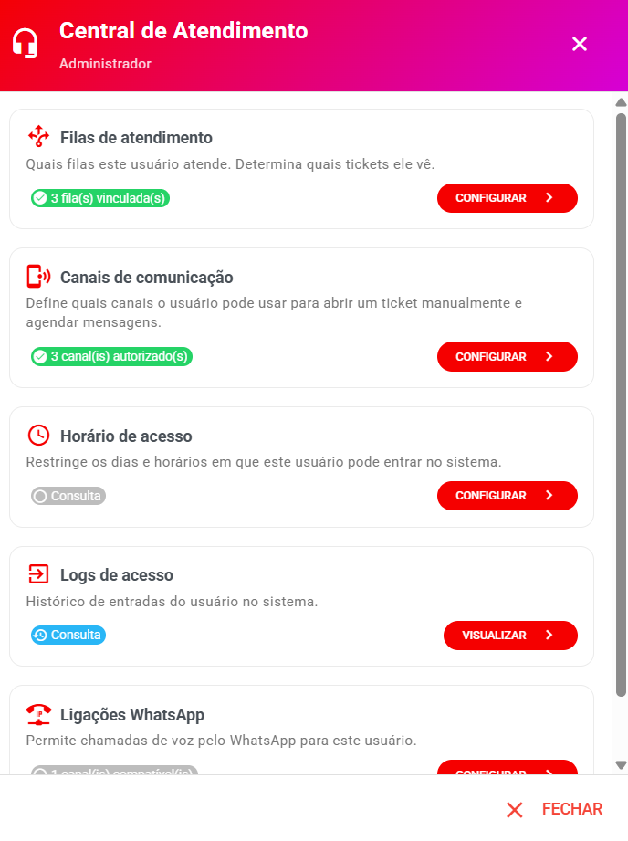

# Algumas Permissões de Usuários

As permissões de cada usuário são gerenciadas a partir da tela **Configurações → Cadastros → Usuários**.

<figure><figcaption></figcaption></figure>

Na coluna **Ações** de cada usuário, o botão com o ícone de **fone de ouvido** (🎧) abre a **Central de Atendimento** — o ponto único onde você gerencia todas as permissões do usuário:

* Filas de atendimento
* Canais de comunicação
* Horário de acesso
* Logs de acesso
* Ligações WhatsApp (WaCalls)
* Ligações Wavoip

Abaixo, cada permissão explicada em detalhes.

***

**Gestão de Filas do Usuário** (Filas de atendimento)

Aqui você define **quais filas o usuário pode acessar**.

Essa é a **configuração mais importante** para controle de visualização. Quem organiza e separa os atendimentos no sistema são as **filas**.

Se o usuário não estiver em uma fila:

* Ele **não verá** os atendimentos dessa fila
* **Não poderá responder**
* **Não poderá transferir**

⚠️ **Muito importante:** sempre que alterar as filas de um usuário, é **obrigatório deslogar e logar novamente**. Caso contrário, as permissões podem não atualizar corretamente.

***

**Gestão dos Canais do Usuário** (Canais de comunicação)

Essa opção define quais canais o usuário pode usar para:

* Abrir um ticket manualmente
* Agendar mensagens

⚠️ **Importante:** se o usuário não tiver nenhum canal definido, ao tentar iniciar um atendimento aparecerá a mensagem:

_"Nenhum canal disponível: sem permissão de acesso ou canal desconectado."_

📌 **Atenção:** essa configuração **NÃO separa atendimentos**. Quem separa são as **filas**. Ela apenas permite iniciar conversas manualmente.

***

**Gestão dos Canais de Ligação do Usuário** (Ligações Wavoip)

Se estiver utilizando **Wavoip**, você pode definir em quais canais o usuário poderá:

* Iniciar chamadas
* Receber chamadas

Sem essa permissão, o usuário não terá acesso às funcionalidades de chamada.

Veja a configuração completa em: [Wavoip](../../../integracoes/telefonia/configurar_wavoip.md)

***

**Ligações WhatsApp (WaCalls)**

Se a empresa utiliza **WaCalls** (chamadas de voz pelo WhatsApp), você pode definir em quais canais o usuário poderá realizar e receber chamadas de voz do WhatsApp.

* Essa seção só aparece se existirem canais com WaCalls configurado no sistema.
* Cada canal aparece com o selo **WaCalls** e pode ser liberado ou bloqueado para o usuário.

Veja a configuração completa em: [WaCalls](../../../integracoes/telefonia/wacalls.md)

***

**Horário de Acesso**

Define os **horários em que o usuário pode acessar o sistema**, evitando acessos fora do expediente por colaboradores.

* Para cada dia da semana (domingo a sábado) escolha **Permitido** ou **Não permitido**.
* Quando permitido, defina o **horário de início** e o **horário de término**.
* Se o usuário estiver logado fora do horário permitido, a **sessão é encerrada automaticamente**.

***

**Logs de Acesso**

Registra **todos os acessos realizados pelos usuários** no sistema, permitindo acompanhamento e auditoria.

* Filtre por **data inicial e data final**.
* A lista mostra: **Ação** (login, logout, online, offline), **Data/Hora**, **IP** e **Navegador/Dispositivo**.

***

## ✅ Resumo importante

* 📲 **Canais** recebem as mensagens e permitem iniciar conversas.
* 📂 **Filas** organizam e separam os atendimentos — quem vê o quê.
* 🔄 Sempre **deslogar e logar novamente** após alterar permissões.
* 🔒 Usuário sem fila **não atende**; usuário sem canal **não inicia conversas manualmente**.
