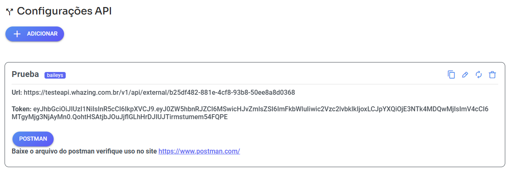

# Ausência de Resposta nas Integrações

Algumas integrações possuem um recurso automático para quando o cliente **para de responder**. Versão whazing mínima 2.16.0

Esse recurso está disponível nas integrações:

* Typebot
* Recepção Inteligente
* 2ª Via de Boleto
* Desbloqueio Confiança

Ele serve para evitar que atendimentos fiquem **parados e esquecidos** no sistema.

<figure><figcaption></figcaption></figure>

***

## ⚙️ Como funciona?

Você define um **tempo limite de espera**.

#### Exemplo:

Se você configurar **20 minutos**:

* Caso o cliente fique **20 minutos sem responder**
* O sistema executará automaticamente uma ação

***

## 🔄 Quais ações podem ser executadas?

Você pode configurar para o sistema:

* 🔁 Transferir o atendimento para uma fila específica
* 👤 Transferir para um usuário específico
* ✅ Fechar o ticket automaticamente

Após executar a ação escolhida, o sistema ainda pode:

* 💬 Enviar uma mensagem personalizada para o cliente

Essa mensagem pode ser algo como:

> “Encerramos o atendimento por falta de resposta. Caso precise, estamos à disposição.”

***

## 🚨 Por que isso é importante?

Sem essa configuração:

* Atendimentos ficam abertos sem necessidade
* Filas acumulam tickets inativos
* Relatórios ficam incorretos
* Operadores podem perder novos atendimentos

⚠️ **Recomendação:** Sempre configure um tempo de ausência para manter seu atendimento organizado e automático.
