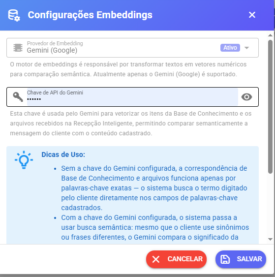

# Busca Semântica

### Motor de Embeddings

O motor de embeddings é responsável por transformar textos em vetores numéricos para permitir comparação semântica entre mensagens, documentos e conteúdos cadastrados.

Atualmente apenas o Gemini (Google) é suportado como motor de embeddings.

### Chave de API do Gemini

<figure><figcaption></figcaption></figure>

A chave Gemini é utilizada para:

* Vetorizar os itens da Base de Conhecimento.
* Vetorizar documentos e arquivos processados pela Recepção Inteligente.
* Comparar semanticamente mensagens dos clientes com conteúdos cadastrados.

### Como Funciona Sem a Chave Gemini

Quando a chave Gemini não está configurada, o sistema realiza apenas busca por palavras-chave exatas.

Exemplo:

Se o conteúdo possuir a palavra-chave "segunda via" e o cliente escrever "boleto atualizado", o sistema pode não encontrar correspondência.

Nesse modo, a busca ocorre somente pelos termos cadastrados manualmente.

### Como Funciona Com a Chave Gemini

Quando a chave Gemini está configurada, o sistema utiliza busca semântica.

Isso significa que a IA compara o significado da mensagem do cliente com o conteúdo cadastrado.

Exemplo:

Cliente:\
"Preciso atualizar meu boleto"

Base de conhecimento:\
"Como emitir segunda via"

Mesmo utilizando palavras diferentes, o sistema consegue identificar que os assuntos possuem o mesmo contexto e localizar a resposta correta.

### Análise de Arquivos

A chave Gemini também permite analisar semanticamente:

* PDFs
* Documentos
* Arquivos enviados pelos clientes
* Conteúdo extraído de imagens

Sem a chave Gemini, a busca considera apenas nomes de arquivos e palavras-chave cadastradas.

Com a chave Gemini, o sistema compara o conteúdo real dos documentos e arquivos para encontrar a melhor correspondência.

### Recomendação

Configure a chave Gemini para ativar a busca semântica na Base de Conhecimento e na Recepção Inteligente.

Sem ela, o sistema funciona apenas com correspondência exata de palavras-chave.

