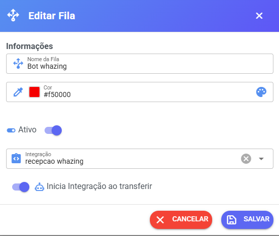

# Como ativar a integração

Depois de criar a integração, você precisa configurar para que ela inicie automaticamente. Siga estes passos:

**1️⃣ Criar e configurar a fila**

Vá em: **Cadastro → Filas/Integrações**

* Crie ou edite uma fila
* Selecione a integração que você criou
* Marque a opção: **“Inicia Integração ao transferir”**

<figure><figcaption></figcaption></figure>

**2️⃣ Vincular a fila ao canal**

Agora vá em: **Configurações → Canais / API**

* Selecione o canal desejado
* Defina a **fila criada**
* **Não selecione usuário**
* **Não selecione chatbot**

<figure><figcaption></figcaption></figure>

**✅ Resultado**

Com isso configurado, sempre que chegar uma nova mensagem:

* A integração será iniciada sem precisar de ação manual
