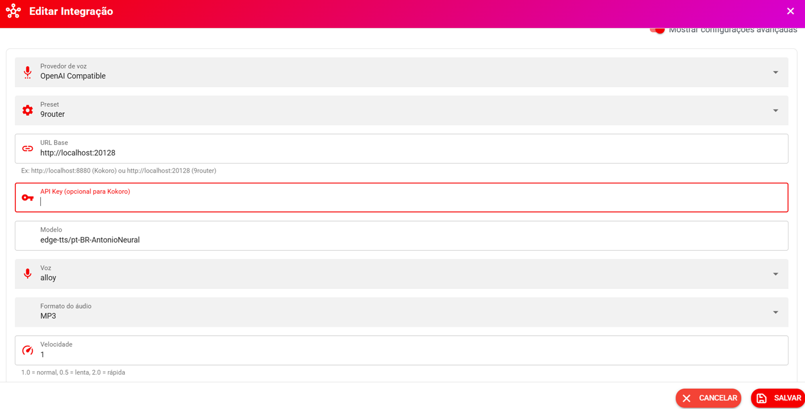

# Configuração de Resposta por Áudio

## 🎙️ Provedores de voz compatíveis com OpenAI

A partir da **versão 3.0**, o sistema passou a oferecer suporte a **provedores de voz compatíveis com a API da OpenAI (OpenAI Compatible)**.

Isso permite utilizar diferentes serviços ou servidores de geração de voz que seguem o padrão compatível com a API da OpenAI, sem ficar limitado a um único provedor.

Além do **ElevenLabs**, você pode configurar provedores compatíveis, como **9router**, **Kokoro** e outras soluções que disponibilizem uma API compatível.

***

### ⚙️ Onde configurar

A configuração do provedor de voz fica na área de configurações de **IA / Voz**, dependendo da configuração disponível no seu ambiente.

Ao adicionar ou editar um provedor, selecione:

**Provedor de voz → OpenAI Compatible**

<figure><figcaption></figcaption></figure>

O print deve destacar os campos de **Preset, URL Base, API Key, Modelo, Voz, Formato do áudio e Velocidade**.

***

## 🔌 Configuração OpenAI Compatible

Ao selecionar **OpenAI Compatible**, serão disponibilizados os campos para configurar o serviço.

#### Preset

O **Preset** permite selecionar uma configuração pré-definida para determinados provedores.

Exemplos:

* **9router**
* Outros presets compatíveis disponíveis no sistema.

***

### 🌐 URL Base

Informe a URL base da API do provedor.

Exemplos:

**Kokoro:**

`http://localhost:8880`

**9router:**

`http://localhost:20128`

A URL deve apontar para o serviço compatível com a API utilizada pelo sistema.

> ⚠️ **Importante:** `localhost` significa que o serviço está sendo executado na mesma máquina/container onde o sistema consegue acessá-lo. Se o provedor estiver em outro servidor, utilize o endereço correspondente.

***

## 🔑 API Key

O campo **API Key** pode ser utilizado quando o provedor exige autenticação.

Por exemplo:

`sk-xxxxxxxxxxxxxxxx`

Alguns provedores locais, como determinadas configurações do **Kokoro**, podem não exigir API Key.

Por isso, o campo pode ser **opcional**, dependendo do serviço utilizado.

> 🔒 Nunca compartilhe sua API Key publicamente. Ela deve ser tratada como uma senha de acesso ao serviço.

***

## 🤖 Modelo

Informe o modelo utilizado pelo provedor.

O modelo depende do serviço configurado.

Por exemplo:

`edge-tts/pt-BR-AntonioNeural`

> O nome do modelo deve ser compatível com o provedor configurado.

***

## 🗣️ Voz

Selecione ou informe a voz que será utilizada para gerar o áudio.

Exemplo:

**alloy**

A disponibilidade das vozes depende do provedor e do modelo utilizado.

***

## 🎵 Formato do áudio

Escolha o formato em que o áudio será gerado.

Exemplo:

**MP3**

O formato disponível depende da compatibilidade do provedor. Recomendado MP3

***

## ⚡ Velocidade

A velocidade define a rapidez com que a voz será reproduzida.

O valor padrão é:

**1.0 = velocidade normal**

Exemplos:

* **0.5** → mais lenta;
* **1.0** → normal;
* **2.0** → mais rápida.

***

## 🔊 Testar voz

Depois de preencher as configurações, utilize o botão:

**Testar voz**

O sistema fará um teste utilizando as configurações informadas.

Recomendamos sempre realizar o teste antes de salvar ou utilizar o provedor em produção.

***

## 🎙️ Exemplos de configuração

### 9router

Uma configuração pode utilizar:

| Campo      | Exemplo                         |
| ---------- | ------------------------------- |
| Provedor   | OpenAI Compatible               |
| Preset     | 9router                         |
| URL Base   | `http://localhost:20128`        |
| API Key    | Sua chave, quando necessária    |
| Modelo     | Conforme modelo disponibilizado |
| Voz        | Conforme voz disponibilizada    |
| Formato    | MP3                             |
| Velocidade | 1.0                             |

***

### Kokoro

Uma configuração local pode utilizar:

| Campo      | Exemplo                         |
| ---------- | ------------------------------- |
| Provedor   | OpenAI Compatible               |
| Preset     | OpenAI Compatible               |
| URL Base   | `http://localhost:8880`         |
| API Key    | Opcional                        |
| Modelo     | Conforme configuração do Kokoro |
| Voz        | Conforme voz disponibilizada    |
| Formato    | MP3                             |
| Velocidade | 1.0                             |

> Os modelos e vozes disponíveis podem variar conforme a instalação e configuração do serviço.

***

## 🔄 Compatibilidade com o sistema de respostas por áudio

A configuração do provedor de voz funciona junto com as opções de resposta automática por áudio.

Você pode utilizar:

#### 🔁 Sempre em Áudio

Todas as respostas do sistema serão convertidas em áudio.

#### 🧠 Modo Inteligente

O sistema decide quando enviar áudio de acordo com as configurações definidas.

Entre as opções estão:

* Responder com áudio quando o cliente enviar áudio;
* Áudio a cada X mensagens do bot;
* Histórico mínimo de mensagens;
* Chance de enviar áudio (%);
* Quantidade mínima de caracteres.

#### Exemplo

> **Áudio a cada 10 mensagens do bot • 15% de chance (mín. 150 caracteres)**

Isso permite utilizar voz de maneira mais natural, evitando transformar todas as mensagens em áudio.

***

## 💡 Qual provedor utilizar?

A escolha depende da sua infraestrutura e do serviço que deseja utilizar.

#### ElevenLabs

Indicado para quem deseja utilizar o serviço da ElevenLabs.

É necessário possuir uma API Key da ElevenLabs.

#### OpenAI Compatible

Indicado quando você deseja utilizar um serviço compatível com o padrão de API da OpenAI.

Pode ser utilizado com soluções como:

* **9router**;
* **Kokoro**;
* Outros provedores compatíveis.

A principal vantagem é permitir maior flexibilidade na escolha do serviço de geração de voz.

> **Importante:** o Whazing fornece a configuração compatível com o padrão da API. A disponibilidade de modelos, vozes, autenticação e formatos depende do provedor escolhido.

***

Agora o sistema pode responder seus clientes com **áudio automático**, deixando o atendimento mais humano e dinâmico.

A funcionalidade utiliza o serviço da **ElevenLabs** para gerar voz.

👉 Para usar, você precisa de uma API Key:\
[https://elevenlabs.io/app/developers/api-keys](https://elevenlabs.io/app/developers/api-keys)

***

### ⚙️ Como funciona

Você pode escolher diferentes formas de resposta por áudio:

<figure><figcaption></figcaption></figure>

#### 🔁 Sempre em Áudio

Todas as mensagens do sistema serão respondidas em áudio.

***

#### 🧠 Modo Inteligente

O sistema decide quando enviar áudio, com base nas configurações abaixo:

* **Responder com áudio quando o cliente enviar áudio**\
  Se o cliente mandar um áudio, o sistema responde em áudio automaticamente.
* **Áudio a cada X mensagens do bot**\
  Define de quanto em quanto tempo o sistema envia uma resposta em áudio.
* **Histórico mínimo de mensagens**\
  Quantidade mínima de mensagens antes de começar a usar áudio.
* **Chance de enviar áudio (%)**\
  Define a probabilidade de uma mensagem ser enviada em áudio.
* **Quantidade mínima de caracteres**\
  Só envia áudio se a mensagem tiver um tamanho mínimo.

***

### 📊 Resumo da Configuração

O sistema mostra um resumo automático da sua configuração.

💡 Exemplo:

> "Áudio a cada 10 mensagens do bot • 15% de chance (mín. 150 caracteres)"

***

### 💡 Dica

Use o modo inteligente para evitar excesso de áudios e tornar a conversa mais natural 👍
