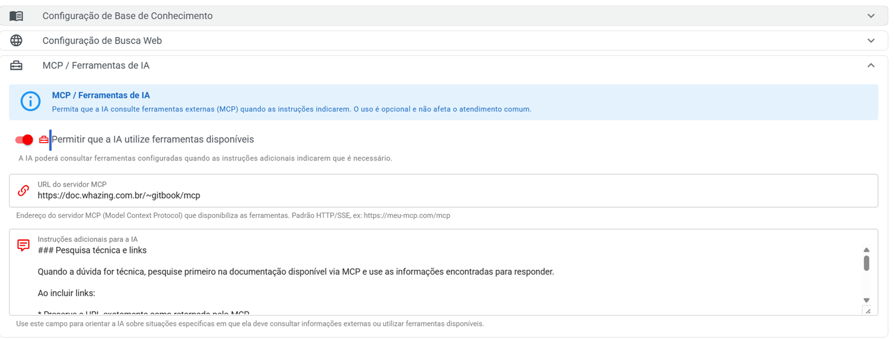

# MCP e Ferramentas de IA

A **Recepção Inteligente** suporta o uso de **MCP (Model Context Protocol)**.

Com esse recurso, a Inteligência Artificial pode utilizar ferramentas externas configuradas no MCP para **pesquisar informações e consultar conteúdos disponíveis em outras fontes**.

Isso é especialmente útil quando você deseja que a IA consulte sua documentação antes de responder uma dúvida do cliente.

***

## 🔎 O que é MCP?

MCP significa **Model Context Protocol**.

De forma simples, ele permite conectar a Inteligência Artificial a **ferramentas e fontes externas de informação**.

Em vez de a IA responder somente utilizando o conhecimento que já possui, ela pode consultar uma ferramenta disponível através do servidor MCP quando isso for necessário.

#### Exemplo

Imagine que seu cliente pergunte:

> "Como faço a integração com o IXC Soft?"

Se sua documentação estiver disponível através do MCP, a Recepção Inteligente poderá pesquisar essa documentação e utilizar as informações encontradas para responder ao cliente.

Isso ajuda a IA a utilizar informações **específicas da sua empresa ou sistema**.

***

## 📚 MCP para documentação

O Whazing possui suporte para configurar um **servidor MCP** que pode disponibilizar ferramentas de pesquisa.

Um exemplo de servidor MCP para documentação é:

[https://doc.whazing.com.br/\~gitbook/mcp](https://doc.whazing.com.br/~gitbook/mcp)

> ⚠️ O endereço utilizado na sua configuração deve ser o endereço do servidor MCP que você deseja utilizar.

***

## ⚙️ Como ativar

Na tela de edição da integração, abra a aba **Conhecimento** e procure pela seção:

**MCP / Ferramentas de IA**

Ative a opção:

#### Permitir que a IA utilize ferramentas disponíveis

Quando ativada:

> A IA poderá consultar ferramentas configuradas quando as instruções adicionais indicarem que é necessário.

Depois, informe a:

#### URL do servidor MCP

Cole nesse campo a URL do servidor MCP que será utilizado pela IA.

<figure><figcaption></figcaption></figure>

***

## 📝 Configurar as instruções da IA

Depois de ativar o MCP, é importante informar à IA **quando ela deve utilizar a ferramenta**.

Isso pode ser feito através das **instruções adicionais** da Recepção Inteligente.

Um exemplo de instrução é:

> #### Pesquisa técnica e links
>
> Quando a dúvida for técnica, pesquise primeiro na documentação disponível via MCP e use as informações encontradas para responder.
>
> Ao incluir links:
>
> * Preserve a URL exatamente como retornada pelo MCP.
> * Nunca coloque pontuação (`.`, `,`, `!`, `?`, `;`) dentro da URL.
> * A pontuação deve ficar após o fechamento do link Markdown.
>
> Exemplo correto: https://doc.whazing.com.br/integracoes/erp-provedor/ixc-soft/integracao-com-ixc-soft-gateway-sms
>
> Exemplo incorreto: https://doc.whazing.com.br/integracoes/erp-provedor/ixc-soft/integracao-com-ixc-soft-gateway-sms.

Essa instrução orienta a IA a **pesquisar primeiro na documentação** quando o cliente fizer uma pergunta técnica.

***

***

## 💡 Por que utilizar MCP na Recepção Inteligente?

O MCP pode ser útil quando sua IA precisa consultar informações que mudam ou que são específicas da sua empresa.

#### Exemplos de utilização

**Documentação técnica**

A IA pode pesquisar procedimentos, configurações e integrações.

**Base de conhecimento**

Pode consultar informações disponibilizadas por ferramentas externas.

**Links**

Pode retornar ao cliente o endereço exato da documentação encontrada.

**Informações atualizadas**

Em vez de depender apenas do conhecimento interno do modelo, a IA pode consultar a fonte disponibilizada pelo MCP.

***

## 🧪 Exemplo prático

Imagine que um cliente pergunte:

> "Como configurar o Gateway SMS do IXC Soft?"

A Recepção Inteligente recebe a pergunta.

#### 1. Identifica que é uma dúvida técnica

A instrução configurada informa que dúvidas técnicas devem ser pesquisadas.

#### 2. Consulta o MCP

A IA utiliza a ferramenta MCP configurada para pesquisar a documentação.

#### 3. Encontra a informação

O MCP retorna o conteúdo relevante e, se disponível, o link da documentação.

#### 4. A IA responde

A Recepção Inteligente utiliza as informações encontradas para montar uma resposta para o cliente.

#### 5. Pode apresentar a documentação

Caso seja necessário, a IA pode enviar o link da página encontrada.

***

## ⚠️ Importante: MCP não substitui o prompt

Ativar o MCP **não significa que a IA irá pesquisar tudo automaticamente**.

A IA poderá utilizar as ferramentas disponíveis quando as instruções indicarem que isso é necessário.

Por isso, recomendamos deixar claro nas instruções da Recepção Inteligente:

* Quando pesquisar;
* Qual fonte deve ser utilizada;
* Como utilizar as informações encontradas;
* Como apresentar links;
* O que fazer quando não encontrar uma resposta.

***

## 📌 Exemplo de configuração completa

Para uma empresa que possui uma documentação técnica, você pode utilizar uma configuração semelhante a esta:

#### Conhecimento MCP / Ferramentas de IA

**Permitir que a IA utilize ferramentas disponíveis:**\
✅ Ativado

**URL do servidor MCP:**

`https://doc.whazing.com.br/~gitbook/mcp`

#### Instruções adicionais

```
### Pesquisa técnica e links

Quando a dúvida for técnica, pesquise primeiro na documentação disponível via MCP e use as informações encontradas para responder.

Ao incluir links:

- Preserve a URL exatamente como retornada pelo MCP.
- Nunca coloque pontuação (.,!,? ;) dentro da URL.
- A pontuação deve ficar após o fechamento do link Markdown.
```

> 💡 Você pode adaptar essas instruções de acordo com as necessidades da sua empresa e das ferramentas disponibilizadas pelo seu servidor MCP.

***

## 🚀 Resumo

Com o **MCP na Recepção Inteligente**, você pode permitir que a IA utilize ferramentas externas para pesquisar informações antes de responder.

O processo é:

**Ativar ferramentas MCP**

↓

**Informar a URL do servidor MCP**

↓

**Orientar a IA através das instruções adicionais**

↓

**Cliente faz uma pergunta**

↓

**IA consulta o MCP quando necessário**

↓

**IA utiliza as informações encontradas**

↓

**Cliente recebe a resposta**

Isso permite criar uma Recepção Inteligente muito mais integrada com sua **documentação, bases de conhecimento e ferramentas externas**.
